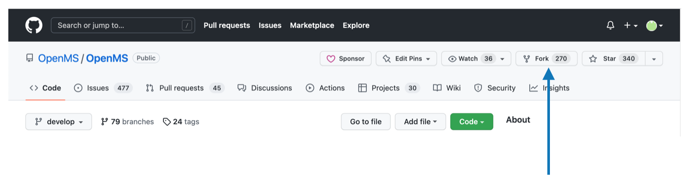

OpenMS Git Workflow
===================

Before getting started, install latest version of git to avoid problems like GitHub https authentication errors
(see [Troubleshooting cloning errors](https://docs.github.com/en/repositories/creating-and-managing-repositories/troubleshooting-cloning-errors) and a solution using [ssh](https://docs.github.com/en/get-started/getting-started-with-git/about-remote-repositories)).

OpenMS follows the [git flow workflow](https://nvie.com/posts/a-successful-git-branching-model/). The difference is that
merge commits are managed via pull requests instead of creating merge commits locally.

## Naming conventions

Naming conventions for the following apply:

* A **local repository** is the repository that lies on your hard drive after cloning.
* A **remote repository** is a repository on a git server such as GitHub.
* A **fork** is a copy of a repository. Forking a repository allows you to freely experiment with changes without affecting the original project.
* **Origin** refers to a remote repository that you have forked. Call this repository `https://github.com/_YOURUSERNAME_/OpenMS`.
* **Upstream** refers to the original remote OpenMS repository. Call this repository `https://github.com/OpenMS/OpenMS`.

## Create fork

Start by [forking](https://docs.github.com/en/get-started/quickstart/fork-a-repo) the OpenMS repository.

To create a fork, click **Fork** under the main menu as shown below.



## Clone your fork

To obtain a local repository copy, clone your fork using:

```bash
$ git clone https://github.com/_YOURUSERNAME_/OpenMS.git
```

This will clone your fork (correctly labelled `origin` by default) into a local copy on your computer.

```{note}
To use `git clone git@github.com:_YOURUSERNAME_/OpenMS.git`, make sure you have [SSH key added to your GitHub account](https://docs.github.com/en/authentication/connecting-to-github-with-ssh/adding-a-new-ssh-key-to-your-github-account).
```
## Link remote branches to your local working repository

After cloning your fork, your local repository should be named origin. Validate this by executing:

```bash
$ git remote -v
  origin https://github.com/_YOURUSERNAME_/OpenMS.git (fetch)
  origin https://github.com/_YOURUSERNAME_/OpenMS.git (push)
```

Sync data between your local copy, your fork (`origin`) and the remote original OpenMS/OpenMS repository (`upstream`)
by using the following command:

```bash
$ git remote add upstream https://github.com/OpenMS/OpenMS.git
```
Verify that upstream was added correctly by calling:

```bash
$ git remote -v
  origin https://github.com/_YOURUSERNAME_/OpenMS.git (fetch)
  origin https://github.com/_YOURUSERNAME_/OpenMS.git (push)
  upstream https://github.com/OpenMS/OpenMS.git (fetch)
  upstream https://github.com/OpenMS/OpenMS.git (push)

```

Fetch changes and new branches from your fork (`origin`) as well as from the central, upstream OpenMS repository by executing:

```bash
$ git fetch upstream
$ git fetch origin
```
or

```bash
$ git fetch --all
```

Create a local branch using the following:

```bash
$ git checkout -b <insert branch-name>
```

Call `git branch -va` to display the status of local and remote branches. You should see an output that looks like this:

```bash
$ git branch -va
* develop                         349ec48 Merge pull request #691 from cbielow/MGF_fix
  feature/my_shiny_new_feature    3c05538 [FEATURE] added option to keep, ensure or reassign UIDs during conversion
  remotes/origin/SILACAnalyzer    3ceae38 Fixed test.
  remotes/origin/antilope         3fe5aa3 git-svn-id: https://open-ms.svn.sourceforge.net/svnroot/open-ms/branches/antilope@12117 6adb6e08-d915-0410-941f-83917bcadc18
  remotes/origin/develop          349ec48 Merge pull request #691 from cbielow/MGF_fix
  remotes/origin/master           b182ba5 [NOP] first commit after SVN import to git
  remotes/origin/msnovogen        93a5e4c [OPT] For faster access to specific amino acids a ResidueServer was added.
  remotes/upstream/HEAD           -> upstream/develop
  remotes/upstream/SILACAnalyzer  3ceae38 Fixed test.
  remotes/upstream/antilope       3fe5aa3 git-svn-id: https://open-ms.svn.sourceforge.net/svnroot/open-ms/branches/antilope@12117 6adb6e08-d915-0410-941f-83917bcadc18
  remotes/upstream/develop        349ec48 Merge pull request #691 from cbielow/MGF_fix
  remotes/upstream/master         b182ba5 [NOP] first commit after SVN import to git
  remotes/upstream/msnovogen      93a5e4c [OPT] For faster access to specific amino acids a ResidueServer was added.
```

## Keep your fork in sync

Keep your fork (`origin`) in sync with the OpenMS repository (`upstream`) by following the [GitHub instructions](https://docs.github.com/en/pull-requests/collaborating-with-pull-requests/working-with-forks/syncing-a-fork).
In summary, to keep your fork in sync:
1. Fetch changes from upstream and update your local branch.
2. Push your updated local branch to your fork (`origin`).

```{tip}
To keep track of others repositories, use `git fetch --all --prune` to update them as well. The option `--prune` tells
git to automatically remove tracked branches if they got removed in the remote repository.
```

```bash
$ git fetch --all --prune
$ git checkout develop
$ git merge --ff-only upstream/develop
$ git push origin develop
```
Feel free to experiment within your fork. However, for your code needs to meet OpenMS quality standards to be merged
into the OpenMS repository,

Follow these rules:
* Never commit directly to the `develop` or `master` branches as it will complicate the merge.
* Try to start every feature from develop and not base features on other features.
* Name the OpenMS remote `upstream` and always push directly to `origin` (`git push origin <branch-name>`).
* When updating your fork, consider using `git fetch upstream` followed by `git merge --ff-only upstream/develop` to
  avoid creating merge commits in `develop`.
* If you never commit to `develop` this should always succeed and (if a commit accidentally went to develop) warn you
  instead of creating a merge commit.

## Create new feature

All features start from `develop`.

```bash
$ git checkout develop
$ git checkout -b feature/your-cool-new-feature
```
All commits related to this feature will then go into the branch `feature/your-cool-new-feature`.

## Keeping your feature branch in sync with develop branch

While working on your feature branch, it is usual that development continues and new features get integrated into the
main development branch. This means your feature branch lags behind `develop`. To get your feature branch up-to-date,
rebase your feature branch on `develop` using:

```bash
$ git checkout feature/myfeaturebranch
$ git rebase develop
```

The above commands:

1. Performs a rewind of your commits until the branching point.
2. Applies all commits that have been integrated into `develop`.
3. Reapplies your commits on top of the commits integrated into `develop`.

For more information, refer to a [visual explanation of rebasing](http://git-scm.com/book/en/v2/Git-Branching-Rebasing).

```{tip}
Do not rebase published branches (e.g. branches that are part of a pull request). If you created a pull request, you
should only add commits in your feature branch to fix things that have been discussed. After your pull request contains
all fixes, you are ready to merge the pull request into develop without rebasing (see e.g. rebase-vs-merge).
```

## Adding a feature to OpenMS

Features that should go into the main development line of OpenMS should be integrated via a [pull request](https://docs.github.com/en/pull-requests/collaborating-with-pull-requests/proposing-changes-to-your-work-with-pull-requests/about-pull-requests). This allows
the development community of OpenMS to discuss the changes and suggest possible improvements.

After opening the pull request via the GitHub web site, GitHub will try to create the pull request against the branch
that you branched off from. Please check the branch that you are opening the pull request against before submitting the
pull request. If any changes are made, a new pull request is required. Select
**Allow others to make changes to this pull request** so that maintainers can directly help to solve problems.

Open pull requests only after checking code-style, documentation and passing tests. Pull requests that do not pass CI
or code review will not be merged until the problems are solved. It is recommended that you read the
[pull request guidelines](pull-request-checklist.md) before you submit a pull request.

## Update git submodules

Start in your local `OpenMS/OpenMS` repository (on your feature/pull request branch).

The following example uses a submodule called `THIRDPARTY`.

```bash
$ git submodule update --init THIRDPARTY
$ cd THIRDPARTY
# yes, in the submodules the default remote is origin
# usually you want to pull the changes from master (e.g. after your pull request to OpenMS/THIRDPARTY has been merged)
$ git pull origin master
$ cd ..
$ git status
# Make sure that you see "modified:   THIRDPARTY (new commits)"
$ git commit -am "updated submodule"
```
