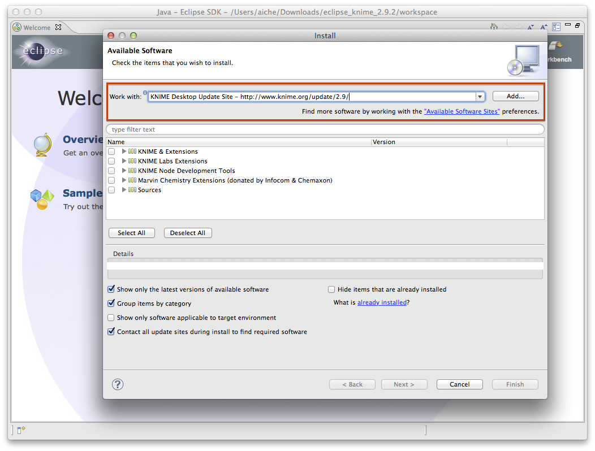
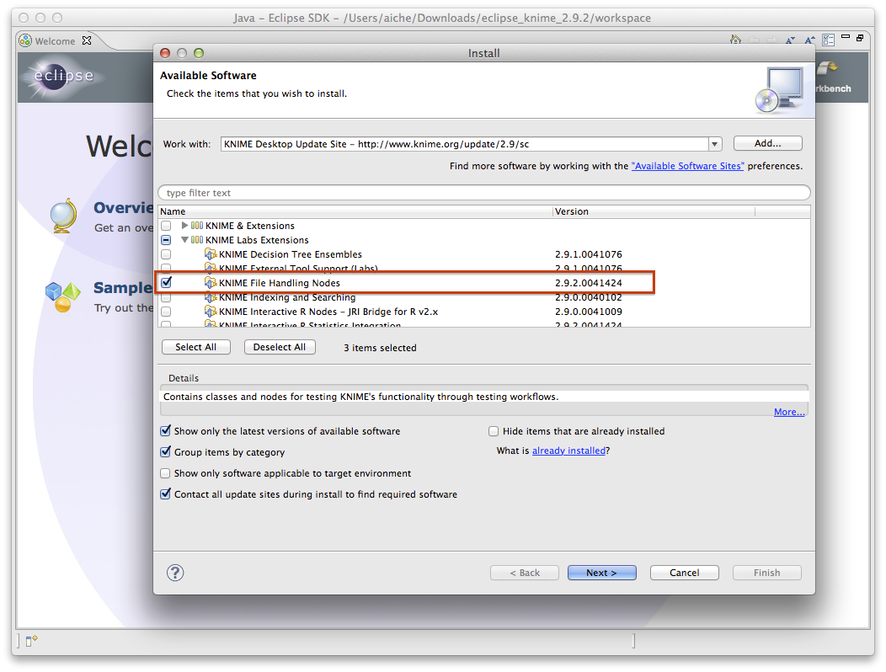
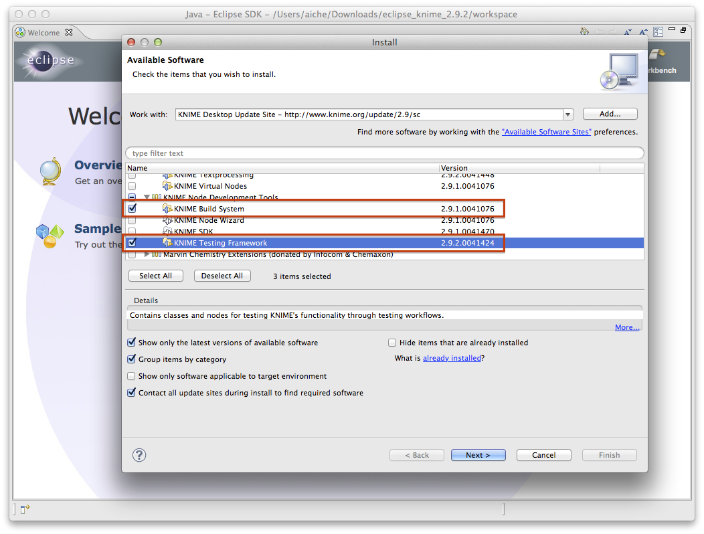
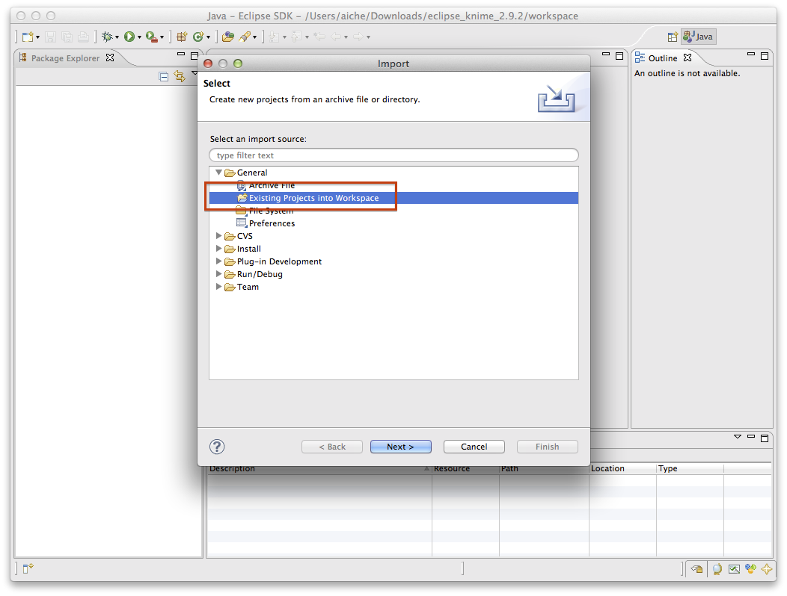
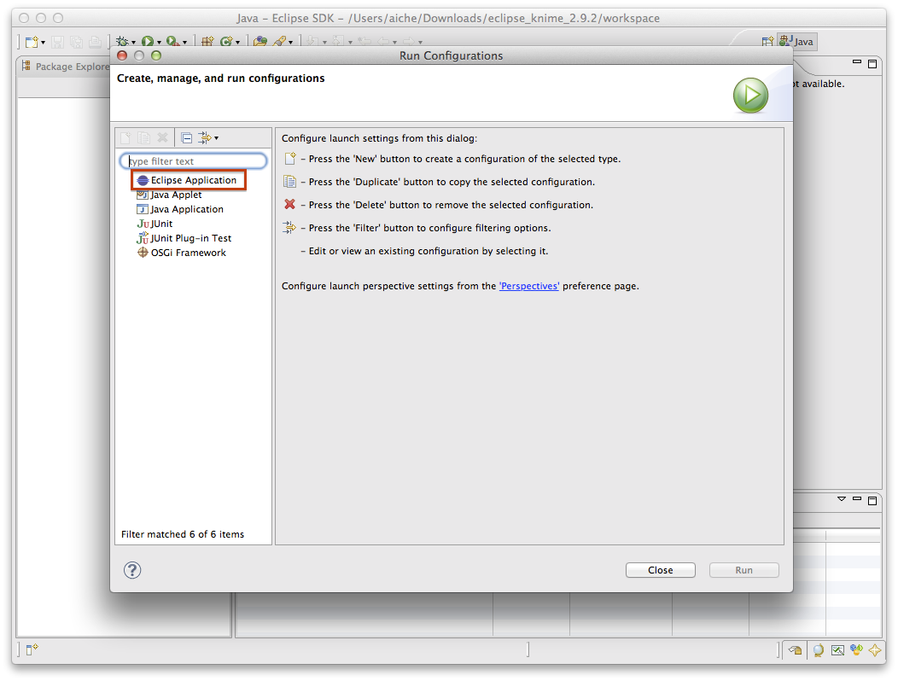
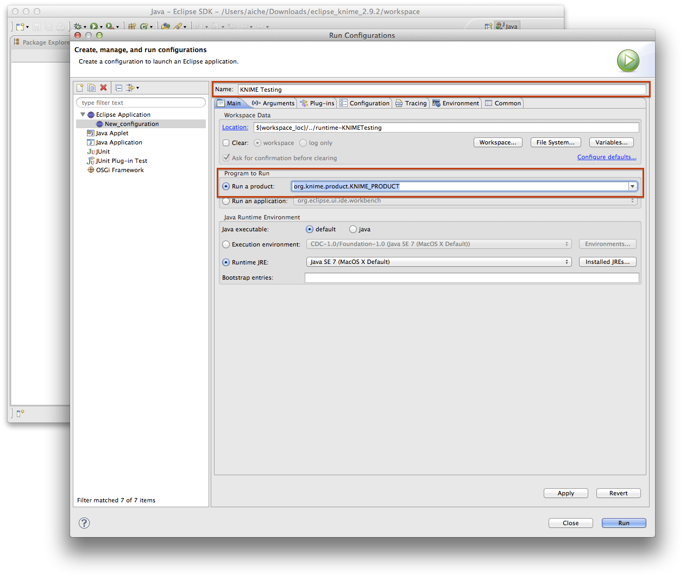

Build Custom OpenMS KNIME package
================================

The following guidelines should help in preparing your own KNIME package. If you still encounter any errors, please
[contact us](../contact-us.md).

## Prerequisites

- **KNIME SDK**: Download it from the [KNIME Download Site](https://www.knime.com/downloads) (at the end of the page).
  We will use Version 2.9.2 (We assume that you have installed it to ~/Development/knime/eclipse_knime_2.9.2 but it could
  be anywhere).
- **Apache Ant**: The Generic KNIME Plugins project uses Apache Ant as the build system. On Linux and Mac, install it
  using your package manager. For Windows, see the [Apache Ant Downloads](https://ant.apache.org/bindownload.cgi). For
  macOS, `brew install ant`.
- A clone of OpenMS and a compiled contrib should be available on your system. Please check the OpenMS documentation for
  instructions how to compile OpenMS. For simplicity we will assume that the OpenMS build tree is located in
  `~/Development/OpenMS/build`.

## Prepare your build environment and create the plugin directory

To generate the source code of the OpenMS KNIME plugin, prepare the build environment. For this, download a recent version
of the search engines distributed with OpenMS. Checkout the tested versions of the binaries matching your system from the
OpenMS subversion repository at sourceforge. Let's assume that the search engines are located in
`~/Development/knime/SEARCHENGINES/`.

```bash
svn export --force https://github.com/OpenMS/THIRDPARTY/trunk/All ~/Development/knime/SEARCHENGINES_ALL
svn export --force https://github.com/OpenMS/THIRDPARTY/trunk/Linux/64bit ~/Development/knime/SEARCHENGINES
mv "~/Development/knime/SEARCHENGINES_ALL/LuciPHOr2" "~/Development/knime/SEARCHENGINES_ALL/MSGFPlus" "~/Development/knime/SEARCHENGINES/"
```

to get the search engines for 64 bit linux build. Supported builds can be found in the [thirdparty tool repository](https://github.com/OpenMS/THIRDPARTY). Ensure that in `~/Development/knime/SEARCHENGINES` ou now have multiple folders (one per searchengine) that
each immediately contain the respective binaries (and metafiles) for all searchengines.

After downloading the search engines we can activate the knime preparation in the OpenMS build system by calling cmake
with some specific arguments in the build directory.

```
$ cd ~/Development/OpenMS/build
$ cmake -D SEARCH_ENGINES_DIRECTORY=$HOME/Development/knime/SEARCHENGINES/ -D ENABLE_PREPARE_KNIME_PACKAGE=On .
```

now, if you used the Makefile generator, execute the `prepare_knime_package` target, e.g.,

```
$ make prepare_knime_package
```

This should recompile OpenMS and construct all the necessary input files for the KNIME plugin generation in the directory
`~/Development/OpenMS/build/ctds`.

## Generate the plugin source code

Based on the files generated in the previous step, now, generate the source code of the KNIME plugin using the
GenericKNIMENodes NodeGenerator tool. Start by cloning the latest version of the GenericKNIMENodes into the directory
`~/Development/knime/GenericKnimeNodes`:

```bash
$ cd ~/Development/knime
$ git clone git://github.com/genericworkflownodes/GenericKnimeNodes.git
```

The node generator can easily be called using `ant`:

```bash
$ cd ~/Development/knime/GenericKnimeNodes
$ ant -Dplugin.dir=$HOME/Development/OpenMS/build/ctds -Dcustom.plugin.generator.target=$HOME/Development/knime/openms_plugin/
```

This will generate the source code of the OpenMS plugin in the directory `~/Development/knime/openms_plugin/`.


## Compiling and running the OpenMS plugin

Before compiling and testing the OpenMS KNIME plugin we have to install some additional plugins necessary for building
the OpenMS nodes. For this we start the previously downloaded KNIME SDK and click on **Help** > **Install New Software...**.

 In the now open dialog we select the **KNIME Desktop Update Site**.

 

 From the list below we select the `KNIME File Handling Nodes`, the `KNIME Build System`, and the `KNIME Testing Framework`.

 ```{tip}
KNIME Build System and KNIME Testing Framework (ships with KNIME SDK) are probably not necessary to install.
 ```





Now follow the installation procedure by clicking on **Next**.

Now that the KNIME SDK is properly setup import the GenericKNIMENodes plugin and the generated OpenMS plugin by clicking
on **File** > **Import...**. First select `Existing Projects into Workspace` and select the GenericKNIMENodes directory
(`~/Development/knime/GenericKnimeNodes`). Repeat those steps with the OpenMS plugin directory
(`~/Development/knime/openms_plugin/`).




This should add the base plugin and the OpenMS plugin to your build environment. Note that it is necessary to copy both
`de.openms.*` and `com.genericworkflownodes.*` into the same subfolder.

Now, start a KNIME instance from within the SDK by clicking on **Run** > **Run Configurations...**. Double click on
**Eclipse Application** to create a new run configuration.



Rename the run configuration (e.g., KNIME Testing) and select `org.knime.product.KNIME_PRODUCT` in `Run a product`.



After clicking **Run** a new KNIME instance should start containing the OpenMS KNIME nodes.
