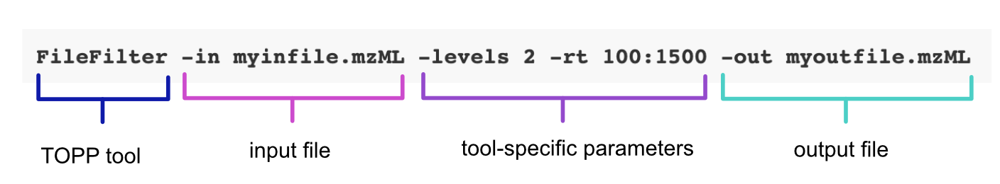

Apply TOPP tools using the Command Line Interface
==================================================

TOPP tools are designed to be called from the command line. OpenMS provides a Command Line Interface (CLI) called TOPP shell to easily execute TOPP tools on mass spectrometry data. However, you can configure the CLI of your choice to run TOPP tools.

## Command line call construction

Command line calls will depend on the TOPP tools used, as each TOPP tool has its own set of parameters. However, the following arguments are typically used:

- `-in`

  Specify an input file in the command line using the `-in` argument. The input file should have an mzML format. If not, use the file converter to convert the file to one using an mzML format. For more information, view the file handling documentation.
- `-out`

  Specify an output file in the command line using the `-out` argument. The output file should have an mzML format, the same format as the input file.
- `-ini`

  Specify an INI file in the command line using the `-ini` argument. TOPP uses INI files to set parameters specific to the command line tool being called.
- `-write_ini`

  Create an INI file using the `-write_ini` file argument.
  Create an INI file with this call:
  `<insert TOPP tool> -write_ini <insert output INI File>`
  If you want a visual tool to assist setting parameters, use [INIFileEditor](graphical-topp-tools/ini-file-editor.md), an application provided when you download OpenMS.  Otherwise, you can set the parameters from the command line.
- `-help`

  Get information about basic options related to the tool using the -help parameter. For more advanced options (algorithmic parameters), use `--help`.
- `--help`

  Get detailed information about algorithmic parameters using the `--help` parameter.

Many (but not all) command line calls will have the following structure:

```bash
<insert TOPP tool> -in <insert input mzML file> -out <insert output mzML file> -ini <insert INI file>
```

The following command line call uses the FileFilter tool to extract data from an mzML file. Note, that this call directly specifies the tool-specific parameters and doesn’t rely on an INI file:



## List of command line TOPP tools

The following command-line TOPP tools have been documented:

- [Calibration](topp-command-line-tools/calibration.md)
- [Consensus peptide identification](topp-command-line-tools/consensus-peptide-identification.md)
- [Conversion between OpenMS XML formats and text formats](topp-command-line-tools/conversion-between-openms-xml-formats-and-text-formats.md)
- [Feature detection on centroided data](topp-command-line-tools/feature-detection-on-centroided-data.md)
- [Feature detection](topp-command-line-tools/feature-detection.md)
- [Feature-grouping](topp-command-line-tools/feature-grouping.md)
- [File handling](topp-command-line-tools/file-handling.md)
- [Map alignment](topp-command-line-tools/map-alignment.md)
- [Peptide property prediction](topp-command-line-tools/peptide-property-prediction.md)
- [Picking peaks](topp-command-line-tools/picking-peaks.md)
- [Profile data processing](topp-command-line-tools/profile-data-processing.md)
- [Quality control](topp-command-line-tools/quality-control.md)
- [Smoothing raw data](topp-command-line-tools/smoothing-raw-data)
- [Subtracting a baseline from a spectrum](topp-command-line-tools/subtracting-a-baseline-from-a-spectrum.md)
