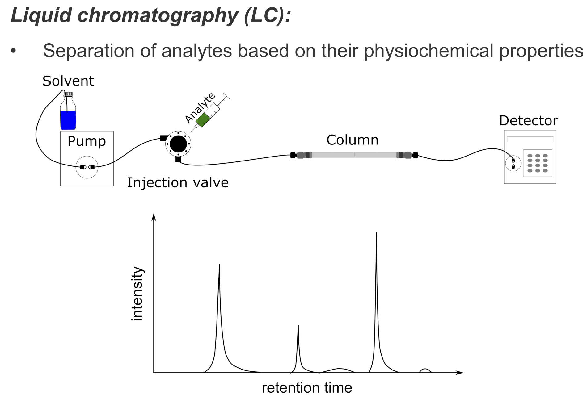

Introduction
============

[OpenMS](http://www.openms.org/)
is an open-source software C++ library for {term}`LC-MS` data management and
analyses. It offers an infrastructure for rapid development of {term}`mass`
spectrometry related software. OpenMS is free software available under the
three clause BSD license and runs under Windows, macOS, and Linux.

```{note}
This introduction is aimed at users new to the field of LC-MS data analysis and will introduce some basics terms
and concepts. How to handle the data analysis, available data structures, algorithms and more are covered in the various
subsections of this documentation.
```

# Background

Proteomics and metabolomics are interdisciplinary research fields that study structure, function, and interaction of
proteins and metabolites. They employ large-scale experimental techniques that allow acquiring data at the level of
cellular systems to whole organisms. {term}`Mass` spectrometry combined with chromatographic separation is commonly used to
identify, characterize or quantify the amount of proteins and metabolites.

In {term}`mass` spectrometry-based proteomics and metabolomics, biological samples are extracted, prepared, and separated to
reduce sample complexity. The separated analytes are ionized and measured in the {term}`mass` spectrometer. {term}`Mass` and abundance
of ions are stored in {term}`mass` spectra and used to identify and quantify the analytes in the sample using computational
methods. The quantity and identity of analytes can then be used, for instance, in biomarker discovery, medical diagnostics,
or basic research.

## Liquid Chromatography(LC)

LC aims to reduce the complexity of the measured sample by separating analytes based on their physicochemical properties.
Separating analytes in time ensures that a manageable amount of analytes elute at the same time. In {term}`mass`
spectrometry-based proteomics, (high-pressure) liquid chromatographic separation techniques (HPLC) are methods of choice
to achieve a high degree of separation. In HPLC, {term}`peptides` are separated on a column. Solved in a pressurized liquid
(mobile phase) they are pumped through a solid adsorbent material (stationary phase) packet into a capillary column.
Physicochemical properties of each peptide determine how strongly it interacts with the stationary phase. The most
common HPLC technique in proteomics and metabolomics uses reversed-phase chromatography (RPC) columns. RPC employs a
hydrophobic stationary phase like {term}`octadecyl (C18)`, a nonpolar carbon chain bonded to a silica base, and a polar mobile
phase. Polar molecules interact weakly with the stationary phase and elute earlier, while non-polar molecules are retained.
Interaction can be further modulated by changing the gradient of solvent concentration in the mobile phase over time.
Elution times in LC are inherently prone to variation, for example, due to fluctuations in the flow rate of the mobile
phase or change of column. Retention time shifts between runs may be compensated using computational chromatographic
retention time alignment methods. In the {term}`LC-MS` setup, the column is directly coupled to the ion source of the {term}`mass`
spectrometer.



## Mass Spectrometry

MS is an analytical technique used to determine the {term}`mass` of molecules. In order to achieve highly accurate and sensitive
{term}`` measurements at the atomic scale, {term}`mass` spectrometers manipulate charged particles using magnetic and electrostatic
fields.


In a typical {term}`mass` spectrometer, three principal components can be identified:

- **Ion Source**: A {term}`mass` spectrometer only handles {term}`ions`. Thus, charge needs first be transferred to uncharged
  particles. The component responsible for the ionization is the ion source. Different types of ion sources and ionization
  techniques exist with {term}`electrospray ionization (ESI)` being currently the most widely used ionization technique
  for {term}`mass` spectrometry-based proteomics.

- **Mass Analyzer**: Most commonly used {term}`mass` analyzer in proteomics are {term}`time-of-flight (TOF)` {term}`mass` analyzers,
  {term}`quadrupole mass filters`, and {term}`orbitrap analyzers`. In TOF {term}`mass` analyzers, the ions are accelerated in an electric field.
  The flight time of an ion allows calculating the velocity which in turn is used to calculate the mass-to-charge ratio
  (m/z). Varying the electric field allows filtering certain mass-to-charge ratios before they enter the detector. In
  quadrupole mass filters, ions pass through an oscillating electric field created by four parallel rods. For a
  particular voltage, only ions in a certain mass-to-charge range will reach the detector. The orbitrap is an ion trap
  mass analyzer (and detector) that traps ions in orbital motion between a barrel-like outer electrode and a spindle-like
central electrode allowing for prolonged {term}`mass` measurement. As a result of the prolonged {term}`mass` measurements, a high {term}`mass`
  resolution can be achieved.

- **Detector**: The last component of the mass spectrometer is the detector. It determines the abundance of ions that
  passed through the {term}`mass`analyzer. Ion intensities (a value that relates to its abundance) and the mass-to-charge ratio
are recorded in a {term}`mass` spectrum.

A sample is measured over the retention time of the chromatography typically resulting in tens of thousands of spectra.
The measurement of one sample is called an MS run and the set of spectra called an {term}`MS(1)` map or peak map.


The left image displays spectrum with peaks (m/z and intensity values) and the right image shows spectra stacked in
retention time yielding a peak map.

In proteomics and metabolomics, the {term}`MS(1)` intensity is often used for the quantification of an analyte. Identification
based on the {term}`MS(1)` mass-to-charge and the isotope pattern is highly ambiguous. To improve identification, tandem {term}`mass`
spectrometry {term}`(MS/MS)` can be applied to assess the analyte substructure. To this end, the precursor ion is isolated and
kinetically fragmented using an inert gas (e.g., Argon). Fragments produced by {term}`collision-induced dissociation (CID)`
are stored in an {term}`MS^2` (or {term}`MS/MS`) spectrum and provide information that helps to resolve the ambiguities in identification.
Alternatively, {term}`MS/MS` spectra can be used for quantification.

Get started with installing OpenMS using the installers available for different operating systems!

## Installation on different platforms

```{tab} GNU/Linux

```bash
wget https://abibuilder.informatik.uni-tuebingen.de/archive/openms/OpenMSInstaller/release/latest/OpenMS-2.8.0-Debian-Linux-x86_64.deb

```

```

```{tab} Windows

```bash
wget https://abibuilder.informatik.uni-tuebingen.de/archive/openms/OpenMSInstaller/release/latest/OpenMS-2.8.0-Win64.exe
```

```

```{tab} macOS

```bash
wget https://abibuilder.informatik.uni-tuebingen.de/archive/openms/OpenMSInstaller/release/latest/OpenMS-2.8.0-macOS.dmg
```

```
