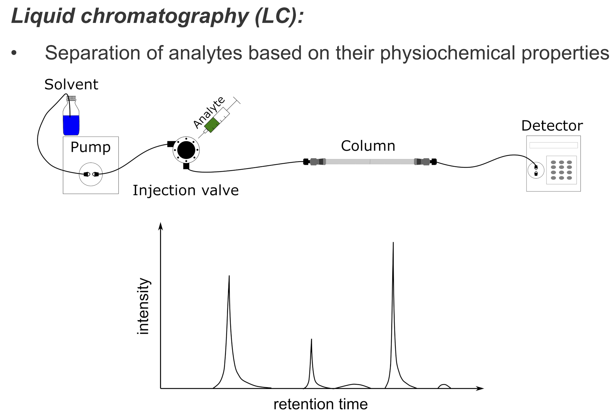
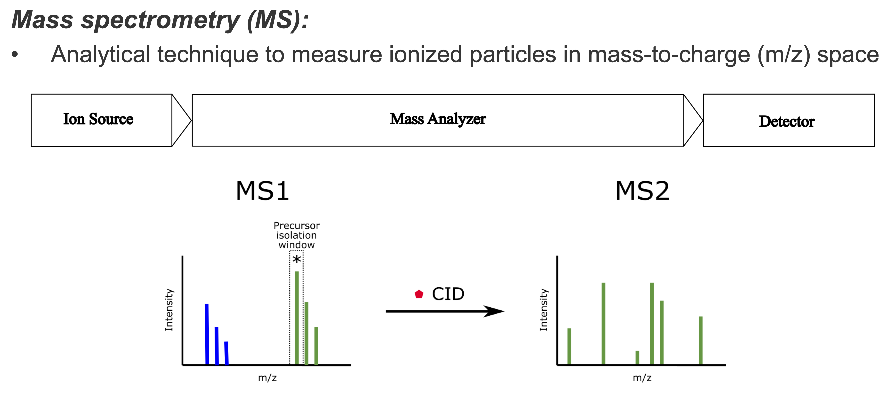

Background
==========

OpenMS was primarily designed to process, analyze and visualize liquid chromatography - mass spectrometry (LC-MS) data.

:::{note}
OpenMS in recent times has been expanded to include other mass spectrometry methods. To design your experimental analysis solution, [contact the OpenMS team](../quick-reference/contact-us.md) today.
:::

To understand how to use OpenMS, one must have a basic understanding of an LC-MS setup.

## Liquid Chromatography (LC)

Liquid chromatography is an analytical technique used to separate analytes according to their physicochemical properties. A sample is transported via a liquid (known as the mobile phase) through a stationary phase which is packed into a capillary column. The time it takes for a separated analyte to move through the stationary phase (or how long it takes to elute) is known as its {term}`retention time`. Each analyte will have a different retention time, depending on how strongly the analyte interacts with the stationary phase.  The total amount of analyte eluting from the column at every (retention) time point can be plotted as a {term}`chromatogram`. In LC-MS, the measured ion intensities are used as a proxy for the total amount.

## Mass Spectrometry

Mass spectrometry is an analytical technique used to determine the abundance of molecules in a sample. There are three major components in a mass spectrometer:
- An **ion source**, which generates ions from the incoming sample.
- A **mass analyzer**, which separates the ions according to their mass-to-charge ratio. There are several types of mass analyzers. Depending on the mass analyzer used in the experiment, OpenMS offers calibration tools, so that highly accurate results can be achieved.
- A **detector**, which records the mass-to-charge ratio of each ion against their relative abundance in a plot known as a {term}`mass spectrum`.

## Liquid Chromatography - Mass Spectrometry
Liquid chromatography is often coupled with mass spectrometry in order to reduce complexity in the mass spectra. The separated analytes from the liquid chromatography setup are directly injected into the ion source from the mass spectrometry setup. Multiple analytes that elute at the same time are separated by mass using the mass spectrometer.

