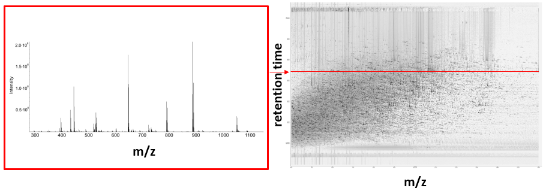

Background
==========

OpenMS was primarily designed to process, analyze and visualize liquid chromatography - mass spectrometry (LC-MS) data.

```{note}
OpenMS in recent times has been expanded to include other mass spectrometry methods. To design your experimental analysis solution, [contact the OpenMS team](https://openms.github.io/community/) today.
```

To understand how to use OpenMS, one must have a basic understanding of an LC-MS setup.

## Liquid Chromatography (LC)

Liquid chromatography (LC) is an analytical technique used to separate analytes according to their physicochemical properties. A sample is transported via a liquid (known as the mobile phase) through a stationary phase which is packed into a capillary column. The time it takes for an analyte to move through the stationary phase (or how long it takes to elute) is known as its {term}`retention time`. Each analyte will have a different {term}`retention time`, depending on how strongly it interacts with the stationary phase. The total amount of analyte eluting from the column at every (retention) time point can be plotted as a {term}`chromatogram`. In LC-MS, ion intensities as measured in the mass spectrometer are used as a proxy for the total amount. Liquid chromatography is especially useful for biomolecules, like metabolites, proteins, RNA, DNA, glycans or lipids as these molecules function naturally in a aqueous environment.


<div class="admonition video">
<p class="admonition-title">**Video**</p>
For more information on liquid chromatography, [view this video](https://timms.uni-tuebingen.de/Player/EPlayer?id=UT_20141021_001_cpm_0001&t=0.0#).
</div>


## Mass Spectrometry

Mass spectrometry is an analytical technique used to determine the abundance of molecules in a sample. There are three major components in a mass spectrometer:
- An **ion source**, which generates ions from the incoming sample. In LC-MS, the different compounds in a sample elute from the LC column at different retention times, reducing the complexity in the mass spectrum.
- A **mass analyzer**, which separates the ions according to their mass-to-charge ratio. There are several types such as time of flight (TOF), orbitrap and quadrupole mass analyzers. Depending on the mass analyzer, OpenMS offers calibration tools, so that highly accurate results can be achieved.
- A **detector**, which records the mass-to-charge ratio of each ion against their relative abundance in a plot known as a mass spectrum.


Sometimes a specialized form of mass spectrometry called Tandem Mass Spectrometry ({term}`MS/MS` spectrometry) is used when better identification is required. With MS/MS spectrometry,  an ion is isolated, fragmented using an inert gas and a second mass spectrum is recorded from the ion fragments. In this context, the primary ion is called the precursor ion and the spectrum from the fragments is called an  MS2 ({term}`MS/MS`) spectrum, which can help to resolve the ambiguities in identification of the precursor ion. Tandem mass spectrometry is especially useful for linear polymers like proteins, RNA and DNA and the fragments typically break the polymer into two parts. For example, peptides (short strands of amino acids, part of a protein) typically break between each of the amino acids, leading to a so-called ion ladder where the distance between each peak in the MS2 spectrum reveals the identity of the amino acid, as most amino acids have different masses. Also, metabolites can be identified by MS2 spectrum similarity matches with annotated compounds in libraries.

## Liquid Chromatography - Mass Spectrometry

Liquid chromatography is often coupled with mass spectrometry to reduce complexity in the mass spectra. If complex samples were directly fed to a mass spectrometer, you would not be able to detect the less abundant analyte ions. The separated analytes from the liquid chromatography setup are directly injected into the ion source from the mass spectrometry setup. Multiple analytes that elute at the same time are separated by mass using the mass spectrometer. 


From the LC-MS setup, a set of spectra called a peak map is produced. In a peak map, each spectrum represents the ions detected at a particular retention time. Each peak in a spectrum has a retention time, mass-to-charge and intensity dimension.




