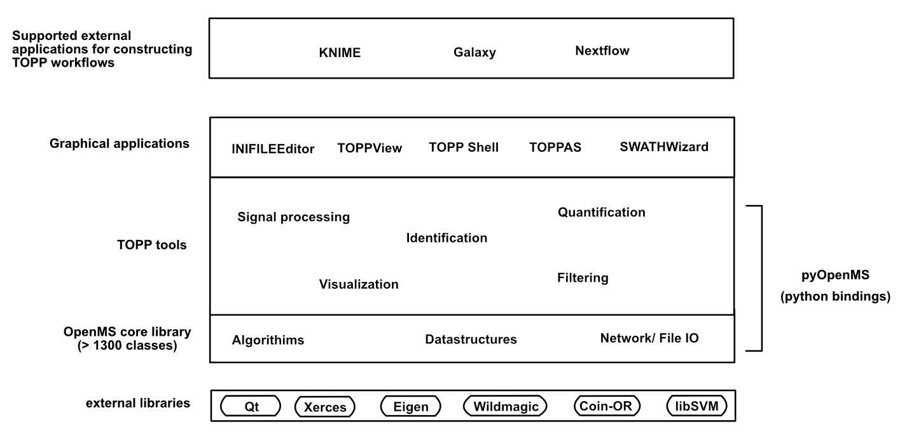

Entry Points to OpenMS
======================

OpenMS has been structured so that users from a wide range of fields can access what they need to solve their particular problem, depending on their skillset.



The following entry points for OpenMS and its TOPP tools are available for users:
- **Use a supported workflow editor** to create or run predefined workflows

  Suppose you want to run the same sequence of TOPP tools on a number of data sets. You can use applications such as KNIME, Nextflow and Galaxy (where TOPP tools are available as a plugin), to apply predefined workflows or custom workflows you have designed on your data. 
   
  ```{note}
  KNIME and Galaxy are recommended over TOPPAS, which can also be used to create workflows however is no longer supported.
  ```
- **Use OpenMS graphical user interfaces** to easily process data

  When OpenMS is installed, a number of graphical user interfaces are available. Life science experts that want to quickly process their mass spectrometry data with the TOPP tools available can use this option. [View the following link for more information](../openms-applications-and-tools/openms-graphical-user-interfaces.md).

- **Use command-line tools**

  All TOPP tools can be executed from a Command Line Interface (CLI) directly or using a shell script. By using a CLI, users can easily automate tasks and create workflows that can be saved, stored and used on multiple datasets. Command line interfaces include, but are not limited to PowerShell in Windows or Terminal in Linux or macOS. [View the command-line usage quick start guide here](../openms-applications-and-tools/command-line-interface.md).

- **Use the pyOpenMs python library** to rapidly prototype methods and scripts

  Classes and methods originally written in C++ have been exposed to a Python interface (pyOpenMS) using Python bindings (via Cython). Central data structures even provide fast export to pandas dataframes or numpy arrays. pyOpenMS was created for users with Python knowledge who want to quickly prototype new methods and scripts or interface with other prominent data science, machine learning or visualization libraries such as tensorflow or plotly.  [View the instructions to install pyOpenMS here](https://pyopenms.readthedocs.io/en/latest/installation.html).

- **Build the OpenMS C++ core library from source** to develop your own tools and methods

  As shown in the image below, TOPP tools have been created using the OpenMS core library and some external libraries, which are written in C++. Using the OpenMS core library directly provides faster access to tools and shorter run-times. Additional TOPP tools can also be developed, customized or extended based on the user’s needs. [View the instructions to build the OpenMS core library from source here](https://abibuilder.cs.uni-tuebingen.de/archive/openms/Documentation/release/latest/html/index.html).


