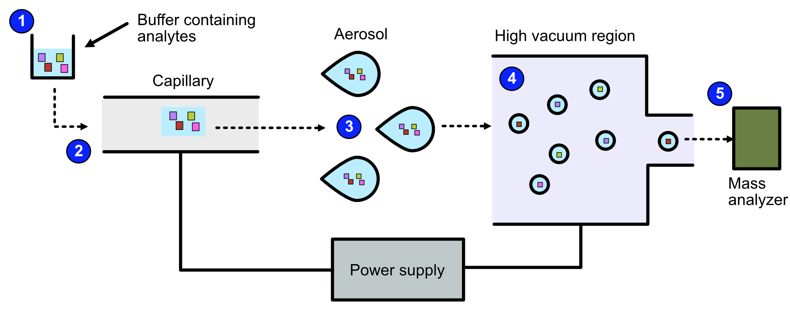
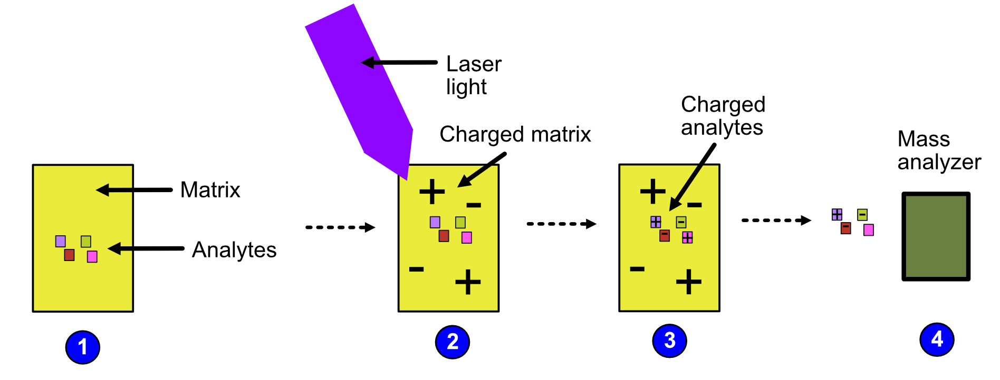

Background - Extended
=====================

Proteomics and metabolomics are interdisciplinary research fields that study the function and interaction of proteins and metabolites. They use large-scale experimental techniques that obtain data at the level of cellular systems to whole organisms. One of the main analytical methods to identify, characterize or quantify proteins and metabolites is mass spectrometry (MS) combined with chromatographic separation.
In mass spectrometry-based proteomics and metabolomics, biological samples are extracted, prepared, and separated by liquid chromatography (LC) to reduce sample complexity. The separated analytes are ionized and measured in the mass spectrometer. Mass and abundance of ions are stored in mass spectra and used to identify and quantify the analytes in the sample using computational methods. The quantity and identity of analytes can then be used in biomarker discovery, medical diagnostics, or basic research.

## Why use OpenMS

Classical analytical techniques are highly accurate but can only identify one protein at a time. Omics technologies can identify proteins by processing large volumes of data but with low accuracy. To address the need for an accurate, high-throughput technology, OpenMS was developed. 

OpenMS is an open-source, C++ framework for analyzing large volumes of mass spectrometry data. It has been specially designed for analyzing high performance LC-MS data but over recent times, has been extended to analyze data generated by other techniques.

```{note}
OpenMS in recent times has been expanded to include other mass spectrometry methods. To design your experimental analysis solution, [contact the OpenMS team](https://openms.github.io/community/) today.
```

## Purpose of section

To use OpenMS effectively, an understanding of chromatography and mass spectrometry is required as many of the algorithms are based on these techniques. 
This section provides a detailed explanation on LC and MS, and how they are combined to identify and quantify substances. 

## Liquid chromatography (LC)

Chromatography is a technique used by life scientists to separate molecules based on a specific physical or chemical property. There are many types of chromatography, but this section focuses on LC as it is widely used in proteomics and metabolomics. 

LC separates molecules based on a specific physical or chemicl property by mixing a sample containing the molecules of interest (otherwise known as **analytes**) in a liquid.

### Key components of LC

LC is made up of the following components:
- **A liquid solution**, known as the **mobile phase**, containing the analytes. 
- **A pump** which transports the liquid solution.
- **A stationary phase** which is a solid, homogeneous substance.
- **A column** which contains the stationary phase.

### How does LC work?

The liquid solution containing the analytes is pumped through a column that is attached to the stationary phase. Analytes are separated based on how strongly they interact with each phase. Some analytes will interact strongly with the mobile phase while others will be strongly attracted to the stationary phase, depending on their physical or chemical properties. The stronger an analyte's attraction is to the mobile phase, the faster it will leave the column. The time it takes for an analyte to escape from the column is called the analyte's **retention time**. As a result of their differing attractions to the mobile and stationary phases, different analytes will have different retention times, which is how separation occurs. 

The retention times for each analyte are recorded by a detector. The most common detector used is the mass spectrometer, which we discuss later. However, other detection methods exist, such as:
- Light absorption (photometric detector)
- Fluorescence
- Change in diffraction index

### High performance liquid chromatography (HPLC)

HPLC is the most commonly used tecchnique for separating proteins and metabolites. In HPLC, a high-pressured pump is used to transport a liquid (solvent) containing the molecules of interest through a thin capillary column. The stationary phase is ‘packed’ into the column. 

Several variations of HPLC exist such as:
- Reversed-phase (RP) chromatography
- Strong cation/anion exchange (SCX/SAX) chromatography
- Affinity chromatography
- Size exclusion chromatography

#### Special case of HPLC: Reversed-phase (RP) chromatography

RP chromatography is the most commony type of HPLC with biological samples. In reversed-phase liquid chromatography, the solid phase is modified to become hydrophobic, when it is originally hydrophilic, hence the term ‘reversed-phase’. The liquid phase is a mixture of water and an organic solvent. The separation of molecules happens based on the following behavior: hydrophilic analytes have a high affinity to the mobile phase and escape the column quickly  while hydrophobic analytes have a high affinity towards the organic solvent and therefore, take a longer time to escape the column.

## Mass spectrometry (MS)

Mass spectrometry is an analytical technique used to determine the abundance of molecules in a sample. 

### Key components of MS

There are three key components in a mass spectrometer:
- An **ion source**, which generates ions from the incoming sample. In LC-MS, the different compounds in a sample escapes from the LC column at different retention times, reducing the complexity in the mass spectrum.
- A **mass analyzer**, which separates the ions according to their mass-to-charge ratio. There are several types such as time of flight (TOF), orbitrap and quadrupole mass analyzers. Depending on the mass analyzer, OpenMS offers calibration tools, so that highly accurate results can be achieved.
- A **detector**, which records the mass-to-charge ratio of each ion against their relative abundance in a plot known as a mass spectrum.

#### Ion source

We want the analytes to move through the electrostatic and electromagnetic fields in the mass analyzer. To achieve this objective, we need to convert them to ions by charging them. There are a number of ways to charge our analytes including:
- Electrospray Ionization (ESI)
- Matrix Assisted Lser Desorption/Ionization (MALDI)
- Electron Impact Ionization (EI)

In proteomics and metabolomics, ESI and MALDI are used because they are soft ionization techniques.. A soft ionization technique is one which charges analytes while keeping the largely intact, so that they can be characterized easily at a later stage. Hard ionization techniques such as EI shatter analytes in smaller fragments, making it difficult to characterize large molecules. 

Given that OpenMS focuses on proteomic and metabolomic applictions, we will describe ESI and MALDI in further detail.

##### Electrospray Ionization (EI)
EI can be broken down into the following steps.

1. The sample is dissolved in a polar, volatile buffer.
2. The sample - dissolved in the buffer - is pumped through a thin, stainless steel capillary.
3. The sample is converted to small, charged, stable droplets (aerosolized) by applying high voltage.   
4. The aerosol is directed through regions of high vacuum until the droplets evaporate to near atomic size.
5. The particles are fed to the mass analyzer. 




##### Matrix Assisted Laser Desorption/Ionization (MALDI)

MALDI can be broken down into the following steps:
1. The analytes are mixed with a small organic molecule known as a matrix.
2. The mixture is exposed to radiation with short pulses of laser light, charging the matrix. 
3. The matrix transfers its charge to the analytes because the wavelength of the laser light is the same as the absorbance maximum of the matrix.
4. The analytes become charged and are fed to the mass analyzer.



#### Mass analyzer

Once the analytes have been charged by the ion source, we want to now sort the analytes by their mass-to-charge ratio for easy identification.

A number of mass analyzers exists. These include:
- Quadrupole analyzer
- Time-of-Flight analyzer
- Orbitrap analyzer

The next sections describe each analyzer type in detail.

##### Quadrupole analyzer

In a quadropole analyzer, you can set the quadropole voltage so that ions with a specific m/z ratio travel through. The oscillating electrostatic fields stabilize the flight path for the ions so that they can pass through the quadropole. Other ions will be accelerated out of the quadropole and will not make it to the end. 

##### Time-of-Flight analyzer

In a time-of-flight analyzer, ions are extracted from the ion source through an electrostatic field in pulses in a field-free drift zone. An electrostatic mirror called a reflectron reflects the ions back onto the next component of mass spectrometry, the detector. The detector counts the particles and records the time of flight from extraction to the moment the particle hits the detector. 

Lighter ions fly faster than heavier ions of the same charge and will arrive earlier at the detector. Therefore, an ion’s time of flight depends on the ion’s mass.  The ion's time of flight is also dependant on the ion's charge. This can be demonstrated by using the following equations:
1. Potential energy is transferred to an ion with charge **q** accelerated by an electrostatic field with voltage.
```{math}
 \begin{equation} E_p = qU_a
 \end{equation}
```
2. The potential energy is converted to kinetic energy as the ion accelerates.

```{math}
 \begin{equation} E_p = E_k = \frac{1}{2}mv^2
 \end{equation}
```

3. We know that for a given path,**s**, from extraction to the detector, the time of flight, **t** is equal to:

```{math}
 \begin{equation} t = \frac{s}{v}
 \end{equation}
```

Therefore,, **t**, for a given instrument's path length, **s**, depends on an ion's charge and mass. 

```{math}
 \begin{equation} t = \frac{s}{v} = \frac{s}{\sqrt{\frac{2qU_a}{m}}}
 \end{equation}
```

##### Orbitrap analyzer