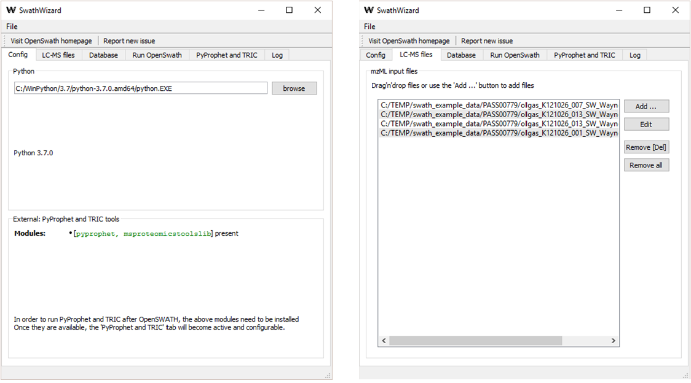

:orphan:
SwathWizard
============

SwathWizard is an assistant for Swath analysis.

The Wizard takes the user through the whole analysis pipeline for SWATH proteomics data analysis, i.e. the
[TOPP Documentation: OpenSwathWorkflow](https://abibuilder.informatik.uni-tuebingen.de/archive/openms/Documentation/nightly/html/UTILS_OpenSwathWorkflow.html) tool, including downstream tools such as [GitHub:PyProphet/pyProphet](https://github.com/PyProphet/pyprophet) and the [GitHub:msproteomicstools/TRIC alignment](https://github.com/msproteomicstools/msproteomicstools) tool.

Since the downstream tools require Python and the respective modules, the Wizard will check their proper installation
status and warn the user if a component is missing.

Users can enter the required input data (mzML MS/MS data, configuration files) in dedicated fields, usually by drag and
droping files from the operating systems' file explorer (Explorer, Nautilus, Finder...). The output of the Wizard is
both the intermediate files from OpenSWATH (e.g. the XIC data in `.sqMass` format) and the tab-separated table format
(`.tsv`) from pyProphet and TRIC.

This is how the wizard looks like:

A schematic of the internal data flow (all tools are called by SwathWizard in the background) can be found in the
[TOPP Documentation: SwathWizard](https://abibuilder.informatik.uni-tuebingen.de/archive/openms/Documentation/nightly/html/TOPP_SwathWizard.html).

A recommended test data for the Wizard is the [PASS00779](https://db.systemsbiology.net/sbeams/cgi/PeptideAtlas/PASS_View?identifier=PASS00779) dataset.
