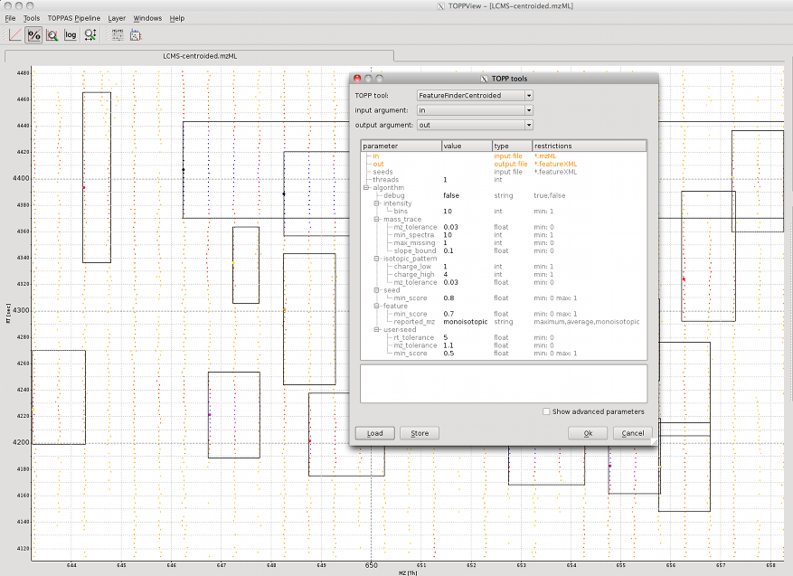

Feature Detection on Centroided Data
====================================

To quantify peptide features, TOPP offers the **FeatureFinder** tools. In this section the **FeatureFinderCentroided**
is used, which works only on centroided data. There are other FeatureFinders available that also work on profile data.

For this example the file `LCMS-centroided.mzML` from the examples data is used (**File** > **Open example data**). In order
to adapt the algorithm to the data, some parameters have to be set.

## Intensity

The algorithm estimates the significance of peak intensities in a local environment. Therefore, the HPLC-MS map is
divided into `n` times `n` regions. Set the `intensity:bins` parameter to `10` for the whole map. For a small region, set
it to `1`.

## Mass trace

For the mass traces, define the number of adjacent spectra in which a mass has to occur (`mass_trace:min_spectra`). In
order to compensate for peak picking errors, missing peaks can be allowed (`mass_trace:max_missing`) and a tolerated
mass deviation must be set (`mass_trace:mz_tolerance`).

## Isotope pattern

The expected isotopic intensity pattern is estimated from an averagene amino acid composition. The algorithm searches
all charge states in a defined range (`isotopic_pattern:change_min` to `isotopic_pattern:change_max`). Just as for mass
traces, a tolerated mass deviation between isotopic peaks has to be set (`isotopic_pattern:mz_tolerance`).

The image shows the centroided peak data and the found peptide features. The used parameters can be found in the TOPP
tools dialog.

