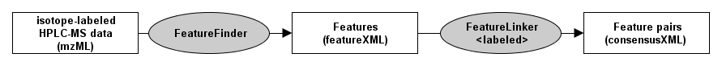

Feature Grouping
================

In order to quantify differences across maps (label-free) or within a map (isotope-labeled), groups of corresponding
features have to be found. The **FeatureLinker** TOPP tools support both approaches. These groups are represented by
consensus features, which contain information about the constituting features in the maps as well as average position,
intensity, and charge.

## Isotope-labeled quantitation

To differentially quantify the features of an isotope-labeled HPLC-MS map, follow the listed steps:

1. The first step in this pipeline is to find the features of the HPLC-MS map. The FeatureFinder applications calculate
   the features from profile data or centroided data.
2. In the second step, the labeled pairs (e.g. light/heavy labels of ICAT) are determined by the **FeatureLinkerLabeled**
   application. **FeatureLinkerLabeled** first determines all possible pairs according to a given optimal shift and
   deviations in RT and m/z. Then it resolves ambiguous pairs using a greedy-algorithm that prefers pairs with a higher
   score. The score of a pair is the product of:

   - feature quality of feature 1
   - feature quality of feature 2
   - quality measure for the shift (how near is it to the optimal shift)

   

## Label-free quantitation

To differentially quantify the features of two or more label-free HPLC-MS map.


```{tip}
This algorithm assumes that the retention time axes of all input maps are very similar. To correct for
retention time distortions, please have a look at [Map alignment](map-alignment.md).
```
