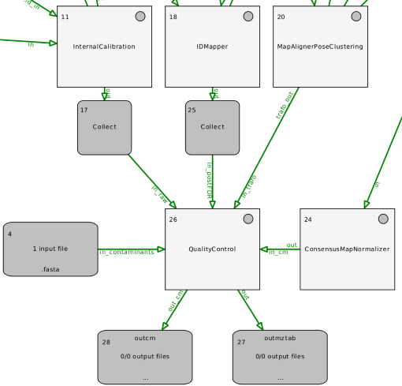

Quality Control
===============

To check the quality of the data (supports label-free workflows and [IsobaricAnalyzer](https://abibuilder.informatik.uni-tuebingen.de/archive/openms/Documentation/nightly/html/TOPP_IsobaricAnalyzer.html) output):

The [QualityControl](https://abibuilder.informatik.uni-tuebingen.de/archive/openms/Documentation/nightly/html/TOPP_QualityControl.html) TOPP tool computes and collects data which allows to compute QC metrics to check the quality of
LC-MS data. Depending on the given input data, this tool collects data for metrics (see section [Metrics](quality-control.md#Metrics)). New
metavalues will be added to existing data and the information will be written out in mzTab format. This mzTab file can
then be processed using custom scripts or via the R package (see [PTXQC](https://github.com/cbielow/PTXQC/)).

## Workflow

Find an example workflow in `OpenMS/share/OpenMS/examples/TOPPAS/QualityControl.toppas`.

For data from [IsobaricAnalyzer](https://abibuilder.informatik.uni-tuebingen.de/archive/openms/Documentation/nightly/html/TOPP_IsobaricAnalyzer.html), just provide the consensusXML as input to
[QualityControl](https://abibuilder.informatik.uni-tuebingen.de/archive/openms/Documentation/nightly/html/TOPP_QualityControl.html). No FeatureXMLs or TrafoXMLs are required. The mzML raw file can be added as input though.

## Metrics

Further headings shows what each of the included metrics does, what they need to be executed and what they add to the
data or what they return.

### Input Data

- **PostFDR FeatureXML**: A FeatureXML after FDR filtering.
- **Contaminants Fasta file**: A Fasta file containing contaminant proteins.
- **Raw mzML file**: An unchanged mzML file.
- **InternalCalibration MzML file**: An MzML file after internal calibration.
- **TrafoXML file**: The RT alignment function as obtained from a MapAligner.

### Contaminants

The Contaminants metric takes the contaminants database and digests the protein sequences with the digestion enzyme that
is given in the featureXML. Afterwards it checks whether each of all peptide sequences of the featureXML (including the
unassigned PeptideIdentifications) is registered in the contaminants database.

#### Required input data

Contaminants Fasta file, PostFDR FeatureXML

#### Output

**Changes in files**:

- Metavalue: `is_contaminant` set to `1` or to `0` if the peptide is found in the contaminant database or not and sets
  a `0` if not.

**Other outputs**:

- Returns:
  - Contaminant ratio of all peptides.
  - Contaminant ratio of all assigned peptides.
  - Contaminant ratio of all unassigned peptides.
  - Intensity ratio of all contaminants in the assigned peptides.
  - Number of empty features, Number of all found features.

### FragmentMassError

The **FragmentMassError** metric computes a list of fragment mass errors for each annotated MS2 spectrum in ppm and Da.
Afterwards it calculates the mass delta between observed and theoretical peaks.

#### Required input data

PostFDR FeatureXML, raw mzML file

#### Output

**Changes in files**:

- Metavalue:
  - `fragment_mass_error_ppm` set to the fragment mass error in parts per million.
  - `fragment_mass_error_da` set to the fragment mass error in Dalton

**Other Output**:

- Returns:
  - Average and variance of fragment mass errors in ppm

### MissedCleavages

The **MissedCleavages** metric counts the number of MissedCleavages per PeptideIdentification given a FeatureMap and returns
an agglomeration statistic (observed counts). Additionally the first PeptideHit of each PeptideIdentification in the
FeatureMap is augmented with metavalues.

#### Required input data

PostFDR FeatureXML

#### Output

**Changes in files**:

- Metavalue:
  - `missed_cleavages`

**Other Output**:

- Returns:
  - Frequency map of missed cleavages as key/value pairs.

### MS2IdentificationRate

The **MS2IdentificationRate** metric calculates the Rate of the MS2 identification as follows: The number of all
PeptideIdentifications are counted and that number is divided by the total number of MS2 spectra.

#### Required input data

PostFDR FeatureXML, raw mzML file.

#### Output

**Changes in files**: This metric does not change anything in the data.

**Other Output**:

- Returns:
  - Number of PeptideIdentifications
  - Number of MS2 spectra
  - Ratio of #pepID/#MS2

### MzCalibration

The **MzCalibration** metric adds new metavalues to the first (best) hit of each PeptideIdentification. For this metric
it is also possible to use this without an MzML File, but then only uncalibrated m/z error (ppm) will be reported.
However, for full functionality a PeakMap/MSExperiment with original m/z-values before m/z calibration generated by
InternalCalibration has to be given.

#### Required input data

PostFDR FeatureXML

#### Output

**Changes in files**:

- Metavalues:
  - `mz_raw` set to m/z value of original experiment.
  - `mz_ref` set to m/z value of calculated reference.
  - `uncalibrated_mz_error_ppm` set to uncalibrated m/z error in parts per million.
  - `calibrated_mz_error_ppm` set to calibrated m/z error in parts per million.

**Other Output**: No additional output.

### RTAlignment

The **RTAlignment** metric checks what the retention time was before the alignment and how it is after the alignment.
These two values are added to the metavalues in the PeptideIdentification.

#### Required input data

PostFDR FeatureXML, trafoXML file

#### Output

**Changes in files**:

- Metavalues:
  - `rt_align` set to retention time after alignment.
  - `rt_raw` set to retention time before alignment.

**Other Output**: No additional output.

### TIC

The **TIC** metric calculates the total ion count of an MSExperiment if a bin size in RT seconds greater than 0 is given.
All MS1 abundances within a bin are summed up.

#### Required input data

raw mzML file

#### Output

**Changes in files**: This metric does not change anything in the data.

**Other Output**:

- Returns:
  - TIC chromatograms

### TopNoverRT

The **TopNoverRT** metric calculates the ScanEventNumber (number of the MS2 scans after the MS1 scan) and adds them as the
new metavalue `ScanEventNumber` to the PeptideIdentifications. It finds all unidentified MS2-Spectra and adds corresponding
`empty` PeptideIdentifications without sequence as placeholders to the unassigned PeptideIdentification list.
Furthermore, it adds the metavalue `identified` to the PeptideIdentification.

#### Required input data

PostFDR FeatureXML, raw mzML file

#### Output

**Changes in files**:

- Metavalues:
  - `ScanEventNumber` set to the calculated value
  - `identified` set to `+` or `-`

- If provided:
  - `FWHM` set to RT peak width for all assigned PIs
  - `ion_injection_time` set to injection time from MS2 spectrum
  - `activation_method` set to activation method from MS2 spectrum
  - `total_ion_count` set to summed intensity from MS2 spectrum
  - `base_peak_intensity` set to highest intensity from MS2 spectrum

- Additionally:
  - Adds empty PeptideIdentifications

**Other Output**: No additional output.
