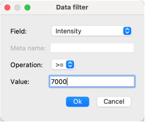

TOPPView: Visualize with OpenMS
===============================

## Introduction

{term}`TOPPView` is a graphical application for inspecting and visualizing {term}`MS` and {term}`HPLC-MS` data. It can be used to inspect files in {term}`mzML`, {term}`mzData`, {term}`mzXML` and several other text-based file formats.

In each view, several datasets can be displayed simultaneously using the layer concept. This allows visual comparison of several
datasets as well as displaying input data and output data of an algorithm together.

{term}`TOPPView` is intended for visual inspection of the data by experimentalists as well as for analysis software by
developers.

## User interface

The following image illustrates different components of TOPPView's user interface.


Components include:

- **Display modes and options**
- A **Viewer** that displays visual data.
- **Layers**

  You can visualize several datasets by creating **layers**. In the **Layers window** (dock window in the upper right
  corner), layers can be hidden and shown using the check box in front of each layer name.
- **Data filtering window**
- **Log window** to view textual output of applying TOPP tools to data.
- **Views windows** that show tabulated information about the dataset.

## Import a file

To import data into TOPPView:

1. Go to **File** > **Open file**.
2. Choose a file from the file importer and click **Open**.
3. Select options from the following panel and click **Ok**:

  

  You can choose to open the new dataset as a **new window** or **new layer**. Choosing **new window** will open a new tab. If you are planning on comparing multiple datasets and want to view them all at once, choose **new layer**.

  TOPPView automatically selects the **Map view** depending on the data you have imported.

  <TODO: explain display options>

You should be able to see your data in the **Viewer**.

## Process data in TOPPView

The following section details how to apply TOPP tools and filter data in TOPPView.

### Apply TOPP tool

OpenMS provides a number of TOPP tools that can be applied to your data.

To apply a TOPP tool to your dataset:

1. Select a layer in the **Layers window**. The selected layer will be highlighted blue.

  

2. Go to **Tools** > **Apply TOPP tool to whole layer**. This will open a panel to select and configure your TOPP tool.

3. Select a **TOPP tool** from the dropdown menu. A description of the TOPP tool will be displayed on the right. You may have to also specify the **input argument** as well though TOPPView might automatically select this option for you. To save the output to a file, specify the **output argument**.

  

4. Specify the TOPP tool parameters by either:
   <ol type="a">
    <li>Loading an INI file by clicking <b>Load</b> and selecting an INI File from the file importer.</li>

    <li>Editing the parameters shown in the table and then saving the INI file. To edit a parameter, double click a row in the table and enter a value or choose from the options available. The modified value will be highlighted yellow. To save the parameters, click <b>Store</b> and enter a file name for the INI file.</li>
   </ol>

   
5. Click **Ok**. You will be prompted to load the new     dataset as a **new window** or a **new layer**. Choose an option and click **Ok**.

  

6. If you chose to load the data in a new window, a new tab will appear. To view that data, select the tab. If you chose to load the data as a new layer, the data will be visualized in the **Viewer**. You can also see the new layer wihout a name in the **Layers window**.

  

7. (Optional) If you did choose to import the data as a new layer, give the new layer a name. To do this, right-click the layer in the **Layers window** and select **Rename**. Enter a name and click OK.

### Filter data

You may only want to see some data from your dataset and hide the rest. OpenMS allows you to filter data based on the following fields: **Intensity**, **Quality**, **Charge**, **Size** and **Meta data**.

To filter your data:

1. Select a layer from the **Layers window**.

    

2. Open the **Data filters window** by clicking the tab at the bottom of the screen.

  

3. Add a filter to the **Data filters window** by right-clicking the window and then selecting **Add filter** from the context menu.

4. Select a field, select an operation and enter a value. For example, to exclude all peaks with an intensity of less than 6999, set **field** to **Intensity**, **operation** to **=>** and set the value to 7000. Click **Ok** on the panel to apply the changes.

  

5. You should see only see data that satisfies the specified criteria.

### Additional topics

You might want to check out the following topics:

```{toctree}
:maxdepth: 1

visualize-with-openms/views-in-toppview.md
visualize-with-openms/display-modes-and-view-options.md
visualize-with-openms/data-analysis-in-toppview.md
visualize-with-openms/data-editing-in-toppview.md
visualize-with-openms/hotkeys-table.md
```
