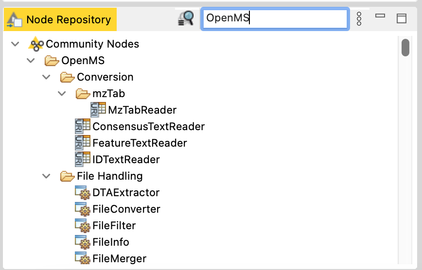

OpenMS in KNIME
===============

KNIME is a free graphical application for creating and executing workflows. OpenMS provides a plugin, which exposes TOPP and UTILS tools to the KNIME interface.

TO start using OpenMS in KNIME:

1. **[Download the application](https://www.knime.com/downloads)**.
2. **Install the OpenMS plugin**.

  <ol type="a">
   <li>Go to <b>File</b> > <b>Install KNIME Extensions</b>.</li>
   <li>Search for <b>OpenMS</b>.</li>
   <li>Select the checkbox next to <b>OpenMS</b> and click <b>Next</b>.</li>
   <li>Click <b>Next</b>.</li>
   <li>Accept the terms of conditions.</li>
   <li>Restart KNIME</li>
  </ol>
3. **Create a new file**.
4. **Search for OpenMS tools in the Node Repository**.

  

For a more specific example of how to use KNIME, [view our tutorial](../tutorials-and-quickstart-guides/tutorials.md#constructing-a-workflow-in-knime).
