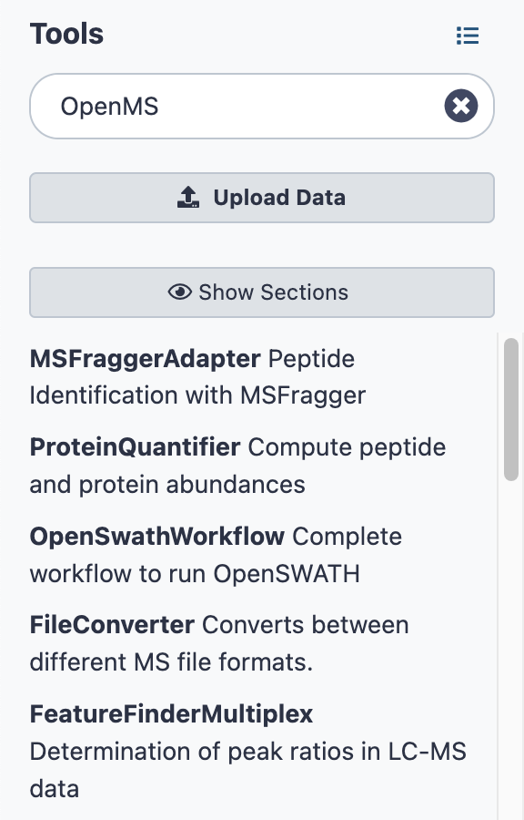

OpenMS on Galaxy
================

Galaxy is an open-source web platform designed for processing and analyzing large quantities of biomedical data.

TOPP tools have been integrated into Galaxy to facilitate the creation and execution of workflows.

To use TOPP tools on Galaxy:

1. Go to the [website](usegalaxy.org.au).
2. Create an account.
3. Go to **Tools** on the far left and scroll down.
4. Search for "OpenMS".
5. You will see a list of TOPP tools.

  
