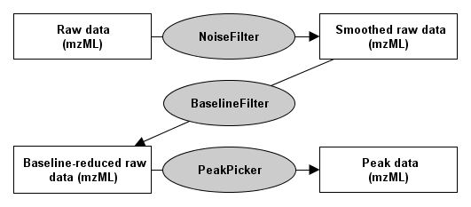

Profile data processing
======================

## Introduction

To find all peaks in the profile data:

1. Eliminate noise using a **NoiseFilter**.
2. The now smoothed profile data can be further processed by subtracting the baseline with the **BaselineFilter**.
3. Then use one of the **PeakPickers** to find all peaks in the baseline-reduced profile data.

There are two different smoothing filters: NoiseFilterGaussian and NoiseFilterSGolay. To use the Savitzky Golay filter,
or the **BaselineFilter** with non equally spaced profile data, e.g. TOF data, you have to generate equally spaced data
using the **Resampler** tool.

## Picking peaks with a PeakPicker

The **PeakPicker** tools allow for picking peaks in profile data. Currently, there are two different TOPP tools
available, PeakPickerWavelet and PeakPickerHiRes.

### PeakPickerWavelet

This peak picking algorithm uses the continuous wavelet transform of a raw data signal to detect mass peaks. Afterwards
a given asymmetric peak function is fitted to the raw data and important peak parameters (e.g. `fwhm`) are extracted. In
an optional step these parameters can be optimized using a non-linear optimization method.

The algorithm is described in detail in Lange et al. (2006) Proc. PSB-06.

- **Input Data**: profile data (low/medium resolution)
- **Application**: This algorithm was designed for low and medium resolution data. It can also be applied to
  high-resolution data, but can be slow on large datasets.

See the `PeakPickerCWT` class documentation for a parameter list.

### PeakPickerHiRes

This peak-picking algorithm detects ion signals in raw data and reconstructs the corresponding peak shape by cubic spline
interpolation. Signal detection depends on the signal-to-noise ratio which is adjustable by the user (see parameter
`signal_to_noise`).  A picked peak's m/z and intensity value is given by the maximum of the underlying peak spline.

Please notice that this method is still **experimental** since it has not been tested thoroughly yet.

- **Input Data**: profile data (high resolution)
- **Application**: The algorithm is best suited for high-resolution MS data (FT-ICR-MS, Orbitrap). In high-resolution
  data, the signals of ions with similar mass-to-charge ratios (m/z) exhibit little or no overlapping and therefore
  allow for a clear separation. Furthermore, ion signals tend to show well-defined peak shapes with narrow peak width.
  These properties facilitate a fast computation of picked peaks so that even large data sets can be processed very
  quickly.

  See the `PeakPickerHiRes` class documentation for a parameter list.

## Finding the right parameters for the NoiseFilters, the BaselineFilter and the PeakPickers

Finding the right parameters is not trivial. The default parameters will not work on most datasets. In order to find
good parameters, following this procedure:

1. Load the data in TOPPView.
2. Extract a single scan from the middle of the HPLC gradient (Right click on **scan**).
3. Experiment with the parameters until you have found the proper settings

Find the **NoiseFilters**, the **BaselineFilter**, and the **PeakPickers** in **TOPPView** in the menu **Layer** > **Apply TOPP tool**.
