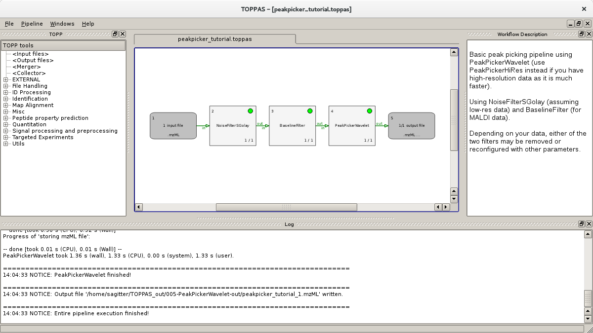

TOPPAS
======

An assistant for GUI-driven TOPP workflow design.

**TOPPAS** allows to create, edit, open, save, and run TOPP workflows. Pipelines can be created conveniently in a GUI by
means of mouse interactions. The parameters of all involved tools can be edited within the application and are also
saved as part of the pipeline definition in the `.toppas` file. Furthermore, TOPPAS interactively performs validity
checks during the pipeline editing process, in order to make it more difficult to create an invalid workflow. Once set
up and saved, a workflow can also be run without the GUI using the `ExecutePipeline` TOPP tool.

The following figure shows a simple example pipeline that has just been created and executed successfully:



More information about TOPPAS can be found in the [TOPPAS tutorial](../tutorials/TOPP/TOPPAS-tutorial.md).

**The command line parameters of this tool are**:

```
TOPPAS -- An assistant for GUI-driven TOPP workflow design.

Usage:
 TOPPAS [options] [files]

Options are:
  --help           Shows this help
  --debug          Enables debug messages
  -ini <File>      Sets the INI file (default: ~/.TOPPAS.ini)
```
