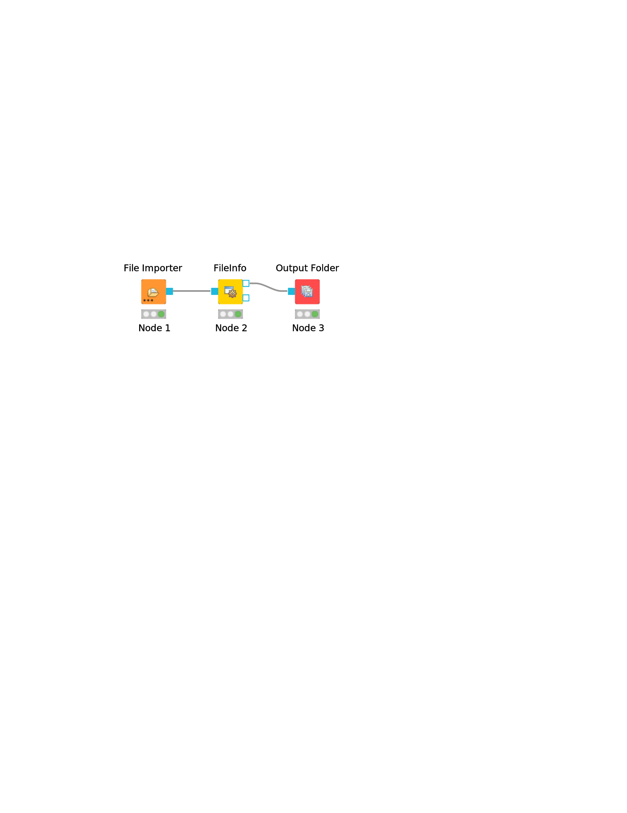

OpenMS User Tutorial
====================

## General Remarks

- This handout will guide you through an introductory tutorial for the OpenMS/TOPP software package[^1].

- OpenMS[^2]<sup>,</sup>[^3] is a versatile open-source library for mass spectrometry data analysis. Based on this library, we offer a collection of command-line tools ready to be used by end users. These so-called TOPP tools (short for ”The OpenMS Pipeline”)[^4] can be understood as small building blocks of arbitrarily complex data analysis workflows.

- In order to facilitate workflow construction, OpenMS was integrated into KNIME[^5], the Konstanz Information Miner, an open-source integration platform providing a powerful and flexible workflow system combined with advanced data analytics, visualization, and report capabilities. Raw MS data as well as the results of data processing using TOPP can be visualized using TOPPView[^6].

- This tutorial was designed for use in a hands-on tutorial session but can also be worked through at home using the online resources. You will become familiar with some of the basic functionalities of OpenMS/TOPP, TOPPView, as well as KNIME and learn how to use a selection of TOPP tools used in the tutorial workflows.

- All sample data referenced in this tutorial can be found in the
`C: / Example_Data` folder, on the USB stick that came with this tutorial, or released online on our GitHub repository `OpenMS/Tutorials`.

## Getting Started

### Installation

Before we get started, we will install OpenMS and KNIME. If you take part in a training session you will have likely received an USB stick from us that contains the required data and software. If we provide laptops with the software you may of course skip the installation process and continue reading the next section.

#### Installation from the OpenMS USB stick

Please choose the directory that matches your operating system and execute the installer.

For Windows, you call:

- The OpenMS installer: `Windows / OpenMS-2.7.0-Win64.exe`
- The KNIME installer: `Windows / KNIME-4.4.1-Installer-64bit.exe`
- OpenMS prerequisites (Windows-only): After installation, before your first use of the OpenMS plugin in KNIME, you will be asked to download it automatically if certain requirements are not found in your Windows registry. Alternatively, you can get a bundled version here or on the OpenMS USB stick (`Windows / OpenMS-2.7-prerequisites-installer.exe`).

On macOS, you call:

- The OpenMS installer: `Mac / OpenMS-2.7.0-macOS.dmg`
- The KNIME installer: `Mac / knime_4.4.1.app.macosx.cocoa.x86_64.dmg`

Afterwards, follow the instructions. For the OpenMS installation on macOS, accept the license and drag and drop  the OpenMS folder into your Applications folder.

```{note}
Due to increasing security measures for downloaded apps (e.g. path
randomization) on macOS you might need to open `TOPPView.app` and `TOPPAS.app` while holding <kbd>ctrl</kbd> and accept the warning. If the app still does not
open, you might need to move them from **Applications** > **OpenMS-2.7.0** to e.g. your Desktop and back.
```
On Linux, you can extract KNIME to a folder of your choice and for TOPPView you need to install OpenMS via your package manager or build it on your own with the instructions under the [API reference](www.openms.de/documentation) website.

```{note}
If you have installed OpenMS on Linux or macOS via your package
manager (for instance by installing the `OpenMS-2.7.0-Linux.deb` package),
then you need to set the `OPENMS_DATA_PATH` variable to the directory containing the shared data (normally `/usr/share/OpenMS`). This must be done prior to running any TOPP tool.
```
#### Installation from the internet

If you are working through this tutorial at home, you can get the installers under the following links:

- [OpenMS](https://www.openms.de/download/openms-binaries)
- [KNIME](https://www.knime.org/downloads/overview)
- OpenMS prerequisites (Windows-only): After installation, before your first use
of the OpenMS plugin in KNIME you will be asked to download it automatically
if certain requirements are not found in your Windows registry. Alternatively,
you can get a bundled version here.

Choose the installers for the platform you are working on.

### Data conversion

Each MS instrument vendor has one or more formats for storing the acquired data.
Converting these data into an open format (preferably mzML) is the very first step
when you want to work with open-source mass spectrometry software. A freely available conversion tool is MSConvert, which is part of a `ProteoWizard` installation. All files
used in this tutorial have already been converted to mzML by us, so you do not need
to perform the data conversion yourself. However, we provide a small raw file so you
can try the important step of raw data conversion for yourself.

```{note}
The OpenMS installation package for Windows automatically installs
ProteoWizard, so you do not need to download and install it separately. Due
to restrictions from the instrument vendors, file format conversion for most
formats is only possible on Windows systems. In practice, performing the
conversion to mzML on the acquisition PC connected to the instrument is
usually the most convenient option.
```
To convert raw data to mzML using `ProteoWizard` you can either use MSConvertGUI (a
graphical user interface) or `msconvert` (a simple command line tool).

||
|:--:|
|Figure 1: `MSConvertGUI` (part of `ProteoWizard`), allows converting raw files to mzML. Select the raw files you want to convert by clicking on the browse button and then on Add. Default parameters can usually be kept as-is. To reduce the initial data size, make sure that the `peakPicking` filter (converts profile data to centroided data (see Fig. 2)) is listed, enabled (true) and applied to all MS levels (parameter ”1-”). Start the conversion process by clicking on the Start button.|

Both tools are
available in: `C: / Program Files / OpenMS-2.7.0 / share / OpenMS / THIRDPARTY / pwiz-bin`.

You can find a small RAW file on the USB stick `C: / Example_Data Introduction
datasets/raw`.

#### MSConvertGUI

`MSConvertGUI` (see Fig. 1) exposes the main parameters for data conversion in a convenient graphical user interface.

#### msconvert

The `msconvert` command line tool has no user interface but offers more options than the application `MSConvertGUI`. Additionally, since it can be used within a batch script, it allows converting large numbers of files and can be much more easily automatized.
To convert and pick the file `raw_data_file.RAW` you may write:

```bash
msconvert raw_data_file.RAW --filter ”peakPicking true 1-”
```

in your command line.

||
|:--:|
|Figure 2: The amount of data in a spectra is reduced by peak picking. Here a profile spectrum (blue) is converted to centroided data (green). Most algorithms from this point on will work with centroided data.|

To convert all RAW files in a folder may write:

```bash
msconvert *.RAW -o my_output_dir
```

```{note}
To display all options you may type `msconvert --help` . Additional information is available on the `ProteoWizard` web page.
```

#### ThermoRawFileParser

Recently the open-source platform independent ThermoRawFileParser tool has been developed. While Proteowizard and MSConvert are only available for Windows systems this new tool allows to also convert raw data on Mac or Linux.

```{note}
To learn more about the ThermoRawFileParser and how to use it in
KNIME see Section 2.4.7
```
### Data visualization using TOPPView

Visualizing the data is the first step in quality control, an essential tool in understanding the data, and of course an essential step in pipeline development. OpenMS provides a convenient viewer for some of the data: TOPPView. We will guide you through some of the basic features of TOPPView. Please familiarize yourself with the key controls and visualization methods. We will make use of these later throughout the tutorial. Let’s start with a first look at one of the files of
our tutorial data set. Note that conceptually, there are no differences in visualizing metabolomic or proteomic data. Here, we inspect a simple proteomic measurement:

||
|:--:|
|Figure 3: TOPPView, the graphical application for viewing mass spectra and analysis results. Top window shows a small region of a peak map. In this 2D representation of the measured spectra, signals of eluting peptides are colored according to the raw peak intensities. The lower window displays an extracted spectrum (=scan) from the peak map. On the right side, the list of spectra can be browsed.|

||
|:--:|
|Figure 4: 3D representation of the measured spectra, signals of eluting peptides arecolored according to the raw peak intensities.|

- Start TOPPView (see Windows' Start-Menu or **Applications** > **OpenMS-2.7.0** on macOS)

- Go to **File** > **Open File**, navigate to the directory where you copied the contents
of the USB stick to, and select **Example_Data** > **Introduction** > **datasets** > **small** > **velos005614.mzML**. This file contains only a reduced LC-MS map of a label-free proteomic platelet measurement recorded on an Orbitrap velos. The other two mzML files contain technical replicates of this experiment. First, we want to
obtain a global view on the whole LC-MS map - the default option Map view 2D
is the correct one and we can click the <kbd>Ok</kbd> button.

- Play around.

- Three basic modes allow you to interact with the displayed data: scrolling, zooming and measuring:
  - **Scroll mode**
    - Is activated by default (though each loaded spectra file is displayed
zoomed out first, so you do not need to scroll).
    - Allows you to browse your data by moving around in RT and m/z range.
    - When zoomed in, you can scroll through the spectra. Click-drag on the current view.
    - Arrow keys can be used to scroll the view as well.
  - **Zoom mode**
    - Zooming into the data; either mark an area in the current view with
your mouse while holding the left mouse button plus the <kbd>Ctrl</kbd> key to
zoom to this area or use your mouse wheel to zoom in and out.
    - All previous zoom levels are stored in a zoom history. The zoom history
can be traversed using <kbd>Ctrl</kbd> + <kbd>+</kbd> or <kbd>Ctrl</kbd> + <kbd>-</kbd> or the mouse wheel (scroll up and down).
    - Pressing backspace <kbd>←</kbd> zooms out to show the full LC-MS map (and
also resets the zoom history).
  - **Measure mode**
    - It is activated using the <kbd>⇧</kbd>(shift) key.
    - Press the left mouse button down while a peak is selected and drag
the mouse to another peak to measure the distance between peaks.
    - This mode is implemented in the 1D and 2D mode only.
- Right click on your 2D map and select **Switch to 3D mode** and examine your data in 3D mode (see Fig. 4).
- Go back to the 2D view. In 2D mode, visualize your data in different intensity normalization modes, use linear , percentage, snap and log-view (icons on
the upper left tool bar). You can hover over the icons for additional information.

  ```{note}
  On macOS, due to a bug in one of the external libraries used by
  OpenMS, you will see a small window of the 3D mode when switching
  to 2D. Close the 3D tab in order to get rid of it.
  ```
- In TOPPView you can also execute TOPP tools. Go to **Tools** > **Apply tool (whole layer)**
and choose a TOPP tool (e.g., `FileInfo`) and inspect the results.

Dependent on your data MS/MS spectra can be visualized as well (see Fig.5) . You can
do so, by double-click on the MS/MS spectrum shown in scan view

||
|:--:|
|Figure 5: MS/MS spectrum|

### Introduction to KNIME/OpenMS

Using OpenMS in combination with KNIME, you can create, edit, open, save, and run workflows that combine TOPP tools with
the powerful data analysis capabilities of KNIME. Workflows can be created conveniently in a graphical user interface.
The parameters of all involved tools can be edited within the application and are also saved as part of the workflow.
Furthermore, KNIME interactively performs validity checks during the workflow editing process, to make it more
difficult to create an invalid workflow. Throughout most parts of this tutorial, you will use KNIME to create and execute
workflows. The first step is to become familiar with KNIME. Additional information on the basic usage of KNIME can be
found on the KNIME [Getting Started page](https://www.knime.com/getting-started-guide). However, the most important
concepts will also be reviewed in this tutorial.

#### Plugin and dependency installation

Before we can start with the tutorial, we need to install all the required extensions for KNIME. Since KNIME 3.2.1, the
program automatically detects missing plugins when you open a workflow but to make sure that the right source for the
OpenMS plugin is chosen, please follow the instructions here. First, we install some additional extensions that are
required by our OpenMS nodes or used in the Tutorials e.g. for visualization and file handling.

1. Click on **Help** > **Install New Software**.
2. From the **Work with**: drop-down list select http://update.knime.com/analytics- platform/4.4.
3. Now select the following plugins from the KNIME & Extensions category
   - KNIME Base Chemistry Types & Nodes
   - KNIME Chemistry Add-Ons
   - KNIME File Handling Nodes (required for OpenMS nodes in general)
   - KNIME Interactive R Statistics Integration
   - KNIME Report Designer
   - KNIME SVG Support
4. Click on **Next** and follow the instructions (you may but don’t need to restart KNIME now).
5. Click again on **Help** > **Install New Software**
6. From the **Work with**: drop-down list select http://update.knime.com/community -contributions/trusted/4.4
7. Now select the following plugin from the ”KNIME Community Contributions - Cheminformatics” category
   - RDKit KNIME integration
8. Click on **Next**  and follow the instructions and after a restart of KNIME the dependencies will be installed.

In addition, we need to install R for the statistical downstream analysis. Choose the directory that matches your
operating system, double-click the R installer and follow the instructions. We recommend to use the default settings
whenever possible. On macOS you also need to install XQuartz from the same directory.

Afterwards open your R installation. If you use Windows, you will find an ”R x64 3.6.X” icon on your desktop. If you use
macOS, you will find R in your Applications folder. In R type the following lines (you might also copy them from the file
**R** > **install_R_packages.R** folder on the USB stick):

```rconsole
install.packages('Rserve',,"http://rforge.net/",type="source")
install.packages("Cairo")

install.packages("devtools")
install.packages("ggplot2")
install.packages("ggfortify")

if (!requireNamespace("BiocManager", quietly = TRUE))
  install.packages("BiocManager")

BiocManager::install()
BiocManager::install(c("MSstats"))
```
In KNIME, click on **KNIME** > **Preferences**, select the category **KNIME** > **R** and set the ”Path to R Home” to
your installation path. You can use the following settings, if you installed R as described above:

- Windows: `C: \Program Files \R \R-3.6.X (where X is the version you used to install the above libraries)`
- macOS: `/Library/Frameworks/R.framework/Versions/3.6/Resources`

You are now ready to install the OpenMS nodes.
- Open KNIME.
- Click on **Help** > **Install New Software**

We included a custom KNIME update site to install the OpenMS KNIME plugins from the USB stick. If you do not have a stick
available, please see below.

- In the now open dialog choose **Add** (in the upper right corner of the dialog) to define a new update site. In the
  opening dialog enter the following details.

  Name: OpenMS 2.7 UpdateSite
  Location: `file:/KNIMEUpdateSite/2.7.0/`
- After pressing **OK** KNIME will show you all the contents of the added Update Site.

```{note}
From now on, you can use this repository for plugins in the **Work with**: drop-down list.
```

- Select the OpenMS nodes in the ”Uncategorized” category and click **Next**.
- Follow the instructions and after a restart of KNIME the OpenMS nodes will be available in the Node repository under
  “Community Nodes”.

Alternatively, you can try these steps that will install the OpenMS KNIME plugins from the internet. Note that download
can be slow.

- In the now open dialog, choose **Add** (in the upper right corner of the dialog) to define a new update site. In the
  opening dialog enter the following details.

  Name: OpenMS 2.5 UpdateSite
  Location: https://abibuilder.informatik.uni- tuebingen.de/archive/openms/knime-plugin/updateSite/nightly/
- After pressing **OK** KNIME will show you all the contents of the added Update Site.

```{note}
From now on, you can use this repository for plugins in the **Work with:** drop-drown list.
```
- Select the OpenMS nodes in the ”Uncategorized” category and click **Next**.
- Follow the instructions and after a restart of KNIME the OpenMS nodes will be available in the Node repository under
  "Community Nodes".

#### KNIME concepts

A workflow is a sequence of computational steps applied to a single or multiple input data to process and analyze the
data. In KNIME such workflows are implemented graphically by connecting so-called nodes. A node represents a single
analysis step in a workflow. Nodes have input and output ports where the data enters the node or the results are provided
for other nodes after processing, respectively. KNIME distinguishes between different port types, representing different
types of data. The most common representation of data in KNIME are tables (similar to an excel sheet). Ports that accept
tables are marked with a small triangle. For OpenMS nodes, we use a different port type, so called file ports, representing
complete files. Those ports are marked by a small blue box. Filled blue boxes represent mandatory inputs and empty blue
boxes optional inputs. The same holds for output ports, despite you can deactivate them in the configuration dialog
(double-click on node) under the **OutputTypes** tab. After execution, deactivated ports will be marked with a red cross and
downstream nodes will be inactive (not configurable).

A typical OpenMS workflow in KNIME can be divided in two conceptually different parts:

- Nodes for signal and data processing, filtering and data reduction. Here, files are passed between nodes. Execution
  times of the individual steps are typically longer for these types of nodes as they perform the main computations.
- Downstream statistical analysis and visualization. Here, tables are passed between nodes and mostly internal KNIME
  nodes or nodes from third-party statistics plugins are used. The transfer from files (produced by OpenMS) and tables
  usually happens with our provided Exporter and Reader nodes (e.g. MzTabExporter followed by MzTabReader).

Nodes can have three different states, indicated by the small traffic light below the node.
- Inactive, failed, and not yet fully configured nodes are marked red.
- Configured but not yet executed nodes are marked yellow.
- Successfully executed nodes are marked green.

If the node execution fails, the node will switch to the red state. Other anomalies and warnings like missing information
or empty results will be presented with a yellow exclamation mark above the traffic light. Most nodes will be configured
as soon as all input ports are connected. Some nodes need to know about the output of the predecessor and may stay red
until the predecessor was executed. If nodes still remain in a red state, probably additional parameters have to be
provided in the configuration dialog that can neither be guessed from the data nor filled with sensible defaults. In
this case, or if you want to customize the default configuration in general, you can open the configuration dialog of a
node with a double-click on the node. For all OpenMS nodes you will see a configuration dialog like the one shown in
below figure.

||
|:--:|
|Figure 6: Node configuration dialog of an OpenMS node|

```{tip}
OpenMS distinguishes between normal parameters and advanced parameters. Advanced parameters are by default hidden from
the users since they should only rarely be customized. In case you want to have a look at the parameters or need to
customize them in one of the tutorials you can show them by clicking on the checkbox **Show advanced parameter**
in the lower part of the dialog. Afterwards the parameters are shown in a light gray color.
```

The dialog shows the individual parameters, their current value and type, and, in the lower part of the dialog, the
documentation for the currently selected parameter. Please also note the tabs on the top of the configuration dialog.
In the case of OpenMS nodes, there will be another tab called OutputTypes. It contains dropdown menus for every output
port that let you select the output filetype that you want the node to return (if the tool supports it). For optional
output ports you can select Inactive such that the port is crossed out after execution and the associated generation of
the file and possible additional computations are not performed. Note that this will deactivate potential downstream
nodes connected to this port.

#### Overview of the graphical user interface

||
|:--:|
|Figure 7: The KNIME workbench|

The graphical user interface (GUI) of KNIME consists of different components or so-called panels that are shown in
above image. We will briefly introduce the individual panels and their purposes below.

##### Workflow Editor

The workflow editor is the central part of the KNIME GUI. Here you assemble the workflow by adding nodes from the Node
Repository via ”drag & drop”. For quick creation of a workflow, note that double-clicking on a node in the repository
automatically connects it to the selected node in the workbench (connecting all the inputs with as many fitting outputs
of the last node). Manually, nodes can be connected by clicking on the output port of one node and dragging the edge
until releasing the mouse at the desired input port of the next node. Deletions are possible by selecting nodes and/or
edges and pressing <kbd>DEL</kbd> or <kbd>Fn</kbd> + <kbd>Backspace</kbd> depending on your OS and settings. Multiselection
happens via dragging rectangles with the mouse or adding elements to the selection by clicking them while holding down
<kbd>Ctrl</kbd>.

##### KNIME Explorer

Shows a list of available workflows (also called workflow projects). You can open a workflow by double-clicking it. A
new workflow can be created with a right-click in the Workflow Explorer followed by choosing **New KNIME Workflow**
from the appearing context menu. Remember to save your workflow often with the <kbd>Ctrl</kbd> + <kbd>S</kbd> shortcut.

##### Workflow Coach (since KNIME 3.2.1)

Shows a list of suggested following nodes, based on the last added/clicked nodes. When you are not sure which node to
choose next, you have a reasonable suggestion based on other users behavior there. Connect them to the last node with a
double-click.

##### Node Repository

Shows all nodes that are available in your KNIME installation. Every plugin you install will provide new nodes that can
be found here. The OpenMS nodes can be found in **Community Node** > **OpenMS** Nodes for managing files (e.g., Input
Files or Output Folders) can be found in **Community Nodes** > **GenericKnimeNode**. You can search the node repository
by typing the node name into the small text box in the upper part of the node repository.

##### Outline

The Outline panel contains a small overview of the complete workflow. While of limited use when working on a small
workflow, this feature is very helpful as soon as the workflows get bigger. You can adjust the zoom level of the explorer
by adjusting the percentage in the toolbar at the top of KNIME.

##### Console

In the console panel, warning and error messages are shown. This panel will provide helpful information if one of the
nodes failed or shows a warning sign.

##### Node Description

As soon as a node is selected, the Node Description window will show the documentation of the node including
documentation for all its parameters and especially their in- and outputs, such that you know what types of data nodes
may produce or expect. For OpenMS nodes you will also find a link to the tool page of the online documentation.

#### Creating workflows

Workflows can easily be created by a right click in the Workflow Explorer followed by clicking on **New KNIME workflow**.

#### Sharing workflows

To be able to share a workflow with others, KNIME supports the import and export of complete workflows. To export a
workflow, select it in the Workflow Explorer and select **File** > **Export KNIME Workflow**. KNIME will export
workflows as a _knwf_ file containing all the information on nodes, their connections, and their parameter configuration.

Those *knwf* files can again be imported by selecting:

**File** > **Import KNIME Workflow**

```{note}
For your convenience we added all workflows discussed in this tutorial to the **Workflows** folder on the USB Stick.
 Additionally, the workflow files can be found on [workflow downloads](../downloads.md#workflows). If you want to check
 your own workflow by comparing it to the solution or got stuck, simply import the full workflow from the corresponding
 *knwf* file and after that double-click it in your KNIME Workflow repository to open it.
```

#### Duplicating workflows

In this tutorial, a lot of the workflows will be created based on the workflow from a previous task. To keep the
intermediate workflows, we suggest you create copies of your workflows so you can see the progress. To create a copy of
your workflow, save it, close it and follow the next steps.

- Right click on the workflow you want to create a copy of in the Workflow Explorer and select **Copy**.
- Right click again somewhere on the workflow explorer and select **Paste**.
- This will create a workflow with same name as the one you copied with a (2) appended.
- To distinguish them later on you can easily rename the workflows in the Workflow Explorer by right clicking on the
  workflow and selecting **Rename**.

```{note}
To rename a workflow it has to be closed, too.
```

#### A minimal workflow

Let us now start with the creation of a simple workflow. As a first step, we will gather some basic
information about the data set before starting the actual development of a data analysis workflow. This minimal workflow
can also be used to check if all requirements are met and that your system is compatible.

- Create a new workflow.
- Add an Input File node and an Output Folder node (to be found in **Community Nodes** > **GenericKnimeNodes** > **IO**
  and a FileInfo node (to be found in the category **Community Node** > **OpenMS** > **File Handling**)  to the workflow.
- Connect the Input File node to the FileInfo node, and the first output port of the FileInfo node to the Output Folder
  node.

```{tip}
In case you are unsure about which node port to use, hovering the cursor over the port in question will display the port
name and what kind of input it expects.
```
The complete workflow is shown in below image. `FileInfo` can produce two different kinds of output files.

||
|:--:|
|Figure 8: A minimal workflow calling `FileInfo` on a single file.|

- All nodes are still marked red, since we are missing an actual input file. Double-click the Input File node and select
  **Browse**. In the file system browser select **Example_Data** > **Introduction** > **datasets** > **tiny** > **velos005614.mzML**
  and click **Open**. Afterwards close the dialog by clicking **Ok**.

```{note}
Make sure to use the “tiny” version this time, not “small”, for the sake of faster workflow execution.
```
- The **Input File** node and the **FileInfo** node should now have switched to yellow, but the **Output Folder** node is still red.
  Double-click on the **Output Folder** node and click on **Browse** to select an output directory for the generated data.
- Great! Your first workflow is now ready to be run. Press <kbd>&uarr;</kbd> + <kbd>F7</kbd> (shift key + F7; or the
  button with multiple green triangles in the KNIME Toolbar) to execute the complete workflow. You can also right click
  on any node of your workflow and select <kbd>Execute</kbd> from the context menu.
- The traffic lights tell you about the current status of all nodes in your workflow. Currently running tools show either
  a progress in percent or a moving blue bar, nodes waiting for data show the small word “queued”, and successfully
  executed ones become green. If something goes wrong (e.g., a tool crashes), the light will become red.
- In order to inspect the results, you can just right-click the Output Folder node and select **View: Open the output folder**
  You can then open the text file and inspect its contents.  You will find some basic information of the data contained
  in the mzML file, e.g., the total number of spectra and peaks, the RT and m/z range, and how many MS1 and MS2 spectra
  the file contains.

Workflows are typically constructed to process a large number of files automatically. As a simple example, consider you
would like to convert multiple Thermo Raw files into the mzML format. We will now modify the workflow to compute the
same information on three different files and then write the output files to a folder.

- We start from the previous workflow.
- First we need to replace our single input file with multiple files. Therefore we add the Input Files node from the
  category **Community Nodes** > **GenericKnimeNodes** > **IO**.
- To select the files we double-click on the Input Files node and click on **Add**. In the filesystem browser we select
  all three files from the directory **Example_Data** > **Introduction** > **datasets** > **tiny**. And close the dialog
  with **Ok**.
- We now add two more nodes: the **ZipLoopStart** and the **ZipLoopEnd** node from the category
  **Community Nodes** > **GenericKnimeNodFlow** > **Flow**.
- Afterwards we connect the **Input Files** node to the first port of the **ZipLoopStart** node, the first port of the **ZipLoopStart**
  node to the **FileConverter** node, the first output port of the **FileConverter** node to the first input port of the
  **ZipLoopEnd** node, and the first output port of the **ZipLoopEnd** node to the **Output Folder** node (NOT to the Output File).

The complete workflow is shown in below figure.

||
|:--:|
|Figure 9: A minimal workflow calling the FileConverter on multiple Thermo Raw files in a loop|

Execute the workflow and inspect the output as before.

In case you had trouble to understand what **ZipLoopStart** and **ZipLoopEnd** do, here is a brief explanation:

- The **Input Files** node passes a list of files to the ZipLoopStart node.
- The ZipLoopStart node takes the files as input, but passes the single files sequentially (that is: one after the other)
  to the next node.
- The ZipLoopEnd collects the single files that arrive at its input port. After all files have been processed, the collected
  files are passed again as file list to the next node that follows.

#### Digression: Working with chemical structures

Metabolomics analyses often involve working with chemical structures. Popular cheminformatic toolkits such as RDKit[7]
or CDK[^8] are available as KNIME plugins and allow us to work with chemical structures directly from within KNIME.
In particular, we will use KNIME and RDKit to visualize a list of compounds and filter them by predefined substructures.
Chemical structures are often represented as SMILES (**S**implified **m**olecular **i**nput **l**ine **e**ntry **s**pecification), a simple and compact way to describe complex chemical structures as text. For example, the chemical structure of L-alanine can be written as the SMILES string C[C@H](N)C(O)=O. As we will discuss later, all OpenMS tools that perform metabolite
identification will report SMILES as part of their result, which can then be further processed and visualized using RDKit
and KNIME.

||
|:--:|
|Figure 10: Workflow to visualize a list of SMILES strings and filter them by predefined substructures|

Perform the following steps to build the workflow shown in the above figure. You will use this workflow to visualize a
list of SMILES strings and filter them by predefined substructures:

- Add the node File Reader, open the node configuration dialog and select the file `smiles.csv`. This file has been
  exported from the Human Metabolome Database (HMDB) and contains the portion of the human metabolome that has been
  detected and quantified. The file preview on the bottom of the dialog shows that each compound is given by its HMDB
  accession, compound name, and SMILES string. Click on the column header **SMILES** to change its properties. Change the
  column type from **string** to **smiles** and close the dialog with **Ok**. Afterwards the **SMILES** column will be
  visualized as chemical structures instead of text directly within all **KNIME** tables.
- Add the node `RDKit From Molecule` and connect it to the `File Reader`. This node will use the provided `SMILES`
  strings to add an additional column that is required by RDKit.
- Add the node `RDKit Functional Group Filter` and open the node configuration dialog. You can use this dialog to filter
  the compounds by any combination of functional groups. In this case we want to find all compounds that contain at
  least one aromatic carboxylic acid group. To do this, set this group as active and choose ’¿=’ and ’1’.
- Connect the first output port (Molecules passing the filter) to a `CSV Writer` node to save the filtered metabolites
  to a file. Right click **RDKit Functional Group Filter** and select the view ’Molecules passing the filter’ to inspect
  the selected compounds in KNIME. How many compounds pass the chosen filter, see below figure.


The following figure shows resulting list of compounds that contains at least one aromatic carboxylic acid group.

||
|:--:|
|Figure 11:  Resulting list of compounds that contains at least one aromatic carboxylic acid group.|

#### Advanced topic: Metanodes

Workflows can get rather complex and may contain dozens or even hundreds of nodes. KNIME provides a simple way to
improve handling and clarity of large workflows:

**Metanodes** allow to bundle several nodes into a single **Metanode**.

<div class="admonition task" name="html-admonition">
<p class="admonition-title"><b>Task</b></p>
Select multiple nodes (e.g. all nodes of the ZipLoop including the start and end node). To select a set of nodes, draw a rectangle around them with the left mouse button or hold <kbd>Ctrl</kbd> to add/remove single nodes from the selection.
<div class="admonition tip" name="html-admonition">
<p class="admonition-title"><b>Tip</b></p>
There is a <b>Select Loop</b> option when you right-click a node in a loop, that does exactly that for you. Then, open the
context menu (right-click on a node in the selection) and select <b>Create Metanode</b>. Enter a caption for the <b>Metanode</b>.
The previously selected nodes are now contained in the <b>Metanode</b>. Double-clicking on the <b>Metanode</b> will display
the contained nodes in a new tab window.
</div>
</div>

<div class="admonition task" name="html-admonition">
<p class="admonition-title"><b>Task</b></p>
Create the Metanode to let it behave like an encapsulated single node. First select the <b>Metanode</b>, open the context
menu (right-click) and select <b>Metanode</b> > <b>Wrap</b>. The differences between Metanodes and their wrapped counterparts
are marginal (and only apply when exposing user inputs and workflow variables). Therefore we suggest to use standard
Metanodes to clean up your workflow and cluster common subparts until you actually notice their limits.
</div>

<div class="admonition task" name="html-admonition">
<p class="admonition-title"><b>Task</b></p>
Undo the packaging. First select the (<b>Wrapped</b>) <b>Metanode</b>, open the context menu (right-click) and select <b>(Wrapped) Metanode</b> > <b>Expand</b>.
</div>

#### Advanced topic: R integration

KNIME provides a large number of nodes for a wide range of statistical analysis, machine learning, data processing, and
visualization. Still, more recent statistical analysis methods, specialized visualizations or cutting edge algorithms
may not be covered in KNIME. In order to expand its capabilities beyond the readily available nodes, external scripting
languages can be integrated. In this tutorial, we primarily use scripts of the powerful statistical computing language R.
Note that this part is considered advanced and might be difficult to follow if you are not familiar with R. In this case
you might skip this part.

**R View (Table)** allows to seamlessly include R scripts into KNIME. We will demonstrate on a minimal. We will
demonstrate on a minimal example how such a script is integrated.

<div class="admonition task" name="html-admonition">
<p class="admonition-title"><b>Task</b></p>
First we need some example data in KNIME, which we will generate using the <b>Data Generator</b> node. You can keep the
default settings and execute the node. The table contains four columns, each containing random coordinates and one column
containing a cluster number (Cluster_0 to Cluster_3). Now place a <b>R View (Table)</b> node into the workflow and connect
the upper output port of the <b>Data Generator</b> node to the input of the <b>R View (Table)</b> node. Right-click and
configure the node. If you get an error message like ”Execute failed: R_HOME does not contain a folder with name ’bin’.”
or ”Execution failed: R Home is invalid.”: please change the R settings in the preferences. To do so open <b>File</b> >
<b>Preferences</b> > <b>KNIME</b> > <b>R</b> and enter the path to your R installation (the folder that contains the bin
directory. (e.g., <b>C:</b> > <b>Program Files</b> > <b>R</b> > <b>R-3.4.3</b>).

If you get an error message like: ”Execute failed: Could not find Rserve package. Please install it in your R
installation by running ”install.packages(’Rserve’)”.” You may need to run your R binary as administrator (In windows
explorer: right-click ”Run as administrator”) and enter install.packages(’Rserve’) to install the package.

If R is correctly recognized we can start writing an R script. Consider that we are interested in plotting the first and
second coordinates and color them according to their cluster number. In R this can be done in a single line. In the
<b>R view (Table)</b> text editor, enter the following code:

<code>plot(x=knime.in$Universe_0_0, y=knime.in$Universe_0_1, main="Plotting column Universe_0_0 vs. Universe_0_1", col=knime.in$"Cluster Membership")</code>

**Explanation:** The table provided as input to the **R View (Table)** node is available as R **data.frame** with name
<code>knime.in</code>. Columns (also listed on the left side of the R View window) can be accessed in the usual R way by first
specifying the <code>data.frame</code> name and then the column name (e.g <code>knime.in$Universe_0_0</code>). <code>plot</code> is the plotting function
we use to generate the image. We tell it to use the data in column <b>Universe_0_0</b> of the dataframe object <b>knime.in</b>
(denoted as <code>knime.in$Universe_0_0</code>) as x-coordinate and the other column <code>knime.in$Universe_0_1</code> as y-coordinate in the
plot. <code>main</code> is simply the main title of the plot and <code>col</code> the column that is used to determine the color (in this case
it is the <code>Cluster Membership</code> column).

Now press the <b>Eval script</b> and <b>Show plot</b> buttons.
</div>

```{note}
Note that we needed to put some extra quotes around `Cluster Membership`. If we omit those, R would interpret the column
name only up to the first space `(knime.in$Cluster)` which is not present in the table and leads to an error. Quotes are
regularly needed if column names contain spaces, tabs or other special characters like $ itself.
```

## Label-free quantification of peptides

### Introduction

In the following chapter, we will build a workflow with OpenMS / KNIME to quantify a label-free experiment. Label-free
quantification is a method aiming to compare the relative amounts of proteins or peptides in two or more samples. We will
start from the minimal workflow of the last chapter and, step-by-step, build a label-free quantification workflow.

### Peptide identification

As a start, we will extend the minimal workflow so that it performs a peptide identification using the OMSSA[^9] search
engine. Since OpenMS version 1.10, OMSSA is included in the OpenMS installation, so you do not need to  download and
install it yourself.

Let’s start by replacing the input files in our **Input Files** node by the three mzML files in
**Example Data** > **Labelfree** > **datasets** > **lfqxspikeinxdilutionx1-3.mzML**. This is a reduced toy dataset where
each of the three runs contains a constant background of S. `pyogenes` peptides as well as human spike-in peptides in
different concentrations. [^10]

- Instead of FileInfo, we want to perform OMSSA identification, so we simply replace the `FileInfo` node with the
  `OMSSAAdapter` node **Community Nodes** > **OpenMS** > **Identification**, and we are almost done. Just make sure you
  have connected the `ZipLoopStart` node with the `in` port of the `OMSSAAdapter` node.
- OMSSA, like most mass spectrometry identification engines, relies on searching the input spectra against sequence
  databases. Thus, we need to introduce a search database input. As we want to use the same search database for all of
  our input files, we can just add a single `Input File` node to the workflow and connect it directly with the
  `OMSSAAdapter database` port. KNIME will automatically reuse this Input node each time a new ZipLoop iteration is
  started. In order to specify the database,
  **Example_Data** > **Labelfree** > **databases** > select **s_pyo_sf370_potato_human_target_decoy_with_contaminants.fasta**,
  and we have a very basic peptide identification workflow.

  ```{note}
  You might also want to save your new identification workflow under a different name. Have a look at [duplicating workflows](#duplicating-workflows)
  for information on how to create copies of workflows.
  ```
- The result of a single OMSSA run is basically a number of peptide-spectrum-matches (PSM) with a score each, and these
  will be stored in an idXML file. Now we can run the pipeline and after execution is finished, we can have a first look
  at the the results: just open the input files folder with a file browser and from there open an mzML file in **TOPPView**.
- Here, annotate this spectrum data file with the peptide identification results. Choose **Tools** > **Annonate with identification**
  from the menu and select the idXML file that **OMSSAAdapter** generated (it is located within the output directory that
  you specified when starting the pipeline).
- On the right, select the tab **Identification view**. All identified peptides can be seen using this view. User can also
  browse the corresponding MS2 spectra.

  ```{note}
  Opening the output file of `OMSSAAdapter` (the idXML file) directly is also possible, but the direct visusalisation of
  an idXML files is less useful.
  ```
- The search results stored in the idXML file can also be read back into a KNIME table for inspection and subsequent
  analyses: Add a `TextExporter` node from **Community Nodes** > **OpenMS** > **File Handling** to your workflow and
  connect the output port of your `OMSSAAdapter` (the same port `ZipLoopEnd` is connected to) to its input port. This
  tool will convert the idXML file to a more human-readable text file which can also be read into a KNIME table using
  the `IDTextReader` node. Add an `IDTextReader` node(**Community Nodes** > **OpenMS** > **Conversion**) after
  **TextExporter** and execute it. Now you can right click `IDTextReader` and select **ID Table** to browse your peptide
  identifications.
- From here, you can use all the tools KNIME offers for analyzing the data in this table. As a simple example, add a
  `Histogram (local)` node (from category **Views - Local (Swing)**) node after `IDTextReader`, double-click it, select
  `peptide_charge` as Histogram column, hit **OK**, and execute it. Right-clicking and selecting
  **Interactive View: Histogram view** will open a plot showing the charge state distribution of your identifications.

In the next step, we will tweak the parameters of OMSSA to better reflect the instrument’s accuracy. Also, we will
extend our pipeline with a false discovery rate (FDR) filter to retain only those identifications that will yeild an
FDR of < 1 %.

- Open the configuration dialog of `OMSSAAdapter`. The dataset was recorded using an LTQ Orbitrap XL mass spectrometer,
  set the precursor mass tolerance to a smaller value, say 5 ppm. Set `precursor_mass_tolerance` to 5 and
  `precursor_error_units` to `ppm`.

  ```{note}
  Whenever you change the configuration of a node, the node as well as all its successors will be reset to the Configured
  state (all node results are discarded and need to be recalculated by executing the nodes again).
  ```

- Set `max_precursor_charge` to 5, in order to also search for peptides with charges up to 5.
- Add `Carbamidomethyl (C)` as fixed modification and `Oxidation(M)` as variable modification.

  ```{note}
  To add a modification click on the empty value field in the configuration dialog to open the list editor dialog. In the
  new dialog click **Add**. Then select the newly added modification to open the drop down list where you can select the
  the correct modification.
  ```
- A common step in analysis is to search not only against a regular protein database, but to also search against a decoy
  database for FDR estimation. The fasta file we used before already contains such a decoy database. For OpenMS to know
  which OMSSA PSM came from which part of the file (i.e. target versus decoy), we have tso index the results. To this end,
  extend the workflow with a `PeptideIndexer` node **Community Nodes** > **OpenMS** > **ID Processing**. This node needs
  the idXML as input as well as the database file (see below figure).

  ```{tip}
  You can direct the files of an `Input File` node to more than just one destination port.
  ```
- The decoys in the database are prefixed with “DECOY_”, so we have to set `decoy_string` to `DECOY_` and `decoy_string_position`
  to `prefix` in the configuration dialog of `PeptideIndexer`.
- Now we can go for the FDR estimation, which the `FalseDiscoveryRate` node will calculate for us (you will find it in
  **Community Nodes** > **OpenMS** > **ID Processing**).
- In order to set the FDR level to 1%, we need an `IDFilter` node from **Community Nodes** > **OpenMS** > **ID Processing**.
  Configuring its parameter score `→pep` to 0.01 will do the trick. The FDR calculations (embedded in the idXML) from
  the `FalseDiscoveryRate` node will go into the *in* port of the `IDFilter` node.
- Execute your workflow and inspect the results using `IDTextReader` like you did before. How many peptides did you
  identify at this FDR threshold?

  ```{note}
  The finished identification workflow is now sufficiently complex that we might want to encapsulate it in a Metanode.
  For this, select all nodes inside the ZipLoop (including the **Input File** node) and right-click to select
  **Collapse into Metanode** and name it ID. Metanodes are useful when you construct even larger workflows and want to
  keep an overview.

  ```

  The below images shows OMSSA ID pipeline including FDR filtering.

  ||
  |:--:|
  |Figure 12: OMSSA ID pipeline including FDR filtering|


#### Bonus task: Identification using several search engines

```{note}
If you are ahead of the tutorial or later on, you can further improve your FDR identification workflow by a so-called
consensus identification using several search engines. Otherwise, just continue with [quantification](#quantification).
```

It has become widely accepted that the parallel usage of different search engines can increase peptide identification
rates in shotgun proteomics experiments. The ConsensusID algorithm is based on the calculation of posterior error
probabilities (PEP) and a combination of the normalized scores by considering missing peptide sequences.

- Next to the `OMSSAAdapter` and a `XTandemAdapter` **Community Nodes** > **OpenMS** > **Identification** node and set
  its parameters and ports analogously to the `OMSSAAdapter`. In XTandem, to get more evenly distributed scores, we
  decrease the number of candidates a bit by setting the precursor mass tolerance to 5 ppm and the fragment mass
  tolerance to 0.1 Da.
- To calculate the PEP, introduce each a `IDPosteriorErrorProbability` **Community Nodes** > **OpenMS** > **ID Processing**
  node to the output of each ID engine adapter node. This will calculate the PEP to each hit and output an updated idXML.
- To create a consensus, we must first merge these two files with a `FileMerger` node **Community Nodes** >
  **GenericKnimeNode** > **Flow** so we can then merge the corresponding IDs with a `IDMerger` **Community Nodes** >
  **OpenMS** > **File Handling**.
- Now we can create a consensus identification with the `ConsensusID` **Community Nodes** > **OpenMS** > **ID Processing**
  node. We can connect this to the `PeptideIndexer` and go along with our existing FDR filtering.

  ```{note}
  By default, X!Tandem takes additional enzyme cutting rules into consideration (besides the specified tryptic digest).
  Thus for the tutorial files, you have to set PeptideIndexer’s `enzyme` →specificity parameter to `none` to accept
  X!Tandems non-tryptic identifications as well.
  ```

In the end, the ID processing part of the workflow can be collapsed into a Metanode to keep the structure clean (see below figure which shows complete consensus identification workflow).

||
|:--:|
|Figure 13: Complete consensus identification workflow|

### Quantification

Now that we have successfully constructed a peptide identification pipeline, we can
add quantification capabilities to our workflow.

### Combining quantitative information across several label-free experiments

#### Basic data analysis in KNIME

### Identification and quantification of the iPRG2015 data with subsequent MSstats analysis

#### Excursion MSstats

#### Dataset

#### Identification and quantification

#### Experimental design

#### Conversion and downstream analysis

#### Result

## Protein inference

### Extending the LFQ workflow by protein inference and quantification

### Statistical validation of protein inference results

#### Data preparation

#### ROC curve of protein ID

#### Posterior probability and FDR of protein IDs

## Isobaric analysis

### Isobaric analysis workflow

### Excursion MSstatsTMT

### Dataset and experimental design

#### MSstatsTMT analysis

### Note

## Label-free quantification of metabolites

### Introduction

### Basics of non-targeted metabolomics data analysis

### Basic metabolite identification

#### Convert your data into a KNIME table

#### Adduct grouping

#### Visualizing data

#### Spectral library search

#### Manual validation

#### De novo identification

### Downstream data analysis and reporting

#### Signal processing and data preparation for identification

#### Data preparation for quantification

#### Statistical analysis

#### Interactive visualization

#### Advanced visualization

#### Data preparation for reporting

## OpenSWATH

### Introduction

### Installation of OpenSWATH

### Installation of mProphet

### Generating the Assay Library

#### Generating TraML from transition lists

#### Appending decoys to a TraML file

### OpenSWATH KNIME

### From the example dataset to real-life applications

## OpenSWATH for Metabolomics

### Introduction

### Workflow

### Prerequisites

#### Windows

#### macOS

#### Linux

### Benchmark data

### Example workflow

### Run the workflow

### Important parameters

## An introduction to pyOpenMS

### Introduction

### Installation

#### Windows

#### macOS

#### Linux

#### IDE with Anaconda integration

### Build instructions

### Scripting with pyOpenMS

### Tool development with pyOpenMS

#### Basics

#### Loading data structures with pyOpenMS

#### Putting things together

#### Bonus task

## Quality control

### Introduction

### Building a qcML file per run

### Adding brand new QC metrics

### Set QC metrics

## Troubleshooting guide

### FAQ

#### How to debug KNIME and/or the OpenMS nodes?

#### General

#### Platform-specific problems

#### Nodes

### Sources of support

## References

[^1]: OpenMS, [OpenMS home page]((http://www.openms.de/)) [online].

[^2]: M. Sturm, A. Bertsch, C. Gröpl, A. Hildebrandt, R. Hussong, E. Lange, N. Pfeifer,
O. Schulz-Trieglaff, A. Zerck, K. Reinert, and O. Kohlbacher, OpenMS - an opensource software framework for mass spectrometry., BMC bioinformatics 9(1)
(2008), doi:10.1186/1471-2105-9-163. 7, 83

[^3]: H. L. Röst, T. Sachsenberg, S. Aiche, C. Bielow, H. Weisser, F. Aicheler, S. Andreotti,
H.-C. Ehrlich, P. Gutenbrunner, E. Kenar, et al., OpenMS: a flexible open-source
software platform for mass spectrometry data analysis, Nature Methods 13(9),
741–748 (2016). 7

[^4]: O. Kohlbacher, K. Reinert, C. Gröpl, E. Lange, N. Pfeifer, O. Schulz-Trieglaff, and
M. Sturm, TOPP–the OpenMS proteomics pipeline., Bioinformatics 23(2) (Jan.
2007). 7, 83
