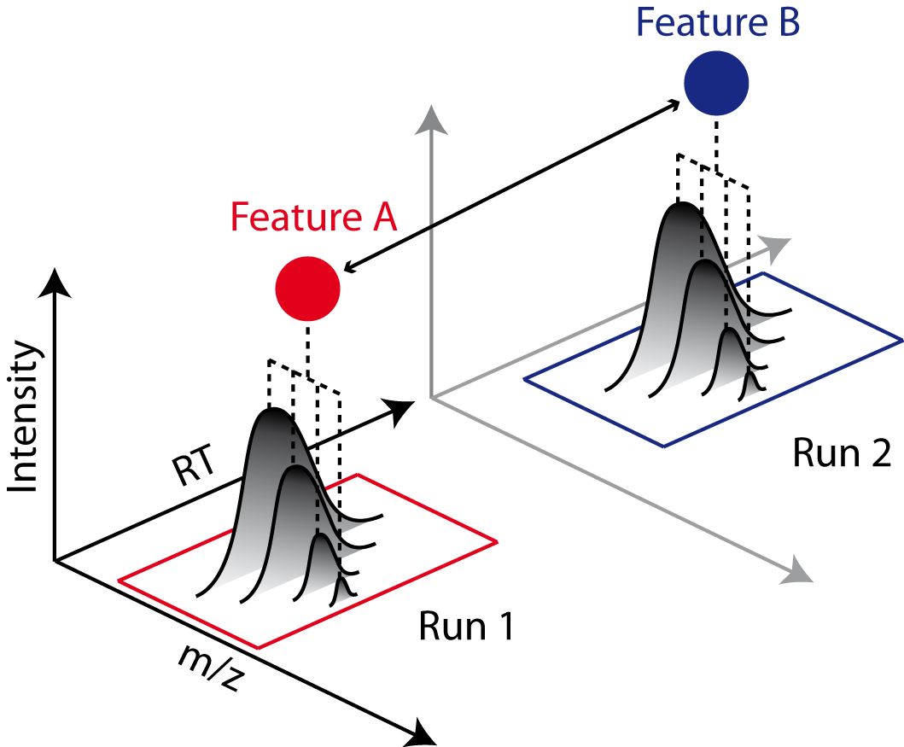

OpenMS User Tutorial
====================

## General Remarks

- This handout will guide you through an introductory tutorial for the OpenMS/TOPP software package[^1].

- OpenMS[^2]<sup>,</sup>[^3] is a versatile open-source library for mass spectrometry data analysis. Based on this library, we offer a collection of command-line tools ready to be used by end users. These so-called TOPP tools (short for ”The OpenMS Pipeline”)[^4] can be understood as small building blocks of arbitrarily complex data analysis workflows.

- In order to facilitate workflow construction, OpenMS was integrated into KNIME[^5], the Konstanz Information Miner, an open-source integration platform providing a powerful and flexible workflow system combined with advanced data analytics, visualization, and report capabilities. Raw MS data as well as the results of data processing using TOPP can be visualized using TOPPView[^6].

- This tutorial was designed for use in a hands-on tutorial session but can also be worked through at home using the online resources. You will become familiar with some of the basic functionalities of OpenMS/TOPP, TOPPView, as well as KNIME and learn how to use a selection of TOPP tools used in the tutorial workflows.

- If you are attending the tutorial and received a USB stick, all sample data referenced in this tutorial can be found in the {path}`C:,Example_Data` folder, on the USB stick, or released online on our GitHub repository [OpenMS/Tutorials](github.com/OpenMS/Tutorials).

## Getting Started

### Installation

Before we get started, we will install OpenMS and KNIME. If you take part in a training session you will have likely received an USB stick from us that contains the required data and software. If we provide laptops with the software you may of course skip the installation process and continue reading the next section.

#### Installation from the OpenMS USB stick

Please choose the directory that matches your operating system and execute the installer.

For Windows, you call:
- The OpenMS installer: `Windows` / {{ '`OpenMS-{0}-Win64.exe`'.format(version) }}
- The KNIME installer: `Windows` / `KNIME-4.4.1-Installer-64bit.exe`
- OpenMS prerequisites (Windows-only): After installation, before your first use of the OpenMS plugin in KNIME, you will be asked to download it automatically if certain requirements are not found in your Windows registry. Alternatively, you can get a bundled version here or on the OpenMS USB stick (`Windows` / `OpenMS-2.7-prerequisites-installer.exe`).

On macOS, you call:

- The OpenMS installer: `Mac` / {{ '`OpenMS-{0}-macOS.dmg`'.format(version) }}
- The KNIME installer: {path}`Mac, knime_4.4.1.app.macosx.cocoa.x86_64.dmg`

Afterwards, follow the instructions. For the OpenMS installation on macOS, accept the license and drag and drop  the OpenMS folder into your Applications folder.

```{note}
Due to increasing security measures for downloaded apps (e.g. path
randomization) on macOS you might need to open `TOPPView.app` and `TOPPAS.app` while holding <kbd>ctrl</kbd> and accept the warning. If the app still does not
open, you might need to move them from **Applications** > {{ '**OpenMS-{0}**'.format(version) }} to e.g. your Desktop and back.
```
On Linux, you can extract KNIME to a folder of your choice and for TOPPView you need to install OpenMS via your package manager or build it on your own with the instructions under the [API reference](www.openms.de/documentation) website.

```{note}
If you have installed OpenMS on Linux or macOS via your package
manager (for instance by installing the {{ '`OpenMS-{0}-Linux.deb`'.format(version) }} package),
then you need to set the `OPENMS_DATA_PATH` variable to the directory containing the shared data (normally `/usr/share/OpenMS`). This must be done prior to running any TOPP tool.
```
#### Installation from the internet

If you are working through this tutorial at home, you can get the installers under the following links:

- [OpenMS](https://www.openms.de/download/openms-binaries)
- [KNIME](https://www.knime.org/downloads/overview)
- OpenMS prerequisites (Windows-only): After installation, before your first use
of the OpenMS plugin in KNIME you will be asked to download it automatically
if certain requirements are not found in your Windows registry. Alternatively,
you can get a bundled version here.

Choose the installers for the platform you are working on.

### Data conversion

Each MS instrument vendor has one or more formats for storing the acquired data.
Converting these data into an open format (preferably mzML) is the very first step
when you want to work with open-source mass spectrometry software. A freely available conversion tool is MSConvert, which is part of a `ProteoWizard` installation. All files
used in this tutorial have already been converted to mzML by us, so you do not need
to perform the data conversion yourself. However, we provide a small raw file so you
can try the important step of raw data conversion for yourself.

```{note}
The OpenMS installation package for Windows automatically installs
ProteoWizard, so you do not need to download and install it separately. Due
to restrictions from the instrument vendors, file format conversion for most
formats is only possible on Windows systems. In practice, performing the
conversion to mzML on the acquisition PC connected to the instrument is
usually the most convenient option.
```
To convert raw data to mzML using `ProteoWizard` you can either use MSConvertGUI (a
graphical user interface) or `msconvert` (a simple command line tool).

(Figure_1)=
||
|:--:|
|Figure 1: `MSConvertGUI` (part of `ProteoWizard`), allows converting raw files to mzML. Select the raw files you want to convert by clicking on the browse button and then on Add. Default parameters can usually be kept as-is. To reduce the initial data size, make sure that the `peakPicking` filter (converts profile data to centroided data (see Fig. 2)) is listed, enabled (true) and applied to all MS levels (parameter ”1-”). Start the conversion process by clicking on the Start button.|

Both tools are
available in: {path}`C:,Program Files,OpenMS-2.7.0,share,OpenMS, THIRDPARTY,pwiz-bin`.

You can find a small RAW file on the USB stick {path}`C:,Example_Data,Introduction,datasets,raw`.

#### MSConvertGUI

`MSConvertGUI` (see <a href="#figure-1">Fig. 1</a>) exposes the main parameters for data conversion in a convenient graphical user interface.

#### msconvert

The `msconvert` command line tool has no graphical user interface but offers more options than the application `MSConvertGUI`. Additionally, since it can be used within a batch script, it allows converting large numbers of files and can be much more easily automatized.
To convert and pick the file `raw_data_file.RAW` you may write:

```bash
msconvert raw_data_file.RAW --filter ”peakPicking true 1-”
```

in your command line.

(Figure_2)=
||
|:--:|
|Figure 2: The amount of data in a spectra is reduced by peak picking. Here a profile spectrum (blue) is converted to centroided data (green). Most algorithms from this point on will work with centroided data.|

To convert all RAW files in a folder may write:

```bash
msconvert *.RAW -o my_output_dir
```

```{note}
To display all options you may type `msconvert --help` . Additional information is available on the `ProteoWizard` web page.
```

#### ThermoRawFileParser

Recently the open-source platform independent ThermoRawFileParser tool has been developed. While Proteowizard and MSConvert are only available for Windows systems this new tool allows to also convert raw data on Mac or Linux.

```{note}
To learn more about the `ThermoRawFileParser` and how to use it in
KNIME see <a href="#a-minimal-workflow">A minimal workflow</a>.
```
### Data visualization using TOPPView

Visualizing the data is the first step in quality control, an essential tool in understanding the data, and of course an essential step in pipeline development. OpenMS provides a convenient viewer for some of the data: TOPPView. We will guide you through some of the basic features of TOPPView. Please familiarize yourself with the key controls and visualization methods. We will make use of these later throughout the tutorial. Let’s start with a first look at one of the files of
our tutorial data set. Note that conceptually, there are no differences in visualizing metabolomic or proteomic data. Here, we inspect a simple proteomic measurement:

||
|:--:|
|Figure 3: TOPPView, the graphical application for viewing mass spectra and analysis results. Top window shows a small region of a peak map. In this 2D representation of the measured spectra, signals of eluting peptides are colored according to the raw peak intensities. The lower window displays an extracted spectrum (=scan) from the peak map. On the right side, the list of spectra can be browsed.|

||
|:--:|
|Figure 4: 3D representation of the measured spectra, signals of eluting peptides are colored according to the raw peak intensities.|

- Start TOPPView (see Windows' Start-Menu or {path}`Applications, OpenMS-2.7.0` on macOS)

- Go to **File** > **Open File**, navigate to the directory where you copied the contents
of the USB stick to, and select {path}`Example_Data,Introduction,datasets,small,velos005614.mzML`. This file contains only a reduced LC-MS map of a label-free proteomic platelet measurement recorded on an Orbitrap velos. The other two mzML files contain technical replicates of this experiment. First, we want to
obtain a global view on the whole LC-MS map - the default option Map view 2D
is the correct one and we can click the <kbd>Ok</kbd> button.

- Play around.

- Three basic modes allow you to interact with the displayed data: scrolling, zooming and measuring:
  - **Scroll mode**
    - Is activated by default (though each loaded spectra file is displayed
zoomed out first, so you do not need to scroll).
    - Allows you to browse your data by moving around in RT and m/z range.
    - When zoomed in, you can scroll through the spectra. Click-drag on the current view.
    - Arrow keys can be used to scroll the view as well.
  - **Zoom mode**
    - Zooming into the data; either mark an area in the current view with
your mouse while holding the left mouse button plus the <kbd>Ctrl</kbd> key to
zoom to this area or use your mouse wheel to zoom in and out.
    - All previous zoom levels are stored in a zoom history. The zoom history
can be traversed using <kbd>Ctrl</kbd> + <kbd>+</kbd> or <kbd>Ctrl</kbd> + <kbd>-</kbd> or the mouse wheel (scroll up and down).
    - Pressing backspace <kbd>←</kbd> zooms out to show the full LC-MS map (and
also resets the zoom history).
  - **Measure mode**
    - It is activated using the <kbd>⇧</kbd>(shift) key.
    - Press the left mouse button down while a peak is selected and drag
the mouse to another peak to measure the distance between peaks.
    - This mode is implemented in the 1D and 2D mode only.
- Right click on your 2D map and select **Switch to 3D mode** and examine your data in 3D mode (see <a href="#figure-4">Fig. 4</a>).
- Go back to the 2D view. In 2D mode, visualize your data in different intensity normalization modes, use linear , percentage, snap and log-view (icons on
the upper left tool bar). You can hover over the icons for additional information.

  ```{note}
  On macOS, due to a bug in one of the external libraries used by
  OpenMS, you will see a small window of the 3D mode when switching
  to 2D. Close the 3D tab in order to get rid of it.
  ```
- In TOPPView you can also execute TOPP tools. Go to **Tools** > **Apply tool (whole layer)**
and choose a TOPP tool (e.g., `FileInfo`) and inspect the results.

Dependent on your data MS/MS spectra can be visualized as well (see Fig.5) . You can
do so, by double-click on the MS/MS spectrum shown in scan view

||
|:--:|
|Figure 5: MS/MS spectrum|

### Introduction to KNIME/OpenMS

Using OpenMS in combination with KNIME, you can create, edit, open, save, and run workflows that combine TOPP tools with
the powerful data analysis capabilities of KNIME. Workflows can be created conveniently in a graphical user interface.
The parameters of all involved tools can be edited within the application and are also saved as part of the workflow.
Furthermore, KNIME interactively performs validity checks during the workflow editing process, to make it more
difficult to create an invalid workflow. Throughout most parts of this tutorial, you will use KNIME to create and execute
workflows. The first step is to become familiar with KNIME. Additional information on the basic usage of KNIME can be
found on the KNIME [Getting Started page](https://www.knime.com/getting-started-guide). However, the most important
concepts will also be reviewed in this tutorial.

#### Plugin and dependency installation

Before we can start with the tutorial, we need to install all the required extensions for KNIME. Since KNIME 3.2.1, the program automatically detects missing plugins when you open a workflow but to make sure that the right source for the
OpenMS plugin is chosen, please follow the instructions here. First, we install some additional extensions that are
required by our OpenMS nodes or used in the Tutorials e.g. for visualization and file handling.

1. Click on **Help** > **Install New Software**.
2. From the **Work with**: drop-down list select http://update.knime.com/analytics- platform/4.4.
3. Now select the following plugins from the KNIME & Extensions category
   - KNIME Base Chemistry Types & Nodes
   - KNIME Chemistry Add-Ons
   - KNIME File Handling Nodes (required for OpenMS nodes in general)
   - KNIME Interactive R Statistics Integration
   - KNIME Report Designer
   - KNIME SVG Support
4. Click on **Next** and follow the instructions (you may but don’t need to restart KNIME now).
5. Click again on **Help** > **Install New Software**
6. From the **Work with**: drop-down list select http://update.knime.com/community -contributions/trusted/4.4
7. Now select the following plugin from the ”KNIME Community Contributions - Cheminformatics” category
   - RDKit KNIME integration
8. Click on **Next**  and follow the instructions and after a restart of KNIME the dependencies will be installed.

In addition, we need to install `R` for the statistical downstream analysis. Choose the directory that matches your
operating system, double-click the `R` installer and follow the instructions. We recommend to use the default settings
whenever possible. On macOS you also need to install `XQuartz` from the same directory.

Afterwards open your `R` installation. If you use Windows, you will find an ”R x64 3.6.X” icon on your desktop. If you use
macOS, you will find R in your Applications folder. In `R`, type the following lines (you might also copy them from the file
`R` > `install_R_packages.R` folder on the USB stick):

```r
install.packages('Rserve',,"http://rforge.net/",type="source")
install.packages("Cairo")

install.packages("devtools")
install.packages("ggplot2")
install.packages("ggfortify")

if (!requireNamespace("BiocManager", quietly = TRUE))
  install.packages("BiocManager")

BiocManager::install()
BiocManager::install(c("MSstats"))
```
In KNIME, click on **KNIME** > **Preferences**, select the category **KNIME** > **R** and set the ”Path to R Home” to
your installation path. You can use the following settings, if you installed R as described above:

- Windows: `C: \Program Files \R \R-3.6.X (where X is the version you used to install the above libraries)`
- macOS: `/Library/Frameworks/R.framework/Versions/3.6/Resources`

You are now ready to install the OpenMS nodes.
- Open KNIME.
- Click on **Help** > **Install New Software**

We included a custom KNIME update site to install the OpenMS KNIME plugins from the USB stick. If you do not have a stick
available, please see below.

- In the now open dialog choose **Add** (in the upper right corner of the dialog) to define a new update site. In the
  opening dialog enter the following details.

  Name: OpenMS 2.7 UpdateSite
  Location: `file:/KNIMEUpdateSite/2.7.0/`
- After pressing **OK** KNIME will show you all the contents of the added Update Site.

```{note}
From now on, you can use this repository for plugins in the **Work with**: drop-down list.
```

- Select the OpenMS nodes in the ”Uncategorized” category and click **Next**.
- Follow the instructions and after a restart of KNIME the OpenMS nodes will be available in the Node repository under
  “Community Nodes”.

Alternatively, you can try these steps that will install the OpenMS KNIME plugins from the internet. Note that download
can be slow.

- In the now open dialog, choose **Add** (in the upper right corner of the dialog) to define a new update site. In the
  opening dialog enter the following details.

  Name: OpenMS 2.5 UpdateSite
  Location: https://abibuilder.informatik.uni-tuebingen.de/archive/openms/knime-plugin/updateSite/nightly/
- After pressing **OK** KNIME will show you all the contents of the added Update Site.

```{note}
From now on, you can use this repository for plugins in the **Work with:** drop-drown list.
```
- Select the OpenMS nodes in the ”Uncategorized” category and click **Next**.
- Follow the instructions and after a restart of KNIME the OpenMS nodes will be available in the Node repository under
  "Community Nodes".

#### KNIME concepts

A workflow is a sequence of computational steps applied to a single or multiple input data to process and analyze the
data. In KNIME such workflows are implemented graphically by connecting so-called nodes. A node represents a single
analysis step in a workflow. Nodes have input and output ports where the data enters the node or the results are provided
for other nodes after processing, respectively. KNIME distinguishes between different port types, representing different
types of data. The most common representation of data in KNIME are tables (similar to an excel sheet). Ports that accept
tables are marked with a small triangle. For OpenMS nodes, we use a different port type, so called file ports, representing
complete files. Those ports are marked by a small blue box. Filled blue boxes represent mandatory inputs and empty blue
boxes optional inputs. The same holds for output ports, despite you can deactivate them in the configuration dialog
(double-click on node) under the **OutputTypes** tab. After execution, deactivated ports will be marked with a red cross and
downstream nodes will be inactive (not configurable).

A typical OpenMS workflow in KNIME can be divided in two conceptually different parts:

- Nodes for signal and data processing, filtering and data reduction. Here, files are passed between nodes. Execution
  times of the individual steps are typically longer for these types of nodes as they perform the main computations.
- Downstream statistical analysis and visualization. Here, tables are passed between nodes and mostly internal KNIME
  nodes or nodes from third-party statistics plugins are used. The transfer from files (produced by OpenMS) and tables
  usually happens with our provided Exporter and Reader nodes (e.g. MzTabExporter followed by MzTabReader).

Nodes can have three different states, indicated by the small traffic light below the node.
- Inactive, failed, and not yet fully configured nodes are marked red.
- Configured but not yet executed nodes are marked yellow.
- Successfully executed nodes are marked green.

If the node execution fails, the node will switch to the red state. Other anomalies and warnings like missing information
or empty results will be presented with a yellow exclamation mark above the traffic light. Most nodes will be configured
as soon as all input ports are connected. Some nodes need to know about the output of the predecessor and may stay red
until the predecessor was executed. If nodes still remain in a red state, probably additional parameters have to be
provided in the configuration dialog that can neither be guessed from the data nor filled with sensible defaults. In
this case, or if you want to customize the default configuration in general, you can open the configuration dialog of a
node with a double-click on the node. For all OpenMS nodes you will see a configuration dialog like the one shown in
below figure.

||
|:--:|
|Figure 6: Node configuration dialog of an OpenMS node|

```{tip}
OpenMS distinguishes between normal parameters and advanced parameters. Advanced parameters are by default hidden from
the users since they should only rarely be customized. In case you want to have a look at the parameters or need to
customize them in one of the tutorials you can show them by clicking on the checkbox **Show advanced parameter**
in the lower part of the dialog. Afterwards the parameters are shown in a light gray color.
```

The dialog shows the individual parameters, their current value and type, and, in the lower part of the dialog, the
documentation for the currently selected parameter. Please also note the tabs on the top of the configuration dialog.
In the case of OpenMS nodes, there will be another tab called OutputTypes. It contains dropdown menus for every output
port that let you select the output filetype that you want the node to return (if the tool supports it). For optional
output ports you can select Inactive such that the port is crossed out after execution and the associated generation of
the file and possible additional computations are not performed. Note that this will deactivate potential downstream
nodes connected to this port.

#### Overview of the graphical user interface

||
|:--:|
|Figure 7: The KNIME workbench|

The graphical user interface (GUI) of KNIME consists of different components or so-called panels that are shown in
above image. We will briefly introduce the individual panels and their purposes below.

##### Workflow Editor

The workflow editor is the central part of the KNIME GUI. Here you assemble the workflow by adding nodes from the Node
Repository via ”drag & drop”. For quick creation of a workflow, note that double-clicking on a node in the repository
automatically connects it to the selected node in the workbench (connecting all the inputs with as many fitting outputs
of the last node). Manually, nodes can be connected by clicking on the output port of one node and dragging the edge
until releasing the mouse at the desired input port of the next node. Deletions are possible by selecting nodes and/or
edges and pressing <kbd>DEL</kbd> or <kbd>Fn</kbd> + <kbd>Backspace</kbd> depending on your OS and settings. Multiselection
happens via dragging rectangles with the mouse or adding elements to the selection by clicking them while holding down
<kbd>Ctrl</kbd>.

##### KNIME Explorer

Shows a list of available workflows (also called workflow projects). You can open a workflow by double-clicking it. A
new workflow can be created with a right-click in the Workflow Explorer followed by choosing **New KNIME Workflow**
from the appearing context menu. Remember to save your workflow often with the <kbd>Ctrl</kbd> + <kbd>S</kbd> shortcut.

##### Workflow Coach (since KNIME 3.2.1)

Shows a list of suggested following nodes, based on the last added/clicked nodes. When you are not sure which node to
choose next, you have a reasonable suggestion based on other users behavior there. Connect them to the last node with a
double-click.

##### Node Repository

Shows all nodes that are available in your KNIME installation. Every plugin you install will provide new nodes that can
be found here. The OpenMS nodes can be found in **Community Node** > **OpenMS** Nodes for managing files (e.g., Input
Files or Output Folders) can be found in **Community Nodes** > **GenericKnimeNode**. You can search the node repository
by typing the node name into the small text box in the upper part of the node repository.

##### Outline

The Outline panel contains a small overview of the complete workflow. While of limited use when working on a small
workflow, this feature is very helpful as soon as the workflows get bigger. You can adjust the zoom level of the explorer
by adjusting the percentage in the toolbar at the top of KNIME.

##### Console

In the console panel, warning and error messages are shown. This panel will provide helpful information if one of the
nodes failed or shows a warning sign.

##### Node Description

As soon as a node is selected, the Node Description window will show the documentation of the node including
documentation for all its parameters and especially their in- and outputs, such that you know what types of data nodes
may produce or expect. For OpenMS nodes you will also find a link to the tool page of the online documentation.

#### Creating workflows

Workflows can easily be created by a right click in the Workflow Explorer followed by clicking on **New KNIME workflow**.

#### Sharing workflows

To be able to share a workflow with others, KNIME supports the import and export of complete workflows. To export a
workflow, select it in the Workflow Explorer and select **File** > **Export KNIME Workflow**. KNIME will export
workflows as a _knwf_ file containing all the information on nodes, their connections, and their parameter configuration.

Those *knwf* files can again be imported by selecting:

**File** > **Import KNIME Workflow**

```{note}
For your convenience we added all workflows discussed in this tutorial to the **Workflows** folder on the USB Stick.
 Additionally, the workflow files can be found on [workflow downloads](../downloads.md#workflows). If you want to check
 your own workflow by comparing it to the solution or got stuck, simply import the full workflow from the corresponding
 *knwf* file and after that double-click it in your KNIME Workflow repository to open it.
```

#### Duplicating workflows

In this tutorial, a lot of the workflows will be created based on the workflow from a previous task. To keep the
intermediate workflows, we suggest you create copies of your workflows so you can see the progress. To create a copy of
your workflow, save it, close it and follow the next steps.

- Right click on the workflow you want to create a copy of in the Workflow Explorer and select **Copy**.
- Right click again somewhere on the workflow explorer and select **Paste**.
- This will create a workflow with same name as the one you copied with a (2) appended.
- To distinguish them later on you can easily rename the workflows in the Workflow Explorer by right clicking on the
  workflow and selecting **Rename**.

```{note}
To rename a workflow it has to be closed, too.
```

#### A minimal workflow

Let us now start with the creation of a simple workflow. As a first step, we will gather some basic
information about the data set before starting the actual development of a data analysis workflow. This minimal workflow
can also be used to check if all requirements are met and that your system is compatible.

- Create a new workflow.
- Add an Input File node and an Output Folder node (to be found in **Community Nodes** > **GenericKnimeNodes** > **IO**
  and a FileInfo node (to be found in the category **Community Node** > **OpenMS** > **File Handling**)  to the workflow.
- Connect the Input File node to the FileInfo node, and the first output port of the FileInfo node to the Output Folder
  node.

```{tip}
In case you are unsure about which node port to use, hovering the cursor over the port in question will display the port
name and what kind of input it expects.
```
The complete workflow is shown in below image. `FileInfo` can produce two different kinds of output files.

||
|:--:|
|Figure 8: A minimal workflow calling `FileInfo` on a single file.|

- All nodes are still marked red, since we are missing an actual input file. Double-click the Input File node and select
  **Browse**. In the file system browser select {path}`Example_Data,Introduction,datasets,tiny,velos005614.mzML`
  and click **Open**. Afterwards close the dialog by clicking **Ok**.

```{note}
Make sure to use the “tiny” version this time, not “small”, for the sake of faster workflow execution.
```
- The **Input File** node and the **FileInfo** node should now have switched to yellow, but the **Output Folder** node is still red.
  Double-click on the **Output Folder** node and click on **Browse** to select an output directory for the generated data.
- Great! Your first workflow is now ready to be run. Press <kbd>&uarr;</kbd> + <kbd>F7</kbd> (shift key + F7; or the
  button with multiple green triangles in the KNIME Toolbar) to execute the complete workflow. You can also right click
  on any node of your workflow and select <kbd>Execute</kbd> from the context menu.
- The traffic lights tell you about the current status of all nodes in your workflow. Currently running tools show either
  a progress in percent or a moving blue bar, nodes waiting for data show the small word “queued”, and successfully
  executed ones become green. If something goes wrong (e.g., a tool crashes), the light will become red.
- In order to inspect the results, you can just right-click the Output Folder node and select **View: Open the output folder**
  You can then open the text file and inspect its contents.  You will find some basic information of the data contained
  in the mzML file, e.g., the total number of spectra and peaks, the RT and m/z range, and how many MS1 and MS2 spectra
  the file contains.

Workflows are typically constructed to process a large number of files automatically. As a simple example, consider you
would like to convert multiple Thermo Raw files into the mzML format. We will now modify the workflow to compute the
same information on three different files and then write the output files to a folder.

- We start from the previous workflow.
- First we need to replace our single input file with multiple files. Therefore we add the Input Files node from the
  category **Community Nodes** > **GenericKnimeNodes** > **IO**.
- To select the files we double-click on the Input Files node and click on **Add**. In the filesystem browser we select
  all three files from the directory **Example_Data** > **Introduction** > **datasets** > **tiny**. And close the dialog
  with **Ok**.
- We now add two more nodes: the **ZipLoopStart** and the **ZipLoopEnd** node from the category
  **Community Nodes** > **GenericKnimeNodFlow** > **Flow**.
- Afterwards we connect the **Input Files** node to the first port of the **ZipLoopStart** node, the first port of the **ZipLoopStart**
  node to the **FileConverter** node, the first output port of the **FileConverter** node to the first input port of the
  **ZipLoopEnd** node, and the first output port of the **ZipLoopEnd** node to the **Output Folder** node (NOT to the Output File).

The complete workflow is shown in below figure.

||
|:--:|
|Figure 9: A minimal workflow calling the FileConverter on multiple Thermo Raw files in a loop|

Execute the workflow and inspect the output as before.

In case you had trouble to understand what **ZipLoopStart** and **ZipLoopEnd** do, here is a brief explanation:

- The **Input Files** node passes a list of files to the ZipLoopStart node.
- The ZipLoopStart node takes the files as input, but passes the single files sequentially (that is: one after the other)
  to the next node.
- The ZipLoopEnd collects the single files that arrive at its input port. After all files have been processed, the collected
  files are passed again as file list to the next node that follows.

#### Digression: Working with chemical structures

Metabolomics analyses often involve working with chemical structures. Popular cheminformatic toolkits such as RDKit[^7]
or CDK[^8] are available as KNIME plugins and allow us to work with chemical structures directly from within KNIME.
In particular, we will use KNIME and RDKit to visualize a list of compounds and filter them by predefined substructures.
Chemical structures are often represented as SMILES (**S**implified **m**olecular **i**nput **l**ine **e**ntry **s**pecification), a simple and compact way to describe complex chemical structures as text. For example, the chemical structure of L-alanine can be written as the SMILES string C[C@H](N)C(O)=O. As we will discuss later, all OpenMS tools that perform metabolite
identification will report SMILES as part of their result, which can then be further processed and visualized using RDKit
and KNIME.

||
|:--:|
|Figure 10: Workflow to visualize a list of SMILES strings and filter them by predefined substructures|

Perform the following steps to build the workflow shown in the above figure. You will use this workflow to visualize a
list of SMILES strings and filter them by predefined substructures:

- Add the node File Reader, open the node configuration dialog and select the file `smiles.csv`. This file has been
  exported from the Human Metabolome Database (HMDB) and contains the portion of the human metabolome that has been
  detected and quantified. The file preview on the bottom of the dialog shows that each compound is given by its HMDB
  accession, compound name, and SMILES string. Click on the column header **SMILES** to change its properties. Change the
  column type from **string** to **smiles** and close the dialog with **Ok**. Afterwards the **SMILES** column will be
  visualized as chemical structures instead of text directly within all **KNIME** tables.
- Add the node `RDKit From Molecule` and connect it to the `File Reader`. This node will use the provided `SMILES`
  strings to add an additional column that is required by RDKit.
- Add the node `RDKit Functional Group Filter` and open the node configuration dialog. You can use this dialog to filter
  the compounds by any combination of functional groups. In this case we want to find all compounds that contain at
  least one aromatic carboxylic acid group. To do this, set this group as active and choose ’¿=’ and ’1’.
- Connect the first output port (Molecules passing the filter) to a `CSV Writer` node to save the filtered metabolites
  to a file. Right click **RDKit Functional Group Filter** and select the view ’Molecules passing the filter’ to inspect
  the selected compounds in KNIME. How many compounds pass the chosen filter, see below figure.


The following figure shows resulting list of compounds that contains at least one aromatic carboxylic acid group.

||
|:--:|
|Figure 11:  Resulting list of compounds that contains at least one aromatic carboxylic acid group.|

#### Advanced topic: Metanodes

Workflows can get rather complex and may contain dozens or even hundreds of nodes. KNIME provides a simple way to
improve handling and clarity of large workflows:

**Metanodes** allow to bundle several nodes into a single **Metanode**.

<div class="admonition task" name="html-admonition">
<p class="admonition-title task title"><b>Task</b></p>
Select multiple nodes (e.g. all nodes of the ZipLoop including the start and end node). To select a set of nodes, draw a rectangle around them with the left mouse button or hold <kbd>Ctrl</kbd> to add/remove single nodes from the selection.
<div class="admonition tip" name="html-admonition">
<p class="admonition-title"><b>Tip</b></p>
There is a <b>Select Loop</b> option when you right-click a node in a loop, that does exactly that for you. Then, open the
context menu (right-click on a node in the selection) and select <b>Create Metanode</b>. Enter a caption for the <b>Metanode</b>.
The previously selected nodes are now contained in the <b>Metanode</b>. Double-clicking on the <b>Metanode</b> will display
the contained nodes in a new tab window.
</div>
</div>

<div class="admonition task" name="html-admonition">
<p class="admonition-title task-title"><b>Task</b></p>
Create the Metanode to let it behave like an encapsulated single node. First select the <b>Metanode</b>, open the context
menu (right-click) and select <b>Metanode</b> > <b>Wrap</b>. The differences between Metanodes and their wrapped counterparts
are marginal (and only apply when exposing user inputs and workflow variables). Therefore we suggest to use standard
Metanodes to clean up your workflow and cluster common subparts until you actually notice their limits.
</div>

<div class="admonition task" name="html-admonition">
<p class="admonition-title task-title"><b>Task</b></p>
Undo the packaging. First select the (<b>Wrapped</b>) <b>Metanode</b>, open the context menu (right-click) and select <b>(Wrapped) Metanode</b> > <b>Expand</b>.
</div>

#### Advanced topic: R integration

KNIME provides a large number of nodes for a wide range of statistical analysis, machine learning, data processing, and
visualization. Still, more recent statistical analysis methods, specialized visualizations or cutting edge algorithms
may not be covered in KNIME. In order to expand its capabilities beyond the readily available nodes, external scripting
languages can be integrated. In this tutorial, we primarily use scripts of the powerful statistical computing language R.
Note that this part is considered advanced and might be difficult to follow if you are not familiar with R. In this case
you might skip this part.

**R View (Table)** allows to seamlessly include R scripts into KNIME. We will demonstrate on a minimal. We will
demonstrate on a minimal example how such a script is integrated.

<div class="admonition task" name="html-admonition">
<p class="admonition-title task-title"><b>Task</b></p>
First we need some example data in KNIME, which we will generate using the <b>Data Generator</b> node. You can keep the
default settings and execute the node. The table contains four columns, each containing random coordinates and one column
containing a cluster number (Cluster_0 to Cluster_3). Now place a <b>R View (Table)</b> node into the workflow and connect
the upper output port of the <b>Data Generator</b> node to the input of the <b>R View (Table)</b> node. Right-click and
configure the node. If you get an error message like ”Execute failed: R_HOME does not contain a folder with name ’bin’.”
or ”Execution failed: R Home is invalid.”: please change the R settings in the preferences. To do so open <b>File</b> >
<b>Preferences</b> > <b>KNIME</b> > <b>R</b> and enter the path to your R installation (the folder that contains the bin
directory. (e.g., <b>C:</b> > <b>Program Files</b> > <b>R</b> > <b>R-3.4.3</b>).

If you get an error message like: ”Execute failed: Could not find Rserve package. Please install it in your R
installation by running ”install.packages(’Rserve’)”.” You may need to run your R binary as administrator (In windows
explorer: right-click ”Run as administrator”) and enter install.packages(’Rserve’) to install the package.

If R is correctly recognized we can start writing an R script. Consider that we are interested in plotting the first and
second coordinates and color them according to their cluster number. In R this can be done in a single line. In the
<b>R view (Table)</b> text editor, enter the following code:

<code>plot(x=knime.in$Universe_0_0, y=knime.in$Universe_0_1, main="Plotting column Universe_0_0 vs. Universe_0_1", col=knime.in$"Cluster Membership")</code>

**Explanation:** The table provided as input to the **R View (Table)** node is available as R **data.frame** with name
<code>knime.in</code>. Columns (also listed on the left side of the R View window) can be accessed in the usual R way by first
specifying the <code>data.frame</code> name and then the column name (e.g <code>knime.in$Universe_0_0</code>). <code>plot</code> is the plotting function
we use to generate the image. We tell it to use the data in column <b>Universe_0_0</b> of the dataframe object <b>knime.in</b>
(denoted as <code>knime.in$Universe_0_0</code>) as x-coordinate and the other column <code>knime.in$Universe_0_1</code> as y-coordinate in the
plot. <code>main</code> is simply the main title of the plot and <code>col</code> the column that is used to determine the color (in this case
it is the <code>Cluster Membership</code> column).

Now press the <b>Eval script</b> and <b>Show plot</b> buttons.
</div>

```{note}
Note that we needed to put some extra quotes around `Cluster Membership`. If we omit those, R would interpret the column
name only up to the first space `(knime.in$Cluster)` which is not present in the table and leads to an error. Quotes are
regularly needed if column names contain spaces, tabs or other special characters like $ itself.
```

## Label-free quantification of peptides

### Introduction

In the following chapter, we will build a workflow with OpenMS / KNIME to quantify a label-free experiment. Label-free
quantification is a method aiming to compare the relative amounts of proteins or peptides in two or more samples. We will
start from the minimal workflow of the last chapter and, step-by-step, build a label-free quantification workflow.

### Peptide identification

As a start, we will extend the minimal workflow so that it performs a peptide identification using the OMSSA[^9] search
engine. Since OpenMS version 1.10, OMSSA is included in the OpenMS installation, so you do not need to  download and
install it yourself.

Let’s start by replacing the input files in our **Input Files** node by the three mzML files in
**Example Data** > **Labelfree** > **datasets** > **lfqxspikeinxdilutionx1-3.mzML**. This is a reduced toy dataset where
each of the three runs contains a constant background of S. `pyogenes` peptides as well as human spike-in peptides in
different concentrations. [^10]

- Instead of FileInfo, we want to perform OMSSA identification, so we simply replace the `FileInfo` node with the
  `OMSSAAdapter` node **Community Nodes** > **OpenMS** > **Identification**, and we are almost done. Just make sure you
  have connected the `ZipLoopStart` node with the `in` port of the `OMSSAAdapter` node.
- OMSSA, like most mass spectrometry identification engines, relies on searching the input spectra against sequence
  databases. Thus, we need to introduce a search database input. As we want to use the same search database for all of
  our input files, we can just add a single `Input File` node to the workflow and connect it directly with the
  `OMSSAAdapter database` port. KNIME will automatically reuse this Input node each time a new ZipLoop iteration is
  started. In order to specify the database,
  **Example_Data** > **Labelfree** > **databases** > select **s_pyo_sf370_potato_human_target_decoy_with_contaminants.fasta**,
  and we have a very basic peptide identification workflow.

  ```{note}
  You might also want to save your new identification workflow under a different name. Have a look at [duplicating workflows](#duplicating-workflows)
  for information on how to create copies of workflows.
  ```
- The result of a single OMSSA run is basically a number of peptide-spectrum-matches (PSM) with a score each, and these
  will be stored in an idXML file. Now we can run the pipeline and after execution is finished, we can have a first look
  at the the results: just open the input files folder with a file browser and from there open an mzML file in **TOPPView**.
- Here, annotate this spectrum data file with the peptide identification results. Choose **Tools** > **Annonate with identification**
  from the menu and select the idXML file that **OMSSAAdapter** generated (it is located within the output directory that
  you specified when starting the pipeline).
- On the right, select the tab **Identification view**. All identified peptides can be seen using this view. User can also
  browse the corresponding MS2 spectra.

  ```{note}
  Opening the output file of `OMSSAAdapter` (the idXML file) directly is also possible, but the direct visusalisation of
  an idXML files is less useful.
  ```
- The search results stored in the idXML file can also be read back into a KNIME table for inspection and subsequent
  analyses: Add a `TextExporter` node from **Community Nodes** > **OpenMS** > **File Handling** to your workflow and
  connect the output port of your `OMSSAAdapter` (the same port `ZipLoopEnd` is connected to) to its input port. This
  tool will convert the idXML file to a more human-readable text file which can also be read into a KNIME table using
  the `IDTextReader` node. Add an `IDTextReader` node(**Community Nodes** > **OpenMS** > **Conversion**) after
  **TextExporter** and execute it. Now you can right click `IDTextReader` and select **ID Table** to browse your peptide
  identifications.
- From here, you can use all the tools KNIME offers for analyzing the data in this table. As a simple example, add a
  `Histogram (local)` node (from category **Views - Local (Swing)**) node after `IDTextReader`, double-click it, select
  `peptide_charge` as Histogram column, hit **OK**, and execute it. Right-clicking and selecting
  **Interactive View: Histogram view** will open a plot showing the charge state distribution of your identifications.

In the next step, we will tweak the parameters of OMSSA to better reflect the instrument’s accuracy. Also, we will
extend our pipeline with a false discovery rate (FDR) filter to retain only those identifications that will yeild an
FDR of < 1 %.

- Open the configuration dialog of `OMSSAAdapter`. The dataset was recorded using an LTQ Orbitrap XL mass spectrometer,
  set the precursor mass tolerance to a smaller value, say 5 ppm. Set `precursor_mass_tolerance` to 5 and
  `precursor_error_units` to `ppm`.

  ```{note}
  Whenever you change the configuration of a node, the node as well as all its successors will be reset to the Configured
  state (all node results are discarded and need to be recalculated by executing the nodes again).
  ```

- Set `max_precursor_charge` to 5, in order to also search for peptides with charges up to 5.
- Add `Carbamidomethyl (C)` as fixed modification and `Oxidation(M)` as variable modification.

  ```{note}
  To add a modification click on the empty value field in the configuration dialog to open the list editor dialog. In the
  new dialog click **Add**. Then select the newly added modification to open the drop down list where you can select the
  the correct modification.
  ```
- A common step in analysis is to search not only against a regular protein database, but to also search against a decoy
  database for FDR estimation. The fasta file we used before already contains such a decoy database. For OpenMS to know
  which OMSSA PSM came from which part of the file (i.e. target versus decoy), we have tso index the results. To this end,
  extend the workflow with a `PeptideIndexer` node **Community Nodes** > **OpenMS** > **ID Processing**. This node needs
  the idXML as input as well as the database file (see below figure).

  ```{tip}
  You can direct the files of an `Input File` node to more than just one destination port.
  ```
- The decoys in the database are prefixed with “DECOY_”, so we have to set `decoy_string` to `DECOY_` and `decoy_string_position`
  to `prefix` in the configuration dialog of `PeptideIndexer`.
- Now we can go for the FDR estimation, which the `FalseDiscoveryRate` node will calculate for us (you will find it in
  **Community Nodes** > **OpenMS** > **ID Processing**).
- In order to set the FDR level to 1%, we need an `IDFilter` node from **Community Nodes** > **OpenMS** > **ID Processing**.
  Configuring its parameter score `→pep` to 0.01 will do the trick. The FDR calculations (embedded in the idXML) from
  the `FalseDiscoveryRate` node will go into the *in* port of the `IDFilter` node.
- Execute your workflow and inspect the results using `IDTextReader` like you did before. How many peptides did you
  identify at this FDR threshold?

  ```{note}
  The finished identification workflow is now sufficiently complex that we might want to encapsulate it in a Metanode.
  For this, select all nodes inside the ZipLoop (including the **Input File** node) and right-click to select
  **Collapse into Metanode** and name it ID. Metanodes are useful when you construct even larger workflows and want to
  keep an overview.

  ```

  The below images shows OMSSA ID pipeline including FDR filtering.

  ||
  |:--:|
  |Figure 12: OMSSA ID pipeline including FDR filtering|


#### Bonus task: Identification using several search engines

```{note}
If you are ahead of the tutorial or later on, you can further improve your FDR identification workflow by a so-called
consensus identification using several search engines. Otherwise, just continue with [quantification](#quantification).
```

It has become widely accepted that the parallel usage of different search engines can increase peptide identification
rates in shotgun proteomics experiments. The ConsensusID algorithm is based on the calculation of posterior error
probabilities (PEP) and a combination of the normalized scores by considering missing peptide sequences.

- Next to the `OMSSAAdapter` and a `XTandemAdapter` **Community Nodes** > **OpenMS** > **Identification** node and set
  its parameters and ports analogously to the `OMSSAAdapter`. In XTandem, to get more evenly distributed scores, we
  decrease the number of candidates a bit by setting the precursor mass tolerance to 5 ppm and the fragment mass
  tolerance to 0.1 Da.
- To calculate the PEP, introduce each a `IDPosteriorErrorProbability` **Community Nodes** > **OpenMS** > **ID Processing**
  node to the output of each ID engine adapter node. This will calculate the PEP to each hit and output an updated idXML.
- To create a consensus, we must first merge these two files with a `FileMerger` node **Community Nodes** >
  **GenericKnimeNode** > **Flow** so we can then merge the corresponding IDs with a `IDMerger` **Community Nodes** >
  **OpenMS** > **File Handling**.
- Now we can create a consensus identification with the `ConsensusID` **Community Nodes** > **OpenMS** > **ID Processing**
  node. We can connect this to the `PeptideIndexer` and go along with our existing FDR filtering.

  ```{note}
  By default, X!Tandem takes additional enzyme cutting rules into consideration (besides the specified tryptic digest).
  Thus for the tutorial files, you have to set PeptideIndexer’s `enzyme` →specificity parameter to `none` to accept
  X!Tandems non-tryptic identifications as well.
  ```

In the end, the ID processing part of the workflow can be collapsed into a Metanode to keep the structure clean (see below figure which shows complete consensus identification workflow).

||
|:--:|
|Figure 13: Complete consensus identification workflow|

### Quantification

Now that we have successfully constructed a peptide identification pipeline, we can
add quantification capabilities to our workflow.

- Add a **FeatureFinderCentroided** node from **Community Nodes** > **OpenMS** > **Quantitation**
which gets input from the first output port of the **ZipLoopStart** node. Also, add
an **IDMapper** node (from **Community Nodes** > **OpenMS** > **ID Processing** ) which receives
input from the **FeatureFinderCentroided** node (Port 1) and the ID Metanode (or **IDFilter** node (Port 0) if you haven’t used the Metanode). The output of the **IDMapper** node is then connected to an in port of the **ZipLoopEnd** node.
- `FeatureFinderCentroided` finds and quantifies peptide ion signals contained in
the MS1 data. It reduces the entire signal, i.e., all peaks explained by one and
the same peptide ion signal, to a single peak at the maximum of the chromatographic elution profile of the monoisotopic mass trace of this peptide ion and
assigns an overall intensity.
- `FeatureFinderCentroided` produces a featureXML file as output, containing only quantitative information of so-far unidentified peptide signals. In order to annotate these with the corresponding ID information, we need the **IDMapper** node.
-  Run your pipeline and inspect the results of the **IDMapper** node in TOPPView. Open the mzML file of your data to display the raw peak intensities.
- To assess how well the feature finding worked, you can project the features contained in the featureXML file on the raw data contained in the mzML file. To
this end, open the featureXML file in TOPPView by clicking on File Open file and add it to a new layer ( Open in New layer ). The features are now visualized on top of your raw data. If you zoom in on a small region, you should be able to see the individual boxes around features that have been detected (see Fig. 14). If you
hover over the the feature centroid (small circle indicating the chromatographic apex of monoisotopic trace) additional information of the feature is displayed.

  ||
  |:--:|
  |Figure 14: Visualization of detected features (boxes) in TOPPView|

  ```{note}
  The chromatographic RT range of a feature is about 30-60 s and
  its m/z range around 2.5 m/z in this dataset. If you have trouble zooming in on a feature, select the full RT range and zoom only into the
  m/z dimension by holding down <kb>Ctrl</kb> ( <kbd>cmd ⌘</kbd> on macOS) and repeatedly
  dragging a narrow box from the very left to the very right
  ```
- You can see which features were annotated with a peptide identification by first
selecting the featureXML file in the **Layers** window on the upper right side and then clicking on the icon with the letters A, B and C on the upper icon bar. Now,
click on the small triangle next to that icon and select **Peptide identification**.

The following image shows the final constructed workflow:

||
|:--:|
|Figure 15: Extended workflow featuring peptide identification and quantification|

### Combining quantitative information across several label-free experiments

So far, we successfully performed peptide identification as well as quantification on
individual LC-MS runs. For differential label-free analyses, however, we need to identify and quantify corresponding signals in different experiments and link them together to compare their intensities. Thus, we will now run our pipeline on all three
available input files and extend it a bit further, so that it is able to find and link features across several runs.

||
|:--:|
|Figure 16: Complete identification and label-free quantification workflow|

- To find features across several maps, we first have to align them to correct for retention time shifts between the different label-free measurements. With the **MapAlignerPoseClustering** node in **Community Nodes** > **OpenMS** > **Map Alignment**, we can align corresponding peptide signals to each other as closely as possible by applying a transformation in the RT dimension.

  ```{note}
  `MapAlignerPoseClustering` consumes several featureXML files and its output should still be several featureXML files containing the same features, but with the transformed RT values. In its configuration dialog, make sure that **OutputTypes** is set to **featureXML**.
  ```
- With the **FeatureLinkerUnlabeledQT** node in **Community Nodes** > **OpenMS** > **Map Alignment**, we can then perform the actual linking of corresponding features. Its output is a consensusXML file containing linked groups of corresponding features across the different experiments.
- Since the overall intensities can vary a lot between different measurements (for example, because the amount of injected analytes was different), we apply the **ConsensusMapNormalizer** node in **Community Node** > **OpenMS** > **Map Alignment** as a last processing step. Configure its parameters with setting `algorithm_type` to `median`. It will then normalize the maps in such a way that the median intensity of all input maps is equal.
- Finally, export the resulting normalized consensusXML file to a csv format using the **TextExporter** node. Connect its out port to a new **Output Folder** node.

  ```{note}
  You can specify the desired column separation character in the parameter settings (by default, it is set to “ ” (a space)). The output file of `TextExporter` can also be opened with external tools, e.g., Microsoft Excel, for downstream statistical analyses.
  ```

#### Basic data analysis in KNIME

For downstream analysis of the quantification results within the KNIME environment, you can use the **ConsensusTextReader** node in **Community Nodes** > **OpenMS** > **Conversion** instead of the **Output Folder** node to convert the output into a KNIME table (indicated by a triangle as output port). After running the node you can view the KNIME table by right-clicking on the **ConsensusTextReader** node and selecting `Consensus Table`. Every row in this table corresponds to a so-called consensus feature, i.e., a peptide signal quantified across several runs. The first couple of columns describe the consensus feature as a whole (average RT and m/z across the maps, charge, etc.). The remaining columns describe the exact positions and intensities of the quantified features separately for all input samples (e.g., intensity_0 is the intensity of the feature in the first input file). The last 11 columns contain information on peptide identification.

- Now, let’s say we want to plot the log intensity distributions of the human spike-in peptides for all input files. In addition, we will plot the intensity distributions of the background peptides.
- As shown in Fig. 17, add a **Row Splitter** node (**Data Manipulation** > **Row** > **Filter**) after the **ConsensusTextReader** node. Double-click it to configure. The human spike-in peptides have accessions starting with “hum”. Thus, set the column to apply the test to: accessions, select pattern matching as matching criterion, enter `hum` into the corresponding text field, and check the contains wild cards box. Press **OK** and execute the node.
- **Row Splitter** produces two output tables: the first one contains all rows from the input table matching the filter criterion, and the second table contains all other rows. You can inspect the tables by right-clicking and selecting **Filtered** and **Filtered Out**. The former table should now only contain peptides with a human accession, whereas the latter should contain all remaining peptides (including unidentified ones).
- Now, since we only want to plot intensities, we can add a **Column Filter** node by going to **Data Manipulation** > **Column Filter**. Connect its input port to the **Filtered output** port of the **Row Filter** node, and open its configuration dialog. We could either manually select the columns we want to keep, or, more elegantly, select **Wildcard/Regex Selection** and enter `intensity_?` as the pattern. KNIME will interactively show you which columns your pattern applies to while you’re typing.
- Since we want to plot log intensities, we will now compute the log of all intensity values in our table. The easiest way to do this in KNIME is a small piece of R code. Add an **R Snippet** node `R` after **Column Filter** and double-click to configure. In the R Script text editor, enter the following code:

  ```r
  x <- knime.in       # store copy of input table in x

  x[x == 0] <- NA     # replace all zeros by NA (= missing value)

  x <- log10(x)       # compute log of all values
  knime.out <- x      # write result to output table
  ```
- Now we are ready to plot! Add a **Box Plot (local)** node `Views -Swing (local)` after the **R Snippet** node, execute it, and open its view. If everything went well, you should see a significant fold change of your human peptide intensities across the three runs.
- To verify that the concentration of background peptides is constant in all three runs, copy and paste the three nodes after **Row Splitter** and connect the duplicated **Column Filter** to the second output port (Filtered Out) of **Row Splitter**, as shown in Fig. 17. Execute and open the view of your second **Box Plot**.

You have now constructed an entire identification and label-free quantification workflow including a simple data analysis using KNIME. The final workflow should like the workflow shown in the following image:

||
|:--:|
|Figure 17: Simple KNIME data analysis example for LFQ|

### Identification and quantification of the iPRG2015 data with subsequent MSstats analysis

Advanced downstream data analysis of quantitative mass spectrometry-based proteomics data can be performed using MSstats[^11]. This tool can be combined with
an OpenMS preprocessing pipeline (e.g. in KNIME). The OpenMS experimental design is used to present the data in an MSstats-conformant way for the analysis. Here,
we give an example how to utilize these resources when working with quantitative label-free data. We describe how to use OpenMS and MSstats for the analysis of the
ABRF iPRG2015 dataset[^12].

```{note}
Reanalysing the full dataset from scratch would take too long. In the following tutorial, we will focus on just the conversion process and the downstream analysis.
```

#### Excursion MSstats

The R package `MSstats` can be used for statistical relative quantification of proteins and peptides in mass spectrometry-based proteomics. Supported are label-free as well as labeled experiments in combination with data-dependent, targeted and data independent acquisition. Inputs can be identified and quantified entities (peptides or proteins) and the output is a list of differentially abundant entities, or summaries of their relative abundance. It depends on accurate feature detection, identification
and quantification which can be performed e.g. by an OpenMS workflow. MSstats can be used for data processing & visualization, as well as statistical modeling & inference. Please see [^11] and the [MSstats](http://msstats.org) website for further
information.

#### Dataset

The iPRG (Proteome Informatics Research Group) dataset from the study in 2015, as
described in [^12], aims at evaluating the effect of statistical analysis software on the
accuracy of results on a proteomics label-free quantification experiment. The data is
based on four artificial samples with known composition (background: 200 ng *S. cerevisiae*). These were spiked with different quantities of individual digested proteins,
whose identifiers were masked for the competition as yeast proteins in the provided
database (see <a href="#table-1">Table 1</a>).

<div class="table" id="table-1">

<!-- l. 1198 --><p class="indent">   </p><figure class="float">

<a id="x1-32001r1"></a>
<a id="x1-32002"></a>
<figcaption class="caption"><span class="id">Table&nbsp;1: Samples (background: 200 ng <i>S.&nbsp;cerevisiae</i>) with spiked-in proteins in different
quantities [fmols]</span></figcaption><!-- tex4ht:label?: x1-32001r3  -->
<div class="tabular">
 <table class="tabular" id="TBL-1"><colgroup id="TBL-1-1g"><col id="TBL-1-1"><col id="TBL-1-2"><col id="TBL-1-3"><col id="TBL-1-4"><col id="TBL-1-5"><col id="TBL-1-6"><col id="TBL-1-7"><col id="TBL-1-8"></colgroup><tbody><tr id="TBL-1-1-"><td class="td11" style="white-space:nowrap; text-align:left;" id="TBL-1-1-1">   </td><td class="td11" style="white-space:nowrap; text-align:left;" id="TBL-1-1-2">                      </td><td class="td11" style="white-space:nowrap; text-align:left;" id="TBL-1-1-3">                   </td><td class="td11" style="white-space:nowrap; text-align:left;" id="TBL-1-1-4">                 </td><td class="td11" style="white-space:nowrap; text-align:right;" colspan="4" id="TBL-1-1-5">         <div class="multicolumn" style="white-space:nowrap; text-align:center;"><span class="rm-lmr-10x-x-109">Samples</span></div>
</td></tr><tr id="TBL-1-2-"><td class="td11" style="white-space:nowrap; text-align:left;" id="TBL-1-2-1">    </td><td class="td11" style="white-space:nowrap; text-align:center;" id="TBL-1-2-2">        <div class="multicolumn" style="white-space:nowrap; text-align:center;"><span class="rm-lmr-10x-x-109">Name</span></div>         </td><td class="td11" style="white-space:nowrap; text-align:center;" id="TBL-1-2-3">       <div class="multicolumn" style="white-space:nowrap; text-align:center;"><span class="rm-lmr-10x-x-109">Origin</span></div>       </td><td class="td11" style="white-space:nowrap; text-align:center;" id="TBL-1-2-4"> <div class="multicolumn" style="white-space:nowrap; text-align:center;"><span class="rm-lmr-10x-x-109">Molecular Weight</span></div> </td><td class="td11" style="white-space:nowrap; text-align:center;" id="TBL-1-2-5">  <div class="multicolumn" style="white-space:nowrap; text-align:center;"><span class="rm-lmr-10x-x-109">1</span></div>  </td><td class="td11" style="white-space:nowrap; text-align:right;" id="TBL-1-2-6">   <span class="rm-lmr-10x-x-109">2  </span></td><td class="td11" style="white-space:nowrap; text-align:right;" id="TBL-1-2-7">  <span class="rm-lmr-10x-x-109">3  </span></td><td class="td11" style="white-space:nowrap; text-align:right;" id="TBL-1-2-8">   <span class="rm-lmr-10x-x-109">4  </span></td>
</tr><tr id="TBL-1-3-"><td class="td11" style="white-space:nowrap; text-align:left;" id="TBL-1-3-1"> <span class="rm-lmr-10x-x-109">A  </span></td><td class="td11" style="white-space:nowrap; text-align:left;" id="TBL-1-3-2"> <span class="rm-lmr-10x-x-109">Ovalbumin                  </span></td><td class="td11" style="white-space:nowrap; text-align:left;" id="TBL-1-3-3"> <i>Egg White</i>             </td><td class="td11" style="white-space:nowrap; text-align:left;" id="TBL-1-3-4"> <span class="rm-lmr-10x-x-109">45 KD                </span></td><td class="td11" style="white-space:nowrap; text-align:right;" id="TBL-1-3-5"> <span class="rm-lmr-10x-x-109">65  </span></td><td class="td11" style="white-space:nowrap; text-align:right;" id="TBL-1-3-6">  <span class="rm-lmr-10x-x-109">55  </span></td><td class="td11" style="white-space:nowrap; text-align:right;" id="TBL-1-3-7"> <span class="rm-lmr-10x-x-109">15  </span></td><td class="td11" style="white-space:nowrap; text-align:right;" id="TBL-1-3-8">   <span class="rm-lmr-10x-x-109">2  </span></td>
</tr><tr id="TBL-1-4-"><td class="td11" style="white-space:nowrap; text-align:left;" id="TBL-1-4-1"> <span class="rm-lmr-10x-x-109">B  </span></td><td class="td11" style="white-space:nowrap; text-align:left;" id="TBL-1-4-2"> <span class="rm-lmr-10x-x-109">Myoglobin                   </span></td><td class="td11" style="white-space:nowrap; text-align:left;" id="TBL-1-4-3"> <i>Equine Heart</i>          </td><td class="td11" style="white-space:nowrap; text-align:left;" id="TBL-1-4-4"> <span class="rm-lmr-10x-x-109">17 KD                </span></td><td class="td11" style="white-space:nowrap; text-align:right;" id="TBL-1-4-5"> <span class="rm-lmr-10x-x-109">55  </span></td><td class="td11" style="white-space:nowrap; text-align:right;" id="TBL-1-4-6">  <span class="rm-lmr-10x-x-109">15  </span></td><td class="td11" style="white-space:nowrap; text-align:right;" id="TBL-1-4-7">  <span class="rm-lmr-10x-x-109">2  </span></td><td class="td11" style="white-space:nowrap; text-align:right;" id="TBL-1-4-8">  <span class="rm-lmr-10x-x-109">65  </span></td>
</tr><tr id="TBL-1-5-"><td class="td11" style="white-space:nowrap; text-align:left;" id="TBL-1-5-1"> <span class="rm-lmr-10x-x-109">C  </span></td><td class="td11" style="white-space:nowrap; text-align:left;" id="TBL-1-5-2"> <span class="rm-lmr-10x-x-109">Phosphorylase b           </span></td><td class="td11" style="white-space:nowrap; text-align:left;" id="TBL-1-5-3"> <i>Rabbit Muscle</i>         </td><td class="td11" style="white-space:nowrap; text-align:left;" id="TBL-1-5-4"> <span class="rm-lmr-10x-x-109">97 KD                </span></td><td class="td11" style="white-space:nowrap; text-align:right;" id="TBL-1-5-5"> <span class="rm-lmr-10x-x-109">15  </span></td><td class="td11" style="white-space:nowrap; text-align:right;" id="TBL-1-5-6">   <span class="rm-lmr-10x-x-109">2  </span></td><td class="td11" style="white-space:nowrap; text-align:right;" id="TBL-1-5-7"> <span class="rm-lmr-10x-x-109">65  </span></td><td class="td11" style="white-space:nowrap; text-align:right;" id="TBL-1-5-8">  <span class="rm-lmr-10x-x-109">55  </span></td>
</tr><tr id="TBL-1-6-"><td class="td11" style="white-space:nowrap; text-align:left;" id="TBL-1-6-1"> <span class="rm-lmr-10x-x-109">D  </span></td><td class="td11" style="white-space:nowrap; text-align:left;" id="TBL-1-6-2"> <span class="rm-lmr-10x-x-109">Beta-Glactosidase         </span></td><td class="td11" style="white-space:nowrap; text-align:left;" id="TBL-1-6-3"> <i>Escherichia Coli</i>      </td><td class="td11" style="white-space:nowrap; text-align:left;" id="TBL-1-6-4"> <span class="rm-lmr-10x-x-109">116 KD               </span></td><td class="td11" style="white-space:nowrap; text-align:right;" id="TBL-1-6-5">  <span class="rm-lmr-10x-x-109">2  </span></td><td class="td11" style="white-space:nowrap; text-align:right;" id="TBL-1-6-6">  <span class="rm-lmr-10x-x-109">65  </span></td><td class="td11" style="white-space:nowrap; text-align:right;" id="TBL-1-6-7"> <span class="rm-lmr-10x-x-109">55  </span></td><td class="td11" style="white-space:nowrap; text-align:right;" id="TBL-1-6-8">  <span class="rm-lmr-10x-x-109">15  </span></td>
</tr><tr id="TBL-1-7-"><td class="td11" style="white-space:nowrap; text-align:left;" id="TBL-1-7-1"> <span class="rm-lmr-10x-x-109">E  </span></td><td class="td11" style="white-space:nowrap; text-align:left;" id="TBL-1-7-2"> <span class="rm-lmr-10x-x-109">Bovine Serum Albumin  </span></td><td class="td11" style="white-space:nowrap; text-align:left;" id="TBL-1-7-3"> <i>Bovine Serum</i>         </td><td class="td11" style="white-space:nowrap; text-align:left;" id="TBL-1-7-4"> <span class="rm-lmr-10x-x-109">66 KD                </span></td><td class="td11" style="white-space:nowrap; text-align:right;" id="TBL-1-7-5"> <span class="rm-lmr-10x-x-109">11  </span></td><td class="td11" style="white-space:nowrap; text-align:right;" id="TBL-1-7-6"> <span class="rm-lmr-10x-x-109">0.6  </span></td><td class="td11" style="white-space:nowrap; text-align:right;" id="TBL-1-7-7"> <span class="rm-lmr-10x-x-109">10  </span></td><td class="td11" style="white-space:nowrap; text-align:right;" id="TBL-1-7-8"> <span class="rm-lmr-10x-x-109">500  </span></td>
</tr><tr id="TBL-1-8-"><td class="td11" style="white-space:nowrap; text-align:left;" id="TBL-1-8-1"> <span class="rm-lmr-10x-x-109">F  </span></td><td class="td11" style="white-space:nowrap; text-align:left;" id="TBL-1-8-2"> <span class="rm-lmr-10x-x-109">Carbonic Anhydrase     </span></td><td class="td11" style="white-space:nowrap; text-align:left;" id="TBL-1-8-3"> <i>Bovine Erythrocytes</i>  </td><td class="td11" style="white-space:nowrap; text-align:left;" id="TBL-1-8-4"> <span class="rm-lmr-10x-x-109">29 KD                </span></td><td class="td11" style="white-space:nowrap; text-align:right;" id="TBL-1-8-5"> <span class="rm-lmr-10x-x-109">10  </span></td><td class="td11" style="white-space:nowrap; text-align:right;" id="TBL-1-8-6"> <span class="rm-lmr-10x-x-109">500  </span></td><td class="td11" style="white-space:nowrap; text-align:right;" id="TBL-1-8-7"> <span class="rm-lmr-10x-x-109">11  </span></td><td class="td11" style="white-space:nowrap; text-align:right;" id="TBL-1-8-8"> <span class="rm-lmr-10x-x-109">0.6  </span></td>

</tr></tbody></table></div>

</figure>
</div>

#### Identification and quantification

||
|:--:|
|Figure 18: KNIME data analysis of iPRG LFQ data.|

The iPRG LFQ workflow (Fig. 18) consists of an identification and a quantification part. The identification is achieved by searching the computationally calculated MS2 spectra from a sequence database (**Input File** node, here with the given database from iPRG:
{path}`ExampleData,iPRG2015,database,iPRG2015targetdecoynocontaminants.fasta`
against the MS2 from the original data (**Input Files** node with all mzMLs following {path}`ExampleData,iPRG2015,datasets,JD06232014sample*.mzML` using the `OMSSAAdapter`.

```{note}
If you want to reproduce the results at home, you have to download the iPRG data in mzML format and perform peak picking on it or convert and pick the raw data with `msconvert`.
```

Afterwards, the results are scored using the **FalseDiscoveryRate** node and filtered to obtain only unique peptides (**IDFilter**) since `MSstats` does not support shared peptides, yet. The quantification is achieved by using the **FeatureFinderCentroided** node, which performs the feature detection on the samples (maps). In the end the quantification results are combined with the filtered identification results (**IDMapper**). In addition, a linear retention time alignment is performed (**MapAlignerPoseClustering**), followed by the feature linking process (**FeatureLinkerUnlabledQT**). The **ConsensusMapNormalizer**s is used to normalize the intensities via robust regression over a set of maps and the **IDConflictResolver** assures that only one identification (best score) is associated with a feature. The output of this workflow is a consensusXML file, which can now be converted using the **MSstatsConverter** (see [Conversion and downstream analysis](openms-user-tutorial.md#conversion-and-downstream-analysis) section).

#### Experimental design

As mentioned before, the downstream analysis can be performed using `MSstats`. In this case, an experimental design has to be specified for the OpenMS workflow. The structure of the experimental design used in OpenMS in case of the iPRG dataset is specified in <a href="#table-2">Table 2</a>.

<div class="table" id="table-2">


<!-- l. 1238 --><p class="indent">   </p><figure class="float">


<a id="x1-34001r2"></a>
<a id="x1-34002"></a>
<figcaption class="caption"><span class="id">Table&nbsp;2: OpenMS Experimental design for the iPRG2015 dataset.</span></figcaption><!-- tex4ht:label?: x1-34001r3  -->
<div class="tabular"> <table class="tabular" id="TBL-2"><colgroup id="TBL-2-1g"><col id="TBL-2-1"><col id="TBL-2-2"><col id="TBL-2-3"><col id="TBL-2-4"><col id="TBL-2-5"></colgroup><tbody><tr id="TBL-2-1-"><td class="td11" style="white-space:nowrap; text-align:left;" id="TBL-2-1-1"> <span class="rm-lmr-10x-x-109">Fraction_Group  </span></td><td class="td11" style="white-space:nowrap; text-align:left;" id="TBL-2-1-2"> <span class="rm-lmr-10x-x-109">Fraction                </span></td><td class="td11" style="white-space:nowrap; text-align:left;" id="TBL-2-1-3"> <span class="rm-lmr-10x-x-109">Spectra_Filepath        </span></td><td class="td11" style="white-space:nowrap; text-align:left;" id="TBL-2-1-4"> <span class="rm-lmr-10x-x-109">Label  </span></td><td class="td11" style="white-space:nowrap; text-align:left;" id="TBL-2-1-5"> <span class="rm-lmr-10x-x-109">Sample  </span></td>
</tr><tr id="TBL-2-2-"><td class="td11" style="white-space:nowrap; text-align:left;" id="TBL-2-2-1"> <span class="rm-lmr-10x-x-109">1                      </span></td><td class="td11" style="white-space:nowrap; text-align:left;" id="TBL-2-2-2"> <span class="rm-lmr-10x-x-109">1                         </span></td><td class="td11" style="white-space:nowrap; text-align:left;" id="TBL-2-2-3"> <span class="rm-lmr-10x-x-109">Sample1-A                </span></td><td class="td11" style="white-space:nowrap; text-align:left;" id="TBL-2-2-4"> <span class="rm-lmr-10x-x-109">1       </span></td><td class="td11" style="white-space:nowrap; text-align:left;" id="TBL-2-2-5"> <span class="rm-lmr-10x-x-109">1          </span></td>
</tr><tr id="TBL-2-3-"><td class="td11" style="white-space:nowrap; text-align:left;" id="TBL-2-3-1"> <span class="rm-lmr-10x-x-109">2                      </span></td><td class="td11" style="white-space:nowrap; text-align:left;" id="TBL-2-3-2"> <span class="rm-lmr-10x-x-109">1                         </span></td><td class="td11" style="white-space:nowrap; text-align:left;" id="TBL-2-3-3"> <span class="rm-lmr-10x-x-109">Sample1-B                </span></td><td class="td11" style="white-space:nowrap; text-align:left;" id="TBL-2-3-4"> <span class="rm-lmr-10x-x-109">1       </span></td><td class="td11" style="white-space:nowrap; text-align:left;" id="TBL-2-3-5"> <span class="rm-lmr-10x-x-109">2          </span></td>
</tr><tr id="TBL-2-4-"><td class="td11" style="white-space:nowrap; text-align:left;" id="TBL-2-4-1"> <span class="rm-lmr-10x-x-109">3                      </span></td><td class="td11" style="white-space:nowrap; text-align:left;" id="TBL-2-4-2"> <span class="rm-lmr-10x-x-109">1                         </span></td><td class="td11" style="white-space:nowrap; text-align:left;" id="TBL-2-4-3"> <span class="rm-lmr-10x-x-109">Sample1-C                </span></td><td class="td11" style="white-space:nowrap; text-align:left;" id="TBL-2-4-4"> <span class="rm-lmr-10x-x-109">1       </span></td><td class="td11" style="white-space:nowrap; text-align:left;" id="TBL-2-4-5"> <span class="rm-lmr-10x-x-109">3          </span></td>
</tr><tr id="TBL-2-5-"><td class="td11" style="white-space:nowrap; text-align:left;" id="TBL-2-5-1"> <span class="rm-lmr-10x-x-109">4                      </span></td><td class="td11" style="white-space:nowrap; text-align:left;" id="TBL-2-5-2"> <span class="rm-lmr-10x-x-109">1                         </span></td><td class="td11" style="white-space:nowrap; text-align:left;" id="TBL-2-5-3"> <span class="rm-lmr-10x-x-109">Sample2-A                </span></td><td class="td11" style="white-space:nowrap; text-align:left;" id="TBL-2-5-4"> <span class="rm-lmr-10x-x-109">1       </span></td><td class="td11" style="white-space:nowrap; text-align:left;" id="TBL-2-5-5"> <span class="rm-lmr-10x-x-109">4          </span></td>
</tr><tr id="TBL-2-6-"><td class="td11" style="white-space:nowrap; text-align:left;" id="TBL-2-6-1"> <span class="rm-lmr-10x-x-109">5                      </span></td><td class="td11" style="white-space:nowrap; text-align:left;" id="TBL-2-6-2"> <span class="rm-lmr-10x-x-109">1                         </span></td><td class="td11" style="white-space:nowrap; text-align:left;" id="TBL-2-6-3"> <span class="rm-lmr-10x-x-109">Sample2-B                </span></td><td class="td11" style="white-space:nowrap; text-align:left;" id="TBL-2-6-4"> <span class="rm-lmr-10x-x-109">1       </span></td><td class="td11" style="white-space:nowrap; text-align:left;" id="TBL-2-6-5"> <span class="rm-lmr-10x-x-109">5          </span></td>
</tr><tr id="TBL-2-7-"><td class="td11" style="white-space:nowrap; text-align:left;" id="TBL-2-7-1"> <span class="rm-lmr-10x-x-109">6                      </span></td><td class="td11" style="white-space:nowrap; text-align:left;" id="TBL-2-7-2"> <span class="rm-lmr-10x-x-109">1                         </span></td><td class="td11" style="white-space:nowrap; text-align:left;" id="TBL-2-7-3"> <span class="rm-lmr-10x-x-109">Sample2-C                </span></td><td class="td11" style="white-space:nowrap; text-align:left;" id="TBL-2-7-4"> <span class="rm-lmr-10x-x-109">1       </span></td><td class="td11" style="white-space:nowrap; text-align:left;" id="TBL-2-7-5"> <span class="rm-lmr-10x-x-109">6          </span></td>
</tr><tr id="TBL-2-8-"><td class="td11" style="white-space:nowrap; text-align:left;" id="TBL-2-8-1"> <span class="rm-lmr-10x-x-109">7                      </span></td><td class="td11" style="white-space:nowrap; text-align:left;" id="TBL-2-8-2"> <span class="rm-lmr-10x-x-109">1                         </span></td><td class="td11" style="white-space:nowrap; text-align:left;" id="TBL-2-8-3"> <span class="rm-lmr-10x-x-109">Sample3-A                </span></td><td class="td11" style="white-space:nowrap; text-align:left;" id="TBL-2-8-4"> <span class="rm-lmr-10x-x-109">1       </span></td><td class="td11" style="white-space:nowrap; text-align:left;" id="TBL-2-8-5"> <span class="rm-lmr-10x-x-109">7          </span></td>
</tr><tr id="TBL-2-9-"><td class="td11" style="white-space:nowrap; text-align:left;" id="TBL-2-9-1"> <span class="rm-lmr-10x-x-109">8                      </span></td><td class="td11" style="white-space:nowrap; text-align:left;" id="TBL-2-9-2"> <span class="rm-lmr-10x-x-109">1                         </span></td><td class="td11" style="white-space:nowrap; text-align:left;" id="TBL-2-9-3"> <span class="rm-lmr-10x-x-109">Sample3-B                </span></td><td class="td11" style="white-space:nowrap; text-align:left;" id="TBL-2-9-4"> <span class="rm-lmr-10x-x-109">1       </span></td><td class="td11" style="white-space:nowrap; text-align:left;" id="TBL-2-9-5"> <span class="rm-lmr-10x-x-109">8          </span></td>
</tr><tr id="TBL-2-10-"><td class="td11" style="white-space:nowrap; text-align:left;" id="TBL-2-10-1"> <span class="rm-lmr-10x-x-109">9                      </span></td><td class="td11" style="white-space:nowrap; text-align:left;" id="TBL-2-10-2"> <span class="rm-lmr-10x-x-109">1                         </span></td><td class="td11" style="white-space:nowrap; text-align:left;" id="TBL-2-10-3"> <span class="rm-lmr-10x-x-109">Sample3-C                </span></td><td class="td11" style="white-space:nowrap; text-align:left;" id="TBL-2-10-4"> <span class="rm-lmr-10x-x-109">1       </span></td><td class="td11" style="white-space:nowrap; text-align:left;" id="TBL-2-10-5"> <span class="rm-lmr-10x-x-109">9          </span></td>
</tr><tr id="TBL-2-11-"><td class="td11" style="white-space:nowrap; text-align:left;" id="TBL-2-11-1"> <span class="rm-lmr-10x-x-109">10                    </span></td><td class="td11" style="white-space:nowrap; text-align:left;" id="TBL-2-11-2"> <span class="rm-lmr-10x-x-109">1                         </span></td><td class="td11" style="white-space:nowrap; text-align:left;" id="TBL-2-11-3"> <span class="rm-lmr-10x-x-109">Sample4-A                </span></td><td class="td11" style="white-space:nowrap; text-align:left;" id="TBL-2-11-4"> <span class="rm-lmr-10x-x-109">1       </span></td><td class="td11" style="white-space:nowrap; text-align:left;" id="TBL-2-11-5"> <span class="rm-lmr-10x-x-109">10        </span></td>
</tr><tr id="TBL-2-12-"><td class="td11" style="white-space:nowrap; text-align:left;" id="TBL-2-12-1"> <span class="rm-lmr-10x-x-109">11                    </span></td><td class="td11" style="white-space:nowrap; text-align:left;" id="TBL-2-12-2"> <span class="rm-lmr-10x-x-109">1                         </span></td><td class="td11" style="white-space:nowrap; text-align:left;" id="TBL-2-12-3"> <span class="rm-lmr-10x-x-109">Sample4-B                </span></td><td class="td11" style="white-space:nowrap; text-align:left;" id="TBL-2-12-4"> <span class="rm-lmr-10x-x-109">1       </span></td><td class="td11" style="white-space:nowrap; text-align:left;" id="TBL-2-12-5"> <span class="rm-lmr-10x-x-109">11        </span></td>
</tr><tr id="TBL-2-13-"><td class="td11" style="white-space:nowrap; text-align:left;" id="TBL-2-13-1"> <span class="rm-lmr-10x-x-109">12                    </span></td><td class="td11" style="white-space:nowrap; text-align:left;" id="TBL-2-13-2"> <span class="rm-lmr-10x-x-109">1                         </span></td><td class="td11" style="white-space:nowrap; text-align:left;" id="TBL-2-13-3"> <span class="rm-lmr-10x-x-109">Sample4-C                </span></td><td class="td11" style="white-space:nowrap; text-align:left;" id="TBL-2-13-4"> <span class="rm-lmr-10x-x-109">1       </span></td><td class="td11" style="white-space:nowrap; text-align:left;" id="TBL-2-13-5"> <span class="rm-lmr-10x-x-109">12        </span></td>
</tr><tr id="TBL-2-14-"><td class="td11" style="white-space:nowrap; text-align:left;" id="TBL-2-14-1">                </td><td class="td11" style="white-space:nowrap; text-align:left;" id="TBL-2-14-2">                  </td><td class="td11" style="white-space:nowrap; text-align:left;" id="TBL-2-14-3">                    </td><td class="td11" style="white-space:nowrap; text-align:left;" id="TBL-2-14-4">       </td><td class="td11" style="white-space:nowrap; text-align:left;" id="TBL-2-14-5">        </td>
</tr><tr id="TBL-2-15-"><td class="td11" style="white-space:nowrap; text-align:left;" id="TBL-2-15-1">                </td><td class="td11" style="white-space:nowrap; text-align:left;" id="TBL-2-15-2">                  </td><td class="td11" style="white-space:nowrap; text-align:left;" id="TBL-2-15-3">                    </td><td class="td11" style="white-space:nowrap; text-align:left;" id="TBL-2-15-4">       </td><td class="td11" style="white-space:nowrap; text-align:left;" id="TBL-2-15-5">        </td>
</tr><tr id="TBL-2-16-"><td class="td11" style="white-space:nowrap; text-align:left;" id="TBL-2-16-1"> <span class="rm-lmr-10x-x-109">Sample              </span></td><td class="td11" style="white-space:nowrap; text-align:left;" id="TBL-2-16-2"> <span class="rm-lmr-10x-x-109">MSstats_Condition  </span></td><td class="td11" style="white-space:nowrap; text-align:left;" id="TBL-2-16-3"> <span class="rm-lmr-10x-x-109">MSstats_BioReplicate  </span></td><td class="td11" style="white-space:nowrap; text-align:left;" id="TBL-2-16-4">       </td><td class="td11" style="white-space:nowrap; text-align:left;" id="TBL-2-16-5">        </td>
</tr><tr id="TBL-2-17-"><td class="td11" style="white-space:nowrap; text-align:left;" id="TBL-2-17-1"> <span class="rm-lmr-10x-x-109">1                      </span></td><td class="td11" style="white-space:nowrap; text-align:left;" id="TBL-2-17-2"> <span class="rm-lmr-10x-x-109">1                         </span></td><td class="td11" style="white-space:nowrap; text-align:left;" id="TBL-2-17-3"> <span class="rm-lmr-10x-x-109">1                             </span></td><td class="td11" style="white-space:nowrap; text-align:left;" id="TBL-2-17-4">       </td><td class="td11" style="white-space:nowrap; text-align:left;" id="TBL-2-17-5">        </td>
</tr><tr id="TBL-2-18-"><td class="td11" style="white-space:nowrap; text-align:left;" id="TBL-2-18-1"> <span class="rm-lmr-10x-x-109">2                      </span></td><td class="td11" style="white-space:nowrap; text-align:left;" id="TBL-2-18-2"> <span class="rm-lmr-10x-x-109">1                         </span></td><td class="td11" style="white-space:nowrap; text-align:left;" id="TBL-2-18-3"> <span class="rm-lmr-10x-x-109">2                             </span></td><td class="td11" style="white-space:nowrap; text-align:left;" id="TBL-2-18-4">       </td><td class="td11" style="white-space:nowrap; text-align:left;" id="TBL-2-18-5">        </td>
</tr><tr id="TBL-2-19-"><td class="td11" style="white-space:nowrap; text-align:left;" id="TBL-2-19-1"> <span class="rm-lmr-10x-x-109">3                      </span></td><td class="td11" style="white-space:nowrap; text-align:left;" id="TBL-2-19-2"> <span class="rm-lmr-10x-x-109">1                         </span></td><td class="td11" style="white-space:nowrap; text-align:left;" id="TBL-2-19-3"> <span class="rm-lmr-10x-x-109">3                             </span></td><td class="td11" style="white-space:nowrap; text-align:left;" id="TBL-2-19-4">       </td><td class="td11" style="white-space:nowrap; text-align:left;" id="TBL-2-19-5">        </td>
</tr><tr id="TBL-2-20-"><td class="td11" style="white-space:nowrap; text-align:left;" id="TBL-2-20-1"> <span class="rm-lmr-10x-x-109">4                      </span></td><td class="td11" style="white-space:nowrap; text-align:left;" id="TBL-2-20-2"> <span class="rm-lmr-10x-x-109">2                         </span></td><td class="td11" style="white-space:nowrap; text-align:left;" id="TBL-2-20-3"> <span class="rm-lmr-10x-x-109">4                             </span></td><td class="td11" style="white-space:nowrap; text-align:left;" id="TBL-2-20-4">       </td><td class="td11" style="white-space:nowrap; text-align:left;" id="TBL-2-20-5">        </td>
</tr><tr id="TBL-2-21-"><td class="td11" style="white-space:nowrap; text-align:left;" id="TBL-2-21-1"> <span class="rm-lmr-10x-x-109">5                      </span></td><td class="td11" style="white-space:nowrap; text-align:left;" id="TBL-2-21-2"> <span class="rm-lmr-10x-x-109">2                         </span></td><td class="td11" style="white-space:nowrap; text-align:left;" id="TBL-2-21-3"> <span class="rm-lmr-10x-x-109">5                             </span></td><td class="td11" style="white-space:nowrap; text-align:left;" id="TBL-2-21-4">       </td><td class="td11" style="white-space:nowrap; text-align:left;" id="TBL-2-21-5">        </td>
</tr><tr id="TBL-2-22-"><td class="td11" style="white-space:nowrap; text-align:left;" id="TBL-2-22-1"> <span class="rm-lmr-10x-x-109">6                      </span></td><td class="td11" style="white-space:nowrap; text-align:left;" id="TBL-2-22-2"> <span class="rm-lmr-10x-x-109">2                         </span></td><td class="td11" style="white-space:nowrap; text-align:left;" id="TBL-2-22-3"> <span class="rm-lmr-10x-x-109">6                             </span></td><td class="td11" style="white-space:nowrap; text-align:left;" id="TBL-2-22-4">       </td><td class="td11" style="white-space:nowrap; text-align:left;" id="TBL-2-22-5">        </td>
</tr><tr id="TBL-2-23-"><td class="td11" style="white-space:nowrap; text-align:left;" id="TBL-2-23-1"> <span class="rm-lmr-10x-x-109">7                      </span></td><td class="td11" style="white-space:nowrap; text-align:left;" id="TBL-2-23-2"> <span class="rm-lmr-10x-x-109">3                         </span></td><td class="td11" style="white-space:nowrap; text-align:left;" id="TBL-2-23-3"> <span class="rm-lmr-10x-x-109">7                             </span></td><td class="td11" style="white-space:nowrap; text-align:left;" id="TBL-2-23-4">       </td><td class="td11" style="white-space:nowrap; text-align:left;" id="TBL-2-23-5">        </td>
</tr><tr id="TBL-2-24-"><td class="td11" style="white-space:nowrap; text-align:left;" id="TBL-2-24-1"> <span class="rm-lmr-10x-x-109">8                      </span></td><td class="td11" style="white-space:nowrap; text-align:left;" id="TBL-2-24-2"> <span class="rm-lmr-10x-x-109">3                         </span></td><td class="td11" style="white-space:nowrap; text-align:left;" id="TBL-2-24-3"> <span class="rm-lmr-10x-x-109">8                             </span></td><td class="td11" style="white-space:nowrap; text-align:left;" id="TBL-2-24-4">       </td><td class="td11" style="white-space:nowrap; text-align:left;" id="TBL-2-24-5">        </td>
</tr><tr id="TBL-2-25-"><td class="td11" style="white-space:nowrap; text-align:left;" id="TBL-2-25-1"> <span class="rm-lmr-10x-x-109">9                      </span></td><td class="td11" style="white-space:nowrap; text-align:left;" id="TBL-2-25-2"> <span class="rm-lmr-10x-x-109">3                         </span></td><td class="td11" style="white-space:nowrap; text-align:left;" id="TBL-2-25-3"> <span class="rm-lmr-10x-x-109">9                             </span></td><td class="td11" style="white-space:nowrap; text-align:left;" id="TBL-2-25-4">       </td><td class="td11" style="white-space:nowrap; text-align:left;" id="TBL-2-25-5">        </td>
</tr><tr id="TBL-2-26-"><td class="td11" style="white-space:nowrap; text-align:left;" id="TBL-2-26-1"> <span class="rm-lmr-10x-x-109">10                    </span></td><td class="td11" style="white-space:nowrap; text-align:left;" id="TBL-2-26-2"> <span class="rm-lmr-10x-x-109">4                         </span></td><td class="td11" style="white-space:nowrap; text-align:left;" id="TBL-2-26-3"> <span class="rm-lmr-10x-x-109">10                            </span></td><td class="td11" style="white-space:nowrap; text-align:left;" id="TBL-2-26-4">       </td><td class="td11" style="white-space:nowrap; text-align:left;" id="TBL-2-26-5">        </td>
</tr><tr id="TBL-2-27-"><td class="td11" style="white-space:nowrap; text-align:left;" id="TBL-2-27-1"> <span class="rm-lmr-10x-x-109">11                    </span></td><td class="td11" style="white-space:nowrap; text-align:left;" id="TBL-2-27-2"> <span class="rm-lmr-10x-x-109">4                         </span></td><td class="td11" style="white-space:nowrap; text-align:left;" id="TBL-2-27-3"> <span class="rm-lmr-10x-x-109">11                            </span></td><td class="td11" style="white-space:nowrap; text-align:left;" id="TBL-2-27-4">       </td><td class="td11" style="white-space:nowrap; text-align:left;" id="TBL-2-27-5">        </td>
</tr><tr id="TBL-2-28-"><td class="td11" style="white-space:nowrap; text-align:left;" id="TBL-2-28-1"> <span class="rm-lmr-10x-x-109">12                    </span></td><td class="td11" style="white-space:nowrap; text-align:left;" id="TBL-2-28-2"> <span class="rm-lmr-10x-x-109">4                         </span></td><td class="td11" style="white-space:nowrap; text-align:left;" id="TBL-2-28-3"> <span class="rm-lmr-10x-x-109">12                            </span></td><td class="td11" style="white-space:nowrap; text-align:left;" id="TBL-2-28-4">       </td><td class="td11" style="white-space:nowrap; text-align:left;" id="TBL-2-28-5">        </td></tr></tbody></table></div>


   </figure>
   </div>

An explanation of the variables can be found in <a href="#table-3">Table 3</a>.

<div class="table">


<!-- l. 1275 --><p class="indent">   </p><figure class="float">


<a id="x1-34003r3"></a>
<a id="x1-34004"></a>
<figcaption class="caption"><span class="id">Table&nbsp;3: Explanation of the column of the experimental design table</span></figcaption><!-- tex4ht:label?: x1-34003r3  -->

 <table class="tabular" id="TBL-5"><colgroup id="TBL-5-1g"><col id="TBL-5-1"><col id="TBL-5-2"></colgroup><tbody><tr id="TBL-5-1-"><td class="td11" style="white-space:nowrap; text-align:left;" id="TBL-5-1-1"> <strong>variables</strong>        </td><td class="td11" style="white-space:normal; text-align:left;" id="TBL-5-1-2"> <!-- l. 1293 --><p class="noindent"><strong>value</strong>                                                                         </p></td>
</tr><tr id="TBL-5-2-"><td class="td11" style="white-space:nowrap; text-align:left;" id="TBL-5-2-1"> <i>Fraction_Group</i>  </td><td class="td11" style="white-space:normal; text-align:left;" id="TBL-5-2-2"> <!-- l. 1293 --><p class="noindent"><span class="rm-lmr-10x-x-109">Index used to group fractions and source files.</span>                                </p></td>
</tr><tr id="TBL-5-3-"><td class="td11" style="white-space:nowrap; text-align:left;" id="TBL-5-3-1"> <i>Fraction</i>           </td><td class="td11" style="white-space:normal; text-align:left;" id="TBL-5-3-2"> <!-- l. 1293 --><p class="noindent"><span class="rm-lmr-10x-x-109">1st, 2nd, .., fraction. Note: All runs must have the same number of
  </span><span class="rm-lmr-10x-x-109">fractions.</span>                                                                                </p></td>
</tr><tr id="TBL-5-4-"><td class="td11" style="white-space:nowrap; text-align:left;" id="TBL-5-4-1"> <i>Spectra_Filepath</i>  </td><td class="td11" style="white-space:normal; text-align:left;" id="TBL-5-4-2"> <!-- l. 1293 --><p class="noindent"><span class="rm-lmr-10x-x-109">Path to mzML files</span>                                                                   </p></td>
</tr><tr id="TBL-5-5-"><td class="td11" style="white-space:nowrap; text-align:left;" id="TBL-5-5-1"> <i>Label</i>               </td><td class="td11" style="white-space:normal; text-align:left;" id="TBL-5-5-2"> <!-- l. 1293 --><p class="noindent"><span class="rm-lmr-10x-x-109">label-free: always 1</span>                                                                   </p></td>
</tr><tr id="TBL-5-6-"><td class="td11" style="white-space:nowrap; text-align:left;" id="TBL-5-6-1"> <i></i>               </td><td class="td11" style="white-space:normal; text-align:left;" id="TBL-5-6-2"> <!-- l. 1293 --><p class="noindent"><span class="rm-lmr-10x-x-109">TMT6Plex: 1...6</span>                                                                      </p></td>
</tr><tr id="TBL-5-7-"><td class="td11" style="white-space:nowrap; text-align:left;" id="TBL-5-7-1"> <i></i>               </td><td class="td11" style="white-space:normal; text-align:left;" id="TBL-5-7-2"> <!-- l. 1293 --><p class="noindent"><span class="rm-lmr-10x-x-109">SILAC with light and heavy: 1..2</span>                                                 </p></td>
</tr><tr id="TBL-5-8-"><td class="td11" style="white-space:nowrap; text-align:left;" id="TBL-5-8-1"> <i>Sample</i>             </td><td class="td11" style="white-space:normal; text-align:left;" id="TBL-5-8-2"> <!-- l. 1293 --><p class="noindent"><span class="rm-lmr-10x-x-109">Index of sample measured in the specified label X, in fraction Y of
  </span><span class="rm-lmr-10x-x-109">fraction group Z.</span>                                                                      </p></td>
</tr><tr id="TBL-5-9-"><td class="td11" style="white-space:nowrap; text-align:left;" id="TBL-5-9-1"> <i>Conditions</i>        </td><td class="td11" style="white-space:normal; text-align:left;" id="TBL-5-9-2"> <!-- l. 1293 --><p class="noindent"><span class="rm-lmr-10x-x-109">Further specification of different conditions (e.g. MSstats_Condition;
  </span><span class="rm-lmr-10x-x-109">MSstats_BioReplicate)</span>                                                              </p></td>

</tr></tbody></table>


   </figure>
   </div>

The conditions are highly dependent on the type of experiment and on which kind of analysis you want to perform. For the `MSstats` analysis the information which sample belongs to which condition and if there are biological replicates are mandatory. This can be specified in further condition columns as explained in Table 3. For a detailed description of the MSstats-specific terminology, see their documentation e.g. in the R vignette.

#### Conversion and downstream analysis

Conversion of the OpenMS-internal consensusXML format (which is an aggregation of quantified and possibly identified features across several MS-maps) to a table (in MSstats-conformant CSV format) is very easy. First, create a new KNIME workflow. Then, run the **MSstatsConverter** node with a consensusXML and the manually created (e.g. in Excel) experimental design as inputs (loaded via **Input File** nodes). The first input can be found in:

{path}`ExampleData,iPRG2015,openmsLFQResults,iPRGlfq.consensusXML`

This file was generated by using the {path}`Workflows,openmsLFQiPRG2015.knwf` workflow (seen in <a href="#figure-18">Fig. 18</a>). The second input is specified in:

{path}`ExampleData,iPRG2015,experimentaldesign.tsv`

Adjust the parameters in the config dialog of the converter to match the given experimental design file and to use a simple summing for peptides that elute in multiple features (with the same charge state, i.e. m/z value).

|**parameter**|**value**|
|------------:|:--------|
|*msstats_bioreplicate*|MSstats_Bioreplicate|
|*msstats_condition*|MSstats_Condition|
|*labeled_reference_peptides*|false|
|*retention_time_summarization_method (advanced)*|sum|

The downstream analysis of the peptide ions with `MSstats` is performed in several steps. These steps are reflected by several KNIME R nodes, which consume the output of **MSstatsConverter**. The outline of the workflow is shown in Figure 19.

||
|:--:|
|Figure 19: MSstats analysis using KNIME. The individual steps (Preprocessing, Group Comparisons, Result Data Renaming, and Export) are split among several consecutive nodes.|

We load the file resulting from **MSStatsConverter** either by saving it with an **Output File** node and reloading it with the **File Reader**.  Alternatively, for advanced users, you can use a URI Port to Variable node and use the variable in the File Reader config dialog (**V** button - located on the right of the **Browse** button) to read from the temporary file.

##### Preprocessing

The first node (**Table to R**) loads `MSstats` as well as the data from the previous KNIME node and performs a preprocessing step on the input data. The following inline R script ( needs to be pasted into the config dialog of the node):

```r
library(MSstats)
data <- knime.in
quant <- OpenMStoMSstatsFormat(data, removeProtein_with1Feature = FALSE)
```

The inline R script allows further preparation of the data produced by **MSstatsConverter** before the actual analysis is performed. In this example, the lines with proteins, which were identified with only one feature, were retained. Alternatively they could be removed.
In the same node, most importantly, the following line transforms the data into a format that is understood by `MSstats`:

```r
processed.quant <- dataProcess(quant, censoredInt = 'NA')
```
Here, `dataProcess` is one of the most important functions that the R package provides. The function performs the following steps:

1. Logarithm transformation of the intensities
2. Normalization
3. Feature selection
4. Missing value imputation
5. Run-level summarization

In this example, we just state that missing intensity values are represented by the `NA` string.

##### Group Comparison

The goal of the analysis is the determination of differentially-expressed proteins among the different conditions C1-C4. We can specify the comparisons that we want to make in a *comparison* matrix. For this, let’s consider the following example:


This matrix has the following properties:

- The number of rows equals the number of comparisons that we want to perform, the number of columns equals the number of conditions (here, column 1 refers to C1, column 2 to C2 and so forth).
- The entries of each row consist of exactly one 1 and one -1, the others must be 0.
- The condition with the entry `1` constitutes the enumerator of the log2 fold-change. The one with entry `-1` denotes the denominator. Hence, the first row states that we want calculate:
```{math}
 \begin{equation} \log_2 \frac{C_{2}}{C_{1}} \end{equation}
 ```
We can generate such a matrix in R using the following code snippet in (for example) a new **R to R** node that takes over the R workspace from the previous node with all its variables:

```r
comparison1<-matrix(c(-1,1,0,0),nrow=1)   
comparison2<-matrix(c(-1,0,1,0),nrow=1)

comparison3<-matrix(c(-1,0,0,1),nrow=1)  
comparison4<-matrix(c(0,-1,1,0),nrow=1)

comparison5<-matrix(c(0,-1,0,1),nrow=1)  
comparison6<-matrix(c(0,0,-1,1),nrow=1)

comparison <- rbind(comparison1, comparison2, comparison3, comparison4, comparison5, comparison6)
row.names(comparison)<-c("C2-C1","C3-C1","C4-C1","C3-C2","C4-C2","C4-C3")
```

Here, we assemble each row in turn, concatenate them at the end, and provide row names for labeling the rows with the respective condition.
In MSstats, the group comparison is then performed with the following line:

```r
test.MSstats <- groupComparison(contrast.matrix=comparison, data=processed.quant)
```
No more parameters need to be set for performing the comparison.

##### Result processing

In a next R to R node, the results are being processed. The following code snippet will rename the spiked-in proteins to A,B,C,D,E, and F and remove the names of other proteins, which will be beneficial for the subsequent visualization, as for example performed in Figure 20:

```r
  test.MSstats.cr <- test.MSstats$ComparisonResult   


  # Rename spiked ins to A,B,C....  
  pnames <- c("A", "B", "C", "D", "E", "F")

  names(pnames) <- c(  
  "sp|P44015|VAC2_YEAST",  
  "sp|P55752|ISCB_YEAST",

  "sp|P44374|SFG2_YEAST",  
  "sp|P44983|UTR6_YEAST",  
  "sp|P44683|PGA4_YEAST",

  "sp|P55249|ZRT4_YEAST"  
  )  

  test.MSstats.cr.spikedins <- bind_rows(

  test.MSstats.cr[grep("P44015", test.MSstats.cr$Protein),],

  test.MSstats.cr[grep("P55752", test.MSstats.cr$Protein),],

  test.MSstats.cr[grep("P44374", test.MSstats.cr$Protein),],

  test.MSstats.cr[grep("P44683", test.MSstats.cr$Protein),],

  test.MSstats.cr[grep("P44983", test.MSstats.cr$Protein),],

  test.MSstats.cr[grep("P55249", test.MSstats.cr$Protein),]  
  )  
  # Rename Proteins

  test.MSstats.cr.spikedins$Protein <- sapply(test.MSstats.cr.spikedins$Protein, function(x) {pnames[as.character(x)]})


  test.MSstats.cr$Protein <- sapply(test.MSstats.cr$Protein, function(x) {


    x <- as.character(x)  

    if (x %in% names(pnames)) {


      return(pnames[as.character(x)])  
      } else {  
      return("")

    }
  })

```

##### Export

The last four nodes, each connected and making use of the same workspace from the last node, will export the results to a textual representation and volcano plots for further inspection. Firstly, quality control can be performed with the following snippet:

```r
qcplot <- dataProcessPlots(processed.quant, type="QCplot",   
        ylimDown=0,

which.Protein = 'allonly',
width=7, height=7, address=F)
```

The code for this snippet is embedded in the first output node of the workflow. The resulting boxplots show the log2 intensity distribution across the MS runs.
The second node is an **R View (Workspace)** node that returns a Volcano plot which displays differentially expressed proteins between conditions C2 vs. C1. The plot is described in more detail in the following Result section. This is how you generate it:

```r
groupComparisonPlots(data=test.MSstats.cr, type="VolcanoPlot",

                    width=12, height=12,dot.size = 2,ylimUp = 7,

                    which.Comparison = "C2-C1",
                    address=F)
```
The last two nodes export the `MSstats` results as a KNIME table for potential further analysis or for writing it to a (e.g. csv) file. Note that you could also write output inside the Rscript if you are familiar with it. Use the following for an **R to Table** node exporting all results:

```r
knime.out <- test.MSstats.cr
```
And this for an **R to Table** node exporting only results for the spike-ins:

```r
knime.out <- test.MSstats.cr.spikedins
```

#### Result

An excerpt of the main result of the group comparison can be seen in Figure 20.

||
|:--:|
||
|Figure 20: Volcano plots produced by the Group Comparison in MSstats The dotted line indicates an adjusted p-value threshold|

The Volcano plots show differently expressed spiked-in proteins. In the left plot, which shows the fold-change C2-C1, we can see the proteins D and F (`sp|P44983|UTR6_YEAST` and `sp|P55249|ZRT4_YEAST`) are significantly over-expressed in C2, while the proteins B,C, and E (`sp|P55752|ISCB_YEAST`, `sp|P55752|ISCB_YEAST`, and `sp|P44683|PGA4_YEAST`) are under-expressed. In the right plot, which shows the fold-change ratio of C3 vs. C2, we can see the proteins E and C (`sp|P44683|PGA4_YEAST` and `sp|P44374|SFG2_YEAST`) over-expressed and the proteins A and F (`sp|P44015|VAC2_YEAST` and `sp|P55249|ZRT4_YEAST`) under-expressed. The plots also show further differentially-expressed proteins, which do not belong to the spiked-in proteins.

The full analysis workflow can be found under:
{path}`Workflows,MSstatsstatPostProcessingiPRG2015.knwf`

## Protein inference

In the last chapter, we have successfully quantified peptides in a label-free experiment. As a next step, we will further extend this label-free quantification workflow by protein inference and protein quantification capabilities. This workflow uses some of the more advanced concepts of KNIME, as well as a few more nodes containing R code. For these reasons, you will not have to build it yourself. Instead, we have already prepared and copied this workflow to the USB sticks. Just import {path}`Workflows,labelfree_with_protein_quantification.knwf` into KNIME via the menu entry **File** > **Import KNIME workflow** > **Select file** and double-click the imported workflow in order to open it.

Before you can execute the workflow, you again have to correct the locations of
the files in the Input Files nodes (don’t forget the one for the FASTA database inside the “ID” meta node). Try and run your workflow by executing all nodes at once.

### Extending the LFQ workflow by protein inference and quantification

We have made the following changes compared to the original label-free quantification workflow from the last chapter:

- First, we have added a **ProteinQuantifier** node and connected its input port to the output port of the **ConsensusMapNormalizer** node.
- This already enables protein quantification. **ProteinQuantifier** quantifies peptides by summarizing over all observed charge states and proteins by summarizing over their quantified peptides. It stores two output files, one for the quantified peptides and one for the proteins.
- In this example, we consider only the protein quantification output file, which is written to the first output port of **ProteinQuantifier**.
-  Because there is no dedicated node in KNIME to read back the **ProteinQuantifier** output file format into a KNIME table, we have to use a workaround. Here, we have added an additional URI Port to Variable node which converts the name of the output file to a so-called “flow variable” in KNIME. This variable is passed on to the next node **CSV Reader**, where it is used to specify the name of the input file to be read. If you double-click on **CSV Reader**, you will see that the text field, where you usually enter the location of the CSV file to be read, is greyed out. Instead, the flow variable is used to specify the location, as indicated by the small green button with the “v=?” label on the right.
- The table containing the **ProteinQuantifier** results is filtered one more time in order to remove decoy proteins. You can have a look at the final list of quantified protein groups by right-clicking the **Row Filter** and selecting **Filtered**.
- By default, i.e., when the second input port `protein_groups` is not used, **ProteinQuantifier** quantifies proteins using only the unique peptides, which usually results in rather low numbers of quantified proteins.
- In this example, however, we have performed protein inference using Fido and
used the resulting protein grouping information to also quantify indistinguishable proteins. In fact, we also used a greedy method in **FidoAdapter** (parameter `greedy_group_resolution`) to uniquely assign the peptides of a group to the most probable protein(s) in the respective group. This boosts the number of quantifications but slightly raises the chances to yield distorted protein quantities.
- As a prerequisite for using **FidoAdapter**, we have added an **IDPosteriorErrorProbability** node within the ID meta node, between the **XTandemAdapter** (note the replacement of OMSSA because of ill-calibrated scores) and **PeptideIndexer**. We have
set its parameter `prob_correct` to `true`, so it computes posterior probabilities instead of posterior error probabilities (1 - PEP). These are stored in the resulting idXML file and later on used by the Fido algorithm. Also note that we excluded FDR filtering from the standard meta node. Harsh filtering before inference impacts the calibration of the results. Since we filter peptides before quantification though, no potentially random peptides will be included in the results anyway.
- Next, we have added a third outgoing connection to our ID meta node and connected it to the second input port of **ZipLoopEnd**. Thus, KNIME will wait until all input files have been processed by the loop and then pass on the resulting list of idXML files to the subsequent IDMerger node, which merges all identifications from all idXML files into a single idXML file. This is done to get a unique assignment of peptides to proteins over all samples.
- Instead of the meta node **Protein inference** with **FidoAdapter**, we could have just used a **FidoAdapter** node ( **Community Nodes** > **OpenMS** > **ID Processing**). However, the meta node contains an additional subworkflow which, besides calling **FidoAdapter**, performs a statistical validation (e.g. (pseudo) receiver operating curves; ROCs) of the protein inference results using some of the more advanced KNIME and R nodes. The meta node also shows how to use **MzTabExporter** and **MzTabReader**.

### Statistical validation of protein inference results

In the following section, we will explain the subworkflow contained in the **Protein inference with FidoAdapter** meta node.

#### Data preparation

For downstream analysis on the protein ID level in KNIME, it is again necessary to convert the idXML-file-format result generated from **FidoAdapter** into a KNIME table.

- We use the **MzTabExporter** to convert the inference results from **FidoAdapter** to a human readable, tab-separated mzTab file. mzTab contains multiple sections,
that are all exported by default, if applicable. This file, with its different sections can again be read by the **MzTabReader** that produces one output in KNIME table
format (triangle ports) for each section. Some ports might be empty if a section did not exist. Of course, we continue by connecting the downstream nodes with the protein section output (second port).
- Since the protein section contains single proteins as well as protein groups, we filter them for single proteins with the standard **Row Filter**.

#### ROC curve of protein ID

ROC Curves (Receiver Operating Characteristic curves) are graphical plots that visualize sensitivity (true-positive rate) against fall-out (false positive rate). They are often used to judge the quality of a discrimination method like e.g., peptide or protein identification engines. ROC Curve already provides the functionality of drawing ROC curves for binary classification problems. When configuring this node, select the `opt_global_target_decoy` column as the class (i.e. target outcome) column. We want to find out, how good our inferred protein probability discriminates between them,
therefore add `best_search_engine_score[1]` (the inference engine score is treated like a peptide search engine score) to the list of *”Columns containing positive class probabilities”*. View the plot by right-clicking and selecting **View: ROC Curves**. A perfect classifier has
an area under the curve (AUC) of 1.0 and its curve touches the upper left of the plot. However, in protein or peptide identification, the ground-truth (i.e., which target
identifications are true, which are false) is usually not known. Instead, so called pseudoROC Curves are regularly used to plot the number of target proteins against the false
discovery rate (FDR) or its protein-centric counterpart, the q-value. The FDR is approximated by using the target-decoy estimate in order to distinguish true IDs from
false IDs by separating target IDs from decoy IDs.

#### Posterior probability and FDR of protein IDs

ROC curves illustrate the discriminative capability of the scores of IDs. In the case of protein identifications, Fido produces the posterior probability of each protein as
the output score. However, a perfect score should not only be highly discriminative (distinguishing true from false IDs), it should also be “calibrated” (for probability indicating that all IDs with reported posterior probability scores of 95% should roughly have a 5% probability of being false. This implies that the estimated number of false
positives can be computed as the sum of posterior error probabilities ( = 1 - posterior probability) in a set, divided by the number of proteins in the set. Thereby a
posterior-probability-estimated FDR is computed which can be compared to the actual target-decoy FDR. We can plot calibration curves to help us visualize the quality of
the score (when the score is interpreted as a probability as Fido does), by comparing how similar the target-decoy estimated FDR and the posterior probability estimated
FDR are. Good results should show a close correspondence between these two measurements, although a non-correspondence does not necessarily indicate wrong results.

The calculation is done by using a simple R script in R snippet. First, the target decoy protein FDR is computed as the proportion of decoy proteins among all significant protein IDs. Then posterior probabilistic-driven FDR is estimated by the average of the posterior error probability of all significant protein IDs. Since FDR is the property for a group of protein IDs, we can also calculate a local property for each protein: the q-value of a certain protein ID is the minimum FDR of any groups of protein IDs
that contain this protein ID. We plot the protein ID results versus two different kinds of FDR estimates in R View(Table) (see Fig. 22).

||
|:--:|
|Figure 21: The workflow of statistical analysis of protein inference results|

||
|:--:|
|Figure 22: The pseudo-ROC Curve of protein IDs. The accumulated number of protein IDs is plotted on two kinds of scales: target-decoy protein FDR and Fido posterior probability estimated FDR. The largest value of posterior probability estimated FDR is already smaller than 0.04, this is because the posterior probability output from Fido is generally very high|

## Isobaric analysis

In the last chapters, we identified and quantified peptides in a label-free experiment.

In this section, we would like to introduce a possible workflow for the analysis of isobaric data.

### Isobaric analysis workflow

Let’s have a look at the workflow (see <a href="#figure-23">Fig 23</a>).

(Figure_23)=
||
|:--:|
|Figure 23: Workflow for the analysis of isobaric data|

The full analysis workflow can be found here:
{path}`Workflows,IdentificationquantificationisobaricinferenceepifanyMSstatsTMT`

The workflow has four input nodes. The first for the experimental design to allow for MSstatsTMT compatible export (**MSstatsConverter**). The second for the `.mzML` files with the centroided spectra from the isobaric labeling experiment and the third one for the `.fasta` database used for identification. The last one allows to specify an output path for the plots generated by the R View, which runs MSstatsTMT (I). The quantification (A) is performed using the **IsobaricAnalzyer**. The tool is able to extract and normalize quantitative information from TMT and iTRAQ data. The values can be assessed from centroided MS2 or MS3 spectra (if available). Isotope correction is performed based on the specified correction matrix (as provided by the manufacturer). The identification (C) is applied as known from the previous chapters by using database search and a target-decoy database.

To reduce the complexity of the data for later inference the q-value estimation and FDR filtering is performed on PSM level for each file individually (B). Afterwards the identification (PSM) and quantiative information is combined using the **IDMapper**. After the processing of all available files, the intermediate results are aggregated (**FileMerger** - D). All PSM results are used for score estimation and protein inference (**Epifany**) (E). For detailed information about protein inference please see Chaper 4. Then, decoys are removed and the inference results are filtered via a protein group FDR. Peptide level results can be exported via **MzTabExporter** (F), protein level results can be obtained via the **ProteinQuantifier** (G) or the results can exported (**MSstatsConverter** - H) and further processed with the following R pipeline to allow for downstream processing using `MSstatsTMT`.

Please import the workflow from {path}`Workflows,IdentificationquantificationisobaricinferenceepifanyMSstatsTMT` into KNIME via the menu entry **File** > **Import KNIME workflow** > **Select file** and double-click the imported workflow in order to open it. Before you can execute the workflow, you have to correct the locations of the files in the **Input Files** nodes (don’t forget the one for the FASTA database inside the “ID” meta node). Try and run your workflow by executing all nodes at once.

### Excursion MSstatsTMT

The R package `MSstatsTMT` can be used for protein significance analysis in shotgun mass spectrometry-based proteomic experiments with tandem mass tag (TMT) labeling. `MSstatsTMT` provides functionality for two types of analysis & their visualization: Protein summarization based on peptide quantification and Model-based group comparison to detect significant changes in abundance. It depends on accurate feature detection, identification and quantification which can be performed e.g. by an OpenMS workflow.

In general, `MSstatsTMT` can be used for data processing & visualization, as well as statistical modeling. Please see [^13] and the [MSstats](http://msstats.org/msstatstmt/) website for further information.

There is also an [online lecture](https://youtu.be/3CDnrQxGLbA) and tutorial for `MSstatsTMT` from the May Institute Workshop 2020.

### Dataset and experimental design

We are using the MSV000084264 ground truth dataset, which consists of TMT10plex controlled mixes of different concentrated UPS1 peptides spiked into SILAC HeLa peptides measured in a dilution series https://www.omicsdi.org/dataset/massive/MSV000084264. <a href="#figure-24">Figure 24</a> shows the experimental design. In this experiment, 5 different TMT10plex mixtures – different labeling strategies – were analysed. These were measured in triplicates represented by the 15 MS runs (3 runs each). The example data, database and experimental design to run the workflow can be found [here](https://abibuilder.informatik.uni-tuebingen.de/archive/openms/Tutorials/Data/isobaric_MSV000084264/).

(Figure_24)=
||
|:--:|
|Figure 24: Experimental Design|

The experimental design in table format allows for `MSstatsTMT` compatible export. The design is represented by two tables. The first one <a href="#table-4">4</a> represents the overall structure of the experiment in terms of samples, fractions, labels and fraction groups. The second one <a href="#table-5">5</a> adds to the first by specifying specific conditions, biological replicates as well as mixtures and label for each channel. For additional information about the experimental design please see <a href="#table-3">Table 3</a>.

<div class="table" id="table-4">


<!-- l. 1737 --><p class="indent">   </p><figure class="float">


<a id="x1-50003r4"></a>
<a id="x1-50004"></a>
<figcaption class="caption"><span class="id">Table&nbsp;4: </span><span class="content">Experimental Design 1
</span></figcaption><!-- tex4ht:label?: x1-50003r5  -->
 <table class="tabular" id="TBL-7"><colgroup id="TBL-7-1g"><col id="TBL-7-1"><col id="TBL-7-2"><col id="TBL-7-3"><col id="TBL-7-4"><col id="TBL-7-5"></colgroup><tbody><tr id="TBL-7-1-"><td class="td11" style="white-space:nowrap; text-align:left;" id="TBL-7-1-1">  <span class="rm-lmr-6">Spectra_Filepath                                                                   </span></td><td class="td11" style="white-space:nowrap; text-align:left;" id="TBL-7-1-2">  <span class="rm-lmr-6">Fraction  </span></td><td class="td11" style="white-space:nowrap; text-align:left;" id="TBL-7-1-3">  <span class="rm-lmr-6">Label  </span></td><td class="td11" style="white-space:nowrap; text-align:left;" id="TBL-7-1-4">  <span class="rm-lmr-6">Fraction_Group  </span></td><td class="td11" style="white-space:nowrap; text-align:left;" id="TBL-7-1-5">  <span class="rm-lmr-6">Sample  </span></td>
</tr><tr id="TBL-7-2-"><td class="td11" style="white-space:nowrap; text-align:left;" id="TBL-7-2-1">  <span class="rm-lmr-6">161117_SILAC_HeLa_UPS1_TMT10_SPS_MS3_Mixture1_01.mzML  </span></td><td class="td11" style="white-space:nowrap; text-align:left;" id="TBL-7-2-2">  <span class="rm-lmr-6">1            </span></td><td class="td11" style="white-space:nowrap; text-align:left;" id="TBL-7-2-3">  <span class="rm-lmr-6">1        </span></td><td class="td11" style="white-space:nowrap; text-align:left;" id="TBL-7-2-4">  <span class="rm-lmr-6">1                     </span></td><td class="td11" style="white-space:nowrap; text-align:left;" id="TBL-7-2-5">  <span class="rm-lmr-6">1          </span></td>
</tr><tr id="TBL-7-3-"><td class="td11" style="white-space:nowrap; text-align:left;" id="TBL-7-3-1">  <span class="rm-lmr-6">161117_SILAC_HeLa_UPS1_TMT10_SPS_MS3_Mixture1_01.mzML  </span></td><td class="td11" style="white-space:nowrap; text-align:left;" id="TBL-7-3-2">  <span class="rm-lmr-6">1            </span></td><td class="td11" style="white-space:nowrap; text-align:left;" id="TBL-7-3-3">  <span class="rm-lmr-6">2        </span></td><td class="td11" style="white-space:nowrap; text-align:left;" id="TBL-7-3-4">  <span class="rm-lmr-6">1                     </span></td><td class="td11" style="white-space:nowrap; text-align:left;" id="TBL-7-3-5">  <span class="rm-lmr-6">2          </span></td>
</tr><tr id="TBL-7-4-"><td class="td11" style="white-space:nowrap; text-align:left;" id="TBL-7-4-1">  <span class="rm-lmr-6">161117_SILAC_HeLa_UPS1_TMT10_SPS_MS3_Mixture1_01.mzML  </span></td><td class="td11" style="white-space:nowrap; text-align:left;" id="TBL-7-4-2">  <span class="rm-lmr-6">1            </span></td><td class="td11" style="white-space:nowrap; text-align:left;" id="TBL-7-4-3">  <span class="rm-lmr-6">3        </span></td><td class="td11" style="white-space:nowrap; text-align:left;" id="TBL-7-4-4">  <span class="rm-lmr-6">1                     </span></td><td class="td11" style="white-space:nowrap; text-align:left;" id="TBL-7-4-5">  <span class="rm-lmr-6">3          </span></td>
</tr><tr id="TBL-7-5-"><td class="td11" style="white-space:nowrap; text-align:left;" id="TBL-7-5-1">  <span class="rm-lmr-6">161117_SILAC_HeLa_UPS1_TMT10_SPS_MS3_Mixture1_01.mzML  </span></td><td class="td11" style="white-space:nowrap; text-align:left;" id="TBL-7-5-2">  <span class="rm-lmr-6">1            </span></td><td class="td11" style="white-space:nowrap; text-align:left;" id="TBL-7-5-3">  <span class="rm-lmr-6">4        </span></td><td class="td11" style="white-space:nowrap; text-align:left;" id="TBL-7-5-4">  <span class="rm-lmr-6">1                     </span></td><td class="td11" style="white-space:nowrap; text-align:left;" id="TBL-7-5-5">  <span class="rm-lmr-6">4          </span></td>
</tr><tr id="TBL-7-6-"><td class="td11" style="white-space:nowrap; text-align:left;" id="TBL-7-6-1">  <span class="rm-lmr-6">161117_SILAC_HeLa_UPS1_TMT10_SPS_MS3_Mixture1_01.mzML  </span></td><td class="td11" style="white-space:nowrap; text-align:left;" id="TBL-7-6-2">  <span class="rm-lmr-6">1            </span></td><td class="td11" style="white-space:nowrap; text-align:left;" id="TBL-7-6-3">  <span class="rm-lmr-6">5        </span></td><td class="td11" style="white-space:nowrap; text-align:left;" id="TBL-7-6-4">  <span class="rm-lmr-6">1                     </span></td><td class="td11" style="white-space:nowrap; text-align:left;" id="TBL-7-6-5">  <span class="rm-lmr-6">5          </span></td>
</tr><tr id="TBL-7-7-"><td class="td11" style="white-space:nowrap; text-align:left;" id="TBL-7-7-1">  <span class="rm-lmr-6">161117_SILAC_HeLa_UPS1_TMT10_SPS_MS3_Mixture1_01.mzML  </span></td><td class="td11" style="white-space:nowrap; text-align:left;" id="TBL-7-7-2">  <span class="rm-lmr-6">1            </span></td><td class="td11" style="white-space:nowrap; text-align:left;" id="TBL-7-7-3">  <span class="rm-lmr-6">6        </span></td><td class="td11" style="white-space:nowrap; text-align:left;" id="TBL-7-7-4">  <span class="rm-lmr-6">1                     </span></td><td class="td11" style="white-space:nowrap; text-align:left;" id="TBL-7-7-5">  <span class="rm-lmr-6">6          </span></td>
</tr><tr id="TBL-7-8-"><td class="td11" style="white-space:nowrap; text-align:left;" id="TBL-7-8-1">  <span class="rm-lmr-6">161117_SILAC_HeLa_UPS1_TMT10_SPS_MS3_Mixture1_01.mzML  </span></td><td class="td11" style="white-space:nowrap; text-align:left;" id="TBL-7-8-2">  <span class="rm-lmr-6">1            </span></td><td class="td11" style="white-space:nowrap; text-align:left;" id="TBL-7-8-3">  <span class="rm-lmr-6">7        </span></td><td class="td11" style="white-space:nowrap; text-align:left;" id="TBL-7-8-4">  <span class="rm-lmr-6">1                     </span></td><td class="td11" style="white-space:nowrap; text-align:left;" id="TBL-7-8-5">  <span class="rm-lmr-6">7          </span></td>
</tr><tr id="TBL-7-9-"><td class="td11" style="white-space:nowrap; text-align:left;" id="TBL-7-9-1">  <span class="rm-lmr-6">161117_SILAC_HeLa_UPS1_TMT10_SPS_MS3_Mixture1_01.mzML  </span></td><td class="td11" style="white-space:nowrap; text-align:left;" id="TBL-7-9-2">  <span class="rm-lmr-6">1            </span></td><td class="td11" style="white-space:nowrap; text-align:left;" id="TBL-7-9-3">  <span class="rm-lmr-6">8        </span></td><td class="td11" style="white-space:nowrap; text-align:left;" id="TBL-7-9-4">  <span class="rm-lmr-6">1                     </span></td><td class="td11" style="white-space:nowrap; text-align:left;" id="TBL-7-9-5">  <span class="rm-lmr-6">8          </span></td>
</tr><tr id="TBL-7-10-"><td class="td11" style="white-space:nowrap; text-align:left;" id="TBL-7-10-1">  <span class="rm-lmr-6">161117_SILAC_HeLa_UPS1_TMT10_SPS_MS3_Mixture1_01.mzML  </span></td><td class="td11" style="white-space:nowrap; text-align:left;" id="TBL-7-10-2">  <span class="rm-lmr-6">1            </span></td><td class="td11" style="white-space:nowrap; text-align:left;" id="TBL-7-10-3">  <span class="rm-lmr-6">9        </span></td><td class="td11" style="white-space:nowrap; text-align:left;" id="TBL-7-10-4">  <span class="rm-lmr-6">1                     </span></td><td class="td11" style="white-space:nowrap; text-align:left;" id="TBL-7-10-5">  <span class="rm-lmr-6">9          </span></td>
</tr><tr id="TBL-7-11-"><td class="td11" style="white-space:nowrap; text-align:left;" id="TBL-7-11-1">  <span class="rm-lmr-6">161117_SILAC_HeLa_UPS1_TMT10_SPS_MS3_Mixture1_01.mzML  </span></td><td class="td11" style="white-space:nowrap; text-align:left;" id="TBL-7-11-2">  <span class="rm-lmr-6">1            </span></td><td class="td11" style="white-space:nowrap; text-align:left;" id="TBL-7-11-3">  <span class="rm-lmr-6">10       </span></td><td class="td11" style="white-space:nowrap; text-align:left;" id="TBL-7-11-4">  <span class="rm-lmr-6">1                     </span></td><td class="td11" style="white-space:nowrap; text-align:left;" id="TBL-7-11-5">  <span class="rm-lmr-6">10         </span></td>
</tr><tr id="TBL-7-12-"><td class="td11" style="white-space:nowrap; text-align:left;" id="TBL-7-12-1">  <span class="rm-lmr-6">161117_SILAC_HeLa_UPS1_TMT10_SPS_MS3_Mixture1_02.mzML  </span></td><td class="td11" style="white-space:nowrap; text-align:left;" id="TBL-7-12-2">  <span class="rm-lmr-6">1            </span></td><td class="td11" style="white-space:nowrap; text-align:left;" id="TBL-7-12-3">  <span class="rm-lmr-6">1        </span></td><td class="td11" style="white-space:nowrap; text-align:left;" id="TBL-7-12-4">  <span class="rm-lmr-6">2                     </span></td><td class="td11" style="white-space:nowrap; text-align:left;" id="TBL-7-12-5">  <span class="rm-lmr-6">11         </span></td>
</tr><tr id="TBL-7-13-"><td class="td11" style="white-space:nowrap; text-align:left;" id="TBL-7-13-1">  <span class="rm-lmr-6">161117_SILAC_HeLa_UPS1_TMT10_SPS_MS3_Mixture1_02.mzML  </span></td><td class="td11" style="white-space:nowrap; text-align:left;" id="TBL-7-13-2">  <span class="rm-lmr-6">1            </span></td><td class="td11" style="white-space:nowrap; text-align:left;" id="TBL-7-13-3">  <span class="rm-lmr-6">2        </span></td><td class="td11" style="white-space:nowrap; text-align:left;" id="TBL-7-13-4">  <span class="rm-lmr-6">2                     </span></td><td class="td11" style="white-space:nowrap; text-align:left;" id="TBL-7-13-5">  <span class="rm-lmr-6">12         </span></td>
</tr><tr id="TBL-7-14-"><td class="td11" style="white-space:nowrap; text-align:left;" id="TBL-7-14-1">  <span class="rm-lmr-6">161117_SILAC_HeLa_UPS1_TMT10_SPS_MS3_Mixture1_02.mzML  </span></td><td class="td11" style="white-space:nowrap; text-align:left;" id="TBL-7-14-2">  <span class="rm-lmr-6">1            </span></td><td class="td11" style="white-space:nowrap; text-align:left;" id="TBL-7-14-3">  <span class="rm-lmr-6">3        </span></td><td class="td11" style="white-space:nowrap; text-align:left;" id="TBL-7-14-4">  <span class="rm-lmr-6">2                     </span></td><td class="td11" style="white-space:nowrap; text-align:left;" id="TBL-7-14-5">  <span class="rm-lmr-6">13         </span></td>
</tr><tr id="TBL-7-15-"><td class="td11" style="white-space:nowrap; text-align:left;" id="TBL-7-15-1">  <span class="rm-lmr-6">161117_SILAC_HeLa_UPS1_TMT10_SPS_MS3_Mixture1_02.mzML  </span></td><td class="td11" style="white-space:nowrap; text-align:left;" id="TBL-7-15-2">  <span class="rm-lmr-6">1            </span></td><td class="td11" style="white-space:nowrap; text-align:left;" id="TBL-7-15-3">  <span class="rm-lmr-6">4        </span></td><td class="td11" style="white-space:nowrap; text-align:left;" id="TBL-7-15-4">  <span class="rm-lmr-6">2                     </span></td><td class="td11" style="white-space:nowrap; text-align:left;" id="TBL-7-15-5">  <span class="rm-lmr-6">14         </span></td>
</tr><tr id="TBL-7-16-"><td class="td11" style="white-space:nowrap; text-align:left;" id="TBL-7-16-1">  <span class="rm-lmr-6">161117_SILAC_HeLa_UPS1_TMT10_SPS_MS3_Mixture1_02.mzML  </span></td><td class="td11" style="white-space:nowrap; text-align:left;" id="TBL-7-16-2">  <span class="rm-lmr-6">1            </span></td><td class="td11" style="white-space:nowrap; text-align:left;" id="TBL-7-16-3">  <span class="rm-lmr-6">5        </span></td><td class="td11" style="white-space:nowrap; text-align:left;" id="TBL-7-16-4">  <span class="rm-lmr-6">2                     </span></td><td class="td11" style="white-space:nowrap; text-align:left;" id="TBL-7-16-5">  <span class="rm-lmr-6">15         </span></td>
</tr><tr id="TBL-7-17-"><td class="td11" style="white-space:nowrap; text-align:left;" id="TBL-7-17-1">  <span class="rm-lmr-6">161117_SILAC_HeLa_UPS1_TMT10_SPS_MS3_Mixture1_02.mzML  </span></td><td class="td11" style="white-space:nowrap; text-align:left;" id="TBL-7-17-2">  <span class="rm-lmr-6">1            </span></td><td class="td11" style="white-space:nowrap; text-align:left;" id="TBL-7-17-3">  <span class="rm-lmr-6">6        </span></td><td class="td11" style="white-space:nowrap; text-align:left;" id="TBL-7-17-4">  <span class="rm-lmr-6">2                     </span></td><td class="td11" style="white-space:nowrap; text-align:left;" id="TBL-7-17-5">  <span class="rm-lmr-6">16         </span></td>
</tr><tr id="TBL-7-18-"><td class="td11" style="white-space:nowrap; text-align:left;" id="TBL-7-18-1">  <span class="rm-lmr-6">161117_SILAC_HeLa_UPS1_TMT10_SPS_MS3_Mixture1_02.mzML  </span></td><td class="td11" style="white-space:nowrap; text-align:left;" id="TBL-7-18-2">  <span class="rm-lmr-6">1            </span></td><td class="td11" style="white-space:nowrap; text-align:left;" id="TBL-7-18-3">  <span class="rm-lmr-6">7        </span></td><td class="td11" style="white-space:nowrap; text-align:left;" id="TBL-7-18-4">  <span class="rm-lmr-6">2                     </span></td><td class="td11" style="white-space:nowrap; text-align:left;" id="TBL-7-18-5">  <span class="rm-lmr-6">17         </span></td>
</tr><tr id="TBL-7-19-"><td class="td11" style="white-space:nowrap; text-align:left;" id="TBL-7-19-1">  <span class="rm-lmr-6">161117_SILAC_HeLa_UPS1_TMT10_SPS_MS3_Mixture1_02.mzML  </span></td><td class="td11" style="white-space:nowrap; text-align:left;" id="TBL-7-19-2">  <span class="rm-lmr-6">1            </span></td><td class="td11" style="white-space:nowrap; text-align:left;" id="TBL-7-19-3">  <span class="rm-lmr-6">8        </span></td><td class="td11" style="white-space:nowrap; text-align:left;" id="TBL-7-19-4">  <span class="rm-lmr-6">2                     </span></td><td class="td11" style="white-space:nowrap; text-align:left;" id="TBL-7-19-5">  <span class="rm-lmr-6">18         </span></td>
</tr><tr id="TBL-7-20-"><td class="td11" style="white-space:nowrap; text-align:left;" id="TBL-7-20-1">  <span class="rm-lmr-6">161117_SILAC_HeLa_UPS1_TMT10_SPS_MS3_Mixture1_02.mzML  </span></td><td class="td11" style="white-space:nowrap; text-align:left;" id="TBL-7-20-2">  <span class="rm-lmr-6">1            </span></td><td class="td11" style="white-space:nowrap; text-align:left;" id="TBL-7-20-3">  <span class="rm-lmr-6">9        </span></td><td class="td11" style="white-space:nowrap; text-align:left;" id="TBL-7-20-4">  <span class="rm-lmr-6">2                     </span></td><td class="td11" style="white-space:nowrap; text-align:left;" id="TBL-7-20-5">  <span class="rm-lmr-6">19         </span></td>
</tr><tr id="TBL-7-21-"><td class="td11" style="white-space:nowrap; text-align:left;" id="TBL-7-21-1">  <span class="rm-lmr-6">161117_SILAC_HeLa_UPS1_TMT10_SPS_MS3_Mixture1_02.mzML  </span></td><td class="td11" style="white-space:nowrap; text-align:left;" id="TBL-7-21-2">  <span class="rm-lmr-6">1            </span></td><td class="td11" style="white-space:nowrap; text-align:left;" id="TBL-7-21-3">  <span class="rm-lmr-6">10       </span></td><td class="td11" style="white-space:nowrap; text-align:left;" id="TBL-7-21-4">  <span class="rm-lmr-6">2                     </span></td><td class="td11" style="white-space:nowrap; text-align:left;" id="TBL-7-21-5">  <span class="rm-lmr-6">20         </span></td>
</tr><tr id="TBL-7-22-"><td class="td11" style="white-space:nowrap; text-align:left;" id="TBL-7-22-1">  <span class="rm-lmr-6">161117_SILAC_HeLa_UPS1_TMT10_SPS_MS3_Mixture1_03.mzML  </span></td><td class="td11" style="white-space:nowrap; text-align:left;" id="TBL-7-22-2">  <span class="rm-lmr-6">1            </span></td><td class="td11" style="white-space:nowrap; text-align:left;" id="TBL-7-22-3">  <span class="rm-lmr-6">1        </span></td><td class="td11" style="white-space:nowrap; text-align:left;" id="TBL-7-22-4">  <span class="rm-lmr-6">3                     </span></td><td class="td11" style="white-space:nowrap; text-align:left;" id="TBL-7-22-5">  <span class="rm-lmr-6">21         </span></td>
</tr><tr id="TBL-7-23-"><td class="td11" style="white-space:nowrap; text-align:left;" id="TBL-7-23-1">  <span class="rm-lmr-6">161117_SILAC_HeLa_UPS1_TMT10_SPS_MS3_Mixture1_03.mzML  </span></td><td class="td11" style="white-space:nowrap; text-align:left;" id="TBL-7-23-2">  <span class="rm-lmr-6">1            </span></td><td class="td11" style="white-space:nowrap; text-align:left;" id="TBL-7-23-3">  <span class="rm-lmr-6">2        </span></td><td class="td11" style="white-space:nowrap; text-align:left;" id="TBL-7-23-4">  <span class="rm-lmr-6">3                     </span></td><td class="td11" style="white-space:nowrap; text-align:left;" id="TBL-7-23-5">  <span class="rm-lmr-6">22         </span></td>
</tr><tr id="TBL-7-24-"><td class="td11" style="white-space:nowrap; text-align:left;" id="TBL-7-24-1">  <span class="rm-lmr-6">161117_SILAC_HeLa_UPS1_TMT10_SPS_MS3_Mixture1_03.mzML  </span></td><td class="td11" style="white-space:nowrap; text-align:left;" id="TBL-7-24-2">  <span class="rm-lmr-6">1            </span></td><td class="td11" style="white-space:nowrap; text-align:left;" id="TBL-7-24-3">  <span class="rm-lmr-6">3        </span></td><td class="td11" style="white-space:nowrap; text-align:left;" id="TBL-7-24-4">  <span class="rm-lmr-6">3                     </span></td><td class="td11" style="white-space:nowrap; text-align:left;" id="TBL-7-24-5">  <span class="rm-lmr-6">23         </span></td>
</tr><tr id="TBL-7-25-"><td class="td11" style="white-space:nowrap; text-align:left;" id="TBL-7-25-1">  <span class="rm-lmr-6">161117_SILAC_HeLa_UPS1_TMT10_SPS_MS3_Mixture1_03.mzML  </span></td><td class="td11" style="white-space:nowrap; text-align:left;" id="TBL-7-25-2">  <span class="rm-lmr-6">1            </span></td><td class="td11" style="white-space:nowrap; text-align:left;" id="TBL-7-25-3">  <span class="rm-lmr-6">4        </span></td><td class="td11" style="white-space:nowrap; text-align:left;" id="TBL-7-25-4">  <span class="rm-lmr-6">3                     </span></td><td class="td11" style="white-space:nowrap; text-align:left;" id="TBL-7-25-5">  <span class="rm-lmr-6">24         </span></td>
</tr><tr id="TBL-7-26-"><td class="td11" style="white-space:nowrap; text-align:left;" id="TBL-7-26-1">  <span class="rm-lmr-6">161117_SILAC_HeLa_UPS1_TMT10_SPS_MS3_Mixture1_03.mzML  </span></td><td class="td11" style="white-space:nowrap; text-align:left;" id="TBL-7-26-2">  <span class="rm-lmr-6">1            </span></td><td class="td11" style="white-space:nowrap; text-align:left;" id="TBL-7-26-3">  <span class="rm-lmr-6">5        </span></td><td class="td11" style="white-space:nowrap; text-align:left;" id="TBL-7-26-4">  <span class="rm-lmr-6">3                     </span></td><td class="td11" style="white-space:nowrap; text-align:left;" id="TBL-7-26-5">  <span class="rm-lmr-6">25         </span></td>
</tr><tr id="TBL-7-27-"><td class="td11" style="white-space:nowrap; text-align:left;" id="TBL-7-27-1">  <span class="rm-lmr-6">161117_SILAC_HeLa_UPS1_TMT10_SPS_MS3_Mixture1_03.mzML  </span></td><td class="td11" style="white-space:nowrap; text-align:left;" id="TBL-7-27-2">  <span class="rm-lmr-6">1            </span></td><td class="td11" style="white-space:nowrap; text-align:left;" id="TBL-7-27-3">  <span class="rm-lmr-6">6        </span></td><td class="td11" style="white-space:nowrap; text-align:left;" id="TBL-7-27-4">  <span class="rm-lmr-6">3                     </span></td><td class="td11" style="white-space:nowrap; text-align:left;" id="TBL-7-27-5">  <span class="rm-lmr-6">26         </span></td>
</tr><tr id="TBL-7-28-"><td class="td11" style="white-space:nowrap; text-align:left;" id="TBL-7-28-1">  <span class="rm-lmr-6">161117_SILAC_HeLa_UPS1_TMT10_SPS_MS3_Mixture1_03.mzML  </span></td><td class="td11" style="white-space:nowrap; text-align:left;" id="TBL-7-28-2">  <span class="rm-lmr-6">1            </span></td><td class="td11" style="white-space:nowrap; text-align:left;" id="TBL-7-28-3">  <span class="rm-lmr-6">7        </span></td><td class="td11" style="white-space:nowrap; text-align:left;" id="TBL-7-28-4">  <span class="rm-lmr-6">3                     </span></td><td class="td11" style="white-space:nowrap; text-align:left;" id="TBL-7-28-5">  <span class="rm-lmr-6">27         </span></td>
</tr><tr id="TBL-7-29-"><td class="td11" style="white-space:nowrap; text-align:left;" id="TBL-7-29-1">  <span class="rm-lmr-6">161117_SILAC_HeLa_UPS1_TMT10_SPS_MS3_Mixture1_03.mzML  </span></td><td class="td11" style="white-space:nowrap; text-align:left;" id="TBL-7-29-2">  <span class="rm-lmr-6">1            </span></td><td class="td11" style="white-space:nowrap; text-align:left;" id="TBL-7-29-3">  <span class="rm-lmr-6">8        </span></td><td class="td11" style="white-space:nowrap; text-align:left;" id="TBL-7-29-4">  <span class="rm-lmr-6">3                     </span></td><td class="td11" style="white-space:nowrap; text-align:left;" id="TBL-7-29-5">  <span class="rm-lmr-6">28         </span></td>
</tr><tr id="TBL-7-30-"><td class="td11" style="white-space:nowrap; text-align:left;" id="TBL-7-30-1">  <span class="rm-lmr-6">161117_SILAC_HeLa_UPS1_TMT10_SPS_MS3_Mixture1_03.mzML  </span></td><td class="td11" style="white-space:nowrap; text-align:left;" id="TBL-7-30-2">  <span class="rm-lmr-6">1            </span></td><td class="td11" style="white-space:nowrap; text-align:left;" id="TBL-7-30-3">  <span class="rm-lmr-6">9        </span></td><td class="td11" style="white-space:nowrap; text-align:left;" id="TBL-7-30-4">  <span class="rm-lmr-6">3                     </span></td><td class="td11" style="white-space:nowrap; text-align:left;" id="TBL-7-30-5">  <span class="rm-lmr-6">29         </span></td>
</tr><tr id="TBL-7-31-"><td class="td11" style="white-space:nowrap; text-align:left;" id="TBL-7-31-1">  <span class="rm-lmr-6">161117_SILAC_HeLa_UPS1_TMT10_SPS_MS3_Mixture1_03.mzML  </span></td><td class="td11" style="white-space:nowrap; text-align:left;" id="TBL-7-31-2">  <span class="rm-lmr-6">1            </span></td><td class="td11" style="white-space:nowrap; text-align:left;" id="TBL-7-31-3">  <span class="rm-lmr-6">10       </span></td><td class="td11" style="white-space:nowrap; text-align:left;" id="TBL-7-31-4">  <span class="rm-lmr-6">3                     </span></td><td class="td11" style="white-space:nowrap; text-align:left;" id="TBL-7-31-5">  <span class="rm-lmr-6">30         </span></td></tr></tbody></table>
  </figure>
  </div>


   <div class="table" id="table-5">


   <!-- l. 1777 --><p class="indent">   </p><figure class="float">


   <a id="x1-50005r5"></a>
   <a id="x1-50006"></a>
   <figcaption class="caption"><span class="id">Table&nbsp;5: Experimental Design 2 </span></figcaption><!-- tex4ht:label?: x1-50005r5  -->
    <table class="tabular" id="TBL-8"><colgroup id="TBL-8-1g"><col id="TBL-8-1"><col id="TBL-8-2"><col id="TBL-8-3"><col id="TBL-8-4"><col id="TBL-8-5"></colgroup><tbody><tr id="TBL-8-1-"><td class="td11" style="white-space:nowrap; text-align:left;" id="TBL-8-1-1">  <span class="rm-lmr-6">Sample  </span></td><td class="td11" style="white-space:nowrap; text-align:left;" id="TBL-8-1-2">  <span class="rm-lmr-6">MSstats_Condition  </span></td><td class="td11" style="white-space:nowrap; text-align:left;" id="TBL-8-1-3">  <span class="rm-lmr-6">MSstats_BioReplicate  </span></td><td class="td11" style="white-space:nowrap; text-align:left;" id="TBL-8-1-4">  <span class="rm-lmr-6">MSstats_Mixture  </span></td><td class="td11" style="white-space:nowrap; text-align:left;" id="TBL-8-1-5">  <span class="rm-lmr-6">LabelName  </span></td>
   </tr><tr id="TBL-8-2-"><td class="td11" style="white-space:nowrap; text-align:left;" id="TBL-8-2-1">  <span class="rm-lmr-6">1           </span></td><td class="td11" style="white-space:nowrap; text-align:left;" id="TBL-8-2-2">  <span class="rm-lmr-6">Norm                    </span></td><td class="td11" style="white-space:nowrap; text-align:left;" id="TBL-8-2-3">  <span class="rm-lmr-6">Norm                       </span></td><td class="td11" style="white-space:nowrap; text-align:left;" id="TBL-8-2-4">  <span class="rm-lmr-6">1                       </span></td><td class="td11" style="white-space:nowrap; text-align:left;" id="TBL-8-2-5">  <span class="rm-lmr-6">126            </span></td>
   </tr><tr id="TBL-8-3-"><td class="td11" style="white-space:nowrap; text-align:left;" id="TBL-8-3-1">  <span class="rm-lmr-6">2           </span></td><td class="td11" style="white-space:nowrap; text-align:left;" id="TBL-8-3-2">  <span class="rm-lmr-6">0.667                    </span></td><td class="td11" style="white-space:nowrap; text-align:left;" id="TBL-8-3-3">  <span class="rm-lmr-6">0.667                        </span></td><td class="td11" style="white-space:nowrap; text-align:left;" id="TBL-8-3-4">  <span class="rm-lmr-6">1                       </span></td><td class="td11" style="white-space:nowrap; text-align:left;" id="TBL-8-3-5">  <span class="rm-lmr-6">127N          </span></td>
   </tr><tr id="TBL-8-4-"><td class="td11" style="white-space:nowrap; text-align:left;" id="TBL-8-4-1">  <span class="rm-lmr-6">3           </span></td><td class="td11" style="white-space:nowrap; text-align:left;" id="TBL-8-4-2">  <span class="rm-lmr-6">0.125                    </span></td><td class="td11" style="white-space:nowrap; text-align:left;" id="TBL-8-4-3">  <span class="rm-lmr-6">0.125                        </span></td><td class="td11" style="white-space:nowrap; text-align:left;" id="TBL-8-4-4">  <span class="rm-lmr-6">1                       </span></td><td class="td11" style="white-space:nowrap; text-align:left;" id="TBL-8-4-5">  <span class="rm-lmr-6">127C          </span></td>
   </tr><tr id="TBL-8-5-"><td class="td11" style="white-space:nowrap; text-align:left;" id="TBL-8-5-1">  <span class="rm-lmr-6">4           </span></td><td class="td11" style="white-space:nowrap; text-align:left;" id="TBL-8-5-2">  <span class="rm-lmr-6">0.5                       </span></td><td class="td11" style="white-space:nowrap; text-align:left;" id="TBL-8-5-3">  <span class="rm-lmr-6">0.5                           </span></td><td class="td11" style="white-space:nowrap; text-align:left;" id="TBL-8-5-4">  <span class="rm-lmr-6">1                       </span></td><td class="td11" style="white-space:nowrap; text-align:left;" id="TBL-8-5-5">  <span class="rm-lmr-6">128N          </span></td>
   </tr><tr id="TBL-8-6-"><td class="td11" style="white-space:nowrap; text-align:left;" id="TBL-8-6-1">  <span class="rm-lmr-6">5           </span></td><td class="td11" style="white-space:nowrap; text-align:left;" id="TBL-8-6-2">  <span class="rm-lmr-6">1                          </span></td><td class="td11" style="white-space:nowrap; text-align:left;" id="TBL-8-6-3">  <span class="rm-lmr-6">1                             </span></td><td class="td11" style="white-space:nowrap; text-align:left;" id="TBL-8-6-4">  <span class="rm-lmr-6">1                       </span></td><td class="td11" style="white-space:nowrap; text-align:left;" id="TBL-8-6-5">  <span class="rm-lmr-6">128C          </span></td>
   </tr><tr id="TBL-8-7-"><td class="td11" style="white-space:nowrap; text-align:left;" id="TBL-8-7-1">  <span class="rm-lmr-6">6           </span></td><td class="td11" style="white-space:nowrap; text-align:left;" id="TBL-8-7-2">  <span class="rm-lmr-6">0.125                    </span></td><td class="td11" style="white-space:nowrap; text-align:left;" id="TBL-8-7-3">  <span class="rm-lmr-6">0.125                        </span></td><td class="td11" style="white-space:nowrap; text-align:left;" id="TBL-8-7-4">  <span class="rm-lmr-6">1                       </span></td><td class="td11" style="white-space:nowrap; text-align:left;" id="TBL-8-7-5">  <span class="rm-lmr-6">129N          </span></td>
   </tr><tr id="TBL-8-8-"><td class="td11" style="white-space:nowrap; text-align:left;" id="TBL-8-8-1">  <span class="rm-lmr-6">7           </span></td><td class="td11" style="white-space:nowrap; text-align:left;" id="TBL-8-8-2">  <span class="rm-lmr-6">0.5                       </span></td><td class="td11" style="white-space:nowrap; text-align:left;" id="TBL-8-8-3">  <span class="rm-lmr-6">0.5                           </span></td><td class="td11" style="white-space:nowrap; text-align:left;" id="TBL-8-8-4">  <span class="rm-lmr-6">1                       </span></td><td class="td11" style="white-space:nowrap; text-align:left;" id="TBL-8-8-5">  <span class="rm-lmr-6">129C          </span></td>
   </tr><tr id="TBL-8-9-"><td class="td11" style="white-space:nowrap; text-align:left;" id="TBL-8-9-1">  <span class="rm-lmr-6">8           </span></td><td class="td11" style="white-space:nowrap; text-align:left;" id="TBL-8-9-2">  <span class="rm-lmr-6">1                          </span></td><td class="td11" style="white-space:nowrap; text-align:left;" id="TBL-8-9-3">  <span class="rm-lmr-6">1                             </span></td><td class="td11" style="white-space:nowrap; text-align:left;" id="TBL-8-9-4">  <span class="rm-lmr-6">1                       </span></td><td class="td11" style="white-space:nowrap; text-align:left;" id="TBL-8-9-5">  <span class="rm-lmr-6">130N          </span></td>
   </tr><tr id="TBL-8-10-"><td class="td11" style="white-space:nowrap; text-align:left;" id="TBL-8-10-1">  <span class="rm-lmr-6">9           </span></td><td class="td11" style="white-space:nowrap; text-align:left;" id="TBL-8-10-2">  <span class="rm-lmr-6">0.667                    </span></td><td class="td11" style="white-space:nowrap; text-align:left;" id="TBL-8-10-3">  <span class="rm-lmr-6">0.667                        </span></td><td class="td11" style="white-space:nowrap; text-align:left;" id="TBL-8-10-4">  <span class="rm-lmr-6">1                       </span></td><td class="td11" style="white-space:nowrap; text-align:left;" id="TBL-8-10-5">  <span class="rm-lmr-6">130C          </span></td>
   </tr><tr id="TBL-8-11-"><td class="td11" style="white-space:nowrap; text-align:left;" id="TBL-8-11-1">  <span class="rm-lmr-6">10          </span></td><td class="td11" style="white-space:nowrap; text-align:left;" id="TBL-8-11-2">  <span class="rm-lmr-6">Norm                    </span></td><td class="td11" style="white-space:nowrap; text-align:left;" id="TBL-8-11-3">  <span class="rm-lmr-6">Norm                       </span></td><td class="td11" style="white-space:nowrap; text-align:left;" id="TBL-8-11-4">  <span class="rm-lmr-6">1                       </span></td><td class="td11" style="white-space:nowrap; text-align:left;" id="TBL-8-11-5">  <span class="rm-lmr-6">131            </span></td>
   </tr><tr id="TBL-8-12-"><td class="td11" style="white-space:nowrap; text-align:left;" id="TBL-8-12-1">  <span class="rm-lmr-6">11          </span></td><td class="td11" style="white-space:nowrap; text-align:left;" id="TBL-8-12-2">  <span class="rm-lmr-6">Norm                    </span></td><td class="td11" style="white-space:nowrap; text-align:left;" id="TBL-8-12-3">  <span class="rm-lmr-6">Norm                       </span></td><td class="td11" style="white-space:nowrap; text-align:left;" id="TBL-8-12-4">  <span class="rm-lmr-6">1                       </span></td><td class="td11" style="white-space:nowrap; text-align:left;" id="TBL-8-12-5">  <span class="rm-lmr-6">126            </span></td>
   </tr><tr id="TBL-8-13-"><td class="td11" style="white-space:nowrap; text-align:left;" id="TBL-8-13-1">  <span class="rm-lmr-6">12          </span></td><td class="td11" style="white-space:nowrap; text-align:left;" id="TBL-8-13-2">  <span class="rm-lmr-6">0.667                    </span></td><td class="td11" style="white-space:nowrap; text-align:left;" id="TBL-8-13-3">  <span class="rm-lmr-6">0.667                        </span></td><td class="td11" style="white-space:nowrap; text-align:left;" id="TBL-8-13-4">  <span class="rm-lmr-6">1                       </span></td><td class="td11" style="white-space:nowrap; text-align:left;" id="TBL-8-13-5">  <span class="rm-lmr-6">127N          </span></td>
   </tr><tr id="TBL-8-14-"><td class="td11" style="white-space:nowrap; text-align:left;" id="TBL-8-14-1">  <span class="rm-lmr-6">13          </span></td><td class="td11" style="white-space:nowrap; text-align:left;" id="TBL-8-14-2">  <span class="rm-lmr-6">0.125                    </span></td><td class="td11" style="white-space:nowrap; text-align:left;" id="TBL-8-14-3">  <span class="rm-lmr-6">0.125                        </span></td><td class="td11" style="white-space:nowrap; text-align:left;" id="TBL-8-14-4">  <span class="rm-lmr-6">1                       </span></td><td class="td11" style="white-space:nowrap; text-align:left;" id="TBL-8-14-5">  <span class="rm-lmr-6">127C          </span></td>
   </tr><tr id="TBL-8-15-"><td class="td11" style="white-space:nowrap; text-align:left;" id="TBL-8-15-1">  <span class="rm-lmr-6">14          </span></td><td class="td11" style="white-space:nowrap; text-align:left;" id="TBL-8-15-2">  <span class="rm-lmr-6">0.5                       </span></td><td class="td11" style="white-space:nowrap; text-align:left;" id="TBL-8-15-3">  <span class="rm-lmr-6">0.5                           </span></td><td class="td11" style="white-space:nowrap; text-align:left;" id="TBL-8-15-4">  <span class="rm-lmr-6">1                       </span></td><td class="td11" style="white-space:nowrap; text-align:left;" id="TBL-8-15-5">  <span class="rm-lmr-6">128N          </span></td>
   </tr><tr id="TBL-8-16-"><td class="td11" style="white-space:nowrap; text-align:left;" id="TBL-8-16-1">  <span class="rm-lmr-6">15          </span></td><td class="td11" style="white-space:nowrap; text-align:left;" id="TBL-8-16-2">  <span class="rm-lmr-6">1                          </span></td><td class="td11" style="white-space:nowrap; text-align:left;" id="TBL-8-16-3">  <span class="rm-lmr-6">1                             </span></td><td class="td11" style="white-space:nowrap; text-align:left;" id="TBL-8-16-4">  <span class="rm-lmr-6">1                       </span></td><td class="td11" style="white-space:nowrap; text-align:left;" id="TBL-8-16-5">  <span class="rm-lmr-6">128C          </span></td>
   </tr><tr id="TBL-8-17-"><td class="td11" style="white-space:nowrap; text-align:left;" id="TBL-8-17-1">  <span class="rm-lmr-6">16          </span></td><td class="td11" style="white-space:nowrap; text-align:left;" id="TBL-8-17-2">  <span class="rm-lmr-6">0.125                    </span></td><td class="td11" style="white-space:nowrap; text-align:left;" id="TBL-8-17-3">  <span class="rm-lmr-6">0.125                        </span></td><td class="td11" style="white-space:nowrap; text-align:left;" id="TBL-8-17-4">  <span class="rm-lmr-6">1                       </span></td><td class="td11" style="white-space:nowrap; text-align:left;" id="TBL-8-17-5">  <span class="rm-lmr-6">129N          </span></td>
   </tr><tr id="TBL-8-18-"><td class="td11" style="white-space:nowrap; text-align:left;" id="TBL-8-18-1">  <span class="rm-lmr-6">17          </span></td><td class="td11" style="white-space:nowrap; text-align:left;" id="TBL-8-18-2">  <span class="rm-lmr-6">0.5                       </span></td><td class="td11" style="white-space:nowrap; text-align:left;" id="TBL-8-18-3">  <span class="rm-lmr-6">0.5                           </span></td><td class="td11" style="white-space:nowrap; text-align:left;" id="TBL-8-18-4">  <span class="rm-lmr-6">1                       </span></td><td class="td11" style="white-space:nowrap; text-align:left;" id="TBL-8-18-5">  <span class="rm-lmr-6">129C          </span></td>
   </tr><tr id="TBL-8-19-"><td class="td11" style="white-space:nowrap; text-align:left;" id="TBL-8-19-1">  <span class="rm-lmr-6">18          </span></td><td class="td11" style="white-space:nowrap; text-align:left;" id="TBL-8-19-2">  <span class="rm-lmr-6">1                          </span></td><td class="td11" style="white-space:nowrap; text-align:left;" id="TBL-8-19-3">  <span class="rm-lmr-6">1                             </span></td><td class="td11" style="white-space:nowrap; text-align:left;" id="TBL-8-19-4">  <span class="rm-lmr-6">1                       </span></td><td class="td11" style="white-space:nowrap; text-align:left;" id="TBL-8-19-5">  <span class="rm-lmr-6">130N          </span></td>
   </tr><tr id="TBL-8-20-"><td class="td11" style="white-space:nowrap; text-align:left;" id="TBL-8-20-1">  <span class="rm-lmr-6">19          </span></td><td class="td11" style="white-space:nowrap; text-align:left;" id="TBL-8-20-2">  <span class="rm-lmr-6">0.667                    </span></td><td class="td11" style="white-space:nowrap; text-align:left;" id="TBL-8-20-3">  <span class="rm-lmr-6">0.667                        </span></td><td class="td11" style="white-space:nowrap; text-align:left;" id="TBL-8-20-4">  <span class="rm-lmr-6">1                       </span></td><td class="td11" style="white-space:nowrap; text-align:left;" id="TBL-8-20-5">  <span class="rm-lmr-6">130C          </span></td>
   </tr><tr id="TBL-8-21-"><td class="td11" style="white-space:nowrap; text-align:left;" id="TBL-8-21-1">  <span class="rm-lmr-6">20          </span></td><td class="td11" style="white-space:nowrap; text-align:left;" id="TBL-8-21-2">  <span class="rm-lmr-6">Norm                    </span></td><td class="td11" style="white-space:nowrap; text-align:left;" id="TBL-8-21-3">  <span class="rm-lmr-6">Norm                       </span></td><td class="td11" style="white-space:nowrap; text-align:left;" id="TBL-8-21-4">  <span class="rm-lmr-6">1                       </span></td><td class="td11" style="white-space:nowrap; text-align:left;" id="TBL-8-21-5">  <span class="rm-lmr-6">131            </span></td>
   </tr><tr id="TBL-8-22-"><td class="td11" style="white-space:nowrap; text-align:left;" id="TBL-8-22-1">  <span class="rm-lmr-6">21          </span></td><td class="td11" style="white-space:nowrap; text-align:left;" id="TBL-8-22-2">  <span class="rm-lmr-6">Norm                    </span></td><td class="td11" style="white-space:nowrap; text-align:left;" id="TBL-8-22-3">  <span class="rm-lmr-6">Norm                       </span></td><td class="td11" style="white-space:nowrap; text-align:left;" id="TBL-8-22-4">  <span class="rm-lmr-6">1                       </span></td><td class="td11" style="white-space:nowrap; text-align:left;" id="TBL-8-22-5">  <span class="rm-lmr-6">126            </span></td>
   </tr><tr id="TBL-8-23-"><td class="td11" style="white-space:nowrap; text-align:left;" id="TBL-8-23-1">  <span class="rm-lmr-6">22          </span></td><td class="td11" style="white-space:nowrap; text-align:left;" id="TBL-8-23-2">  <span class="rm-lmr-6">0.667                    </span></td><td class="td11" style="white-space:nowrap; text-align:left;" id="TBL-8-23-3">  <span class="rm-lmr-6">0.667                        </span></td><td class="td11" style="white-space:nowrap; text-align:left;" id="TBL-8-23-4">  <span class="rm-lmr-6">1                       </span></td><td class="td11" style="white-space:nowrap; text-align:left;" id="TBL-8-23-5">  <span class="rm-lmr-6">127N          </span></td>
   </tr><tr id="TBL-8-24-"><td class="td11" style="white-space:nowrap; text-align:left;" id="TBL-8-24-1">  <span class="rm-lmr-6">23          </span></td><td class="td11" style="white-space:nowrap; text-align:left;" id="TBL-8-24-2">  <span class="rm-lmr-6">0.125                    </span></td><td class="td11" style="white-space:nowrap; text-align:left;" id="TBL-8-24-3">  <span class="rm-lmr-6">0.125                        </span></td><td class="td11" style="white-space:nowrap; text-align:left;" id="TBL-8-24-4">  <span class="rm-lmr-6">1                       </span></td><td class="td11" style="white-space:nowrap; text-align:left;" id="TBL-8-24-5">  <span class="rm-lmr-6">127C          </span></td>
   </tr><tr id="TBL-8-25-"><td class="td11" style="white-space:nowrap; text-align:left;" id="TBL-8-25-1">  <span class="rm-lmr-6">24          </span></td><td class="td11" style="white-space:nowrap; text-align:left;" id="TBL-8-25-2">  <span class="rm-lmr-6">0.5                       </span></td><td class="td11" style="white-space:nowrap; text-align:left;" id="TBL-8-25-3">  <span class="rm-lmr-6">0.5                           </span></td><td class="td11" style="white-space:nowrap; text-align:left;" id="TBL-8-25-4">  <span class="rm-lmr-6">1                       </span></td><td class="td11" style="white-space:nowrap; text-align:left;" id="TBL-8-25-5">  <span class="rm-lmr-6">128N          </span></td>
   </tr><tr id="TBL-8-26-"><td class="td11" style="white-space:nowrap; text-align:left;" id="TBL-8-26-1">  <span class="rm-lmr-6">25          </span></td><td class="td11" style="white-space:nowrap; text-align:left;" id="TBL-8-26-2">  <span class="rm-lmr-6">1                          </span></td><td class="td11" style="white-space:nowrap; text-align:left;" id="TBL-8-26-3">  <span class="rm-lmr-6">1                             </span></td><td class="td11" style="white-space:nowrap; text-align:left;" id="TBL-8-26-4">  <span class="rm-lmr-6">1                       </span></td><td class="td11" style="white-space:nowrap; text-align:left;" id="TBL-8-26-5">  <span class="rm-lmr-6">128C          </span></td>
   </tr><tr id="TBL-8-27-"><td class="td11" style="white-space:nowrap; text-align:left;" id="TBL-8-27-1">  <span class="rm-lmr-6">26          </span></td><td class="td11" style="white-space:nowrap; text-align:left;" id="TBL-8-27-2">  <span class="rm-lmr-6">0.125                    </span></td><td class="td11" style="white-space:nowrap; text-align:left;" id="TBL-8-27-3">  <span class="rm-lmr-6">0.125                        </span></td><td class="td11" style="white-space:nowrap; text-align:left;" id="TBL-8-27-4">  <span class="rm-lmr-6">1                       </span></td><td class="td11" style="white-space:nowrap; text-align:left;" id="TBL-8-27-5">  <span class="rm-lmr-6">129N          </span></td>
   </tr><tr id="TBL-8-28-"><td class="td11" style="white-space:nowrap; text-align:left;" id="TBL-8-28-1">  <span class="rm-lmr-6">27          </span></td><td class="td11" style="white-space:nowrap; text-align:left;" id="TBL-8-28-2">  <span class="rm-lmr-6">0.5                       </span></td><td class="td11" style="white-space:nowrap; text-align:left;" id="TBL-8-28-3">  <span class="rm-lmr-6">0.5                           </span></td><td class="td11" style="white-space:nowrap; text-align:left;" id="TBL-8-28-4">  <span class="rm-lmr-6">1                       </span></td><td class="td11" style="white-space:nowrap; text-align:left;" id="TBL-8-28-5">  <span class="rm-lmr-6">129C          </span></td>
   </tr><tr id="TBL-8-29-"><td class="td11" style="white-space:nowrap; text-align:left;" id="TBL-8-29-1">  <span class="rm-lmr-6">28          </span></td><td class="td11" style="white-space:nowrap; text-align:left;" id="TBL-8-29-2">  <span class="rm-lmr-6">1                          </span></td><td class="td11" style="white-space:nowrap; text-align:left;" id="TBL-8-29-3">  <span class="rm-lmr-6">1                             </span></td><td class="td11" style="white-space:nowrap; text-align:left;" id="TBL-8-29-4">  <span class="rm-lmr-6">1                       </span></td><td class="td11" style="white-space:nowrap; text-align:left;" id="TBL-8-29-5">  <span class="rm-lmr-6">130N          </span></td>
   </tr><tr id="TBL-8-30-"><td class="td11" style="white-space:nowrap; text-align:left;" id="TBL-8-30-1">  <span class="rm-lmr-6">29          </span></td><td class="td11" style="white-space:nowrap; text-align:left;" id="TBL-8-30-2">  <span class="rm-lmr-6">0.667                    </span></td><td class="td11" style="white-space:nowrap; text-align:left;" id="TBL-8-30-3">  <span class="rm-lmr-6">0.667                        </span></td><td class="td11" style="white-space:nowrap; text-align:left;" id="TBL-8-30-4">  <span class="rm-lmr-6">1                       </span></td><td class="td11" style="white-space:nowrap; text-align:left;" id="TBL-8-30-5">  <span class="rm-lmr-6">130C          </span></td>
   </tr><tr id="TBL-8-31-"><td class="td11" style="white-space:nowrap; text-align:left;" id="TBL-8-31-1">  <span class="rm-lmr-6">30          </span></td><td class="td11" style="white-space:nowrap; text-align:left;" id="TBL-8-31-2">  <span class="rm-lmr-6">Norm                    </span></td><td class="td11" style="white-space:nowrap; text-align:left;" id="TBL-8-31-3">  <span class="rm-lmr-6">Norm                       </span></td><td class="td11" style="white-space:nowrap; text-align:left;" id="TBL-8-31-4">  <span class="rm-lmr-6">1                       </span></td><td class="td11" style="white-space:nowrap; text-align:left;" id="TBL-8-31-5">  <span class="rm-lmr-6">131            </span></td></tr></tbody></table>
  </figure>
  </div>

After running the worklfow, the **MSstatsConverter** will convert the OpenMS output in addition with the experimental design to a file (.csv) which can be processed by using `MSstatsTMT`.

#### MSstatsTMT analysis

Here, we depict the analysis by `MSstatsTMT` using a segment of the isobaric analysis workflow (<a href="#figure-25">Fig. 25</a>). The segment is available as {path}`Workflows,MSstatsTMT.knwf`.

(Figure_25)=
||
|:--:|
|Figure 25: MSstatsTMT workflow segment|

There are two input nodes, the first one takes the result (.csv) from the **MSstatsConverter** and the second a path to the directory where the plots generated by `MSstatsTMT` should be saved. The **R source** node loads the required packages, such as `dplyr` for data wrangling, `MSstatsTMT` for analysis and `MSstats` for plotting. The inputs are further processed in the **R View** node.

Here, the data of the **Input File** is loaded into **R** using the flow variable [”URI-0”]:

```r
file <- substr(knime.flow.in[["URI-0"]], 6, nchar(knime.flow.in[["URI-0"]]))

MSstatsConverter_OpenMS_out <- read.csv(file)
data <- MSstatsConverter_OpenMS_out
```

The `OpenMStoMSstatsTMTFormat` function preprocesses the OpenMS report and converts it into the required input format for `MSstatsTMT`, by filtering based on unique peptides and measurements in each MS run.

```r
processed.data <- OpenMStoMSstatsTMTFormat(data)
```

Afterwards different normalization steps are performed (global, protein, runs) as well as data imputation by using the msstats method. In addition peptide level data is summarized to protein level data.

```r
quant.data <- proteinSummarization(processed.data,   
                                  method="msstats",

                                  global_norm=TRUE,  
                                  reference_norm=TRUE,

                                  MBimpute = TRUE,  
                                  maxQuantileforCensored = NULL,

                                  remove_norm_channel = TRUE,
                                  remove_empty_channel =  TRUE)
```

There a lot of different possibilities to configure this method please have a look at the MSstatsTMT package for [additional detailed information](http://bioconductor.org/packages/release/bioc/html/MSstatsTMT.html).

The next step is the comparions of the different conditions, here either a pairwise comparision can be performed or a confusion matrix can be created. The goal is to detect and compare the UPS peptides spiked in at different concentrations.

```r
# prepare contrast matrix   
unique(quant.data$Condition)  

comparison<-matrix(c(-1,0,0,1,

                     0,-1,0,1,  
                     0,0,-1,1,

                     0,1,-1,0,  
                     1,-1,0,0), nrow=5, byrow = T)  


# Set the names of each row  
row.names(comparison)<- contrasts <- c("1-0125",

                                       "1-05",  
                                       "1-0667",

                                       "05-0667",  
                                       "0125-05")

# Set the column names
colnames(comparison)<- c("0.125", "0.5", "0.667", "1")
```

The constructed confusion matrix is used in the `groupComparisonTMT` function to test for significant changes in protein abundance across conditions based on a family of linear mixed-effects models in TMT experiments.

```r
data.res <- groupComparisonTMT(data = quant.data,   
                               contrast.matrix = comparison,

                               moderated = TRUE, # do moderated t test

                               adj.method = "BH") # multiple comparison adjustment
data.res <- data.res %>% filter(!is.na(Protein))
```

In the next step the comparison can be plotted using the `groupComparisonPlots` function by `MSstats`.

```r
library(MSstats)  
groupComparisonPlots(data=data.res.mod, type="VolcanoPlot", address=F, which.Comparison = "0125-05", sig = 0.05)
```

Here, we have a example output of the **R View**, which depicts the significant regulated UPS proteins in the comparison of 125 to 05 (<a href="figure-26">Fig. 26</a>).

(Figure_26)=
||
|:--:|
|Figure 26: Volcanoplot of the group comparison regarding 0125 to 05|

All plots are saved to the in the beginning specified output directory in addition.

### Note

The isobaric analysis does not always has to be performed on protein level, for example for phosphoproteomics studies one is usually interested on the peptide level - in addition inference on peptides with post-translational modification is not straight forward. Here, we present and additonal workflow on peptide level, which can potentially be adapted and used for such cases. Please see {path}`Workflows,IdentificationquantificationisobaricMSstatsTMT`

## Label-free quantification of metabolites

### Introduction

Quantification and identification of chemical compounds are basic tasks in metabolomic studies. In this tutorial session we construct a UPLC-MS based, label-free quantification and identification workflow. Following quantification and identification we then perform statistical downstream analysis to detect quantification values that differ significantly between two conditions. This approach can, for example, be used to detect biomarkers. Here, we use two spike-in conditions of a dilution series (0.5 mg/l and 10.0 mg/l, male blood background, measured in triplicates) comprising seven isotopically labeled compounds. The goal of this tutorial is to detect and quantify these differential spike-in compounds against the complex background.

### Basics of non-targeted metabolomics data analysis

For the metabolite quantification we choose an approach similar to the one used for peptides, but this time based on the OpenMS `FeatureFinderMetabo` method. This feature finder again collects peak picked data into individual mass traces. The reason
why we need a different feature finder for metabolites lies in the step after trace detection: the aggregation of isotopic traces belonging to the same compound ion into the same feature. Compared to peptides with their averagine model, small molecules
have very different isotopic distributions. To group small molecule mass traces correctly, an aggregation model tailored to small molecules is thus needed.

- Create a new workflow called for instance ”Metabolomics”.
- Add an **Input File** node and configure it with one mzML file from the {path}`Example_Data,Metabolomics,datasets`.
- Add a **FeatureFinderMetabo** node (from **Community Nodes** > **OpenMS** > **Quantitation**) and
connect the first output port of the **Input File** to the **FeatureFinderMetabo**.
-  For an optimal result adjust the following settings. Please note that some of these are advanced parameters.
- Connect a **Output Folder** to the output of the **FeatureFinderMetabo** (see <a href="#figure-27">Fig. 27</a>).

(Figure_27)=
||
|:--:|
|Figure 27: FeatureFinderMetabo workflow|

In the following advanced parameters will be highlighted. These parameter can be altered if the `Show advanced parameter` field in the specific tool is activated.

|**parameter**|**value**|
|:------------|:--------|
|*algorithm*→*common*→*chrom_fwhm*|8.0|
|*algorithm*→*mtd*→*trace_termination_criterion*|sample_rate|
|*algorithm*→*mtd*→*min_trace_length*|3.0|
|*algorithm*→*mtd*→*max_trace_length*|600.0|
|*algorithm*→*epd*→*width_filtering*|off|
|*algorithm*→*ffm*→*report_convex_hulls*|true|

The parameters change the behavior of **FeatureFinderMetabo** as follows:

- **chrom_fwhm**: The expected chromatographic peak width in seconds.
- **trace_termination_criterion**: In the first stage **FeatureFinderMetabo** assembles
mass traces with a pre-defined mass accuracy. If this parameter is set to ’outlier’, the extension of a mass trace is stopped after a predefined number of consecutive outliers is found. If this parameter is set to ’sample_rate’, the extension of a mass trace is stopped once the ratio of collected peaks versus visited spectra falls below the ratio given by `min_sample_rate`.
-  **min_trace_length**: Minimal length of a mass trace in seconds. Choose a small value, if you want to identify low-intensity compounds.
- **max_trace_length**: Maximal length of a mass trace in seconds. Set this parameter to -1 to disable the filtering by maximal length.
- **width_filtering**: **FeatureFinderMetabo** can remove features with unlikely peak widths from the results. If activated it will use the interval provided by the parameters `min_fwhm` and `max_fwhm`.
- **report_convex_hulls**: If set to true, convex hulls including mass traces will be reported for all identified features. This increases the output size considerably.

The output file .featureXML can be visualized with TOPPView on top of the used `.mzML` file - in a so called layer - to look at the identified features.

First start TOPPView and open the example `.mzML` file (see <a href="#figure-28">Fig. 28</a>). Afterwards open the `.featureXML` output as new layer (see <a href="#figure-29">Fig. 29</a>). The overlay is depicted in <a href="#figure-30">Figure 30</a>. The zoom of the `.mzML` - `.featureXML` overlay shows the individual mass traces and the assembly of those in a feature (see <a href="#figure-31">Fig. 31</a>).

(Figure_28)=
||
|:--:|
|Figure 28: Opened .mzML in TOPPView|

(Figure_29)=
||
|:--:|
|Figure 29: Add new layer in TOPPView|

(Figure_30)=
||
|:--:|
|Figure 30: Overlay of the .mzML layer with the .featureXML layer|

(Figure_31)=
||
|:--:|
|Figure 31: Zoom of the overlay of the .mzML with the .featureXML layer. Here the individual isotope traces (blue lines) are assembled into a feature here shown as convex hull (rectangular box).|

The workflow can be extended for multi-file analysis, here an **Input Files** node is to be used instead of the **Input File** node. In front of the **FeatureFinderMetabo**, a **ZipLoopStart** and behind **ZipLoopEnd** has to be used, since **FeatureFinderMetabo** will analysis on file to file bases.

To facilitate the collection of features corresponding to the same compound ion across different samples, an alignment of the samples’ feature maps along retention time is often helpful. In addition to local, small-scale elution differences, one can often see constant retention time shifts across large sections between samples. We can use linear transformations to correct for these large scale retention differences. This brings the majority of corresponding compound ions close to each other. Finding the correct corresponding ions is then faster and easier, as we don’t have to search as far around individual features.

(Figure_32)=
||
|:--:|
|Figure 32: The first feature map is used as a reference to which other maps are aligned. The calculated transformation brings corresponding features into close retention time proximity. Linking of these features form a so-called consensus features of a consensus map.|

- After the **ZipLoopEnd** node, add a **MapAlignerPoseClustering** node (**Community Nodes**>**OpenMS**>**Map Alignment**), set its Output Type to featureXML, and adjust the following settings:

|**parameter**|	**value**|
|:------------|:---------|
|*algorithm* → *max_num_peaks_considered*|	−1|
|*algorithm* → *superimposer* → *mz_pair_max_distance*|	0.005|
|*algorithm* → *superimposer* → *num_used_points*|	10000|
|*algorithm* → *pairfinder* → *distance_RT* → *max_difference*|	20.0|
|*algorithm* → *pairfinder* → *distance_MZ* → *max_difference*|	20.0|
|*algorithm* → *pairfinder* → *distance_MZ* → *unit*|	ppm|

`MapAlignerPoseClustering` provides an algorithm to align the retention time scales of multiple input files, correcting shifts and distortions between them. Retention time adjustment may be necessary to correct for chromatography differences e.g. before data from multiple LC-MS runs can be combined (feature linking). The alignment algorithm implemented here is the pose clustering algorithm.

The parameters change the behavior of `MapAlignerPoseClustering` as follows:
- **max_num_peaks_considered**: The maximal number of peaks/features to be considered per map. To use all, set this parameter to -1.
- **mz_pair_max_distance**: Maximum of m/z deviation of corresponding elements in different maps. This condition applies to the pairs considered in hashing.
- **num_used_points**: Maximum number of elements considered in each map (selected by intensity). Use a smaller number to reduce the running time and to disregard weak signals during alignment.
- **distance_RT → max_difference**: Features that have a larger RT difference will never be paired.
- **distance_MZ →max_difference**: Features that have a larger m/z difference will never be paired.
- **distance_MZ →unit**: Unit used for the parameter distance_MZ max_difference, either Da or ppm.

The next step after retention time correction is the grouping of corresponding features in multiple samples. In contrast to the previous alignment, we assume no linear relations of features across samples. The used method is tolerant against local swaps in elution order.

(Figure_33)=
||
|:--:|
|Figure 33: Features A and B correspond to the same analyte. The linking of features between runs (indicated by an arrow) allows comparing feature intensities.|

- After the **MapAlignerPoseClustering** node, add a **FeatureLinkerUnlabeledQT** node (**Community Nodes** > **OpenMS**>**Map Alignment**) and adjust the following settings:
    
    |**parameter**|**value**|
    |:------------|:--------|
    |*algorithm* → *distance_RT* → *max_difference*|40|
    |*algorithm* → *distance_MZ* → *max_difference*|20|
    |*algorithm* → *distance_MZ* → *unit*|ppm|
    
    The parameters change the behavior of **FeatureLinkerUnlabeledQT** as follows (similar to the parameters we adjusted for **MapAlignerPoseClustering**):
    
    - **distance_RT → max_difference**: Features that have a larger RT difference will never be paired.
    - **distance_MZ → max_difference**: Features that have a larger m/z difference will never be paired.
    - **distance_MZ → unit**: Unit used for the parameter distance_MZ max_difference, either Da or ppm.
    
- After the **FeatureLinkerUnlabeledQT** node, add a **TextExporter** node (**Community Nodes** > **OpenMS** > **File Handling**).
- Add an **Output Folder** node and configure it with an output directory where you want to store the resulting files.
- Run the pipeline and inspect the output.

(Figure_34)=
||
|:--:|
|Figure 34: Label-free quantification workflow for metabolites.|

You should find a single, tab-separated file containing the information on where metabolites were found and with which intensities. You can also add **Output Folder** nodes at different stages of the workflow and inspect the intermediate results (e.g., identified metabolite features for each input map). The complete workflow can be seen in <a href="#figure-34">Figure 34</a>. In the following section we will try to identify those metabolites.

The **FeatureLinkerUnlabeledQT** output can be visualized in TOPPView on top of the input and output of the **FeatureFinderMetabo** (see <a href="#figure-35">Fig 35</a>).

(Figure_35)=
||
|:--:|
|Figure 35: Visualization of .consensusXML output over the .mzML and .featureXML ’layer’.|

### Basic metabolite identification
At the current state we found several metabolites in the individual maps but so far don’t know what they are. To identify metabolites, OpenMS provides multiple tools, including search by mass: the AccurateMassSearch node searches observed masses against the Human Metabolome Database (HMDB)[^14]<sup>,</sup> [^15]<sup>,</sup> [^16]. We start with the workflow from the previous section (see <a href="#figure-34">Figure 34</a>).

- Add a **FileConverter** node (**Community Nodes** > **OpenMS** > **File Handling**) and connect the output of the FeatureLinkerUnlabeledQT to the incoming port.
- Open the Configure dialog of the **FileConverter** node and select the tab **OutputTypes**. In the drop down list for FileConverter.1.out select **featureXML**.
- Add an **AccurateMassSearch** node (**Community Nodes** > **OpenMS** > **Utilities**) and connect the output of the **FileConverter** node to the first port of the **AccurateMassSearch** node.
- Add four **Input File** nodes and configure them with the following files:
  - {path}`Example_Data,Metabolomics,databases,PositiveAdducts.tsv`
    This file specifies the list of adducts that are considered in the positive mode. Each line contains the formula and charge of an adduct separated by a semicolon (e.g. M+H;1+). The mass of the adduct is calculated automatically.
  - {path}`Example_Data,Metabolomics,databases,NegativeAdducts.tsv`
    This file specifies the list of adducts that are considered in the negative mode analogous to the positive mode.
  - {path}`Example_Data,Metabolomics,databases,HMDBMappingFile.tsv`
    This file contains information from a metabolite database in this case from HMDB. It has three (or more) tab-separated columns: mass, formula, and identifier(s). This allows for an efficient search by mass.
  - {path}`Example_Data,Metabolomics,databases,HMDB2StructMapping.tsv`
    This file contains additional information about the identifiers in the mapping file. It has four tab-separated columns that contain the identifier, name, SMILES, and INCHI. These will be included in the result file. The identifiers in this file must match the identifiers in the `HMDBMappingFile.tsv`.
- In the same order as they are given above connect them to the remaining input ports of the **AccurateMassSearch** node.
- Add an **Output Folder** node and connect the first output port of the
**AccurateMassSearch** node to the **Output Folder** node.

The result of the **AccurateMassSearch** node is in the mzTab format[^17] so you can easily open it in a text editor or import it into Excel or KNIME, which we will do in the next section. The complete workflow from this section is shown in <a href="#figure-36">Figure 36</a>.

(Figure_36)=
||
|:--:|
|Figure 36: Label-free quantification and identification workflow for metabolites.|

#### Convert your data into a KNIME table

The result from the TextExporter node as well as the result from the **AccurateMassSearch** node are files while standard KNIME nodes display and process only KNIME tables. To convert these files into KNIME tables we need two different nodes. For the **AccurateMassSearch** results, we use the **MzTabReader** node (**Community Nodes** > **OpenMS** > **Conversion** > **mzTab**) and its **Small Molecule Section** port. For the result of the **TextExporter**, we use the **ConsensusTextReader** (**Community Nodes** > **OpenMS** > **Conversion**).
When executed, both nodes will import the OpenMS files and provide access to the data as KNIME tables. The retention time values are exported as a list using the **MzTabReader** based on the current PSI-Standard. This has to be parsed using the **SplitCollectionColumn**, which outputs a ”Split Value 1” based on the first entry in the rention time list, which has to be renamed to retention time using the **ColumnRename**. You can now combine both tables using the **Joiner** node (**Manipulation** > **Column** > **Split & Combine**) and configure it to match the m/z and retention time values of the respective tables. The full workflow is shown in <a href="#figure-37">Figure 37</a>.

(Figure_37)=
||
|:--:|
|Figure 37: Label-free quantification and identification workflow for metabolites that loads the results into KNIME and joins the tables.|

#### Adduct grouping

Metabolites commonly co-elute as ions with different adducts (e.g., glutathione+H, glutathione+Na) or with charge-neutral modifications (e.g., water loss). Grouping such related ions allows to leverage information across features. For example, a low intensity, single trace feature could still be assigned a charge and adduct due to a matching high-quality feature. Several OpenMS tools, such as **AccurateMassSearch**, can use this information to, for example, narrow down candidates for identification.

For this grouping task, we provide the **MetaboliteAdductDecharger** node. Its method explores the combinatorial space of all adduct combinations in a charge range for optimal explanations. Using defined adduct probabilities, it assigns co-eluting features having suitable mass shifts and charges those adduct combinations which maximize overall ion probabilities.

The tool works natively with featureXML data, allowing the use of reported convex hulls. On such a single-sample level, co-elution settings can be chosen more stringently, as ionization-based adducts should not influence the elution time: Instead, elution differences of related ions should be due to slightly differently estimated times for their feature centroids.

Alternatively, consensusXML data from feature linking can be converted for use, though with less chromatographic information. Here, the elution time averaging for features linked across samples, motivates wider co-elution tolerances.

The two main tool outputs are a consensusXML file with compound groups of related input ions, and a featureXML containing the input file but annotated with inferred adduct information and charges.

Options to respect or replace ion charges or adducts allow for example:
- Heuristic but faster, iterative adduct grouping(**MetaboliteAdductDecharger → MetaboliteFeatureDeconvolution → q_try** set to “feature”) by chaining multiple **MetaboliteAdductDecharger** nodes with growing adduct sets, charge ranges or otherwise relaxed tolerances.
- More specific feature linking (**FeatureLinkerUnlabeledQT → algorithm → ignore_adduct** set to “false”)

(Figure_38)=
||
|:--:|
|Figure 38: Metabolite Adduct Decharger adduct grouping workflow. |

<div class="admonition task" name="html-admonition">
<p class="admonition-title task-title"><b>Task</b></p>
A modified metabolomics workflow with exemplary MetaboliteAdductDecharger use and parameters is provided in {path}`Workflows,MetaboliteAdductGrouping.knwf`. Run the workflow, inspect tool outputs and compare <b>AccurateMassSearch</b> results with and without adduct grouping.
</div>

#### Visualizing data

Now that you have your data in KNIME you should try to get a feeling for the capabilities of KNIME.

<div class="admonition task" name="html-admonition">
<p class="admonition-title task-title"><b>Task</b></p>
Check out the <b>Molecule Type Cast</b> node (<b>Chemistry</b> > <b>Translators</b>) together with subsequent cheminformatics nodes (e.g. <b>RDKit From Molecule</b>(<b>Community Nodes</b> > <b>RDKit</b> > <b>Converters</b>)) to render the structural formula contained in the result table.
</div>

<div class="admonition task" name="html-admonition">
<p class="admonition-title task-title"><b>Task</b></p>
Have a look at the <b>Column Filter</b> node to reduce the table to the interesting columns, e.g., only the Ids, chemical formula, and intensities.
</div>

<div class="admonition task" name="html-admonition">
<p class="admonition-title task-title"><b>Task</b></p>
Try to compute and visualize the m/z and retention time error of the different feature elements (from the input maps) of each consensus feature. Hint: A nicely configured <b>Math Formula (Multi Column)</b> node should suffice.
</div>

#### Spectral library search

Identifying metabolites using only the accurate mass may lead to ambiguous results. In practice, additional information (e.g. the retention time) is used to further narrow down potential candidates. Apart from MS1-based features, tandem mass spectra (MS2) of metabolites provide additional information. In this part of the tutorial, we take a look on how metabolite spectra can be identified using a library of previously identified spectra.

Because these libraries tend to be large we don’t distribute them with OpenMS.

<div class="admonition task" name="html-admonition">
<p class="admonition-title task-title"><b>Task</b></p>
Construct the workflow as shown in <a href="#figure-39">Fig. 39</a>. Use the file <code>ExampleData</code> ► <code>Metabolomics</code> ► <code>datasets</code> ► <code>MetaboliteIDSpectraDBpositive.mzML</code> as input for your workflow. You can use the spectral library from <code>ExampleData</code> ► <code>Metabolomics</code> ► <code>databases</code> ► <code>MetaboliteSpectralDB.mzML</code> as second input. The first input file contains tandem spectra that are identified by the <b>MetaboliteSpectralMatcher</b>. The resulting mzTab file is read back into a KNIME table The retention time values are exported as a list based on the current PSI-Standard. This has to be parsed using the <b>SplitCollectionColumn</b>, which outputs a ”Split Value 1” based on the first entry in the rention time list, which has to be renamed to retention time using the <b>ColumnRename</b> before it is stored in an Excel table. Make sure that you connect the <b>MzTabReader</b> port corresponding to the Small Molecule Section to the <b>Excel writer (XLS)</b>. Please select the ”add column headers” option in the <b>Excel writer (XLS)</b>).
</div>

(Figure_39)=
||
|:--:|
|Figure 39: Spectral library identification workflow.|

Run the workflow and inspect the output.

#### Manual validation

In metabolomics, matches between tandem spectra and spectral libraries are manually validated. Several commercial and free online resources exist which help in that task. Some examples are:

- mzCloud contains only spectra from Thermo Orbitrap instruments. The webpage requires Microsoft Silverlight which currently does not work in modern browsers (see the following [link](https://www.mzcloud.org/DataViewer).
- MassBank North America (MoNA) has spectra from different instruments but falls short in number of spectra (compared to Metlin and mzCloud). See the following [link](http://mona.fiehnlab.ucdavis.edu/spectra/display/KNA00122).
- METLIN includes 961,829 molecules ranging from lipids, steroids, metabolites, small peptides, carbohydrates, exogenous drugs and toxicants. In total over 14,000 metabolites.

Here, we will use METLIN to manually validate metabolites.

<div class="admonition task" name="html-admonition">
<p class="admonition-title task-title"><b>Task</b></p>
Check in the .xlsx output from the Excel writer (XLS) if you can find glutathione. Use the retention time column to find the spectrum in the mzML file. Here open the file in the <code>ExamplexData</code> ► <code>Metabolomics</code> ► <code>datasets</code> ► <code>MetaboliteIDSpectraDBpositive.mzML</code> in TOPPView. The MSMS spectrum with the retention time of 67.6 s is used as example. The spectrum can be selected based on the retention time in the scan view window. Therefore the MS1 spectrum with the retention time of 66.9 s has to be double clicked and the MSMS spectra recorded in this time frame will show up. Select the tandem spectrum of Glutathione, but do not close TOPPView, yet.
</div>

(Figure_40)=
||
|:--:|
|Figure 40: Tandem spectrum of glutathione. Visualized in TOPPView.|

<div class="admonition task" name="html-admonition">
<p class="admonition-title task-title"><b>Task</b></p>
On the METLIN homepage search for **Name** Glutathione using the **Advanced Search**. See the [link](https://metlin.scripps.edu/landing_page.php?pgcontent=advanced_search). Note that free registration is required. Which collision energy (and polarity) gives the best (visual) match to your experimental spectrum in TOPPView? Here you can compare the fragmentation patterns in both spectra shown by the Intensity or relative Intensity, the m/z of a peak and the distance between peaks. Each distance between two peaks corresponds to a fragment of elemental composition (e.g., NH2 with the charge of one would have mass of two peaks of 16.023 Th).
</div>

(Figure_41)=
||
|:--:|
|Figure 41: Tandem spectrum of glutathione. Visualized in Metlin. Note that several fragment spectra from varying collision energies are available.|

#### De novo identification

Another method for MS2 spectra-based metabolite identification is de novo identification. This approach can be used in addition to the other methods (accurate mass search, spectral library search) or individually if no spectral library is available. In this part of the tutorial, we discuss how metabolite spectra can be identified using de
novo tools. To this end, the tools SIRIUS and CSI:FingerID ([^18]<sup>,</sup> [^19]<sup>,</sup> [^20]) were integrated in the OpenMS Framework as SiriusAdapter. SIRIUS uses isotope pattern analysis to detect the molecular formula and further analyses the fragmentation pattern
of a compound using fragmentation trees. CSI:FingerID is a method for searching a
fingerprint of a small molecule (metabolite) in a molecular structure database.
The node **SiriusAdapter** is able to work in different modes depending on the provided input.

- Input: mzML - SiriusAdapter will search all MS2 spectra in a map.
- Input: mzML, featureXML (FeatureFinderMetabo) - SiriusAdapter can use the provided feature information to reduce the search space to valid features with MS2 spectra. Additionally it can use the isotopic trace information.
- Input: mzML, featureXML (FeatureFinderMetabo / MetaboliteAdductDecharger / AccurateMassSearch) - SiriusAdapter can use the feature information as mentioned above together with feature adduct information from adduct grouping or previous identification.

By using a mzML and featureXML, SIRIUS gains a lot of additional information by using the OpenMS tools for preprocessing.

<div class="admonition task" name="html-admonition">
<p class="admonition-title task-title"><b>Task</b></p>
Construct the workflow as shown in <a href="#figure-42">Fig. 42</a>.
<code>ExampleData</code> ► <code>Metabolomics</code> ► <code>datasets</code>
Use the file <code>MetaboliteDeNovoID.mzML</code> as input for your workflow.
</div>

Below we show an example workflow for de novo identification (<a href="#figure-42">Fig. 42</a>). Here, the node **FeatureFinderMetabo** is used for feature detection to annotate analytes in mz, rt, intensity and charge. This is followed by adduct grouping, trying to asses possible adducts based on the feature space using the **MetaboliteAdductDecharger**. In addition, the **HighResPrecursorMassCorrector** can use the newly generated feature information to map MS2 spectra, which were measured on one of the isotope traces to the monoisotopic precursor. This helps with feature mapping and analyte identification in the **SiriusAdapter** due to the usage of additional MS2 spectra that belong to a specific feature.

(Figure_42)=
||
|:--:|
|Figure 42: *De novo* identification workflow|

Run the workflow and inspect the output.

The output consists of two mzTab files and an internal .ms file. One mzTab for SIRIUS and the other for the CSI:FingerID. These provide information about the chemical formula, adduct and the possible compound structure. The information is referenced to the spectrum used in the analysis. Additional information can be extracted from the **SiriusAdapter** by setting an ”out_workspace_directory”. Here the SIRIUS workspace will be provided after the calculation has finished. This workspace contains information about annotated fragments for each successfully explained compound.

### Downstream data analysis and reporting

In this part of the metabolomics session we take a look at more advanced downstream analysis and the use of the statistical programming language R. As laid out in the introduction we try to detect a set of spike-in compounds against a complex blood background. As there are many ways to perform this type of analysis we provide a complete workflow.

<div class="admonition task" name="html-admonition">
<p class="admonition-title task-title"><b>Task</b></p>
Import the workflow from <code>Workflows</code> ► <code>metaboliteID.knwf</code> in KNIME:
<b>File</b> > <b>Import KNIME Workflow...</b>
</div>

The section below will guide you in your understanding of the different parts of the workflow. Once you understood the workflow you should play around and be creative. Maybe create a novel visualization in KNIME or R? Do some more elaborate statistical analysis? Note that some basic R knowledge is required to fully understand the processing in **R Snippet** nodes.

#### Signal processing and data preparation for identification

The following part is analogous to what you did for the simple metabolomics pipeline.

#### Data preparation for quantification

The first part is identical to what you did for the simple metabolomics pipeline. Additionally, we convert zero intensities into NA values and remove all rows that contain at least one NA value from the analysis. We do this using a very simple **R Snippet** and subsequent **Missing Value filter** node.

<div class="admonition task" name="html-admonition">
<p class="admonition-title task-title"><b>Task</b></p>
Inspect the <b>R Snippet</b> by double-clicking on it. The KNIME table that is passed to an <b>R Snippet</b> node is available in R as a data.frame named <code>knime.in</code>. The result of this node will be read from the data.frame <code>knime.out</code> after the script finishes. Try to understand and evaluate parts of the script (Eval Selection). In this dialog you can also print intermediary results using for example the R command <code>head(knime.in)</code> or <code>cat(knime.in)</code> to the Console pane.
</div>

#### Statistical analysis

After we linked features across all maps, we want to identify features that are significantly deregulated between the two conditions. We will first scale and normalize the data, then perform a t-test, and finally correct the obtained p-values for multiple testing using Benjamini-Hochberg. All of these steps will be carried out in individual **R Snippet** nodes.
- Double-click on the first **R Snippet** node labeled ”log scaling” to open the **R Snippet** dialog. In the middle you will see a short R script that performs the log scaling. To perform the log scaling we use a so-called regular expression (<code>grepl</code>) to select all columns containing the intensities in the six maps and take the log2 logarithm.
- The output of the log scaling node is also used to draw a boxplot that can be used to examine the structure of the data. Since we only want to plot the intensities in the different maps (and not m/z or rt) we first use a **Column Filter** node to keep only the columns that contain the intensities. We connect the resulting table to a **Box Plot** node which draws one box for every column in the input table. Right-click and select **View: Box Plot**
- The median normalization is performed in a similar way to the log scaling. First we calculate the median intensity for each intensity column, then we subtract the median from every intensity.
- Open the **Box Plot** connected to the normalization node and compare it to the box plot connected to the log scaling node to examine the effect of the median normalization.
- To perform the t-test we defined the two groups we want to compare. Finally we save the p-values and fold-changes in two new columns named p-value and FC.
- The **Numeric Row Splitter** is used to filter less interesting parts of the data. In this case we only keep columns where the fold-change is ≥ 2.
- We adjust the p-values for multiple testing using Benjamini-Hochberg and keep all consensus features with a q-value ≤ 0.01 (i.e. we target a false-discovery rate of 1%).

#### Interactive visualization

KNIME supports multiple nodes for interactive visualization with interrelated output. The nodes used in this part of the workflow exemplify this concept. They further demonstrate how figures with data dependent customization can be easily realized using basic KNIME nodes. Several simple operations are concatenated in order to enable an interactive volcano plot.

- We first log-transform fold changes and p-values in the **R Snippet** node. We then append columns noting interesting features (concerning fold change and p-value).
- With this information, we can use various Manager nodes (**Views** > **Property**) to emphasize interesting data points. The configuration dialogs allow us to select columns to change color, shape or size of data points dependent on the column values.
- The **Scatter Plot** node (from the **Views** repository) enables interactive visualization of the logarithmized values as a volcano plot: the log-transformed values can be chosen in the ‘Column Selection’ tab of the plot view. Data points can be selected in the plot and highlighted via the menu option. The highlighting transfers to all other interactive nodes connected to the same data table. In our case, selection and the highlighting will also occur in the **Interactive Table** node (from the **Views** repository).
- Output of the interactive table can then be filtered via the ”HiLite” menu tab. For example, we could restrict shown rows to points highlighted in the volcano plot.

<div class="admonition task" name="html-admonition">
<p class="admonition-title task-title"><b>Task</b></p>
Inspect the nodes of this section. Customize your visualization and possibly try to visualize other aspects of your data.
</div>

#### Advanced visualization

R Dependencies: This section requires that the R packages <code>ggplot2</code> and <code>ggfortify</code> are both installed. <code>ggplot2</code> is part of the KNIME R Statistics Integration (Windows Binaries) which should already be installed via the full KNIME installer, ggfortify however is not. In case that you use an R installation where one or both of them are not yet installed, add an **R Snippet** node and double-click to configure. In the R Script text editor, enter the following code:

```r
#Include the next line if you also have to install ggplot2:   
install.packages("ggplot2")
 
#Include the following lines to install ggfortify:  
install.packages("ggfortify")
 
library(ggplot2) 
library(ggfortify)
```

You can remove the:

```r
install.packages
```

commands once it was successfully installed.

Even though the basic capabilities for (interactive) plots in KNIME are valuable for initial data exploration, professional looking depiction of analysis results often relies on dedicated plotting libraries. The statistics language R supports the addition of a large variety of packages, including packages providing extensive plotting capabilities. This part of the workflow shows how to use R nodes in KNIME to visualize more advanced figures. Specifically, we make use of different plotting packages to realize heatmaps.
- The used **RView (Table)** nodes combine the possibility to write R snippet code with visualization capabilities inside KNIME. Resulting images can be looked at in the output RView, or saved via the **Image Writer (Port)** node.
- The heatmap nodes make use of the `gplots` libary, which is by default part of the R Windows binaries (for full KNIME version 3.1.1 or higher). We again use regular expressions to extract all measured intensity columns for plotting. For clarity, feature names are only shown in the heatmap after filtering by fold changes.

#### Data preparation for reporting

Following the identification, quantification and statistical analysis our data is merged and formatted for reporting. First we want to discard our normalized and logarithmized intensity values in favor of the original ones. To this end we first remove the intensity columns (**Column Filter**) and add the original intensities back (**Joiner**). For that, we use an Inner Join 2 with the **Joiner** node. In the dialog of the node, we add two entries for the Joining Columns and for the first column we pick `retention_time` from the top input (i.e. the **AccurateMassSearch** output) and `rt_cf` (the retention time of the consensus features) for the bottom input (the result from the quantification). For the second column you should choose `exp_mass_to_charge` and `mz_cf` respectively to make the joining unique. Note that the workflow needs to be executed up to the previous nodes for the possible selections of columns to appear.

(Figure_43)=
||
|:--:|
|Figure 43:  Data preparation for reporting|

<div class="admonition question" name="html-admonition">
<p class="admonition-title question-title"><b>Question</b></p>
What happens if we use a <i>Left Outer Join</i>, <i>Right Outer Join</i> or <i>Full Outer Join</i> instead of the <i>Inner Join</i>?
</div>

<div class="admonition task" name="html-admonition">
<p class="admonition-title task-title"><b>Task</b></p>
Inspect the output of the join operation after the Molecule Type Cast and RDKit molecular structure generation.
</div>

While all relevant information is now contained in our table the presentation could be improved. Currently, we have several rows corresponding to a single consensus feature (=linked feature) but with different, alternative identifications. It would be more convenient to have only one row for each consensus feature with all accurate mass identifications added as additional columns. To this end, we use the **Column to Grid** node that flattens several rows with the same consensus number into a single one. Note that we have to specify the maximum number of columns in the grid so we set this to a large value (e.g. 100). We finally export the data to an Excel file (**XLS Writer**).

## OpenSWATH

### Introduction

OpenSWATH [^21] allows the analysis of LC-MS/MS DIA (data independent acquisition) data using the approach described by Gillet *et al*. [^22]. The DIA approach described there uses 32 cycles to iterate through precursor ion windows from 400-426 Da to 1175-1201 Da and at each step acquires a complete, multiplexed fragment ion spectrum of all precursors present in that window. After 32 fragmentations (or 3.2 seconds), the cycle is restarted and the first window (400-426 Da) is fragmented again, thus delivering complete “snapshots” of all fragments of a specific window every 3.2 seconds.
The analysis approach described by Gillet et al. extracts ion traces of specific fragment ions from all MS2 spectra that have the same precursor isolation window, thus generating data that is very similar to SRM traces.

### Installation of OpenSWATH

OpenSWATH has been fully integrated since OpenMS 1.10 [^4]<sup>,</sup> [^2]<sup>,</sup> [^23]<sup>,</sup> [^24]<sup>,</sup> [^25].

### Installation of mProphet

[mProphet](http://www.mprophet.org/)[^26] is available as standalone script in <code>External _Tools</code> ► <code>mProphet</code>. [R](http://www.r-project.org/) and the package [MASS](http://cran.r-project.org/web/packages/MASS/) are further required to execute mProphet. Please obtain a version for either Windows, Mac or Linux directly from CRAN.
PyProphet, a much faster reimplementation of the mProphet algorithm is available from [PyPI](https://pypi.python.org/pypi/pyprophet/). The usage of pyprophet instead of mProphet is suggested for large-scale applications.

mProphet will be used in this tutorial.

### Generating the Assay Library

#### Generating TraML from transition lists

OpenSWATH requires an assay library to be supplied in the TraML format[^27]. To enable manual editing of transition lists, the TOPP tool **TargetedFileConverter** is available, which uses tab separated files as input. Example datasets are provided in `ExampleData` ► `OpenSWATH` ► `assay`. Please note that the transition lists need to be named `.tsv`.

The header of the transition list contains the following variables (with example values in brackets):

**Required Columns**:
`PrecursorMz`

  The mass-to-charge (m/z) of the precursor ion. (924.539)

`ProductMz`

  The mass-to-charge (m/z) of the product or fragment ion. (728.99)

`LibraryIntensity`

  The relative intensity of the transition. (0.74)

`NormalizedRetentionTime`

  The normalized retention time (or iRT)[^28] of the peptide. (26.5)

**Targeted Proteomics Columns**
`ProteinId`

  A unique identifier for the protein. (AQUA4SWATH_HMLangeA)

`PeptideSequence`

  The unmodified peptide sequence. (ADSTGTLVITDPTR)

`ModifiedPeptideSequence`

  The peptide sequence with UniMod modifications. (ADSTGTLVITDPTR(UniMod:267))

`PrecursorCharge`

  The precursor ion charge. (2)

`ProductCharge`

  The product ion charge. (2)

**Grouping Columns**:
`TransitionGroupId`

  A unique identifier for the transition group.
(AQUA4SWATH_HMLangeA_ADSTGTLVITDPTR(UniMod:267)/2)

`TransitionId`

  A unique identifier for the transition.
(AQUA4SWATH_HMLangeA_ADSTGTLVITDPTR(UniMod:267)/2_y8)

`Decoy`

  A binary value whether the transition is target or decoy. (target: 0, decoy: 1)

`PeptideGroupLabel`

  Which label group the peptide belongs to.

`DetectingTransition`

  Use transition for peak group detection. (1)

`IdentifyingTransition`

  Use transition for peptidoform inference using IPF. (0)

`QuantifyingTransition`

  Use transition to quantify peak group. (1)

For further instructions about generic transition list and assay library generation please see the following [link](http://openswath.org/en/latest/docs/generic.html).
To convert transitions lists to TraML, use the TargetedFileConverter: Please use the absolute path to your OpenMS installation.

**Linux or Mac**

On the Terminal:

```bash
 TargetedFileConverter -in OpenSWATH_SGS_AssayLibrary_woDecoy.tsv -out OpenSWATH_SGS_AssayLibrary_woDecoy.TraML
```

**Windows**

On the TOPP command:

```bash
 TargetedFileConverter.exe -in OpenSWATH_SGS_AssayLibrary_woDecoy.tsv -out OpenSWATH_SGS_AssayLibrary_woDecoy.TraML
```

#### Appending decoys to a TraML file

In addition to the target assays, OpenSWATH requires decoy assays in the library which are later used for classification and error rate estimation. For the decoy generation it is crucial that the decoys represent the targets in a realistic but unnatural manner without interfering with the targets. The methods for decoy generation implemented in OpenSWATH include ’shuffle’, ’pseudo-reverse’, ’reverse’ and ’shift’. To append decoys to a TraML, the TOPP tool **OpenSwathDecoyGenerator** can be used: Please use the absolute path to your OpenMS installation.

**Linux or Mac**

On the Terminal:

```bash
OpenSwathDecoyGenerator -in OpenSWATH_SGS_AssayLibrary_woDecoy.TraML -out OpenSWATH_SGS_AssayLibrary.TraML -method shuffle -switchKR false
```

**Windows**

On the TOPP command:

```bash
OpenSwathDecoyGenerator.exe -in OpenSWATH_SGS_AssayLibrary_woDecoy.TraML -out OpenSWATH_SGS_AssayLibrary.TraML -method shuffle -switchKR false
```

### OpenSWATH KNIME

An example KNIME workflow for OpenSWATH is supplied in `Workflows` (<a href="#figure-44">Fig. 44</a>). The example dataset can be used for this workflow (filenames in brackets):

1. Open `Workflows` ► `OpenSWATH.knwf` in KNIME: **File** > **Import KNIME Workflow...**
2. Select the normalized retention time (iRT) assay library in TraML format by double-clicking on node **Input File** > **iRT Assay Library**. (`ExampleData` ► `OpenSWATH` ► `assay` ► `OpenSWATHiRTAssayLibrary.TraML`).
3. Select the SWATH MS data in mzML format as input by double-clicking on node **Input File** > **SWATH-MS files**. (`ExampleData` ► `OpenSWATH` ► `data` ► `splitnapedroL120420x010SW-*.nf.pp.mzML`).
4. Select the target peptide assay library in TraML format as input by double-clicking on node **Input Files** > **Assay Library**. (`ExampleData` ► `OpenSWATH` ► `assay` ► `OpenSWATHSGSAssayLibrary.TraML`).
5. Set the output destination by double-clicking on node **Output File**.
6. Run the workflow.

The resulting output can be found at your selected path, which will be used as input for mProphet. Execute the script on the Terminal (Linux or Mac) or cmd.exe (Windows) in `ExampleData` ► `OpenSWATH` ► `result`. Please use the absolute path to your R installation and the result file:

```r
R --slave --args bin_dir=../../../External_Tools/mProphet/ mquest=OpenSWATH_quant.tsv workflow=LABEL_FREE num_xval=5 run_log=FALSE write_classifier=1 write_all_pg=1 < ../../../External_Tools/mProphet/mProphet.R
```

or for Windows:

```r
"C:\Program Files\R\R-3.5.1\bin\x86\R.exe" --slave --args bin_dir=../../../External_Tools/mProphet/ mquest=OpenSWATH_quant.tsv workflow=LABEL_FREE num_xval=5 run_log=FALSE write_classifier=1 write_all_pg=1 < ../../../External_Tools/mProphet/mProphet.R
```

The main output will be called: `OpenSWATH` ► `result` ► `mProphetxallxpeakgroups.xls` with statistical information available in `OpenSWATH` ► `result` ► `mProphet.pdf`. 

Please note that due to the semi-supervised machine learning approach of mProphet the results differ slightly when mProphet is executed several times.

(Figure_44)=
||
|:--:|
|Figure 44: OpenSWATH KNIME Workflow.|

Additionally, the chromatogram output (.mzML) can be visualized for inspection with TOPPView.
For additional instructions on how to use pyProphet instead of mProphet please have a look at the [PyProphet Legacy Workflow](http://openswath.org/en/latest/docs/pyprophet_legacy.html). If you want to use the SQLite-based workflow in your lab in the future, please have a look [here](http://openswath.org/en/latest/docs/pyprophet.html). The SQLite-based workflow will not be part of the tutorial.

### From the example dataset to real-life applications

The sample dataset used in this tutorial is part of the larger SWATH MS Gold Standard (SGS) dataset which is described in the publication of Roest *et al.*[^21]. It contains one of 90 SWATH-MS runs with significant data reduction (peak picking of the raw, profile data) to make file transfer and working with it easier. Usually SWATH-MS datasets are huge with several gigabyte per run. Especially when complex samples in combination with large assay libraries are analyzed, the TOPP tool based workflow requires a lot of computational resources. Additional information and instruction can be found at the following [link](http://openswath.org/en/latest/).

## OpenSWATH for Metabolomics

### Introduction

We would like to present an automated DIA/SWATH analysis workflow for metabolomics, which takes advantage of experiment specific target-decoy assay library generation. This allows for targeted extraction, scoring and statistical validation of metabolomics DIA data[^29]<sup>,</sup> [^30].

### Workflow

The workflow follows multiple steps (see <a href="#figure-45">Fig. 45</a>).

(Figure_45)=
||
|:--:|
|Figure 45: DIAMetAlyzer - pipeline for assay library generation and targeted analysis with statistical validation. DDA data is used for candidate identification containing feature detection, adduct grouping and accurate mass search. Library construction uses fragment annotation via compositional fragmentation trees and decoy generation using a fragmentation tree re-rooting method to create a target-decoy assay library. This library is used in a second step to analyse metabolomics DIA data performing targeted extraction, scoring and statistical validation (FDR estimation).|

(Figure_46)=
||
|:--:|
|Figure 46: Assay library generation. The results of the compound identification (feature, molecular formula, adduct), with the corresponding fragment spectra for the feature, are used to perform fragment annotation via SIRIUS, using the compositional fragmentation trees. Then, the n highest intensity transitions are extracted and stored in the assay library.|

(Figure_47)=
||
|:--:|
|Figure 47: Decoy generation. The compositional fragmentations trees from the step above are used to run the fragmentation tree re-rooting method from Passatutto, generating a compound specific decoy MS2 spectrum. Here, the n highest intensity decoy transitions are extracted and stored in the target-decoy assay library.|

- **Candidate identification**
   Feature detection, adduct grouping and accurate mass search are applied on DDA data.
- **Library construction**
  The knowledge determined from the DDA data, about compound identification, its potential adduct and the corresponding fragment spectra are used to perform fragment annotation via compositional fragmentation trees sugin SIRIUS 4[^31]. Afterwards transitions, which are the reference of a precursor to its fragment ions are stored in a so-called assay library (<a href="#figure-46">Fig. 46</a>). Assay libraries usually contain additional metadata (i.e. retention time, peak intensities). FDR estimation is based on the target-decoy approach[^32]. For the generation of the MS2 decoys, the fragmentation tree-based rerooting method by Passatutto ensure the consistency of decoy spectra (<a href="#figure-47">Fig.47</a>)[^33]. The target-decoy assay library is then used to analyse the SWATH data.
- **Targeted extraction**
  Chromatogram extraction and peak-group scoring. This step is performed using an algorithm based on OpenSWATH[^29] for metabolomics data.
- **Statistical validation**
  FDR estimation uses the PyProphet algorithm[^30]. To prevent overfitting we chose the simpler linear model (LDA) for target-decoy discrimination in PyProphet, using MS1 and MS2 scoring with low correlated scores.

### Prerequisites
Apart from the usual KNIME nodes, the workflow uses python scripting nodes. One basic requirement for the installation of python packages, in particular pyOpenMS, is a package manager for python. Using conda as an environment manger allows to specify a specific environment in the KNIME settings (**File**>**Preferences**>**KNIME**>**Python**).

#### Windows

We suggest do use a virtual environment for the Python 3 installation on windows. Here you can install miniconda and follow the further instructions.

1. Create new `conda` python environment.
    ```bash
    conda create -n py39 python=3.9
    ```
2. Activate `py39` environment.
    ```bash
    conda activate py39
    ```    
3. Install pip (see above).
4. On the command line:
    ```bash
    python -m pip install -U pip   
    python -m pip install -U numpy  
    python -m pip install -U pandas
 
    python -m pip install -U pyprophet 
    python -m pip install -U pyopenms
    ```

#### macOS

We suggest do use a virtual environment for the Python 3 installation on Mac. Here you can install miniconda and follow the further instructions.

1. Create new `conda` python environment.
    ```bash
    conda create -n py39 python=3.9
    ```
2. Activate py39 environment.
    ```bash
    conda activate py39
    ```
3. On the Terminal:
    ```bash
    python -m pip install -U pip   
    python -m pip install -U numpy  
    python -m pip install -U pandas
 
    python -m pip install -U pyprophet 
    python -m pip install -U pyopenms
    ```

#### Linux

Use your package manager apt-get or yum, where possible.

1. Install Pytohn 3.9 (Debian: python-dev, RedHat: python-devel)
2. Install NumPy (Debian/RedHat: python-numpy).
3. Install setuptools (Debian/RedHat: python-setuptools).
4. On the Terminal:
    ```bash
    python -m pip install -U pip   
    python -m pip install -U numpy  
    python -m pip install -U pandas
 
    python -m pip install -U pyprophet 
    python -m pip install -U pyopenms 
    ```

### Benchmark data

For the assay library construction pesticide mixes (Agilent Technologies, Waldbronn, Germany) were measured individually in solvent (DDA). Benchmark DIA samples were prepared by spiking different commercially available pesticide mixes into human plasma metabolite extracts in a 1:4 dilution series, which covers 5 orders of magnitude.

The example data can be found [here](https://abibuilder.informatik.uni-tuebingen.de/archive/openms/Tutorials/Data/DIAMetAlyzer/).

### Example workflow

Example workflow for the usage of the DIAMetAlyzer Pipeline in KNIME (see <a href="#figure-48">Fig. 48</a>). Inputs are the SWATH-MS data in profile mode (.mzML), a path for saving the new target-decoy assay library, the SIRIUS 4.9.0 executable, the DDA data (.mzML), custom libraries and adducts for **AccurateMassSearch**, the min/max fragment mass-to-charge to be able to restrict the mass of the transitions and the path to the PyProphet executable. The DDA is used for feature detection, adduct grouping, accurate mass search and forwarded to the **AssayGeneratorMetabo**. Here, feature mapping is performed to collect MS2 spectra that belong to a feature. All information collected before (feautre, adduct, putative identification, MS2 spectra) are then internally forwarded to SIRIUS. SIRIUS is used for fragment annotation and decoy generation based on the fragmentation tree re-rooting approach. This information is then used to filter spectra/decoys based on their explained intensity (min. 85%). Afterwards internal feature linking is performed which is most important for untargeted experiments using a lot of DDA data to construct the library. The constructed target-decoy assay library is processed with the SWATH-MS data in OpenSWATH. The results are used by PyProphet for scoring and output a list of metabolites with their respective q-value and quantitative information.

(Figure_48)=
||
|:--:|
|Figure 48: Example workflow for the usage of the DIAMetAlyzer Pipeline in KNIME.|

### Run the workflow

These steps need to be followed to run the workflow successfully:
- Add DDA Input Files (.mzML).
- Specify SIRIUS 4.9.0 executable.
- Specify library files (mapping, struct) for **AccurateMassSearch**.
- Add positive/negative adducts lists for **AccurateMassSearch**. 
- Supply an output path for the SIRIUS workspace in the **AssayGeneratorMetabo**.
- Specify additional paths and variables, such as an output path for the target-decoy assay library and a path to the pyprophet installation as well as decoy fragment mz filter (min/max).
- Input DIA/SWATH files (.mzML).
- Specify output path in the output folders.

You can now run the workflow.

### Important parameters

Please have a look at the most important parameters, which should be tweaked to fit your data. In general, OpenMS has a lot of room for parameter optimization to best fit your chromatography and instrumental settings.

#### FeatureFinderMetabo

|**parameter**|**explanation**|
|:------------|:--------------|
|*noise_threshold_int*|Intensity threshold below which peaks are regarded as noise.|
|*chrom_fwhm*|Expected chromatographic peak width (in seconds).|
|*mass_error_ppm*|Allowed mass deviation (in ppm).|

#### MetaboliteAdductDecharger

|**parameter**|**explanation**|
|:------------|:--------------|
|*mass_max_diff*|Maximum allowed mass tolerance per feature..|
|*potential_adducts*|Adducts used to explain mass differences - These should fit to the adduct list specified for AccurateMassSearch.|

#### AccurateMassSearch

|**parameter**|**explanation**|
|:------------|:--------------|
|*mass_error_value*|Tolerance allowed for accurate mass search.|
|*ionization_mode*|Positive or negative ionization mode.|

#### AssayGeneratorMetabo

|**parameter**|**explanation**|
|:------------|:--------------|
|*min_transitions*|Minimal number of transitions (3).|
|*max_transitions*|Maximal number of transitions (3).|
|**min_fragment_mz**|Minimal m/z of a fragment ion choosen as a transition|
|**max_fragment_mz**|Maximal m/z of a fragment ion choosen as a transition|
|*transitions_threshold*|Further transitions need at least x% of the maximum intensity.|
|**fragment_annotation_score_threshold**|Filters annotations based on the explained intensity of the peaks in a spectrum (0.8).|
|SIRIUS (internal):|
|*out_workspace_directory*|Output directory for SIRIUS workspace (Fragmentation Trees).|
|*filter_by_num_masstraces*|Features have to have at least x MassTraces. To use this parameter feature_only is neccessary.|
|*precursor_mass_tolerance*|Tolerance window for precursor selection (Feature selection in regard to the precursor).|
|*precursor_rt_tolerance*|Tolerance allowed for matching MS2 spectra depending on the feature size (should be around the FWHM of the chromatograms).|
|*profile*|Specify the used analysis profile (e.g. qtof).|
|*elements*|Allowed elements for assessing the putative sumformula (e.g. CHNOP[5]S[8]Cl[1]). Elements found in the isotopic pattern are added automatically, but can be specified nonetheless.|
|Feature linking (internal):|
|**ambiguity_resolution mz_tolerance**|M/z tolerance for the resolution of identification ambiguity over multiple files - Feature linking m/z tolerance.|
|**ambiguity_resolution rt_tolerance**|RT tolerance in seconds for the resolution of identification ambiguity over multiple files - Feature linking m/z tolerance.|
|**total_occurrence_filter**|Filter compound based on total occurrence in analysed samples.|

In case of the **total_occurrence_filter** the value to chose depends on the analysis strategy used. In the instance you are using only identified compounds (**use_known_unknowns**= false) - it will filter based on identified features. This means that even if the feature
was detected in e.g. 50% of all samples it might be only identified correctly by accurate mass search in 20% of all samples. Using a **total_occurrence_filter** this specific feature would still be filtered out due to less identifications.

#### OpenSWATH

|**parameter**|**explanation**|
|*rt_extraction_window*|Extract x seconds around this value.|
|*rt_normalization_factor*|Please use the range of your gradient e.g. 950 seconds.|

If you are analysing a lot of big DIA mzML files ≈ 3-20GB per File, it makes sense to change how OpenSWATH processes the spectra.

|**parameter**|**explanation**|
|*readOptions*|Set cacheWorkingInMemory - will cache the files to disk
and read SWATH-by-SWATH into memory|
|*tempDirectory*|Set a directory, where cached mzMLs are stored (be
aware that his directory can be quite huge depending on the data).|

In the workflow pyprophet is called after OpenSWATH, it merges the result files, which allows to get enough data for the model training.

```bash
pyprophet merge --template path_to_target-decoy_assay_library.pqp --out merged.osw,→ ./*.osw
```
Afterwards, the results are scored using the MS1 and MS2 levels and filter for metabolomics scores, which have a low correlation.

```bash
pyprophet score --in merged.osw --out scored.osw --level ms1ms2 --ss_main_score,→ ”var_isotope_correlation_score” --ss_score_filter metabolomics
```
Export the non filtered results:

```bash
pyprophet export-compound --in scored.osw --out scored + ”_pyprophet_nofilter_ms1ms2.tsv” --max_rs_peakgroup_qvalue 1000.0
```

Please see the workflow for actual parameter values used for the benchmarking dataset.

The workflow can be used without any identification (remove AccurateMassSearch).
Here, all features (**known_unknowns**) are processed. The assay library is constructed based on the chemical composition elucidated via the fragment annotation (SIRIUS 4).
It is also possible to use identified and in addition unknown (non-identified) features, by using **AccurateMassSearch** in combination with the use_known_unknowns in the **AssayGeneratorMetabo**.

## An introduction to pyOpenMS

### Introduction

pyOpenMS provides Python bindings for a large part of the OpenMS library for mass spectrometry based proteomics and metabolomics. It thus provides access to a featurerich, open-source algorithm library for mass-spectrometry based LC-MS analysis. These Python bindings allow raw access to the data-structures and algorithms implemented
in OpenMS, specifically those for file access (mzXML, mzML, TraML, mzIdentML among others), basic signal processing (smoothing, filtering, de-isotoping and peak-picking) and complex data analysis (including label-free, SILAC, iTRAQ and SWATH analysis tools). pyOpenMS is integrated into OpenMS starting from version 1.11. This tutorial is addressed to people already familiar with Python. If you are new to Python, we suggest
to start with a [Python tutorial](https://en.wikibooks.org/wiki/Non-Programmer%27s_Tutorial_for_Python_3).

### Installation

One basic requirement for the installation of python packages, in particular pyOpenMS, is a package manager for python. We provide a package for [pip](https://pypi.python.org/pypi/pip).

#### Windows

1. Install [Python 3.9](http://www.python.org/download/).
2. Install [NumPy](http:///www.lfd.uci.edu/~gohlke/pythonlibs/#numpy).
3. Install pip (see above). 
4. On the command line:
    ```bash
    python -m pip install -U pip   
    python -m pip install -U numpy 
    python -m pip install pyopenms
    ```

#### macOS

We suggest do use a virtual environment for the Python 3 installation on Mac. Here you can install miniconda and follow the further instructions.

1. Create new `conda` python environment.
    ```bash
    conda create -n py37 python=3.9 anaconda
    ```
2. Activate `py37` environment.
    ```bash
    source activate py37
    ```
3. On the Terminal:
    ```bash
    pip install -U pip   
    pip install -U numpy 
    pip install pyopenms
    ```

#### Linux

Use your package manager apt-get or yum, where possible.

1. Install Python 3.9 (Debian: python-dev, RedHat: python-devel). 
2. Install NumPy (Debian / RedHat: python-numpy).
3. Install setuptools (Debian / RedHat: python-setuptools). 
4. On the Terminal:
    ```bash
     pip install pyopenms
    ```

#### IDE with Anaconda integration

If you do not have python installed or do not want to modify your native installation, another possibility is to use an IDE (integrated development environment) with Anaconda integration. Here, we recommend [`spyder`](https://www.spyder-ide.org/). It comes with Anaconda, which is a package and environment manager. Thus the IDE should be able to run a specific environment independent of your systems python installation.
Please execute the installer for your respective platform located in the respective directory for your platform and follow the installation instructions.
After installation, the ANACONDA Navigator (Anaconda 3) should be available. Please start the application. To install pyopenms please choose the button ”Environments” and click the play symbol of the base environment and ”Open Terminal”.
Update `pip` and install `pyopenms` (MacOS, Linux):

```bash
pip install -U pip   
pip install -U numpy 
pip install -U pyopenms
```

Update `pip` and install `pyopenms`:

```bash
python -m pip install -U pip   
python -m pip install -U numpy 
python -m pip install -U pyopenms
```

Install a local available package:

```bash
pip install numpy-1.20.0-cp37*.whl   
pip install pyopenms-2.7.0-cp37*.whl  
or (in case of windows)
 
python -m pip install -U numpy-1.20.0-cp37*.whl 
python -m pip install -U pyopenms-2.7.0-cp37*.whl
```
The local available packages can be found in the directory corresponding to your operating system. Please use the absolute path to the packages for the installation.

Now launch ”Spyder” (python IDE) in the home menu.

### Build instructions

Instructions on how to build pyOpenMS can be found [online](https://pyopenms.readthedocs.io/en/release_2.7.0/build_from_source.html).

### Scripting with pyOpenMS

A big advantage of pyOpenMS are its scripting capabilities (beyond its application in tool development). Most of the OpenMS datastructure can be accessed using [python](https://abibuilder.informatik.uni-tuebingen.de/archive/openms/Documentation/nightly/html/index.html). Here we would like to give some examples on how pyOpenMS can be used for simple scripting task, such as peptide mass calculation and peptide/protein digestion as well as isotope distribution calculation.

Calculation of teh monisotopic and average mass of a peptide sequence:

```python
from pyopenms import *   
  
seq = AASequence.fromString("DFPIANGER")
 
  
mono_mass = seq.getMonoWeight(Residue.ResidueType.Full, 0)
 
average_mass = seq.getAverageWeight(Residue.ResidueType.Full, 0)  

 
print("The masses of the peptide sequence " + seq.toString().decode('utf-8') + " are:")
 
print("mono: " + str(mono_mass)) 
print("average: "+ str(average_mass))
```

Enzymatic digest of a peptide/protein sequence:

```python
enzyme = "Trypsin"   
to_digest = AASequence.fromString("MKWVTFISLLLLFSSAYSRGVFRRDTHKSEIAHRFKDLGE")
 
after_digest = []  
  
EnzymaticDigest = EnzymaticDigestionLogModel()
 
EnzymaticDigest.setEnzyme(enzyme)  
EnzymaticDigest.digest(to_digest, after_digest)  

 
print("The peptide " + to_digest.toString().decode('utf-8') + " was digested using " + str(EnzymaticDigest.getEnzymeName().decode('utf-8')) + " to:")
 
  
for element in after_digest: 
    print(element.toString().decode('utf-8'))
```

Use empirical formula to calculate the isotope distribution:

```python
from pyopenms import *   
  
methanol = EmpiricalFormula("CH3OH")  
water = EmpiricalFormula("H2O")
 
wm = EmpiricalFormula(water.toString().decode('utf-8') + methanol.toString().decode('utf-8'))
 
print(wm.toString().decode('utf-8'))  
print(wm.getElementalComposition())  

 
isotopes = wm.getIsotopeDistribution( CoarseIsotopePatternGenerator(3) )
 
for iso in isotopes.getContainer(): 
    print (iso.getMZ(), ":", iso.getIntensity())
```

For further examples and the pyOpenMS datastructure please see the following [link](https://pyopenms.readthedocs.io/en/release_2.7.0/datastructures.html).

### Tool development with pyOpenMS

Scripting is one side of pyOpenMS, the other is the ability to create Tools using the C++ OpenMS library in the background. In the following section we will create a ”ProteinDigestor” pyOpenMS Tool. It should be able to read in a fasta file. Digest the proteins with a specific enzyme (e.g. Trypsin) and export an idXML output file. Please see `ExampleData` ► `pyopenms` for code snippets.

```bash
usage: ProteinDigestor.py [-h] [-in INFILE] [-out OUTFILE] [-enzyme ENZYME]
 
                          [-min_length MIN_LENGTH] [-max_length MAX_LENGTH]
 
                          [-missed_cleavages MISSED_CLEAVAGES]  
  
ProteinDigestor −− In silico digestion of proteins.
 
  
optional arguments:  
  -h, --help            show this help message and exit
 
  -in INFILE            An input file containing amino acid sequences [fasta]
 
  -out OUTFILE          Output digested sequences in idXML format [idXML]
 
  -enzyme ENZYME        Enzyme used for digestion  
  -min_length MIN_LENGTH                Minimum length of peptide
 
  -max_length MAX_LENGTH                Maximum length of peptide 
  -missed_cleavages MISSED_CLEAVAGES                        The number of allowed missed cleavages
```

#### Basics
First, your tool needs to be able to read parameters from the command line and provide a main routine. Here standard Python can be used (no pyOpenMS is required so far).

```python
#!/usr/bin/env python   
import sys  
  
def main(options):  
  
    # test parameter handling
 
    print(options.infile, options.outfile, options.enzyme, options.min_length, options.max_length, options.missed_cleavages)
 
  
def handle_args():  
    import argparse  
  
    usage = ""
 
    usage += "\nProteinDigestor −− In silico digestion of proteins."
 
  
    parser = argparse.ArgumentParser(description = usage)
 
    parser.add_argument('-in', dest='infile', help='An input file containing amino acid sequences [fasta]')
 
    parser.add_argument('-out', dest='outfile', help='Output digested sequences in idXML format [idXML]')
 
    parser.add_argument('-enzyme', dest='enzyme', help='Enzyme used for digestion')
 
    parser.add_argument('-min_length', type=int, dest='min_length', help ='Minimum length of peptide')
 
    parser.add_argument('-max_length', type=int, dest='max_length', help='Maximum length of peptide')
 
    parser.add_argument('-missed_cleavages', type=int, dest='missed_cleavages', help='The number of allowed missed cleavages')
 
  
    args = parser.parse_args(sys.argv[1:])  
    return args  
  
if __name__ == '__main__':
 
    options = handle_args() 
    main(options)
```
Open the Anaconda Terminal and change into the `ExampleData` ► `pyopenms` directory. Execute the example script.

```bash
python ProteinDigestor_argparse.py -h
python ProteinDigestor_argparse.py -in mini_example.fasta -out mini_example_out.idXML -enzyme Trypsin -min_length 6 -max_length 40 -missed_cleavages 1
```

The parameters are being read from the command line by the function `handle_args()` and given to the `main(`) function of the script, which prints the different variables.

OpenMS has a `ProteaseDB` class containing a list of enzymes which can be used for digestion of proteins. You can add this to the `argparse` code to be able to see the usable enzymes. From this point onward, pyOpenMS is required.

```python
# from here pyopenms is needed   
    # get available enzymes from ProteaseDB
 
    all_enzymes = []  
    p_db=ProteaseDB().getAllNames(all_enzymes)  

 
    # concatenate them to the enzyme argument. 
    parser.add_argument('-enzyme', dest='enzyme', help='Enzymes which can be used for digestion: '+ ', '.join(map(bytes.decode, all_enzymes)))
```
#### Loading data structures with pyOpenMS

We already scripted enzymatic digestion with the `AASequence` and `EnzymaticDigest` (see above). To make this even easier, we can use an existing class in OpenMS, called `ProteaseDigestion`.

```python
# Use the ProteaseDigestion class
# set the enzyme used for digestion and the number of missed cleavages
digestor = ProteaseDigestion()
digestor.setEnzyme(options.enzyme)
digestor.setMissedCleavages(options.missed_cleavages)
# call the ProteaseDigestion::digest function
# which will return the number of discarded digestions products
# and fill the current_digest list with digestes peptide sequences
digestor.digest(aaseq.fromString(fe.sequence), current_digest, options.min_length, → options.max_length)
```

The next step is to use FASTAFile class to read the fasta input:

```python
     # construct a FASTAFile Object and read the input file   
    ff = FASTAFile()
 
    ff.readStart(options.infile)  
  
    # construct and FASTAEntry Object  
    fe = FASTAEntry()
 
  
    # loop over the entry in the fasta while using while 
    while(ff.readNext(fe)):
```

The output idXML needs the information about protein and peptide level, which can be saved in the `ProteinIdentification` and `PeptideIdentification` classes.

```python
idxml = IdXMLFile()  
idxml.store(options.outfile, protein_identifications, peptide_identifications)
```

This is the part of the program which unifies the snippets provided above. Please have a closer look how the protein and peptide datastructure is incorporated in the program.

```python
def main(options):   
    # read fasta file  
    ff = FASTAFile()  
    ff.readStart(options.infile)
 
    fe = FASTAEntry()  
  
    # use ProteaseDigestion class  
    digestor = ProteaseDigestion()
 
    digestor.setEnzyme(options.enzyme)  
    digestor.setMissedCleavages(options.missed_cleavages)  

 
    # protein and peptide datastructure  
    protein_identifications = []
 
    peptide_identifications = []  
    protein_identification = ProteinIdentification()
 
    protein_identifications.append(protein_identification)  
    temp_pe = PeptideEvidence()  

 
    # number of dropped peptides due to length restriction  
    dropped_by_length = 0  
  
    while(ff.readNext(fe)):
 
        # construct ProteinHit and fill it with sequence information  
        temp_protein_hit = ProteinHit()
 
        temp_protein_hit.setSequence(fe.sequence)  
        temp_protein_hit.setAccession(fe.identifier)
 
  
        # save the ProteinHit in a ProteinIdentification Object
 
        protein_identification.insertHit(temp_protein_hit)  

 
        # construct a PeptideHit and save the ProteinEvidence (Mapping) for the specific  
        # current protein
 
        temp_peptide_hit = PeptideHit()  
        temp_pe.setProteinAccession(fe.identifier);
 
        temp_peptide_hit.setPeptideEvidences([temp_pe])  
  
        # digestion
 
        current_digest = []  
        aaseq = AASequence()  
        if (options.enzyme == "none"):
 
            current_digest.append(aaseq.fromString(fe.sequence))  
        else:
 
            dropped_by_length += digestor.digest(aaseq.fromString(fe.sequence), current_digest, options.min_length, options.max_length)
 
  
        for seq in current_digest:  
            # fill the PeptideHit and PeptideIdentification datastructure
 
            peptide_identification = PeptideIdentification()  
            temp_peptide_hit.setSequence(seq)
 
            peptide_identification.insertHit(temp_peptide_hit)
 
            peptide_identifications.append(peptide_identification)  

 
    print(str(dropped_by_length) + " peptides have been dropped due to the length restriction.")
 
    idxml = IdXMLFile() 
    idxml.store(options.outfile, protein_identifications, peptide_identifications)
```
#### Putting things together

The paramter input and the functions can be used to construct the program we are looking for. If you are struggling please have a look in the example data section `ProteinDigestor.py`.

Now you can run your tool in the Anaconda Terminal `ExampleData` ► `pyopenms`.

```bash
python ProteinDigestor.py -in mini_example.fasta -out mini_example_out.idXML -enzyme Trypsin -min_length 6 -max_length 40 -missed_cleavages 1
```

#### Bonus task

<div class="admonition task" name="html-admonition">
<p class="admonition-title task-title"><b>Task</b></p>
Implement all other 184 TOPP tools using pyOpenMS.
</div>

## Quality control

### Introduction

In this chapter, we will build on an existing workflow with OpenMS / KNIME to add some quality control (QC). We will utilize the qcML tools in OpenMS to create a file with which we can collect different measures of quality to the mass spectrometry runs themselves and the applied analysis. The file also serves the means of visually reporting on the collected quality measures and later storage along the other analysis result files. We will, step-by-step, extend the label-free quantitation workflow from <a href="#label-free-quantification-of-peptides">section 3</a> with QC functions and thereby enrich each time the report given by the qcML file. But first, to make sure you get the most of this tutorial section, a little primer on how we handle QC on the technical level.

#### QC metrics and qcML

To assert the quality of a measurement or analysis we use quality metrics. Metrics are describing a certain aspect of the measurement or analysis and can be anything from a single value, over a range of values to an image plot or other summary. Thus, qcML metric representation is divided into QC parameters (QP) and QC attachments (QA) to be able to represent all sorts of metrics on a technical level.
A QP may (or may not) have a value which would equal a metric describable with a single value. If the metric is more complex and needs more than just a single value, the QP does not require the single value but rather depends on an attachment of values (QA) for full meaning. Such a QA holds the plot or the range of values in a table-like form. Like this, we can describe any metric by a QP and an optional QA.
To assure a consensual meaning of the quality parameters and attachments, we created a controlled vocabulary (CV). Each entry in the CV describes a metric or part/extension thereof. We embed each parameter or attachment with one of these and by doing so, connect a meaning to the QP/QA. Like this, we later know exactly what we collected and the programs can find and connect the right dots for rendering the report or calculating new metrics automatically. You can find the constantly growing controlled vocabulary [here](https://github.com/qcML/qcML-development/blob/master/cv/qc-cv.obo).
Finally, in a qcml file, we split the metrics on a per mass-spectrometry-run base or a set of mass-spectrometry-runs respectively. Each run or set will contain its QP/QA we calculate for it, describing their quality.

### Building a qcML file per run

As a start, we will build a basic qcML file for each mzML file in the label-free analysis. We are already creating the two necessary analysis files to build a basic qcML file upon each mzML file, a feature file and an identification file. We use the **QCCalculator** node from **Community** > **OpenMS** > **Utilities** where also all other QC* nodes will be found. The **QCCalculator** will create a very basic qcML file in which it will store collected and calculated quality data.

- Copy your label-fee quantitation workflow into a new lfq-qc workflow and open it.
- Place the **QCCalculator** node after the **IDMapper** node. Being inside the **ZipLoop**, it will execute for each of the three mzML files the **Input** node.
- Connect the first **QCCalculator** port to the first **ZipLoopStart** outlet port, which will carry the individual mzML files.
- Connect the last’s ID outlet port (**IDFilter** or the ID metanode) to the second **QCCalculator** port for the identification file.
- Finally, connect the **IDMapper** outlet to the third **QCCalculator** port for the feature file.

The created qcML files will not have much to show for, basic as they are. So we will extend them with some basic plots.

- First, we will add an 2D overview image of the given mass spectrometry run as you may know it from TOPPView. Add the **ImageCreator** node from **Community Nodes** > **OpenMS** > **Utilities**. Change the width and heigth parameters to 640x640 as we don’t want it to be too big. Connect it to the first **ZipLoopStart** outlet port, so it will create an image file of the mzML’s contained run.
- Now we have to embed this file into the qcML file, and attach it to the right **QualityParameter**. For this, place a **QCEmbedder** node behind the **ImageCreator** and connect that to its third inlet port. Connect its first inlet port to the outlet of the **QCCalculator** node to pass on the qcML file. Now change the parameter cv_acc to QC:0000055 which designates the attached image to be of type QC:0000055 - MS experiment heatmap. Finally, change the parameter qp_att_acc to QC:0000004, to attach the image to the QualityParameter QC:0000004 - MS acquisition result details.
- For a reference of which CVs are already defined for qcML, have a look at the following [link](https://github.com/qcML/qcML-development/blob/master/cv/qc-cv.obo).

There are two other basic plots which we almost always might want to look at before judging the quality of a mass spectrometry run and its identifications: the **total ion current** (TIC) and the **PSM mass error** (Mass accuracy), which we have available as pre-packaged QC metanodes.

<div class="admonition task" name="html-admonition">
<p class="admonition-title task-title"><b>Task</b></p>
Import the workflow from <code>Workflows</code> ► <code>Quality Control</code> ► <code>QC Metanodes.zip</code> by navigating to <b>File</b> > <b>Import KNIME Workflow...</b>
</div>

- Copy the **Mass accuracy** metanode into the workflow behind the **QCEmbedder** node and connect it. The qcML will be passed on and the Mass accuracy plots added. The information needed was already collected by the **QCCalculator**.
- Do the same with the **TIC** metanode so that your qcML file will get passed on and enriched on each step.

R Dependencies: This section requires that the R packages `ggplot2` and scales are both installed. This is the same procedure as in this [section](#advanced-visualization). In case that you use an R installation where one or both of them are not yet installed, open the **R Snippet** nodes inside the metanodes you just used (double-click). Edit the script in the *R Script* text editor from:

```r
#install.packages("ggplot2")  
#install.packages("scales")
```
to
```r
install.packages("ggplot2")  
install.packages("scales")
```
Press **Eval script** to execulte the script.

(Figure_49)=
||
|:--:|
|Figure 49: Basic QC setup within a LFQ workflow.|

```{note}
To have a peek into what our qcML now looks like for one of the **ZipLoop** iterations, we can add an **Output Folder** node from **Community Nodes** > **GenericKnimeNodes** > **IO** and set its destination parameter to somewhere we want to find our intermediate qcML files in, for example **tmp** > **qcxlfq**. If we now connect the last metanode with the Output Folder and restart the workflow, we can start inspecting the qcML files.
```
<div class="admonition task" name="html-admonition">
<p class="admonition-title task-title"><b>Task</b></p>
Find your first created qcML file and open it with the browser (not IE), and the contained QC parameters will be rendered for you.
</div>

### Adding brand new QC metrics

We can also add brand new QC metrics to our qcML files. Remember the **Histogram** you added inside the **ZipLoop** during the label-free quantitation section? Let’s imagine for a moment this was a brand new and utterly important metric and plot for the assessment of your analyses quality. There is an easy way to integrate such new metrics into your qcMLs. Though the **Histogram** node cannot pass its plot to an image, we can do so with a **R View (table)**.

- Add an **R View (table)** next to the **IDTextReader** node and connect them.
- Edit the **R View (table)** by adding the *R Script* according to this:

```r
 #install.packages("ggplot2")   
library("ggplot2")  
ggplot(knime.in, aes(x=peptide_charge)) +
 
 geom_histogram(binwidth=1, origin =-0.5) +  
 scale_x_discrete() +
 
 ggtitle("Identified peptides charge histogram") + 
 ylab("Count")
```

- This will create a plot like the **Histogram** node on *peptide_charge* and pass it on as an *image*.
- Now add and connect a **Image2FilePort** node from **Community Nodes** > **GenericKnimeNodes** > **Flow** to the **R View (table)**.
- We can now use a **QCEmbetter** node like before to add our new metric plot into the qcML.
- After looking for an appropriate target from the following [link](https://github.com/qcML/qcML-development/blob/master/cv/qc-cv.obo), we found that we can attach our plot to the MS *identification result details* by setting the parameter `qp_att_acc` to `QC:0000025`, as we are plotting the charge histogram of our identified peptides.
- To have the plot later displayed properly, we assign it the parameter `cv_acc` of `QC:0000051`, a generic plot. Also we made sure in the *R Script*, that our plot carries a caption so that we know which is which, if we had more than one new plot.
- Now we redirect the **QCEmbedders** output to the **Output Folder** from before and can have a look at how our qcML is coming along after restarting the workflow.

(Figure_50)=
||
|:--:|
|Figure 50: QC with new metric.|

### Set QC metrics

Besides monitoring the quality of each individual mass spectrometry run analysis, another capability of QC with OpenMS and qcML is to monitor the complete set. The easiest control is to compare mass spectrometry runs which should be similar, e.g. technical replicates, to spot any aberrations in the set.
For this, we will first collect all created qcML files, merge them together and use the qcML onboard set QC properties to detect any outliers.

- Connect the **QCEmbedders** output from last section to the **ZipLoopEnds** second input port.
- The corresponding output port will collect all qcML files from each **ZipLoop** iteration and pass them on as a list of files.
- Now we add a **QCMerger** node after the **ZipLoopEnd** and feed it that list of qcML files. In addition, we set its parameter `setname` to give our newly created set a name - say `spikein_replicates`.
- To inspect all the QCs next to each other in that created qcML file, we have to add a new **Output Folder** to which we can connect the **QCMerger** output.

When inspecting the set-qcML file in a browser, we will be presented another overview. After the set content listing, the basic QC parameters (like number of identifications) are each displayed in a graph. Each set member (or run) has its own section on the x-axis and each run is connected with that graph via a link in the mouseover on one of the QC parameter values.

(Figure_51)=
||
|:--:|
|Figure 51: QC set creation from ZipLoop.|

<div class="admonition task" name="html-admonition">
<p class="admonition-title task-title"><b>Task</b></p>
For ideas on new QC metrics and parameters -as you add them in your qcML files as generic parameters, feel free to contact us, so we can include them in the CV.
</div>

## Troubleshooting guide

This section will show you where you can turn to when you encounter any problems with this tutorial or with our nodes in general. Please see the FAQ first. If your problem is not listed or the proposed solution does not work, feel free to leave us a message at the means of support that you see most fit. If that is the case, please provide us with as much information as you can. In an ideal case, that would be:

- Your operating system and its version (e.g. Windows 8, Ubuntu 14.04).
- Your KNIME version (e.g. KNIME 3.1.2 full, KNIME 3.1.1 core). 
- If not full: Which update site did you use for the OpenMS plugin? Trunk (nightly-builds) or Stable?
- Your OpenMS plugin version found under **Help** > **Install New Software** > **What is already installed?**
- Other installations of OpenMS on your computer (e.g. from the independent OpenMS installer, another KNIME instance etc.)
- The log of the error in KNIME and the standard output of the tool (see FAQ: How to debug).
- Your description of what you tried to do and experienced instead.

### FAQ

#### How to debug KNIME and/or the OpenMS nodes?

- **KNIME**: Start with the normal log on the bottom right of KNIME. In general all warnings and errors will be listed there. If the output is not helpful enough, try to set the logging verbosity to the highest (DEBUG) under **Preferences** > **KNIME** > **Log file log level**. 
- **OpenMS nodes**: The first step should also be the log of KNIME. Additionally, you can view the output and the errors of our tools by right-clicking on the node and selecting **View: NODENAME Std Output?error**. This shows you the output of the OpenMS executable that was called by that node. For advanced users, you can try to execute the underlying executable in your `KNIME/plugins/de.openms.platform.arch.version/payload/bin` folder, to see if the error is reproducible outside of KNIME.
You can look up temporary files that are created by OpenMS nodes not connected to an Output or Viewer Node by right- clicking on a node and selecting the corresponding output view for the output you want to have a look at. The output views are located on the bottom of the menu that shows up after right-clicking. Their icon is a magnifying glass on top of a data table. The names of the output views in that menu may vary from node to node (usually a combination of ”file”,”out”,”output” and optionally its possible extensions). For example for the Input File node you can open the information on the output files by clicking on ”loaded file”. In any case, a hierarchy of file descriptions will show up. If there are multiple files on that port they will be numbered (usually beginning from 0). Expand the information for the file you want to see and copy its URI (you might need to erase the ”file:” prefix). Now open it with an editor of your choice. Be aware that temporary files are subject to deletion and are usually only stored as long as they are actually needed. There is also a Debug mode for the GKN nodes that keeps temporary files that can be activated under **Preferences** > **KNIME** > **Generic KNIME Nodes** > **Debug mode**. For the single nodes you can also increase the debug level in the configuration dialog under the advanced parameters. You can also specify a log file there, to save the log output of a specific node on your file system.

#### General

**Q:** Can I add my own modifications to the Unimod.xml?

**A:** Unfortunately not very easy. This is an open issue since the selections are hard-coded during creation of the tools. We included 10 places for dummy modifications that can be entered in our Unimod.xml and selected in KNIME.

**Q:** I have problem XYZ but it also occurs with other nodes or generally in the KNIME environment/GUI, what should I do?

**A:** This sounds like a general KNIME bug and we advise to search help directly at the KNIME developers. They also provide a [FAQ](https://tech.knime.org/) and a [forum](https://tech.knime.org/forum).

**Q:** After exporting and reading in results into a KNIME table (e.g. with a MzTabExporter and MzTabReader combination) numeric values get rounded (e.g. from scientific notation 4.5e-10 to zero) or are in a different representation than in the underlying exported file!

**A:** Please try a different table column renderer in KNIME. Open the table in question, right-click on the header of an affected column and select another Available Renderer by hovering and finally left-clicking.

**Q:** I have checked all the configurations but KNIME complains that it can not find certain output Files (FileStoreObjects).

**A:** Sometimes KNIME/GKN has hiccups with multiple nodes with a same name, executed at the same time in the same loop. We have seen that a simple save and restart of KNIME usually solves the problem.

#### Platform-specific problems

##### Linux

**Q:** Whenever I try to execute an OpenMS node I get an error similar to these:

```bash
/usr/lib/x86_64-linux-gnu/libgomp.so.1: version `GOMP_4.0' not found
/usr/lib/x86_64-linux-gnu/libstdc++.so.6: version `GLIBCXX_3.4.20' not found
```
**A:** We currently build the binaries shipped in the OpenMS KNIME plugin with gcc 4.8. We will try to extend our support for older compilers. Until then you either need to upgrade your gcc compiler or at least the library that the tool complained about or you need to build the binaries yourself (see OpenMS documentation) and replace them in your KNIME binary folder (`YOURKNIMEFOLDER/plugins/de.openms.platform.architecture.version/payload/bin`)

**Q:** Why is my configuration dialog closing right away when I double-click or try to configure it? Or why is my GUI responding so slow?

**A:** If you have any problems with the KNIME GUI or the opening of dialogues under Linux you might be affected by a GTK bug. See the KNIME forum (e.g. [here](https://tech.knime.org/forum/knime-general/ubuntu-1604-slow-performance) or [here](https://tech.knime.org/forum/knime-users/knime-300-crashes-after-splash-screen)) for a discussion and a possible solution. In short: set environment variable by calling `export SWT_GTK3=0` or edit `knime.ini` to make Eclipse use GTK2 by adding the following two lines:
```xml
–launcher.GTK_version
2
```
##### macOS

**Q:** I have problems installing RServe in my local R installation for the R KNIME Extension.

**A:** If you encounter linker errors while running `install.packages(”Rserve”)` when using an R installation from homebrew, make sure gettext is installed via homebrew and you pass flags to its lib directory. See [StackOverflow question 21370363](http://stackoverflow.com/questions/21370363/link-error-installing-rcpp-library-not-found-for-lintl).

**Q:** Although <kbd>Ctrl</kbd> + <kbd>Left-click</kbd> TOPPAS.app or TOPPView.app and accept the risk of a downloaded application, the icon only shortly blinks and nothing happens.

**A:** It seems like your OS is not able to remove the quarantine flag. If you trust us, please remove it yourself by typing the following command in your Terminal.app:

```bash
xattr -r -d com.apple.quarantine /Applications/OpenMS-2.7.0
```

##### Windows

**Q:** KNIME has problems getting the requirements for some of the OpenMS nodes on Windows, what can I do?

**A:** Get the prerequisites installer [here](https://abibuilder.informatik.uni-tuebingen.de/archive/openms/OpenMSInstaller/PrerequisitesInstaller/OpenMS-2.7-prerequisites-installer.exe) or install .NET3.5, .NET4 and VCRedist10.0 and 12.0 yourself.

#### Nodes

**Q:** Why is my XTandemAdapter printing empty or VERY few results, although I did not use an e-value cutoff?

**A:** Due to a bug in OpenMS 2.0.1 the XTandemAdapter requires a default parameter file. Give it the default configuration in `YOURKNIMEFOLDER/plugins/de.openms.platform.architecture.version/payload/share/CHEMISTRY/XTandemxdefaultxinput.xml` as a third input file. This should be resolved in newer versions though, such that it automatically uses this file if the optional inputs is empty. This should be solved in newer versions.

**Q:** Do MSGFPlusAdapter, LuciphorAdapter or SiriusAdapter generally behave different/unexpected?

**A:** These are Java processes that are started underneath. For example they can not be killed during cancellation of the node. This should not affect its performance, however. Make sure you set the Java memory parameter in these nodes to a reasonable value. Also MSGFPlus is creating several auxiliary files and accesses them during execution. Some users therefore experienced problems when executing several instances at the same time.

### Sources of support

If your questions could not be answered by the FAQ, please feel free to turn to our developers via one of the following means:

- File an issue on [GitHub](https://github.com/OpenMS/OpenMS/issues)
- Write to the [Mailing List](open-ms-developers@lists.sourceforge.net)
- Open a thread on the KNIME Community Contributions [forum](https://forum.knime.com/) for OpenMS

## References

[^1]: OpenMS, <a href="http://www.openms.de/">OpenMS home page</a> [online].

[^2]: M. Sturm, A. Bertsch, C. Gröpl, A. Hildebrandt, R. Hussong, E. Lange, N. Pfeifer,
O. Schulz-Trieglaff, A. Zerck, K. Reinert, and O. Kohlbacher, <a href="http://dx.doi.org/10.1186/1471-2105-9-163">OpenMS - an opensource software framework for mass spectrometry</a>., BMC bioinformatics 9(1)
(2008), <a href="https://bmcbioinformatics.biomedcentral.com/articles/10.1186/1471-2105-9-163">doi:10.1186/1471-2105-9-163</a>. 7, 83

[^3]: H. L. Röst, T. Sachsenberg, S. Aiche, C. Bielow, H. Weisser, F. Aicheler, S. Andreotti,
H.-C. Ehrlich, P. Gutenbrunner, E. Kenar, et al., OpenMS: a flexible open-source
software platform for mass spectrometry data analysis, Nature Methods 13(9),
741–748 (2016). 7

[^4]: O. Kohlbacher, K. Reinert, C. Gröpl, E. Lange, N. Pfeifer, O. Schulz-Trieglaff, and
M. Sturm, <a href="http://view.ncbi.nlm.nih.gov/pubmed/17237091">TOPP–the OpenMS proteomics pipeline</a>., Bioinformatics 23(2) (Jan.
2007). 7, 83

[^5]: M. R. Berthold, N. Cebron, F. Dill, T. R. Gabriel, T. Kötter, T. Meinl, P. Ohl, C. Sieb, K. Thiel, and B. Wiswedel, KNIME: The Konstanz Information Miner, in Studies in Classification, Data Analysis, and Knowledge Organization (GfKL 2007), Springer, 2007.

[^6]: M. Sturm and O. Kohlbacher, <a href="http://dx.doi.org/10.1021/pr900171m">TOPPView: An Open-Source Viewer for Mass Spectrometry Data</a>, Journal of proteome research 8(7), 3760–3763 (July 2009), <a href="https://pubs.acs.org/doi/10.1021/pr900171m?cookieSet=1">doi:10.1021/pr900171m</a>. 7

[^7]: RDKit: Open-source cheminformatics, http://www.rdkit.org, [Online; accessed
31-August-2018]. 25

[^8]: C. Steinbeck, Y. Han, S. Kuhn, O. Horlacher, E. Luttmann, and E. Willighagen, The
Chemistry Development Kit (CDK): An Open-Source Java Library for Chemo- and
Bioinformatics, Journal of Chemical Information and Computer Sciences 43(2),
493–500 (2003), PMID: 12653513, <a href="https://pubs.acs.org/doi/10.1021/ci025584y">doi:10.1021/ci025584y</a>. 25

[^9]: L. Y. Geer, S. P. Markey, J. A. Kowalak, L. Wagner, M. Xu, D. M. Maynard, X. Yang,
W. Shi, and S. H. Bryant, <a href="http://pubs.acs.org/doi/abs/10.1021/pr0499491">Open mass spectrometry search algorithm</a>, Journal of
Proteome Research 3(5), 958–964 (2004). 30

[^10]: A. Chawade, M. Sandin, J. Teleman, J. Malmström, and F. Levander, <a href="http://dx.doi.org/10.1021/pr500665j">Data Processing Has Major Impact on the Outcome of Quantitative Label-Free LC-MS Analysis</a>, Journal of Proteome Research 14(2), 676–687 (2015), PMID: 25407311,
arXiv:http://dx.doi.org/10.1021/pr500665j, doi:10.1021/pr500665j. 30

[^11]: A. Chawade, M. Sandin, J. Teleman, J. Malmström, and F. Levander, Data Processing Has Major Impact on the Outcome of Quantitative Label-Free LC-MS Analysis, Journal of Proteome Research 14(2), 676–687 (2015), PMID: 25407311, arXiv:http://dx.doi.org/10.1021/pr500665j, doi:10.1021/pr500665j. 30

[^12]: M. Choi, Z. F. Eren-Dogu, C. Colangelo, J. Cottrell, M. R. Hoopmann, E. A. Kapp,
S. Kim, H. Lam, T. A. Neubert, M. Palmblad, B. S. Phinney, S. T. Weintraub, B. MacLean, and O. Vitek, ABRF Proteome Informatics Research Group (iPRG)
2015 Study: Detection of Differentially Abundant Proteins in Label-Free Quantitative LC-MS/MS Experiments, J. Proteome Res. 16(2), 945–957 (2017), <a href="https://pubs.acs.org/doi/10.1021/acs.jproteome.6b00881">doi: 10.1021/acs.jproteome.6b00881</a>. 40

[^13]: T. Huang, M. Choi, S. Hao, and O. Vitek, MSstatsTMT: Protein Significance Analysis in shotgun mass spectrometry-based proteomic experiments with tandem
mass tag (TMT) labeling., (2020), <a href="https://bioconductor.org/packages/release/bioc/html/MSstatsTMT.html">doi:10.18129/B9.bioc.MSstatsTMT</a>. 55

[^14]: D. S. Wishart, D. Tzur, C. Knox, et al., HMDB: the Human Metabolome Database,
Nucleic Acids Res 35(Database issue), D521–6 (Jan 2007), <a href="https://academic.oup.com/nar/article/35/suppl_1/D521/1109186">doi:10.1093/nar/gkl923</a>. 69

[^15]: D. S. Wishart, C. Knox, A. C. Guo, et al., HMDB: a knowledgebase for the human
metabolome, Nucleic Acids Res 37(Database issue), D603–10 (Jan 2009), <a href="https://academic.oup.com/nar/article/37/suppl_1/D603/1011821">doi: 10.1093/nar/gkn810</a>. 69

[^16]: D. S. Wishart, T. Jewison, A. C. Guo, M. Wilson, C. Knox, et al., HMDB 3.0–The
Human Metabolome Database in 2013, Nucleic Acids Res 41(Database issue),D801–7 (Jan 2013), <a href="https://academic.oup.com/nar/article/41/D1/D801/1055560">doi:10.1093/nar/gks1065</a>. 69

[^17]: J. Griss, A. R. Jones, T. Sachsenberg, M. Walzer, L. Gatto, J. Hartler, G. G.
Thallinger, R. M. Salek, C. Steinbeck, N. Neuhauser, J. Cox, S. Neumann, J. Fan,
F. Reisinger, Q.-W. Xu, N. Del Toro, Y. Perez-Riverol, F. Ghali, N. Bandeira, I. Xenarios, O. Kohlbacher, J. A. Vizcaino, and H. Hermjakob, The mzTab Data Exchange Format: communicating MS-based proteomics and metabolomics experimental results to a wider audience, Mol Cell Proteomics (Jun 2014), <a href="https://www.mcponline.org/article/S1535-9476(20)32821-8/fulltext">doi:10.1074/mcp.O113.036681</a>. 69

[^18]: S. Böcker, M. C. Letzel, Z. Lipták, and A. Pervukhin, SIRIUS: Decomposing isotope
patterns for metabolite identification, Bioinformatics 25(2), 218–224 (2009), <a href="https://academic.oup.com/bioinformatics/article/25/2/218/218950">doi:10.1093/bioinformatics/btn603</a>. 75

[^19]: S. Böcker and K. Dührkop, Fragmentation trees reloaded, J. Cheminform. 8(1),
1–26 (2016), <a href="https://jcheminf.biomedcentral.com/articles/10.1186/s13321-016-0116-8">doi:10.1186/s13321-016-0116-8</a>. 75

[^20]: K. Dührkop, H. Shen, M. Meusel, J. Rousu, and S. Böcker, <a href="https://www.pnas.org/doi/abs/10.1073/pnas.1509788112">Searching molecular structure databases with tandem mass spectra using CSI:FingerID</a>, Proc. Natl.
Acad. Sci. 112(41), 12580–12585 (oct 2015), <a href="https://www.pnas.org/doi/full/10.1073/pnas.1509788112">doi:10.1073/pnas.1509788112</a>. 75

[^21]: H. L. Röst, G. Rosenberger, P. Navarro, L. Gillet, S. M. Miladinovic, O. T. Schubert, W. Wolski, B. C. Collins, J. Malmstrom, L. Malmström, and R. Aebersold,
OpenSWATH enables automated, targeted analysis of data-independent acquisition MS data, Nature Biotechnology 32(3), 219–223 (Mar. 2014). 83, 87

[^22]: L. C. Gillet, P. Navarro, S. Tate, H. Röst, N. Selevsek, L. Reiter, R. Bonner, and
R. Aebersold, <a href="https://www.mcponline.org/article/S1535-9476(20)30442-4/fulltext">Targeted Data Extraction of the MS/MS Spectra Generated by Data-independent Acquisition: A New Concept for Consistent and Accurate Proteome Analysis.</a>, Molecular & Cellular Proteomics 11(6) (June 2012), <a href="https://www.mcponline.org/article/S1535-9476(20)30442-4/fulltext">doi:10.1074/mcp.O111.016717</a>. 83

[^23]: A. Bertsch, C. Gröpl, K. Reinert, and O. Kohlbacher, <a href="https://link.springer.com/protocol/10.1007/978-1-60761-987-1_23">OpenMS and TOPP: open source software for LC-MS data analysis.</a>, Methods in molecular biology (Clifton,
N.J.) 696, 353–367 (2011), <a href="https://link.springer.com/protocol/10.1007/978-1-60761-987-1_23">doi:10.1007/978-1-60761-987-1_23</a>. 83

[^24]: H. L. Röst, T. Sachsenberg, S. Aiche, C. Bielow, H. Weisser, F. Aicheler, S. Andreotti, H.-c. Ehrlich, P. Gutenbrunner, E. Kenar, X. Liang, S. Nahnsen, L. Nilse,
J. Pfeuffer, G. Rosenberger, M. Rurik, U. Schmitt, J. Veit, M. Walzer, D. Wojnar,
W. E. Wolski, O. Schilling, J. S. Choudhary, L. Malmström, R. Aebersold, K. Reinert, and O. Kohlbacher, <a href="https://www.nature.com/articles/nmeth.3959">OpenMS: a flexible open-source software platform
for mass spectrometry data analysis</a>, Nat. Methods 13(9), 741–748 (sep 2016),<a href="https://www.nature.com/articles/nmeth.3959">doi:10.1038/nmeth.3959</a>. 83

[^25]: J. Pfeuffer, T. Sachsenberg, O. Alka, M. Walzer, A. Fillbrunn, L. Nilse, O. Schilling,
K. Reinert, and O. Kohlbacher, OpenMS - A platform for reproducible analysis
of mass spectrometry data, J. Biotechnol. 261(February), 142–148 (2017), <a href="https://www.sciencedirect.com/science/article/pii/S0168165617302511?via%3Dihub">doi:10.1016/j.jbiotec.2017.05.016</a>. 83

[^26]: L. Reiter, O. Rinner, P. Picotti, R. Huttenhain, M. Beck, M.-Y. Brusniak, M. O. Hengartner, and R. Aebersold, <a href="https://www.nature.com/articles/nmeth.1584">mProphet: automated data processing and statistical validation for large-scale SRM experiments</a>, Nature Methods 8(5), 430–435 (May
2011), <a href="https://www.nature.com/articles/nmeth.1584">doi:10.1038/nmeth.1584</a>. 83

[^27]: E. W. Deutsch, M. Chambers, S. Neumann, F. Levander, P.-A. Binz, J. Shofstahl,
D. S. Campbell, L. Mendoza, D. Ovelleiro, K. Helsens, L. Martens, R. Aebersold,
R. L. Moritz, and M.-Y. Brusniak, <a href="https://www.mcponline.org/article/S1535-9476(20)30489-8/fulltext">TraML—A Standard Format for Exchange of Selected Reaction Monitoring Transition Lists</a>, Molecular & Cellular Proteomics
11(4) (Apr. 2012), <a href="https://www.mcponline.org/article/S1535-9476(20)30489-8/fulltext">doi:10.1074/mcp.R111.015040</a>. 84

[^28]: C. Escher, L. Reiter, B. MacLean, R. Ossola, F. Herzog, J. Chilton, M. J. MacCoss, and O. Rinner, <a href="https://analyticalsciencejournals.onlinelibrary.wiley.com/doi/10.1002/pmic.201100463">Using iRT, a normalized retention time for more targeted measurement of peptides</a>., Proteomics 12(8), 1111–1121 (Apr. 2012),
doi:10.1002/pmic.201100463. 84

[^29]: H. L. Röst, G. Rosenberger, P. Navarro, L. Gillet, S. M. Miladinović, O. T. Schubert, W. Wolski, B. C. Collins, J. Malmström, L. Malmström, and R. Aebersold,
<a href="https://pubmed.ncbi.nlm.nih.gov/24727770/">OpenSWATH enables automated, targeted analysis of data-independent acquisition MS data</a>., Nat. Biotechnol. 32(3), 219–23 (2014), <a href="https://www.nature.com/articles/nbt.2841">doi:10.1038/nbt.2841</a>.
89, 90

[^30]: J. Teleman, H. L. Röst, G. Rosenberger, U. Schmitt, L. Malmström, J. Malmström, and F. Levander, DIANA-algorithmic improvements for analysis of dataindependent acquisition MS data, Bioinformatics 31(4), 555–562 (2015), arXiv:
9808008, <a href="https://academic.oup.com/bioinformatics/article/31/4/555/209120">doi:10.1093/bioinformatics/btu686</a>. 89, 90

[^31]: K. Dührkop, M. Fleischauer, M. Ludwig, A. A. Aksenov, A. V. Melnik, M. Meusel,
P. C. Dorrestein, J. Rousu, and S. Böcker, <a href="https://www.nature.com/articles/s41592-019-0344-8">SIRIUS 4: a rapid tool for turning tandem
mass spectra into metabolite structure information</a>, Nat. Methods 16(4), 299–
302 (apr 2019), <a href="https://www.nature.com/articles/s41592-019-0344-8">doi:10.1038/s41592-019-0344-8</a>. 89

[^32]: J. E. Elias and S. P. Gygi, Target-decoy search strategy for increased confidence
in large-scale protein identifications by mass spectrometry, Nat. Methods 4(3),
207–214 (Mar. 2007). 89

[^33]: K. Scheubert, F. Hufsky, D. Petras, M. Wang, L. F. Nothias, K. Dührkop, N. Bandeira, P. C. Dorrestein, and S. Böcker, <a href="https://www.nature.com/articles/s41467-017-01318-5">Significance estimation for large scale
metabolomics annotations by spectral matching</a>, Nat. Commun. 8(1) (2017),
<a href="https://www.nature.com/articles/s41467-017-01318-5">doi:10.1038/s41467-017-01318-5</a>. 89
