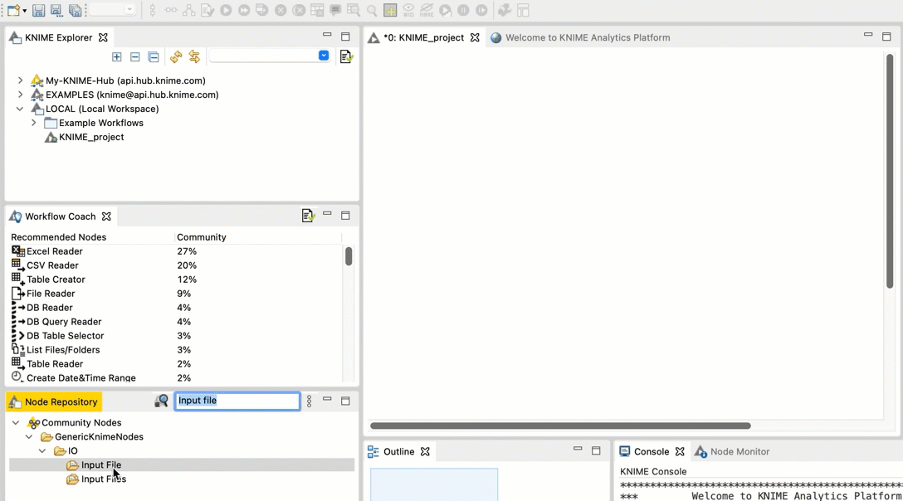

Tutorials
=========

The following tutorials provide the opportunity to complete a real-world example while also seeing the different methods OpenMS makes available to complete the same task.

There are four ways to use OpenMS to complete a task. For example, say you want to read a file and store the information in an output file. You can do this by:

- **Using TOPP shell** to run a shell script** or execute a command directly.
- **Using pyOpenMS** and creating and running a python script.
- **Using TOPPView**, a graphical user interface provided by OpenMS.
- **Constructing a workflow in KNIME**, which can be saved and executed on multiple input files

The following sections explain how to read a file and store the information in an output file using these four different methods.

## Using TOPP shell

## Using pyOpenMS

## Using TOPPView

## Constructing a workflow in KNIME

