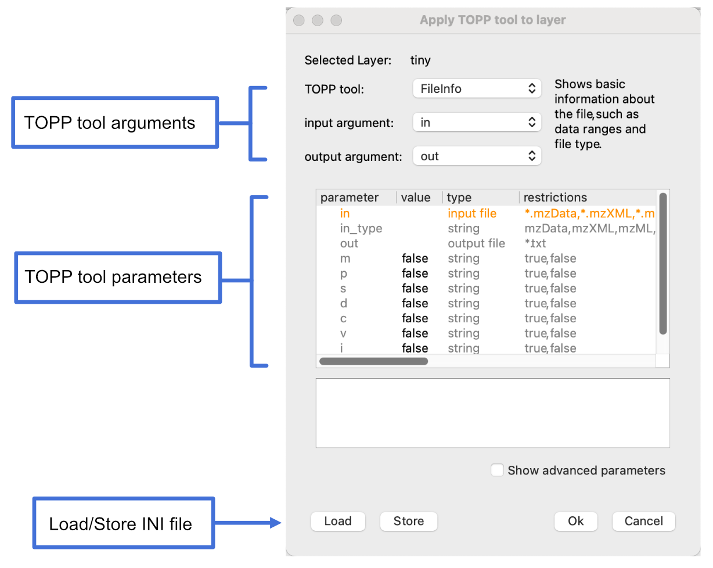

Tutorials: How to Read File Information
=======================================

The following tutorials provide the opportunity to complete a real-world example while also seeing the different methods OpenMS makes available to complete the same task.

There are four ways to use OpenMS to complete a task. For example, say you want to read a file and store the information in an output file. You can do this by:

- **Using TOPP shell** to run a shell script or execute a command directly.
- **Using pyOpenMS** and creating and running a python script.
- **Using TOPPView**, a graphical user interface provided by OpenMS.
- **Constructing a workflow in KNIME**, which can be saved and executed on multiple input files.
- **Running a script** using Nextflow, a language based on the Groovy programming language.

The following sections explain how to read a file and store the information in an output file using these five different methods.

## Using TOPP shell

As explained in the command-line quick start guide, TOPP shell is available for those who are comfortable with executing command line tools and writing scripts.

To read the information of a file, just type the following in the command line and press <kbd>Enter</kbd>.

```bash
FileInfo -in <insert input file> -out <insert output file>
```

You can also copy and paste this into a shell script (file with an .sh extension), and then type bash <insert file> in the command line to execute the script.

## Using pyOpenMS

You can replicate the functionality of the `FileInfo` TOPP tool in pyOpenMS, using one of the following examples, depending on the type of file you want to get information about.

- Example for `mzML` file

  ```python
  from pyopenms import *

  exp = MSExperiment()
  MzMLFile().load("sample.mzML", exp)
  exp.updateRanges()

  ms_levels = exp.getMSLevels()
  num_spectra = {level: 0 for level in ms_levels}

  for spec in exp:
     num_spectra[spec.getMSLevel()] += 1

  print("Instrument:")
  for analyzer in exp.getInstrument().getMassAnalyzers():
     print(f"\tMass Analyzer: {analyzer.getType()} (resolution: {analyzer.getResolution()})")

  print("\nMS levels: "+", ".join([str(level) for level in ms_levels]))
  print(f"Total number of peaks: {sum([spec.size() for spec in exp])}")
  print(f"Total number of spectra: {exp.size()}")

  print("\nRanges:")
  print(f"\tretention time: {exp.getMinRT()} .. {exp.getMaxRT()} ({round((exp.getMaxRT()-exp.getMinRT())/60, 2)} min)")
  print(f"\tmass-to-charge: {exp.getMinMZ()} .. {exp.getMaxMZ()}")
  print(f"\tintensity: {exp.getMinIntensity()} .. {exp.getMaxIntensity()}")

  print("\nNumber of spectra per MS level:")
  for level, number in num_spectra.items():
     print(f"\tlevel {level}: {number}")
  ```
  - Example for `featureXML` file

  ```python
  feature_map = FeatureMap()
  FeatureXMLFile().load("sample.featureXML", feature_map)

  charges = {}
  number_of_ids = {}
  tic = 0

  for feature in feature_map:
     charge = feature.getCharge()
     if charge in charges.keys():
         charges[charge] += 1
     else:
         charges[charge] = 1
     num_ids = len(feature.getPeptideIdentifications())
     if num_ids in number_of_ids.keys():
         number_of_ids[num_ids] += 1
     else:
         number_of_ids[num_ids] = 1
     tic += feature.getIntensity()

  print(f"Number of features: {feature_map.size()}")

  print("\nRanges:")
  print(f"\tretention time: {feature_map.getMinRT()} .. {feature_map.getMaxRT()} ({round((feature_map.getMaxRT()-feature_map.getMinRT())/60, 2)} min)")
  print(f"\tmass-to-charge: {feature_map.getMinMZ()} .. {feature_map.getMaxMZ()}")
  print(f"\tintensity: {feature_map.getMinIntensity()} .. {feature_map.getMaxIntensity()}")

  print(f"\nTotal ion current in features: {int(tic)}")

  print("\nCharge distribution:")
  for charge, occurence in charges.items():
     print(f"\tcharge {charge}: {occurence}x")

  print("\nDistribution of peptide identifications (IDs) per feature:")
  for num_ids, occurence in number_of_ids.items():
     print(f"\t{num_ids} IDs: {occurence}")

  print(f"\nUnassigned peptide identifications: {len(feature_map.getUnassignedPeptideIdentifications())}")
  ```

## Using TOPPView

If you want a graphical user interface to interact with, then use TOPPView. Follow these steps to read the file information using TOPPView:

1. Go to **File** > **Open file** and open a file by following the prompts.
2. Go to **Tools** > **Apply TOPP tool (whole layer)**.
3. Set **TOPP tool** to **FileInfo** and **output argument** to **out**.
4. Load an existing INI file by clicking **Load** and selecting an INI file from the file importer. If you don’t have an INI file, click **Store**, enter a file name and click **OK** to generate an INI file, then click **Load** and load the file.

   
5. Click **OK**.
6. Open the **Log** panel at the bottom of the screen to view the resulting file information.

## Constructing a workflow in KNIME

KNIME is available for those who want a graphical user interface to create and use workflows. Here is an example of how to report file information on an input file to an output file using KNIME.

**1. Install OpenMS plugin**.
   <ol type="a">
    <li>Go to <b>File</b> > <b>Install KNIME Extensions</b>.</li>
    <li>Search for <b>OpenMS</b>.</li>
    <li>Select the checkbox next to <b>OpenMS</b> and click <b>Next</b>.</li>
    <li>Click <b>Next</b>.</li>
    <li>Accept the terms of conditions.</li>
    <li>Restart KNIME</li>
   </ol>

**2. Open a new file** by going to **File** > **New file**.

**3. Construct workflow by adding nodes.**
   <ol type="a">
   <li>Go to the <b>Node repository</b></li>
   <li>In the search field, type <b>Input File</b>. You should see an <b>Input File</b> node in the filtered list.</li>
   <li>Drag and drop the <b>Input File</b> node from the Node repository into the workspace.</li>
   </img>
   <li>Repeat steps b and c for the <b>FileInfo</b> node and the <b>Output File</b> node.</li>
   <li>Connect the <b>Input File</b> node to the <b>FileInfo</b> node. Connect the <b>FileInfo</b> node to the <b>Output File</b> node. Your workflow should look like this:</li>
   </img>
   Once you configure your nodes in the next step, the warnings should disappear.
   </ol>

**4. Configure the nodes in workflow.**
   <ol type="a">
   <li>Right-click the <b>Input File</b> node and select <b>Configure</b>.</li>
   <li>Click <b>Browse</b> and choose the appropriate file from the file importer.</li>
   <li>Click <b>OK</b>.</li>
   <li>Right-click the <b>Output File</b> node and select <b>Configure</b>.</li>
   <li>Either choose an existing file or enter the file name of the new file. If you choose an existing file, select the <b>Overwrite file(s) if it/they exist</b> checkbox.</li>
   <li>Click <b>OK</b>.</li>
   <li>Your workflow should be cleared of warnings and look like this:</li>
   </img>
   </ol>

**5. Play the workflow.**
   <ol type="a">
   <li>Click the Execute all executable nodes </img> button in the toolbar at the top of the screen.</li>
   <li>You should produce an output file at the specified location. Here is an example of what can be produced:</li>
   </img>
   </ol>

## Running a Nextflow script

Nextflow is a scripting language based on the Groovy programming language.

The following is a Nextflow script that executes the `FileInfo` TOPP tool on an input file.

```groovy
params.input_file = 'path/to/input_file'

process runFileInfo {
  output:
    stdout

  """
  FileInfo -in ${params.input_file}
  """
}

workflow {
  runFileInfo | view { it }
}
```

The above script can be executed from the command line by entering:

```bash
nextflow run file_info.nf
```

You can also specify a file path from the command line by using:

```bash
nextflow run file_info.nf --input_file path/to/file
```
