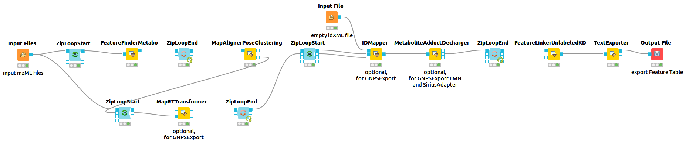

# Untargeted Metabolomics Pre-processing

The universal workflow for untargeted metabolomics always consists of feature detection in the individual MS sample files and their linkage to consensus features with common m/z and retention time values. In addition, there are optional steps such as adduct detection and annotation of features with associated MS2 spectra. This workflow prepares all the file necessary to do formula and structural annotations via `SiriusAdapter`. Furthermore it prepares all required files to run `GNPSExport`, which generates all files necessary to directly run [GNPS](https://gnps.ucsd.edu) Feature Based Molecular Networking (FBMN) and Ion Identity Molecular Networking (IIMN).


If you want to use the example data, download the files [sample1.mzML](../data/sample1.mzML) and [sample2.mzML](../data/sample2.mzML).

For each mzML file do mass trace, elution peak and feature detection.
```shell
FeatureFinderMetabo -in sample1.mzML -out sample1.featureXML -algorithm:common:noise_threshold_int 10000 -algorithm:mtd:mass_error_ppm 10 -algorithm:ffm:remove_single_traces true
FeatureFinderMetabo -in sample2.mzML -out sample2.featureXML -algorithm:common:noise_threshold_int 10000 -algorithm:mtd:mass_error_ppm 10 -algorithm:ffm:remove_single_traces true
```

Align feature retention times based on the feature map with the highest number of features (reference map).
```shell
MapAlignerPoseClustering -in sample1.featureXML sample2.featureXML -out aligned_sample1.featureXML aligned_sample2.featureXML -trafo_out sample1.trafoXML sample2.trafoXML -algorithm:pairfinder:distance_MZ:max_difference 10.0 -algorithm:pairfinder:distance_MZ:unit ppm
```

Align mzML files aligment based on FeatureMap alignment (optional, only for GNPS).
```shell
MapRTTransformer -in sample1.mzML -out aligned_sample1.mzML -trafo_in sample1.trafoXML
MapRTTransformer -in sample2.mzML -out aligned_sample2.mzML -trafo_in sample2.trafoXML
```

Map MS2 spectra to features as PeptideIdentification objects (optional, only for GNPS). Requires an [empty idXML](link to empty idXML file) file.
```shell
IDMapper -id empty.idXML -in aligned_sample1.featureXML -spectra:in aligned_sample1.mzML -out IDmapped_sample1.featureXML
IDMapper -id empty.idXML -in aligned_sample2.featureXML -spectra:in aligned_sample2.mzML -out IDmapped_sample2.featureXML
```

Detect adducts (optional, only for SIRIUS and GNPS Ion Identity 
Molecular Networking).
```shell
MetaboliteAdductDecharger -in IDmapped_sample1.featureXML -out_fm adducts_sample1.featureXML -algorithm:MetaboliteFeatureDeconvolution:potential_adducts "H:+:0.6" "Na:+:0.1" "NH4:+:0.1" "H-1O-1:+:0.1" "H-3O-2:+:0.1"
MetaboliteAdductDecharger -in IDmapped_sample2.featureXML -out_fm adducts_sample2.featureXML -algorithm:MetaboliteFeatureDeconvolution:potential_adducts "H:+:0.6" "Na:+:0.1" "NH4:+:0.1" "H-1O-1:+:0.1" "H-3O-2:+:0.1"
```

Link features in a ConsensusMap.
```shell
FeatureLinkerUnlabeledKD -in adducts_sample1.featureXML adducts_sample2.featureXML -out Preprocessed.consensusXML -algorithm:link:rt_tol 30.0 -algorithm:link:mz_tol 10.0
```

Export table of metabolic features as tsv file including meta values (e.g. best consensus adduct ion).
```shell
TextExporter -in Preprocessed.consensusXML -out Features.tsv -consensus:add_metavalues
```

You can recreate this workflow in KNIME. [Download the KNIME workflow here](../workflows/UntargetedMetabolomicsPreProcessing.knwf). The workflow should look like this:



