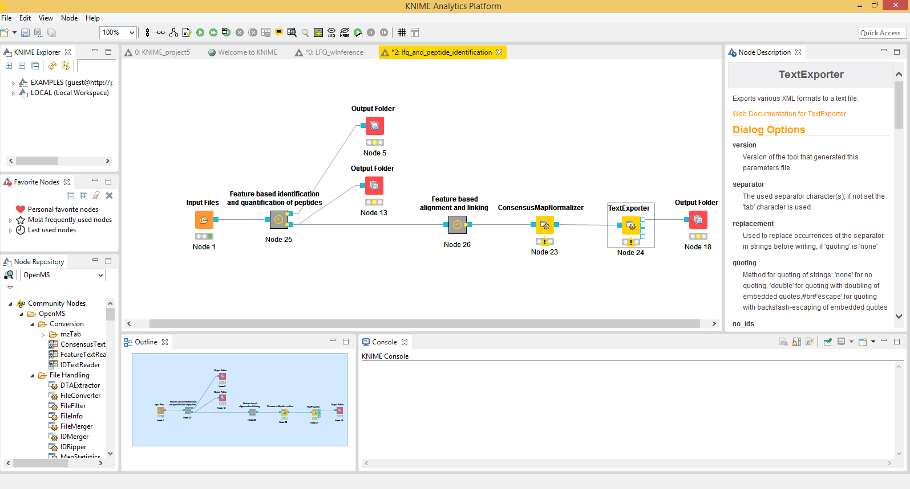
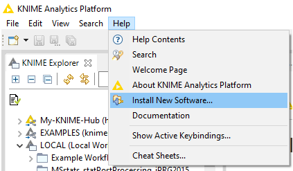
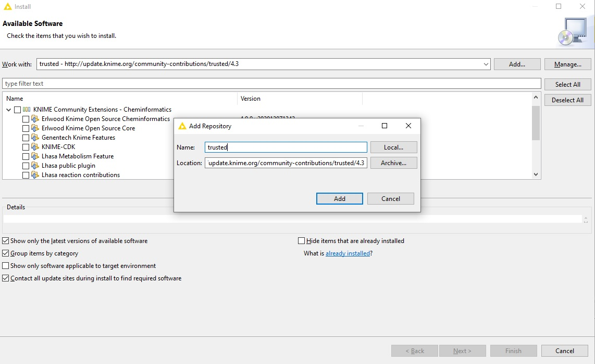

KNIME Tutorial
==============

Users can now use {term}`KNIME` in place of {term}`TOPPAS`; the later will deprecated with no support in near future.

The below image shows an example workflow in {term}`KNIME`.

## Installing OpenMS in KNIME

Installation of OpenMS in {term}`KNIME` is platform-independent across Windows, MacOSX, and Linux.

1. Download the latest {term}`KNIME` release from the [KNIME website](https://www.knime.com/).
2. In the full install of {term}`KNIME` skip the following installation routine since all required plugins should be
   installed by default. For the standard (core) installation, follow the instructions here or in the extended [user-tutorial](../../tutorials-and-quickstart-guides/openms-user-tutorial.md).

   

3. In KNIME click on **Help** > **Install new Software**.
4. Install the required KNIME File Handling nodes from the official KNIME Update Site (a standard entry in the update
   sites). Choose the update site from the **Work with:** dropdown menu.

   **Name**: KNIME Analytics Platform {{ knime_version }} Update Site.

   **Location**: {{ 'http://update.knime.org/analytics-platform/{0}'.format(knime_version) }}

5. Filter the results for **File handling** and select the {term}`KNIME` File Handling Nodes. Click **Next** and install.

   

6. Now, install the actual OpenMS plugin. Next to the **Work with:** dropdown menu, click on **Add...**. In the opening
   dialog fill in at least one of the following additional Update Sites (if not already present):

   **Recommended**:

   **Name**: KNIME Community Contributions (Stable)

   **Location**: {{ 'http://update.knime.org/community-contributions/trusted/{0}'.format(knime_version) }}

   **Unstable**:

   **Name**: KNIME Nightly Community Contributions (trunk)

   **Location**:  http://update.knime.org/community-contributions/trunk

7. Use the search or navigate to **KNIME Community Contributions – Bioinformatics & NGS** and select **OpenMS**. Then
   click **Next** and follow the installation instructions. A restart of KNIME might be necessary afterward. On Windows,
   if prompted to install additional requirements like the Microsoft Visual Studio Redistributable for the conversion
   software ProteoWizard that is packaged with our plugin.
8. After a restart of KNIME the OpenMS nodes will be available in your Node Repository (panel on the lower left) under
   **Community Nodes**.

## Creating workflows with KNIME

Download Introduction to OpenMS in KNIME [user tutorial](../../tutorials-and-quickstart-guides/openms-user-tutorial.md) containing hands-on training material covering also basic
usage of KNIME. See the official [KNIME Getting Started Guide](https://tech.knime.org/knime) for a more in-depth view of
the KNIME functionality besides OpenMS.

If you face any issues, please [contact us](../../quick-reference/contact-us.md) and specifically for the usage of OpenMS in KNIME, the KNIME community contribution [forum](https://forum.knime.com/c/community-extensions/openms/40).

## Creating your own Generic KNIME Nodes

To create your own generic KNIME nodes, refer to their [documentation](https://docs.knime.com/latest/pure_python_node_extensions_guide/index.html#introduction).
