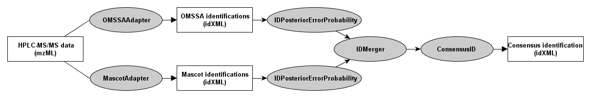

Consensus Peptide Identification
===============================

In order to compute a consensus identification for a HPLC-MS\MS experiment use several identification engines.

OpenMS offers adapters for the following commercial and free peptide identification engines: Sequest, Mascot, OMSSA,
PepNovo, XTandem and Inspect. The adapters allow setting the input parameters and data for the identification engine
and return the result in the OpenMS idXML format.

In order to improve the identification accuracy, several identification engines can be used and a consensus
identification can be calculated from the results. The image below shows an example where Mascot and OMSSA results are
fed to the **ConsensusID** tool (ConsensusID is currently usable for Mascot, OMSSA and XTandem).

To combine quantitation and identification results:

Protein/peptide identifications can be annotated to quantitation results (featureXML, consensusXML) by the **IDMapper**
tool. The combined results can then be exported by the **TextExporter** tool:
[Conversion between OpenMS XML formats and text formats](conversion-between-openms-xml-formats-and-text-formats.md).
