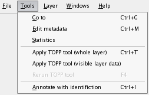
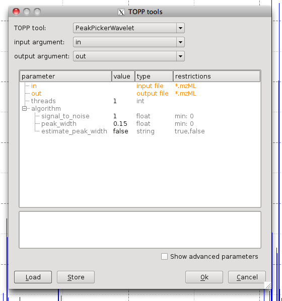
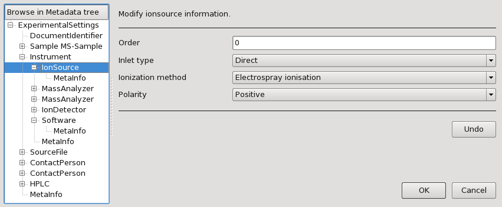
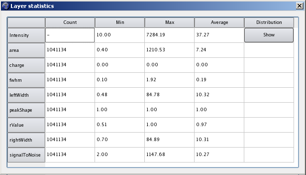

Data Analysis in TOPPView
=========================

TOPPView also offers limited data analysis capabilities for single layers, which will be illustrated in the following
sections. The functionality presented here can be found in the **Tools** menu:



## TOPP Tools

Single TOPP tools can be applied to the data of the currently selected layer or to the visible data of the current layer.
The following example image shows the TOPP tools dialog:



To apply a TOPP tool, follow the instructions below:

1. Select a TOPP tool and if necessary a type.
2. Specify the command line option of the tool, that takes the input file name.
3. Specify the command line option of the tool, that takes the output file name.
4. Set the algorithm parameters manually or load them from an INI file.

## Metadata

One can access the metadata, the layer is annotated with. This data comprises e.g. contact person, instrument description
and sample description.



```{tip}
Identification data, e.g. from a Mascot run, can be annotated to the spectra or features, too. After
annotation, this data is listed in the metadata.
```

## Statistics

Statistics about peak/feature intensities and peak meta information can be displayed. For intensities, it is possible to
display an additional histogram view.


