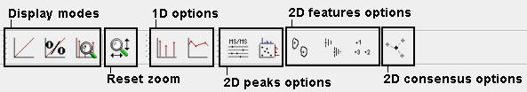

Display Modes and View Options in TOPPView
==========================================

All of the views support several display modes and view options.
Display modes determine how intensities are displayed. View options configure the view.

# Display Modes

Intensity display modes determine the way peak intensities are displayed.

### Linear

Normal display mode.

### Percentage

In this display mode the intensities of each dataset are normalized with the maximum intensity of the dataset. This is
especially useful in order to visualize several datasets that have large intensity differences. If only one dataset is
opened it corresponds to the normal mode.

### Snap to Maximum Intensity

In this mode the maximum currently displayed intensity is treated as if it was the maximum overall intensity.

# View Options

View options configure the view of the current layer.

### 1D

Switching between raw data and peak mode.

### 2D (Peaks)

`MS/MS` precursor peaks can be highlighted.
Projections to **m/z** and **RT** axis can be shown.

### 2D (Features)

Overall convex hull of the features can be displayed.
Convex hulls of mass traces can be displayed (if available).
A feature identifier, consisting of the feature index and an optional label can be displayed.

### 2D (Consensus)

The elements of a consensus feature can be displayed.

### 3D

Currently there are no options for 3D view.
