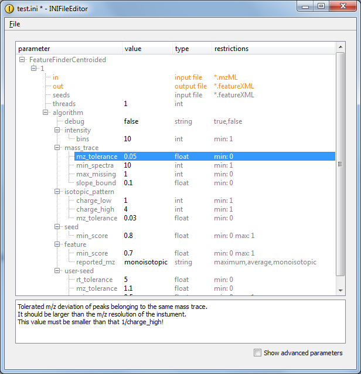

General Introduction
====================

This tutorial will gives a brief overview of the most important **TOPP** tools. First, some basics that are required for
every TOPP tool, then there are several example pipelines explained.

## File formats

The TOPP tools use the HUPO-PSI standard format mzML 1.1.0 as input format. In order to convert other open formats
(mzData, mzXML, DTA, ANDI/MS) to mzML, a file converter is provided by TOPP.

Proprietary MS machine formats are not supported. To convert these formats to mzML, mzData or mzXML, please have a look
at the [SASHIMI project page](http://tools.proteomecenter.org/wiki/index.php) or contact your MS machine vendor.

mzML covers only the output of a mass spectrometry experiment. For further analysis of the data several other file
formats are needed. The main file formats used by TOPP are:

1. **mzML**: The HUPO-PSI standard format for mass spectrometry data.
2. **featureXML**: The OpenMS format for quantitation results.
3. **consensusXML**: The OpenMS format for grouping features in one map or across several maps.
4. **idXML**: The OpenMS format for protein and peptide identification.

Documented schemas of the OpenMS formats can be found [here](https://github.com/OpenMS/OpenMS/tree/develop/share/OpenMS/SCHEMAS).

`idXML` files and `consensusXML`  files created by OpenMS can be visualized in a web browser. XSLT stylesheets are used to
transform the XML to HTML code. The stylesheets are contained in the `OpenMS/share/OpenMS/XSLT/` folder of your OpenMS
installation.

To view the file on the computer with the OpenMS installation, open it in your browser.

To copy the file to another computer, copy the XSLT stylesheet to that computer and change the second line in the XML
file. The following example shows how to change the stylesheet location for an idXML file. Change the `PATH` in the
line as:

```
<?xml-stylesheet type="text/xsl" href="file:///*PATH*idXML.xsl"?>
```

to the folder where the stylesheet resides.

## Common arguments of the TOPP tools

The command line and INI file parameters of the TOPP tools vary due to the different tasks of the TOPP tools. However,
all TOPP tools share this common interface:

1. **-ini** `<file>`: Use the given TOPP INI file.
2. **-log** `<file>`: Location of the log file (default: `TOPP.log`).
3. **-instance** `<n>`: Instance number in the TOPP INI file (default: `1`).
4. **-debug** `<n>`: Sets the debug level (default: `0`).
5. **-write_ini** `<file>`: Writes an example INI file.
6. **-no_progress**: Disables progress logging to command line.
7. **–help**: Shows a help page for the command line and INI file options.
8. **–helphelp**: Shows a detailed (including advanced parameters) help page for the command line and INI file options.

## TOPP INI files

Each TOPP tool has its own set of parameters which can be specified at the command line. However, a more convenient
(and persistent) way to handle larger sets of parameters is to use TOPP INI files. TOPP INI files are XML-based and
can contain the configuration of one or several TOPP tools.

The following examples will give an overview of how TOPP tools can be chained in order to create analysis pipelines. INI
files are the recommended way to store all settings of such a pipeline in a single place.

```{note}
The issue of finding suitable parameters for the tools is not addressed here. For problems during the
execution of the example pipelines on the data, adapt the parameters. Have a look at the documentation of the
corresponding TOPP tool in that case.
```

### Parameter documentation

General documentation of a TOPP tool and documentation for the command line parameters, can be displayed using the
command line flag `-help`. Some TOPP tools also have subsections of parameters that are internally handed to an
algorithm. The documentation of these subsections is not displayed with `–help`. It is however displayed in
**INIFileEditor**.



In the [INIFileEditor](https://abibuilder.informatik.uni-tuebingen.de/archive/openms/Documentation/nightly/html/TOPP_INIFileEditor.html), click on the respective parameter, the documentation of the parameters is displayed in the window at the bottom.

### Updating an INI file for a TOPP tool or a whole TOPPAS pipeline

For an old INI file which does not work for a newer [OpenMS]() version (due to renamed/removed or new) parameters, you
can rescue parameters whose name did not change into the new version by using [INIUpdater](https://abibuilder.informatik.uni-tuebingen.de/archive/openms/Documentation/nightly/html/UTILS_INIUpdater.html) tool by calling it with (a list of) outdated
INI and/or TOPPAS files. See the INIUpdater tool description for details. This will remove invalid parameters and add
new parameters (if available) while retaining values for unchanged parameters. As an alternative to the INIUpdater, use
the command line by calling the TOPP tool from which the ini originated and combining `-write_ini` and `-ini`, e.g.,

```
FileInfo -ini old_fi.ini -write_ini fi.ini
```

This will transfer all values of parameters from `old_fi.ini` which are still valid to the `fi.ini`.

### General structure of an INI file

An INI file is always enclosed by the `<PARAMETERS>` tag. Inside this tag, a tree-like hierarchy is created with `<NODE>`
tags that represent *sections* and `<ITEM>` tags, each of which stores one of the parameters. The first two level of the
hierarchy have a special meaning.

**Example**: Below is the content of an INI file for **FileFilter**.

Several parameter sets for a TOPP tool can be specified in a *tool* section. The tool section is always named after the
program itself, in this case `FileFilter`.

- In order to make storing several parameter sets for the same tool in one INI file possible, , the tool section
contains one or several *numbered instance subsections* ('1', '2', ...). These numbers are the instance numbers which
can be specified using the `-instance` command line argument. (Remember the default is `1`).
- Within each instance section, the actual parameters of the TOPP tool are given. INI files for complex tools can
contain nested subsections in order to group related parameters.
- If a parameter is not found in the instance section, the *tool-specific common section* is considered.
- Finally, we look if the *general common section* contains a value for the parameter.

As an example, let's call the `FileFilter` tool with the INI file given below and instance number `2`. The `FileFilter`
parameters `rt` and `mz` are looked up by the tool. *mz* can be found in section **FileFilter** - `2`. `rt` is not
specified in this section, thus the `common` **FileFilter** section is checked first, where it is found in our example.
When looking up the `debug` parameter, the tool would search the instance section and tool-specific common section
without finding a value. Finally, the *general common section* would be checked, where the debug level is specified.

```
<PARAMETERS>

  <NODE name="FileFilter">
    <NODE name="1">
      <ITEM name="rt" value="0:1200" type="string"/>
    </NODE>
    <NODE name="2">
      <ITEM name="mz" value="700:1000" type="string"/>
    </NODE>
  </NODE>

  <NODE name="common">
    <NODE name="FileFilter">
      <ITEM name="rt" value=":" type="string"/>
      <ITEM name="mz" value=":" type="string"/>
    </NODE>
    <ITEM name="debug" value="2" type="int"/>
  </NODE>

</PARAMETERS>
```
