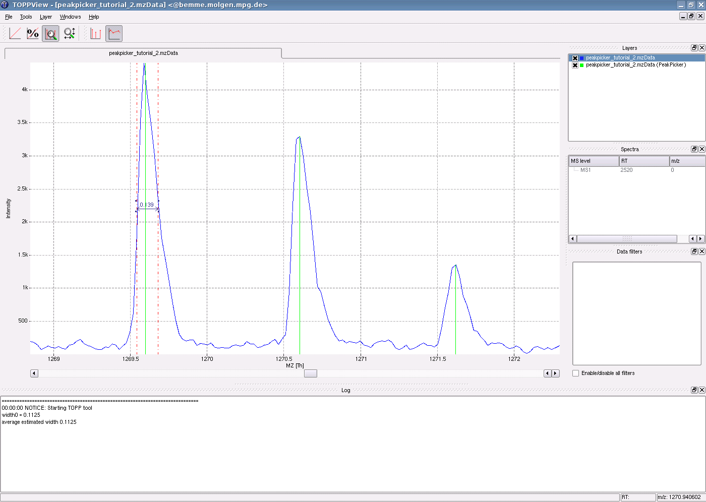

Picking Peaks
============

For low resolution data, consider to smooth the data first ([Smoothing raw data](smoothing-raw-data.md)) and subtract
the baseline ([Subtracting a baseline from a spectrum](subtracting-a-baseline-from-a-spectrum.md)) before peak picking.

There are two types of PeakPickers, the PeakPickerWavelet and one especially suited for high resolution data
(PeakPickerHiRes). This tutorial explains the PeakPickerWavelet. Use the file `peakpicker_tutorial_2.mzML` from the
examples data (`File` \> `Open example data`).

The main parameters are the peak width and the minimal signal to noise ratio for a peak to be picked. If you don't know
the approximate `fwhm` of peaks, use the estimation included in the PeakPickerWavelet, set the flag `estimate\_peak\_width`
to true. After applying the PeakPickerWavelet, observe which peak width was estimated and used for peak picking in the
log window.

To estimate the peak width, use the measuring tool ([Action Modes and Their Uses](views-in-toppview.md##action-modes-and-their-uses)) to determine
the fwhm of one or several representative peaks.

If the peak picker delivers only a few peaks even though the `peak_with` and `signal_to_noise` parameters are set to
good values, consider changing the advanced parameter `fwhm_lower_bound_factor` to a lower value. All peaks with a lower
`fwhm` than `fwhm_lower_bound_factor` \* `peak\_width` are discarded.

The following image shows a part of the spectrum with the picked peaks shown in green,  the estimated peak width in the
log window and the measured peak width.

