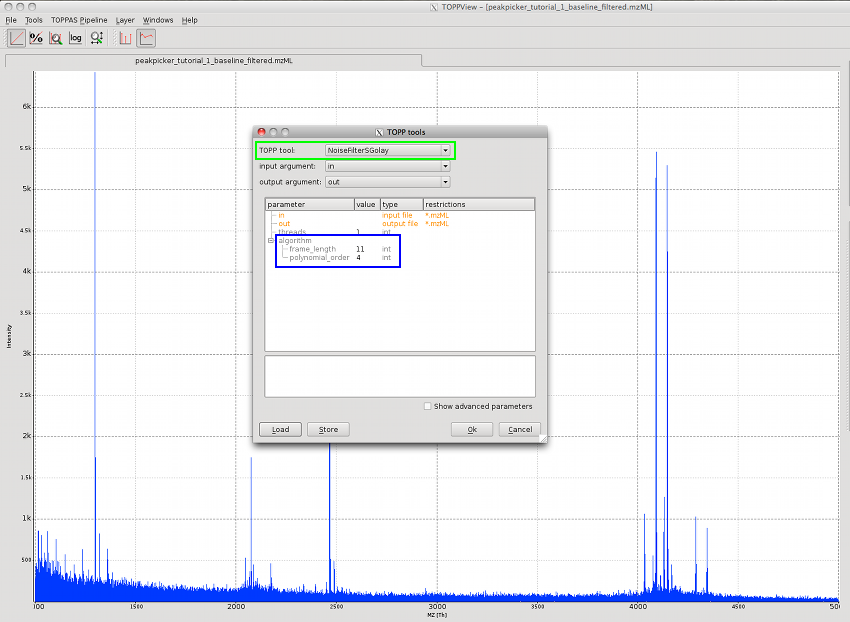
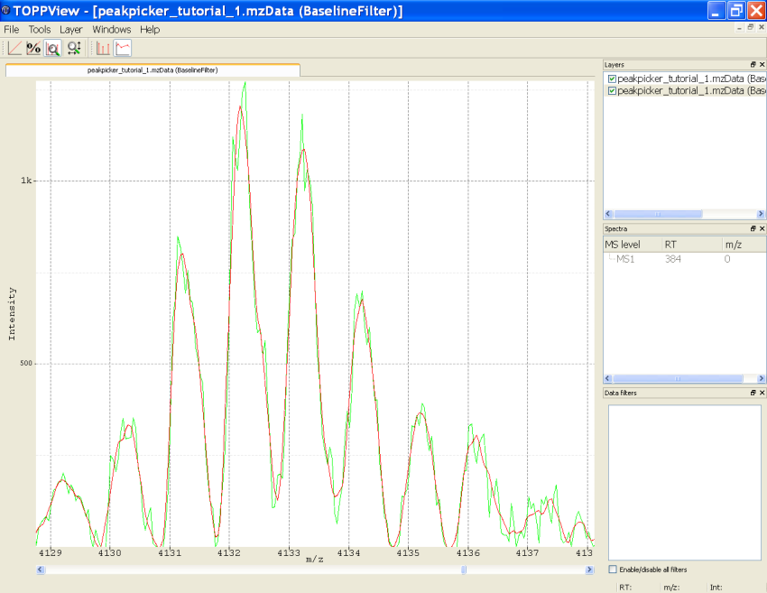

Smoothing Raw Data
==================

To smooth raw data call one of the available NoiseFilters via the Tools-menu, (`Tools` > `Apply TOPP tool`), then select
`NoiseFilterSGolay` or `NoiseFilterGaussian` as TOPPtool (green rectangle). The parameters for the filter type can be
adapted (blue rectangle). For the `Savitzky-Golay` set the frame length and the order of the polynomial that is fitted.
For the Gaussian filter the gaussian width and the ppm tolerance for a flexible gaussian width depending on the `m/z`
value can be adapted. Press `Ok` to run the selected `NoiseFilter`.

The following image shows a part of the spectrum after smoothing as red line with the un-smoothed data in green.

