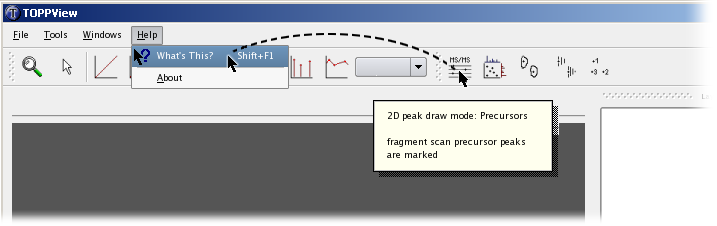

TOPPView Introduction
=====================

{term}`TOPPView` is a viewer for {term}`MS` and {term}`HPLC-MS` data. It can be used to inspect files in {term}`mzML`,
{term}`mzData`, {term}`mzXML` and several other text-based file formats.

In each view, several datasets can be displayed using the layer concept. This allows visual comparison of several
datasets as well as displaying input data and output data of an algorithm together.

{term}`TOPPView` is intended for visual inspection of the data by experimentalists as well as for analysis software by
developers.


The above example image shows a 2D view of TOPPView (blue rectangle) and the corresponding [Display modes and view options](display-modes-and-view-options.md) (red rectangle). The right dock area, shows the [Layers](#layers) (yellow rectangle), the [Spectrum browser](#spectrum-browser) (magenta rectangle) and the [Data filtering](data-filtering) (green rectangle). Switch between open windows can
be done using the tab bar (black rectangle).

## Layers

Each view of TOPPView supports several datasets, called layers. In the *layer manager* (dock window in the upper right
corner), layers can be hidden and shown using the check box in front of each layer name.

By clicking on a layer, this layer is selected, which is indicated by a blue background. The selected layer can be
manipulated using the *Tools* menu.

Layers can be copied by dragging them to the tab bar. If the layer is dropped on a tab, it is added to the corresponding
window. If the layer is dropped on the tab bar but not on a tab, a new window with that layer is added.

## Spectrum browser

The spectra contained in a peak map can be browsed in the *spectrum browser*. It displays a tree view of all spectra in
the current layer, where a spectrum with MS level *n* is a child of the spectrum with MS level *n - 1* that contains its
corresponding precursor peak. For each spectrum in the list, the retention time and (for spectra with MS level > 1) the
m/z value of the precursor peak are also shown.

If a 2D or 3D window is active, double-clicking a spectrum will open it in a new 1D window. If the active window is a 1D
view, the spectra can be browsed and the currently selected spectrum will be shown.

## Data filtering

TOPPView allows filtering of the displayed peak data and feature data. Peak data can be filtered according to intensity
and meta data. Meta data is arbitrary data the peak is annotated with. Feature data can be filtered according to
intensity, charge, quality and meta data.

Data filters are managed by a dock window. Filters can be added, removed and edited through the context menu (right
button mouse click) of the data filters window. For convenience, filters can also be edited by double-clicking them.

## Command line options

Several files can be opened in one layer from the command line by putting a '+' character between the file names. The
following command opens three files in three layers of the same window:

```bash
TOPPView file1.mzML + file2.mzML + file3.mzML
```

Without the '+' the files would be opened in three different tabs.

The color gradient used to display a file can be changed by adding one of several '@' commands. The following command
opens the file with a white-to-black gradient:

```bash
TOPPView file1.mzML @bw
```

Automatic annotation of a layer with ID data (.osw files etc) can be performed by using the '!' character. This will
treat the next filename as annotation to the previous layer. The following command opens two layers in the same tab,
with the first layer being annotated:

```bash
TOPPView file1.mzML ! file1.idXML + file2.mzML
```

For more information on command line parameters call:

```bash
TOPPView --help
```

## Looking for help?

You can display a short help text for each button and dock window of TOPPView by clicking on it in *What's this?* mode.
*What's this?* mode can be entered using the *Help* menu.


