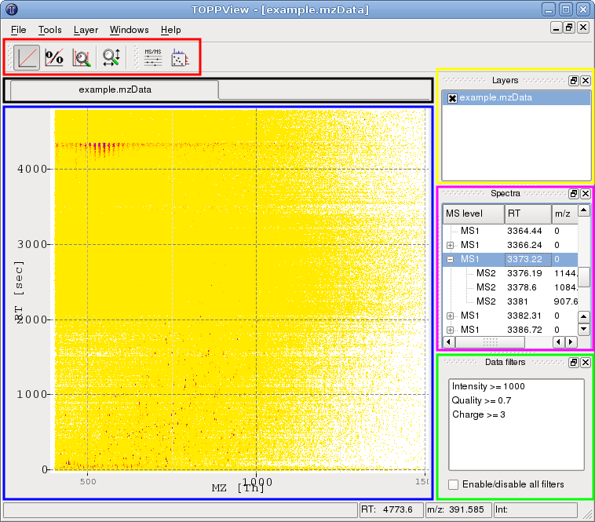

TOPPView Introduction
=====================

{term}`TOPPView` is a viewer for {term}`MS` and {term}`HPLC-MS` data. It can be used to inspect files in {term}`mzML`,
{term}`mzData`, {term}`mzXML` and several other text-based file formats.

In each view, several datasets can be displayed using the layer concept. This allows visual comparison of several
datasets as well as displaying input data and output data of an algorithm together.

{term}`TOPPView` is intended for visual inspection of the data by experimentalists as well as for analysis software by
developers.

