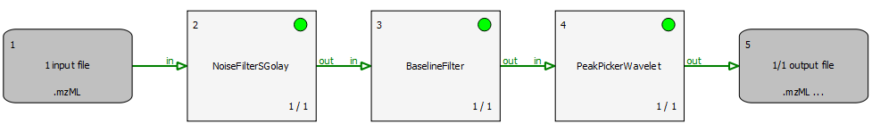
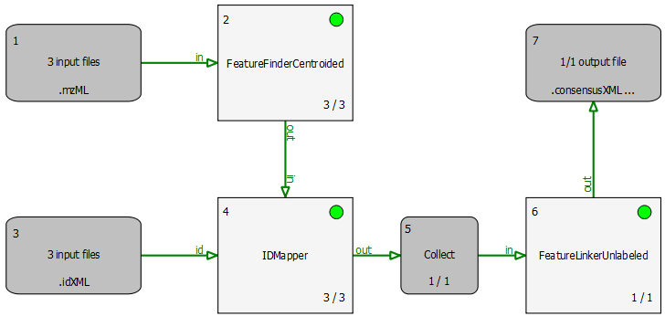
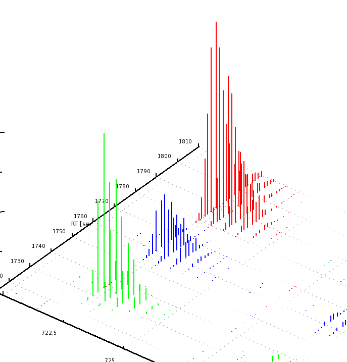
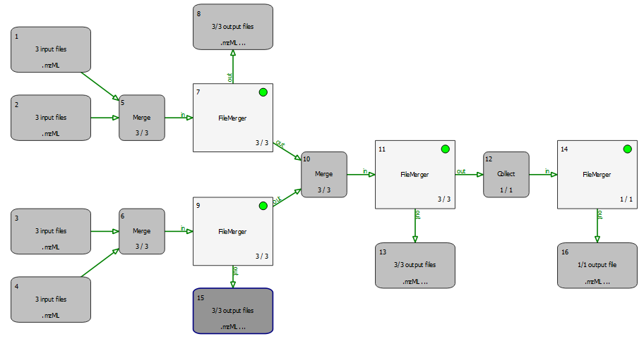

Examples
========

The following sections explain the example pipelines TOPPAS comes with. Open them by selecting **File** > **Open example file**.
All input files and parameters are already specified, so you can just hit **Pipeline** > **Run** (or press <kbd>F5</kbd>) and see what happens.

## Profile data processing

The file `peakpicker_tutorial.toppas` contains  a simple pipeline representing a common use case: starting with profile
data, the noise is eliminated and the baseline is subtracted. Then, PeakPickerWavelet is used to find all peaks in the
noise-filtered and baseline-reduced profile data. This workflow is also described in the section
[Profile data processing](../TOPP/profile-data-processing.md). The individual steps are explained in more detail in the
TOPPView tutorial: [Smoothing raw data](../TOPP/smoothing-raw-data.md), [Subtracting a baseline from a spectrum](../TOPP/subtracting-a-baseline-from-a-spectrum.md), and [Picking peaks](../TOPP/picking-peaks.md).



## Identification of E. coli peptides

This section describes an example identification pipeline contained in the example directory, `Ecoli_Identification.toppas`.
It is shipped together with a reduced example mzML file containing 139 MS2 spectra from an E. coli run on an Orbitrap
instrument as well as an E. coli target-decoy database.

Use the search engine OMSSA (Geer et al., 2004) for peptide identification. Therefore, OMSSA must be installed and the
path to the OMSSA executable (omssacl) must be set in the parameters of the OMSSAAdapter node.

- Node #1 accepts mzML files containing MS2 spectra.
- Node #2 provides the database and is set to **recycling mode** to allow the database to be reused when there is more
  than one input file in node #1.
- OMSSAAdapter calls OMSSA which performs the actual search.
- PeptideIndexer annotates for each search result whether it is a target or a decoy hit.
- FalseDiscoveryRate computes q-values for the IDs.
- Finally, IDFilter selects only those IDs with a q-value of less than 1%.


Extensions to this pipeline would be to do the annotation of the spectra with multiple search engines and combine the
results afterwards, using the **ConsensusID** TOPP tool.

The results may be exported using the **TextExporter** tool, for further analysis with different tools.

## Quantitation of BSA runs

The simple pipeline described in this section (`BSA_Quantitation.toppas`) can be used to quantify peptides that occur
on different runs. The example dataset contains three different bovine serum albumin (BSA) runs. First, **FeatureFinderCentroided** is called since the dataset is centroided. The results of the feature finding are then annotated with (existing) identification results. For convenience, we provide these search results from OMSSA with peptides with an FDR of 5% in the BSA directory.



Identifications are mapped to features by the **IDMapper**. The last step is performed by **FeatureLinkerUnlabeled** which links
corresponding features. The results can be used to calculate ratios, for example. The data could also be exported to a
text based format using the TextExporter for further processing (e.g., in Microsoft Excel).

The results can be opened in TOPPView. The next figures show the results in 2D and 3D view, together with the feature
intermediate results.

```{note}
The intensities and retention times are slightly different between the runs. To correct for retention
times shift, a map alignment could be done, either on the spectral data or on the feature data.
```




## Merger and Collect nodes

The following example is trivial but demonstrates how merger and collector nodes can be used in a pipeline. Have a look
at `merger_tutorial.toppas`:



A Merger merges its incoming file lists, i.e., files of all incoming edges are appended into new
lists (which have as many elements as the merger has incoming connections). All tools this merger has outgoing
connections to are called with these merged lists as input files. All incoming connections should pass the same number
of files (unless the corresponding preceding tool is in recycling mode).

A collector node, on the other hand, waits for all rounds to finish before concatenating all files from all incoming
connections into one single list. It then calls the next tool with this list of files as input. This will happen exactly
once during the entire pipeline run.

In order to track what is happening, open the example file and run it. When the pipeline execution has finished, have a
look at all input and output files (e.g., select **Open in TOPPView** in the context menu of the input/output nodes). The
input files are named `rt_1.mzML`, `rt_2.mzML`, ... and each contains a single spectrum with RT as indicated by the filename,
which helps to understand which files have been merged together.
