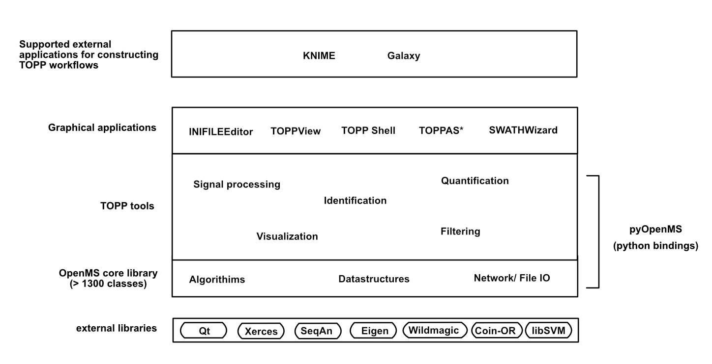

What is OpenMS?
===============

OpenMS is an open-source software platform designed for the analysis and visualization of high-throughput mass spectrometry data. OpenMS has been designed to operate on all platforms, and provides a flexible framework for users to access a wide range of built-in tools or build their own tools using the existing functionality. These tools can be applied separately to data or be applied in sequence (as a workflow or pipeline) to mass spectrometry data. OpenMS is well established and has been used widely in [literature](https://openms.github.io/publications/), particularly in the life sciences.

Fields such as proteomics and metabolomics require the rapid, large-scale identification, quantification and characterization of biomolecules which traditional analytical techniques struggle to offer. OpenMS has been created by a team of biologists and computer scientists to create a completely open-source solution that offers customisable tools for high-throughput processing of mass spectrometry data.

OpenMS provides a number of tools built from a C++ core library. These tools are collectively referred to as “The OpenMS PiPeline (TOPP) (formerly known as The OpenMS Proteomic Pipeline) tools. TOPP tools can be chained in a sequence to form workflows and can be applied to mass spectrometry data.
Note: TOPP’s capabilities have been expanded to apply to a wide range of areas in the life sciences.

## Who are our users?

There are three types of users that OpenMS caters to:
- Researchers and data scientists with C++ coding ability.
  The OpenMS core library has been written in C++. Those that have a working knowledge of C++ are encouraged to contribute to the core library and extend tools which can benefit the entire OpenMS community.
- Researchers and data scientists with Python coding ability.
  OpenMS has developed a Python library called pyOpenMS. Functionality from the OpenMS core library has been exposed to pyOpenMS using python bindings, allowing users access to tools and develop workflows to process their data depending on their specific needs.
- Life science experts who want fast access to tools to process their data.
  If you want to quickly process your mass spectrometry data and are looking for an open source solution, then this is the option for you. OpenMS provides a range of graphical user applications that allow users to easily apply tools and workflows to their data.

The following diagram illustrates the OpenMS software platform architecture. Depending on individual needs, users can either:
- Directly access TOPP tools and construct tools and workflows from the OpenMS core library.
- Access TOPP tools or construct tools and workflows using pyOpenMS.
- Apply TOPP tools and workflows using OpenMS graphical applications.

